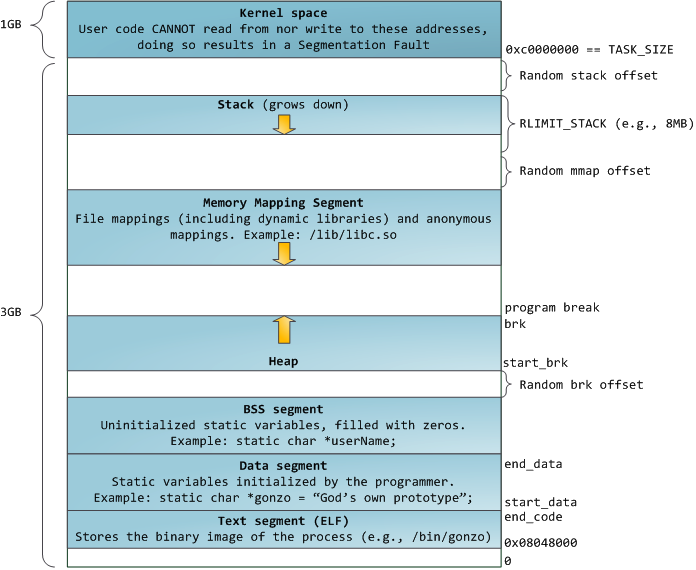

# 基础知识

- [基础知识](#基础知识)
  - [Linux 进程内存布局](#linux-进程内存布局)
    - [ELF 文件布局](#elf-文件布局)
    - [ELF 文件装载](#elf-文件装载)
    - [进程内存布局](#进程内存布局)
  - [操作系统内存分配的相关函数](#操作系统内存分配的相关函数)
    - [堆](#堆)
    - [mmap 映射区](#mmap-映射区)

## Linux 进程内存布局

### ELF 文件布局

- [参考文章-Linux可执行文件如何装载进虚拟内存](https://zhuanlan.zhihu.com/p/148426554)
- [参考文章-ELF文件解析（一）：Segment和Section](https://www.cnblogs.com/jiqingwu/p/elf_format_research_01.html)
- [参考文章-Executable and Linkable Format (ELF)](http://www.skyfree.org/linux/references/ELF_Format.pdf)

Linux ELF 格式可执行程序的结构是以段（segment）为单位组合而成的。Linux 系统在装载 elf 程序文件时，通过 loader 将各个 segment 依次载入到某一地址开始的空间中：

> section 代指 .text、.bss、.data 等，这些信息可用于链接时地址重定位等，因此 section 又被称为链接视图，可以使用 readelf -S object 来查看目标文件的 section。
>
> segment 则是执行视图，程序执行是以 segment 为单位载入，每个 segment 对应 ELF 文件中 program header table 中的一个条目，用来建立可执行文件的进程映像。通常说的，代码段、数据段是 segment，目标代码中的 section 会被链接器组织到可执行文件的各个 segment 中。可以使用 readelf -l a.out 查看 ELF 格式执行文件的 segment 信息。


如上图所示，LOAD 的段是运行时所需载入的：

```shell
LOAD           0x0000000000008000 0x0000000000408000 0x0000000000408000
                0x00000000001072a5 0x00000000001072a5  R E    0x1000
# 其标号为 0x3，对应：

03     .init .plt .text .fini

# 可以发现其包含我们的代码段，R（只读）E（可执行）W（可写）
```

### ELF 文件装载

- [参考文章-ELF文件的加载过程](https://blog.csdn.net/gatieme/article/details/51628257#t0)
- [参考文章-Linux中main是如何执行的](https://www.cnblogs.com/harlanc/p/7774882.html)

Linux 支持不同的可执行程序，其内核使用 `struct linux_binfmt` 来描述各种可执行程序，已 ELF 格式举例：

1. 首先需要填充一个 linux_binfmt 格式的结构：

    ```c
    // /fs/binfmt.c
    static struct linux_binfmt elf_format = {
        .module      = THIS_MODULE,
        .load_binary = load_elf_binary, //通过读存放在可执行文件中的信息为当前进程建立一个新的执行环境
        .load_shlib      = load_elf_library,  //用于动态的把一个共享库捆绑到一个已经在运行的进程，这是由 uselib() 系统调用激活的
        .core_dump       = elf_core_dump,
        .min_coredump    = ELF_EXEC_PAGESIZE,
        .hasvdso     = 1
    };
    ```

2. 所有的 `linux_binfmt` 对象都处于一个链表中，第一个元素的地址存放在 formats 变量中，可以通过调用 register_binfmt() 和 unregister_binfmt() 函数在链表中插入和删除元素，在系统启动期间，为每个编译进内核的可执行格式都执行 registre_fmt() 函数。执行一个可执行程序的时候，内核会 `list_for_each_entry` 遍历所有注册的 `linux_binfmt` 对象，对其调用 `load_binrary` 方法来尝试加载，直到加载成功为止

3. 内核通过 `execv()` 或 `execve()` 系统调用到 `do_execve()` 函数，其读取 ELF 文件头部字节（Linux 128 字节头），再通过 `search_binary_handler()` 搜索对应的格式加载方法，最终调用处理函数来加载目标 ELF。

4. 以 ELF 格式的 load_elf_binary 函数执行过程举例：
   - 填充并且检查目标程序 ELF 头部
   - load_elf_phdrs 加载目标程序的程序头表
   - 如果需要动态链接，则寻找和处理解释器段
   - 检查并读取解释器的程序表头
   - 装入目标程序的段 segment
   - 填写程序的入口地址
   - create_elf_tables 填写目标文件的参数环境变量等必要信息
   - start_kernel 宏准备进入新的程序入口

### 进程内存布局

- [参考文章-进程的内存空间布局](https://blog.csdn.net/cztqwan/article/details/80248479)
- [参考文章-anatomy-of-program-in-memory](https://girdhargopalbansal.blogspot.com/2013/06/anatomy-of-program-in-memory.html)

1. 内核态内存空间，大小固定（编译时可以调整），32 位系统一般为 1GB，64 位系统为 128TB。
2. 用户态的栈，大小不固定，可以用ulimit -s 进行调整，默认一般为 8M，从高地址向低地址增长。
3. mmap区域（内存映射段），既可以从高地址到低地址延伸（所谓 flexible layout），也可以从低到高延伸(所谓 legacy layout)，看进程具体情况。一般 32 位系统默认为 flexible，64 位系统为 legacy。
4. brk 区域（堆），紧邻数据段（甚至贴着），从低位向高位伸展，但它的大小主要取决于 mmap 如何增长，一般来说，即使是 32 位的进程以传统方式延伸，也有差不多 1 GB 的空间。
5. 数据段，主要是进程里初始化和未初始化（BSS）的全局数据总和，当然还有编译器生成一些辅助数据结构等等)，大小取决于具体进程，其位置紧贴着代码段。
6. 代码段，主要是进程的指令，包括用户代码和编译器生成的辅助代码，其大小取决于具体程序，但起始位置根据 32 位还是 64 位一般固定（-fPIC, -fPIE 等除外）。
7. 以上各段（除了代码段数据段）其起始位置根据系统是否起用 randomize_va_space 一般稍有变化，各段之间因此可能有随机大小的间隔。

- 32 位 flexible layout。

    

- 64 位 legacy layout。

    

## 操作系统内存分配的相关函数

Heap 和 mmap 区域都可以供用户自由使用，但是它在刚开始的时候并没有映射到内存空间内，是不可访问的。在向内核请求分配该空间之前,对这个空间的访问会导致 segmentation fault。用户程序可以直接使用系统调用来管理 heap 和 mmap 映射区域，但更多的时候程序都是使用 C 语言提供的 malloc()和 free() 函数来动态的分配和释放内存。

### 堆

[参考文章-Glibc：浅谈 malloc() 函数具体实现](https://blog.csdn.net/plus_re/article/details/80211488)

Linux 操作系统对于堆操作提供了 `brk` 函数，基于 brk 函数 glibc 封装了 `sbrk` ，同时 malloc 函数族包括 realloc、calloc 等最终都是调用 sbrk() 函数将数据段下移，并在内核的管理下将虚拟地址空间映射到内存供 malloc 函数使用，接下来简单分析下 malloc 的调用流程：


再次调用的流程。


```c
void *
__libc_malloc (size_t bytes)
{
  mstate ar_ptr;
  void *victim;

  _Static_assert (PTRDIFF_MAX <= SIZE_MAX / 2,
                  "PTRDIFF_MAX is not more than half of SIZE_MAX");

  void *(*hook) (size_t, const void *)  // 可以重载自己的内存分配方法给 __malloc_hook
    = atomic_forced_read (__malloc_hook);
  if (__builtin_expect (hook != NULL, 0)) // 这里会直接调用过去，默认是 ptmalloc 的 malloc_hook_ini
    return (*hook)(bytes, RETURN_ADDRESS (0)); // 当第一次调用完成 malloc_hook_ini 后，__malloc_hook 会被置空
#if USE_TCACHE
  /* int_free also calls request2size, be careful to not pad twice.  */
  size_t tbytes;
  if (!checked_request2size (bytes, &tbytes)) // 计算 chunk
    {
      __set_errno (ENOMEM);
      return NULL;
    }
  size_t tc_idx = csize2tidx (tbytes);

  MAYBE_INIT_TCACHE ();

  DIAG_PUSH_NEEDS_COMMENT;
  if (tc_idx < mp_.tcache_bins
      && tcache
      && tcache->counts[tc_idx] > 0)
    {
      return tcache_get (tc_idx);
    }
  DIAG_POP_NEEDS_COMMENT;
#endif

  if (SINGLE_THREAD_P)
    {
      victim = _int_malloc (&main_arena, bytes);
      assert (!victim || chunk_is_mmapped (mem2chunk (victim)) ||
         &main_arena == arena_for_chunk (mem2chunk (victim)));
      return victim;
    }

  arena_get (ar_ptr, bytes); // 获取分配区，包含加锁

  victim = _int_malloc (ar_ptr, bytes); // 分配内存
  /* Retry with another arena only if we were able to find a usable arena
     before.  */
  if (!victim && ar_ptr != NULL)
    {
      LIBC_PROBE (memory_malloc_retry, 1, bytes);
      ar_ptr = arena_get_retry (ar_ptr, bytes);
      victim = _int_malloc (ar_ptr, bytes);
    }

  if (ar_ptr != NULL)
    __libc_lock_unlock (ar_ptr->mutex); //解锁分配区

  assert (!victim || chunk_is_mmapped (mem2chunk (victim)) ||
          ar_ptr == arena_for_chunk (mem2chunk (victim)));
  return victim;
}
```

### mmap 映射区

- [参考文章-认真分析 mmap](https://www.cnblogs.com/huxiao-tee/p/4660352.html)

mmap 映射区的操作主要通过，mmap() 函数。即一种内存映射文件的方法，其将一个文件或者其他对象映射到进程内存 mmap 分区，实现文件磁盘地址与进程虚拟地址空间中一段虚拟内存映射的关系，使得进程可以通过访问虚拟内存操作对应的文件或数据，系统会自动通过`回写脏页`到对应的文件磁盘。


