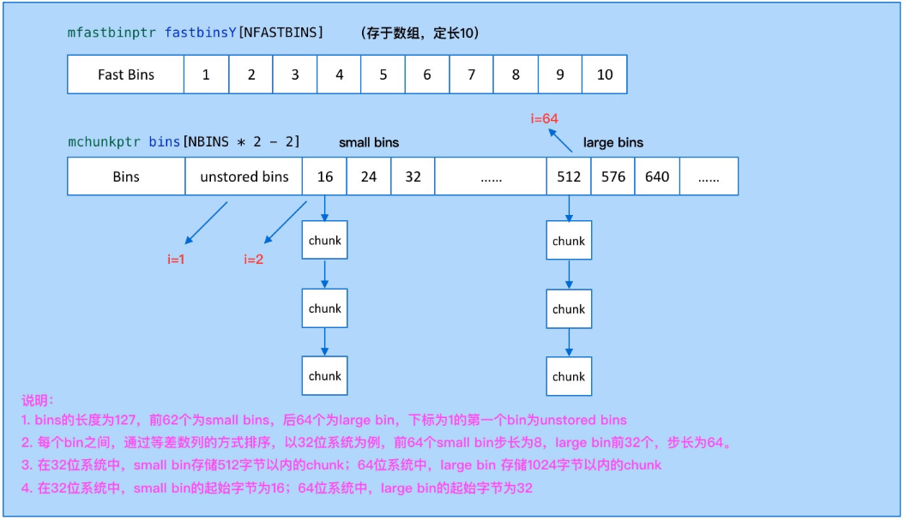

# Ptmalloc 内存管理实现

- [Ptmalloc 内存管理实现](#ptmalloc-内存管理实现)
  - [Ptmalloc 源码 -- `__libc_malloc`](#ptmalloc-源码----__libc_malloc)
  - [入口流程](#入口流程)
    - [入口流程--`malloc_hook_ini`](#入口流程--malloc_hook_ini)
      - [入口流程--`ptmalloc_init`](#入口流程--ptmalloc_init)
        - [入口流程--`malloc_init_state`](#入口流程--malloc_init_state)
  - [调用流程图](#调用流程图)
  - [内存管理数据结构之分配区](#内存管理数据结构之分配区)
  - [内存管理数据结构之 bins](#内存管理数据结构之-bins)
    - [特殊 bins 类型](#特殊-bins-类型)
  - [内存管理数据结构之 chunk](#内存管理数据结构之-chunk)

## Ptmalloc 源码 -- `__libc_malloc`

- [参考文章-strong_alias && weak_alias && __attribute__](https://www.cnblogs.com/justinyo/archive/2013/03/12/2956438.html)
- [参考文章-why uClibc/glibc use the alias for function name?](https://comp.os.linux.development.system.narkive.com/L4JmkjDb/why-uclibc-glibc-use-the-alias-for-function-name)

当调用 malloc 申请内存时，通过 `strong_alias` 别名机制是直接调用到 __libc_malloc 函数上：

> strong_alias : 强别名，当出现相同符号的定义会发成重定义冲突。
> weak_alias : 弱别名，当出现相同名字的不会重定义，只有当没有冲突时才使用若定义别名。

```c
# define strong_alias(name, aliasname) _strong_alias(name, aliasname)
# define _strong_alias(name, aliasname) \
  extern __typeof (name) aliasname __attribute__ ((alias (#name))) \
    __attribute_copy__ (name);

strong_alias (__libc_malloc, __malloc) strong_alias (__libc_malloc, malloc)
```

ptmalloc 源码，我们先从入口开始分析：

```c
void *
__libc_malloc (size_t bytes)
{
  mstate ar_ptr;
  void *victim;

  _Static_assert (PTRDIFF_MAX <= SIZE_MAX / 2,
                  "PTRDIFF_MAX is not more than half of SIZE_MAX");

  void *(*hook) (size_t, const void *)  // 可以重载自己的内存分配方法给 __malloc_hook
    = atomic_forced_read (__malloc_hook);
  if (__builtin_expect (hook != NULL, 0)) // 这里会直接调用过去，默认是 ptmalloc 的 malloc_hook_ini
    return (*hook)(bytes, RETURN_ADDRESS (0)); // 当第一次调用完成 malloc_hook_ini 后，__malloc_hook 会被置空
#if USE_TCACHE
  /* int_free also calls request2size, be careful to not pad twice.  */
  size_t tbytes;
  if (!checked_request2size (bytes, &tbytes)) // 计算 chunk
    {
      __set_errno (ENOMEM);
      return NULL;
    }
  size_t tc_idx = csize2tidx (tbytes);

  MAYBE_INIT_TCACHE ();

  DIAG_PUSH_NEEDS_COMMENT;
  if (tc_idx < mp_.tcache_bins
      && tcache
      && tcache->counts[tc_idx] > 0)
    {
      return tcache_get (tc_idx);
    }
  DIAG_POP_NEEDS_COMMENT;
#endif

  if (SINGLE_THREAD_P)
    {
      victim = _int_malloc (&main_arena, bytes);
      assert (!victim || chunk_is_mmapped (mem2chunk (victim)) ||
         &main_arena == arena_for_chunk (mem2chunk (victim)));
      return victim;
    }

  arena_get (ar_ptr, bytes); // 获取分配区，包含加锁

  victim = _int_malloc (ar_ptr, bytes); // 分配内存
  /* Retry with another arena only if we were able to find a usable arena
     before.  */
  if (!victim && ar_ptr != NULL)
    {
      LIBC_PROBE (memory_malloc_retry, 1, bytes);
      ar_ptr = arena_get_retry (ar_ptr, bytes);
      victim = _int_malloc (ar_ptr, bytes);
    }

  if (ar_ptr != NULL)
    __libc_lock_unlock (ar_ptr->mutex); //解锁分配区

  assert (!victim || chunk_is_mmapped (mem2chunk (victim)) ||
          ar_ptr == arena_for_chunk (mem2chunk (victim)));
  return victim;
}
```

## 入口流程

- [参考文章-C++性能榨汁机之分支预测器](https://zhuanlan.zhihu.com/p/36543235)

```c
void *weak_variable (*__malloc_hook)
    (size_t __size, const void *) = malloc_hook_ini;
    
    .......

void *
__libc_malloc (size_t bytes)
{
  mstate ar_ptr;
  void *victim;

  _Static_assert (PTRDIFF_MAX <= SIZE_MAX / 2,
                  "PTRDIFF_MAX is not more than half of SIZE_MAX"); //TODO: WHY？

  void *(*hook) (size_t, const void *)  // 可以重载自己的内存分配方法给 __malloc_hook
    = atomic_forced_read (__malloc_hook);
  if (__builtin_expect (hook != NULL, 0)) // 这里会直接调用过去，默认是 ptmalloc 的 malloc_hook_ini
    return (*hook)(bytes, RETURN_ADDRESS (0)); // 当第一次调用完成 malloc_hook_ini 后，__malloc_hook 会被置空

    .......
}
```

1. 可以看出如果没有重定义 `__malloc_hook` 弱别名就使用默认的 `malloc_hook_ini`，通过 atomic_forced_read 原子读取。
2. 判断 `__malloc_hook` 是否为空，如果不为空则进行调用。
   - `__builtin_expect` 用于编译其优化，告知编译器此判断语句更容易为 true 或 false，便于 cpu 的分支预测。
   - `__glibc_unlikely` 和 `__glibc_likely` 都是包装了下 `__builtin_expect`，功能是一样的。

### 入口流程--`malloc_hook_ini`

```c
static void *
malloc_hook_ini (size_t sz, const void *caller)
{
  __malloc_hook = NULL;
  ptmalloc_init ();
  return __libc_malloc (sz);
}
```

1. 第一步先将 `__malloc_hook` 置为 NULL。
2. 调用 `ptmalloc_init` 后，又重新调用了 `__libc_malloc`，配合前边 `__libc_malloc` 中判断 hook 是否为空就是为这时准备的，由于 hook 在第一次 malloc 调用后就被置 NULL 了，`__builtin_expect` 的期望也就是 false。

#### 入口流程--`ptmalloc_init`

- [参考文章--Tunable Framework](https://sourceware.org/glibc/wiki/Tunables)

简略版本代码：

```c
/* There are several instances of this struct ("arenas") in this
   malloc.  If you are adapting this malloc in a way that does NOT use
   a static or mmapped malloc_state, you MUST explicitly zero-fill it
   before using. This malloc relies on the property that malloc_state
   is initialized to all zeroes (as is true of C statics).  */

static struct malloc_state main_arena =
{
  .mutex = _LIBC_LOCK_INITIALIZER,
  .next = &main_arena,
  .attached_threads = 1
};
.....

/* Already initialized? */
int __malloc_initialized = -1;

.....

static void
ptmalloc_init (void)
{
  if (__malloc_initialized >= 0)
    return;

  __malloc_initialized = 0;

  thread_arena = &main_arena;

  malloc_init_state (&main_arena);

  TUNABLE_GET (check, int32_t, TUNABLE_CALLBACK (set_mallopt_check));
  TUNABLE_GET (top_pad, size_t, TUNABLE_CALLBACK (set_top_pad));
  TUNABLE_GET (perturb, int32_t, TUNABLE_CALLBACK (set_perturb_byte));
  TUNABLE_GET (mmap_threshold, size_t, TUNABLE_CALLBACK (set_mmap_threshold));
  TUNABLE_GET (trim_threshold, size_t, TUNABLE_CALLBACK (set_trim_threshold));
  TUNABLE_GET (mmap_max, int32_t, TUNABLE_CALLBACK (set_mmaps_max));
  TUNABLE_GET (arena_max, size_t, TUNABLE_CALLBACK (set_arena_max));
  TUNABLE_GET (arena_test, size_t, TUNABLE_CALLBACK (set_arena_test));

  TUNABLE_GET (mxfast, size_t, TUNABLE_CALLBACK (set_mxfast));

  __malloc_initialized = 1;
}
```

1. 通过全局变量 `__malloc_initialized` 标识 ptmalloc 初始化状态：-1 未初始化、0 正在初始化、1 初始化完成。
2. 将主分配区 `main_arena` 分配给进行初始化的线程。//TODO: 什么是主分配区？还有什么其他种类的分配区？作用是什么？。
3. 调用 `malloc_init_state` 初始话主分配区。
4. `TUNABLE_GET` 可调参数是 GNU C 库中的一个特性，它允许应用程序作者和发行版维护人员改变运行时库的行为以匹配他们的工作负载。具体详见参考文章 `Tunable Framework`。

##### 入口流程--`malloc_init_state`

- [参考文章--ptmalloc 源码分析](https://blog.csdn.net/initphp/article/details/109489720#t1)

```c
/*
   Initialize a malloc_state struct.

   This is called from ptmalloc_init () or from _int_new_arena ()
   when creating a new arena.
 */

static void
malloc_init_state (mstate av)
{
  int i;
  mbinptr bin;

  /* Establish circular links for normal bins */
  /* NBINS=128 */
  /**
   * 说明：ptmalloc 通过 bins 数组来管理 chunk 双向链表，初始化的 chunk 链表指针都指向了自己
   * 1. bins 上管理三种 bin：unsorted bin、small bins 和 large bins
   * 2. 下标默认从 1 开始，其中下标为 1 的，则是 unsorted bin
   */
  for (i = 1; i < NBINS; ++i)
    {
      bin = bin_at (av, i);
      bin->fd = bin->bk = bin;
    }

#if MORECORE_CONTIGUOUS
  if (av != &main_arena)
#endif
  set_noncontiguous (av);
  if (av == &main_arena)
    set_max_fast (DEFAULT_MXFAST);
  atomic_store_relaxed (&av->have_fastchunks, false);

  av->top = initial_top (av);
}

```

## 调用流程图


再次调用的流程。


## 内存管理数据结构之分配区

- [参考文章-Wolfram Gloger's malloc homepage](http://www.malloc.de/en/)

1. 为什么要有 ptmalloc？
   - 最初版本的 malloc 内存分配器只有一个主分配区，每次分配内存都必须对住分配区加锁，完成后再释放使得多线程情况下效率较差。而当前的 ptmalloc 增加了对应`非主分配区`，主分配区与非主分配区用环形链表进行管理，每一个分配区利用互斥锁 (mutex) 使线程对于该分配区的访问互斥。

2. 什么是分配区？主分配区与非主分配区有什么区别？
   - ptmalloc 通过 malloc_state 的状态机来管理内存的分配，即分配区。malloc_state 主要用来管理分配的内存块，比如是否有空闲的 chunk，有什么大小的空闲 chunk 等等。（ chunk 是内存管理的最小单元）。当用户层调用 malloc/free 等函数的时候，都会通过 ptmalloc 内核模块进行内存的分配，每一块从操作系统上分配的内存，都会使用 malloc_state 结构体来管理。
   - 每个进程有一个主分配区，也可以允许有多个非主分配区。
   - 主分配区可以使用 brk 和 mmap 来分配，而非主分配区只能使用 mmap 来映射内存块。
   - 非主分配区的数量一旦增加，则不会减少。
   - 主分配区和非主分配区形成一个环形链表进行管理。通过 malloc_state->next 来链接。

3. 具体分配去如何避免多线程问题？
   - 当一个线程使用malloc分配内存的时候，首选会检查该线程环境中是否已经存在一个分配区，如果存在，则对该分配区进行加锁，并使用该分配区进行内存分配。
   - 如果分配失败，则遍历链表中获取的未加锁的分配区。
   - 如果整个链表都没有未加锁的分配区，则ptmalloc开辟一个新的分配区，假如malloc_state->next全局队列，并该线程在改内存分区上进行分配。
   - 当释放这块内存的时候，首先获取分配区的锁，然后释放内存，如果其他线程正在使用，则等待其他线程。

    ```c
    /*
    ----------- Internal state representation and initialization -----------
    */

    /*
    have_fastchunks indicates that there are probably some fastbin chunks.
    It is set true on entering a chunk into any fastbin, and cleared early in
    malloc_consolidate.  The value is approximate since it may be set when there
    are no fastbin chunks, or it may be clear even if there are fastbin chunks
    available.  Given it's sole purpose is to reduce number of redundant calls to
    malloc_consolidate, it does not affect correctness.  As a result we can safely
    use relaxed atomic accesses.
    */

    struct malloc_state
    {
    /* Serialize access.  */
    // 线程锁，只有当前申请线程拿到后才能使用分配区申请内存，否则只能继续查找下一个空闲的分配区
    // 如果所有的分配区都已经加锁，那么 malloc() 会开辟一个新的分配区，把该分配区加入到全局分配区循环链表并加锁，然后使用该分配区进行分配内存操作。
    __libc_lock_define (, mutex); 

    /* Flags (formerly in max_fast).  */
    //记录了分配区的一些标志，比如 bit0 记录了分配区是否有 fast bin chunk ，bit1 标识分配区是否能返回连续的虚拟地址空间
    int flags;

    /* Set if the fastbin chunks contain recently inserted free blocks.  */
    /* Note this is a bool but not all targets support atomics on booleans.  */
    // 用于标记是否有 fast bins
    int have_fastchunks;

    /* Fastbins */
    //fast bins 是 bins 的高速缓冲区，大约有 10 个定长队列。
    //当用户释放一块不大于 max_fast（默认值 64）的 chunk（一般小内存）的时候，会默认会被放到 fast bins 上。
    mfastbinptr fastbinsY[NFASTBINS];

    /* Base of the topmost chunk -- not otherwise kept in a bin */
    // 指向分配区的 top chunk。top chunk 相当于分配区的顶部空闲内存，当 bins 上都不能满足内存分配要求的时候，就会来 top chunk 上分配。 
    mchunkptr top;

    /* The remainder from the most recent split of a small request */
    mchunkptr last_remainder;

    /* Normal bins packed as described above 
    * 常规 bins chunk 的链表数组
    * 1. unsorted bin：是 bins 的一个缓冲区。当用户释放的内存大于 max_fast 或者 fast bins 合并后的 chunk 都会进入 unsorted bin 上
    * 2. small bins 和 large bins。small bins 和 large bins 是真正用来放置 chunk 双向链表的。每个 bin 之间相差 8 个字节，并且通过上面的这个列表，可以快速定位到合适大小的空闲 chunk。
    * 3. 下标 1 是 unsorted bin，2 到 63 是 small bin，64 到 126 是 large bin，共 126 个 bin
    */
    mchunkptr bins[NBINS * 2 - 2];

    /* Bitmap of bins */
    //表示 bin 数组当中某一个下标的 bin 是否为空，用来在分配的时候加速
    unsigned int binmap[BINMAPSIZE];

    /* Linked list */
    /* 分配区全局链表：分配区链表，主分配区放头部，新加入的分配区放 main_arean.next 位置 Linked list */
    struct malloc_state *next;

    /* Linked list for free arenas.  Access to this field is serialized
        by free_list_lock in arena.c.  */
    struct malloc_state *next_free;

    /* Number of threads attached to this arena.  0 if the arena is on
        the free list.  Access to this field is serialized by
        free_list_lock in arena.c.  */
    INTERNAL_SIZE_T attached_threads;

    /* Memory allocated from the system in this arena.  */
    INTERNAL_SIZE_T system_mem;
    INTERNAL_SIZE_T max_system_mem;
    };
    ```

## 内存管理数据结构之 bins

ptmalloc 的空闲 chunk 都是通过在 malloc_state 上的 bins 数组来管理的。一共分为四种类型的 bins：fast bins、 unsorted bin、small bins 和 large bins。

- `fast bins`：fast bins 是 bins 的高速缓冲区，**大约有 10 个定长队列**。当用户释放一块不大于 max_fast（**默认值 64**）的 chunk（一般小内存）的时候，会默认会被放到 fast bins 上。当用户下次需要申请内存的时候首先会到 fast bins 上寻找是否有合适的 chunk，然后才会到 bins 上空闲链表里面查找的 chunk。ptmalloc 会遍历 fast bin，看是否有合适的 chunk 需要合并到 bins 上。主要放置在 fastbinsY 数组上。

- `unsorted bin`：是 bins 的一个缓冲区，bins 数组下标为 1 的即是 unstored bin。当用户释放的内存大于 max_fast 或者 fast bins 合并后的 chunk 都会进入 unsorted bin 上。当用户 malloc 的时候，先会到 unsorted bin 上查找是否有合适的 bin，如果没有合适的 bin，ptmalloc 会将 unsorted bin 上的 chunk 放入 bins 上，然后到 bins 上查找合适的空闲 chunk。

- `small bins`：小于 512 字节（64 位机器 1024 字节）的 chunk 被称为 small chunk，而保存 small chunks 的 bin 被称为 small bin。**数组从 2 开始编号到 63，前 62 个 bin 为 small bins**，small bin 每个 bin 之间相差 8 个字节（64 位 16 字节），同一个 small bin 中的 chunk 具有相同大小。起始 bin 大小为 16 字节（64 位系统 32）。

- `large bins`：大于等于 512 字节（64 位机器 1024 字节）的 chunk 被称为 large chunk，而保存 large chunks 的 bin 被称为 large bin。**位于 small bins 后面，数组编号从 64 开始，后 64 个 bin 为 large bins**。同一个 bin 上的 chunk，可以大小不一定相同。large bins 都是通过等差步长的方式进行拆分。（以 32 位系统为例，前 32 个 bin 步长 64，后 16 个 bin 步长 512，后 8 个步长 4096，后四个 32768，后 2 个 262144）（编号 63 到 64 的步长跟）。起始 bin 大小为 512 字节（64 位系统 1024）。




### 特殊 bins 类型

是三种例外的 chunk 管理方式：`top chunk`，`mmaped chunk` 和 `last remainder chunk`。

- `Top chunk`：top chunk 相当于分配区的顶部空闲内存，当 bins 上都不能满足内存分配要求的时候，就会来 top chunk 上分配。top chunk 大小比用户所请求大小还大的时候，top chunk 会分为两个部分：User chunk（用户请求大小）和 Remainder chunk（剩余大小）。其中 Remainder chunk 成为新的 top chunk。当 top chunk 大小小于用户所请求的大小时，top chunk 就通过 sbrk（main arena）或 mmap（thread arena）系统调用来扩容。

- `mmaped chunk`：当分配的内存非常大（大于分配阀值，默认 128K）的时候，需要被 mmap 映射，则会放到 mmaped chunk 上，当释放 mmaped chunk 上的内存的时候会直接交还给操作系统。

- `Last remainder chunk`：Last remainder chunk 是另外一种特殊的 chunk，就像 top chunk 和 mmaped chunk 一样，不会在任何 bins 中找到这种 chunk。当需要分配一个 small chunk, 但在 small bins 中找不到合适的 chunk，如果 last remainder chunk 的大小大于所需要的 small chunk 大小，last remainder chunk 被分裂成两个 chunk，其中一个 chunk 返回给用户，另一个 chunk 变成新的 last remainder chunk。

## 内存管理数据结构之 chunk

- [参考文章--glibc 内存管理源码分析](https://github.com/vislee/leevis.com/issues/132)

```c
/*
  -----------------------  Chunk representations -----------------------
*/

/*
  This struct declaration is misleading (but accurate and necessary).
  It declares a "view" into memory allowing access to necessary
  fields at known offsets from a given base. See explanation below.
*/

/*
   malloc_chunk 详细信息：

    （以下内容包括 Colin Plumb 精心编辑的解释。）

    内存块使用“边界标记”方法维护，如下所示：如 Knuth 或 Standish 中所述。 （请参阅保罗的论文威尔逊 ftp://ftp.cs.utexas.edu/pub/garbage/allocsrv.ps 这些技术的调查。）
    空闲块的大小都存储在每个块的前面和结尾。这使得将碎片化的块合并为更大的块更快。大小字段的低位表示块是空正在使用。

    分配的块看起来像这样：

    chunk-> +-+-+-+-+-+-+-+-+-+-+-+-+-+-+-+-+-+-+-+-+-+-+-+-+-+-+-+-+-+-+-+-+
        |             Size of previous chunk, if unallocated (P clear)  |
        +-+-+-+-+-+-+-+-+-+-+-+-+-+-+-+-+-+-+-+-+-+-+-+-+-+-+-+-+-+-+-+-+
        |             Size of chunk, in bytes                     |A|M|P|
        mem-> +-+-+-+-+-+-+-+-+-+-+-+-+-+-+-+-+-+-+-+-+-+-+-+-+-+-+-+-+-+-+-+-+
        |             User data starts here...                          .
        .                                                               .
        .             (malloc_usable_size() bytes)                      .
        .                                                               |
    nextchunk-> +-+-+-+-+-+-+-+-+-+-+-+-+-+-+-+-+-+-+-+-+-+-+-+-+-+-+-+-+-+-+-+-+
        |             (size of chunk, but used for application data)    |
        +-+-+-+-+-+-+-+-+-+-+-+-+-+-+-+-+-+-+-+-+-+-+-+-+-+-+-+-+-+-+-+-+
        |             Size of next chunk, in bytes                |A|0|1|
        +-+-+-+-+-+-+-+-+-+-+-+-+-+-+-+-+-+-+-+-+-+-+-+-+-+-+-+-+-+-+-+-+

    在大多数情况下，“chunk”是标识的给 malloc 分配的空间，但是“mem”是返回到用户的地址。 “Nextchunk”是下一个连续块的开始。
    
    块总是从偶数字边界开始，因此 mem 部分（返回给用户）是在偶数字边界上，并且因此，至少双字对齐。

    空闲块存储在环形双向链接列表中，如下所示：

    chunk-> +-+-+-+-+-+-+-+-+-+-+-+-+-+-+-+-+-+-+-+-+-+-+-+-+-+-+-+-+-+-+-+-+
        |             Size of previous chunk, if unallocated (P clear)  |
        +-+-+-+-+-+-+-+-+-+-+-+-+-+-+-+-+-+-+-+-+-+-+-+-+-+-+-+-+-+-+-+-+
    `head:' |             Size of chunk, in bytes                     |A|0|P|
        mem-> +-+-+-+-+-+-+-+-+-+-+-+-+-+-+-+-+-+-+-+-+-+-+-+-+-+-+-+-+-+-+-+-+
        |             Forward pointer to next chunk in list             |
        +-+-+-+-+-+-+-+-+-+-+-+-+-+-+-+-+-+-+-+-+-+-+-+-+-+-+-+-+-+-+-+-+
        |             Back pointer to previous chunk in list            |
        +-+-+-+-+-+-+-+-+-+-+-+-+-+-+-+-+-+-+-+-+-+-+-+-+-+-+-+-+-+-+-+-+
        |             Unused space (may be 0 bytes long)                .
        .                                                               .
        .                                                               |
    nextchunk-> +-+-+-+-+-+-+-+-+-+-+-+-+-+-+-+-+-+-+-+-+-+-+-+-+-+-+-+-+-+-+-+-+
    `foot:' |             Size of chunk, in bytes                           |
        +-+-+-+-+-+-+-+-+-+-+-+-+-+-+-+-+-+-+-+-+-+-+-+-+-+-+-+-+-+-+-+-+
        |             Size of next chunk, in bytes                |A|0|0|
        +-+-+-+-+-+-+-+-+-+-+-+-+-+-+-+-+-+-+-+-+-+-+-+-+-+-+-+-+-+-+-+-+

    P（PREV_INUSE）位，存储在未使用的块大小标识的低位中及 "head"（始终是两字节的倍数），在使用中*上一个*块的位。如果该位*清除*，则当前块大小之前的字节包含前一个块大小，并且可以用来查找前一个块的前面。
    分配的第一个块始终设置有该位，防止访问不存在的（或非所有的）内存。如果为任何给定的块设置了 prev_inuse，那么您无法确定前一块的大小，甚至可能会得到一个内存尝试解决故障时。

    清除开头的块中的 A（NON_MAIN_ARENA）位，主分配区，由 main_arena 变量描述。当额外产生线程，每个线程都有自己的舞台（最多一个可配置的限制，之后将分配区重用于多个线程），并且这些分配区中的块均设置了 A 位。
    在这样的非主分配区上找到块的分配区，heap_for_ptr 通过 ar_ptr 执行位掩码操作和间接寻址每堆头标 heap_info 的成员（请参见 arena.c）。

    请注意，当前块的“英尺”实际上表示为作为 NEXT 块的 prev_size。这使得更容易处理对齐方式等，但尝试时可能会造成混乱扩展或修改此代码。

    所有这三个例外是：

     1. 特殊的块“top”不会打扰使用尾随大小字段，因为没有下一个连续的块那将不得不索引它。初始化后，“top”被迫永远存在。如果它变得小于长度为 MINSIZE 个字节，则补充。

     2. 通过 mmap 分配的块，其次低在其大小字段中设置的位 M（IS_MMAPPED）。因为他们是一对一分配，每个都必须包含自己的尾随大小场地。如果设置了 M 位，则忽略其他位（因为映射的块既不在分配区中，也不在附近到释放的块中）。 M 位还用于块最初来自通过 malloc_set_state 的转储堆钩子 c。

     3. fastbin 中的块被视为从中分配的块。块分配器的观点。他们被合并与他们的邻居仅在 malloc_consolidate 中批量。
*/ 

struct malloc_chunk {

  INTERNAL_SIZE_T      mchunk_prev_size;  /* Size of previous chunk (if free).  */
  INTERNAL_SIZE_T      mchunk_size;       /* Size in bytes, including overhead. */

  struct malloc_chunk* fd;         /* double links -- used only if free. */
  struct malloc_chunk* bk;

  /* Only used for large blocks: pointer to next larger size.  */
  struct malloc_chunk* fd_nextsize; /* double links -- used only if free. */
  struct malloc_chunk* bk_nextsize;
};
```
