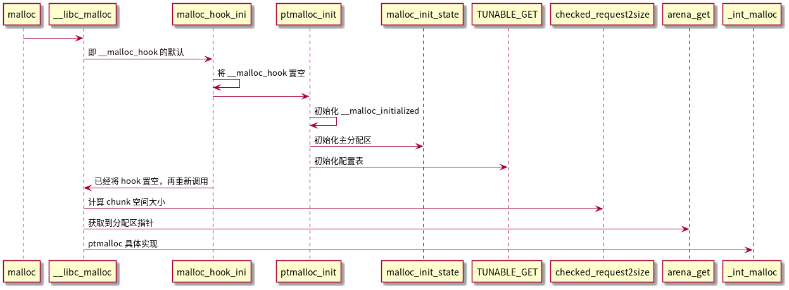

# Ptmalloc 内存管理实现

- [Ptmalloc 内存管理实现](#ptmalloc-内存管理实现)
  - [Ptmalloc 源码 -- `__libc_malloc`](#ptmalloc-源码----__libc_malloc)
  - [入口流程](#入口流程)
    - [入口流程--`malloc_hook_ini`](#入口流程--malloc_hook_ini)
      - [入口流程--`ptmalloc_init`](#入口流程--ptmalloc_init)
        - [入口流程--`malloc_init_state`](#入口流程--malloc_init_state)
  - [调用流程图](#调用流程图)
  - [Q/A](#qa)
    - [分配区](#分配区)
    - [bin 成员](#bin-成员)
    - [特殊 bins 类型](#特殊-bins-类型)
  - [内存管理数据结构之 chunk](#内存管理数据结构之-chunk)

## Ptmalloc 源码 -- `__libc_malloc`

- [参考文章-strong_alias && weak_alias && __attribute__](https://www.cnblogs.com/justinyo/archive/2013/03/12/2956438.html)
- [参考文章-why uClibc/glibc use the alias for function name?](https://comp.os.linux.development.system.narkive.com/L4JmkjDb/why-uclibc-glibc-use-the-alias-for-function-name)

当调用 malloc 申请内存时，通过 `strong_alias` 别名机制是直接调用到 __libc_malloc 函数上：

> strong_alias : 强别名，当出现相同符号的定义会发成重定义冲突。
>
> weak_alias : 弱别名，当出现相同名字的不会重定义，只有当没有冲突时才使用若定义别名。

```c
# define strong_alias(name, aliasname) _strong_alias(name, aliasname)
# define _strong_alias(name, aliasname) \
  extern __typeof (name) aliasname __attribute__ ((alias (#name))) \
    __attribute_copy__ (name);

strong_alias (__libc_malloc, __malloc) strong_alias (__libc_malloc, malloc)
```

ptmalloc 源码，我们先从入口开始分析：

```c
void *
__libc_malloc (size_t bytes)
{
  mstate ar_ptr;
  void *victim;

  _Static_assert (PTRDIFF_MAX <= SIZE_MAX / 2,
                  "PTRDIFF_MAX is not more than half of SIZE_MAX");

  void *(*hook) (size_t, const void *)  // 可以重载自己的内存分配方法给 __malloc_hook
    = atomic_forced_read (__malloc_hook);
  if (__builtin_expect (hook != NULL, 0)) // 这里会直接调用过去，默认是 ptmalloc 的 malloc_hook_ini
    return (*hook)(bytes, RETURN_ADDRESS (0)); // 当第一次调用完成 malloc_hook_ini 后，__malloc_hook 会被置空
#if USE_TCACHE
  /* int_free also calls request2size, be careful to not pad twice.  */
  size_t tbytes;
  if (!checked_request2size (bytes, &tbytes)) // 计算 chunk
    {
      __set_errno (ENOMEM);
      return NULL;
    }
  size_t tc_idx = csize2tidx (tbytes);

  MAYBE_INIT_TCACHE ();

  DIAG_PUSH_NEEDS_COMMENT;
  if (tc_idx < mp_.tcache_bins
      && tcache
      && tcache->counts[tc_idx] > 0)
    {
      return tcache_get (tc_idx);
    }
  DIAG_POP_NEEDS_COMMENT;
#endif

  if (SINGLE_THREAD_P)
    {
      victim = _int_malloc (&main_arena, bytes);
      assert (!victim || chunk_is_mmapped (mem2chunk (victim)) ||
         &main_arena == arena_for_chunk (mem2chunk (victim)));
      return victim;
    }

  arena_get (ar_ptr, bytes); // 获取分配区，包含加锁

  victim = _int_malloc (ar_ptr, bytes); // 分配内存
  /* Retry with another arena only if we were able to find a usable arena
     before.  */
  if (!victim && ar_ptr != NULL)
    {
      LIBC_PROBE (memory_malloc_retry, 1, bytes);
      ar_ptr = arena_get_retry (ar_ptr, bytes);
      victim = _int_malloc (ar_ptr, bytes);
    }

  if (ar_ptr != NULL)
    __libc_lock_unlock (ar_ptr->mutex); //解锁分配区

  assert (!victim || chunk_is_mmapped (mem2chunk (victim)) ||
          ar_ptr == arena_for_chunk (mem2chunk (victim)));
  return victim;
}
```

## 入口流程

- [参考文章-C++性能榨汁机之分支预测器](https://zhuanlan.zhihu.com/p/36543235)
- [参考文章-prevent allocs larger than PTRDIFF_MAX on Android](https://github.com/jemalloc/jemalloc/pull/295)
- [参考文章-What is the maximum size of an array in C?](https://stackoverflow.com/questions/9386979/what-is-the-maximum-size-of-an-array-in-c)

```c
void *weak_variable (*__malloc_hook)
    (size_t __size, const void *) = malloc_hook_ini;

# if __WORDSIZE == 64
#  define SIZE_MAX  (18446744073709551615UL)
# else
#  if __WORDSIZE32_SIZE_ULONG
#   define SIZE_MAX  (4294967295UL)
#  else
#   define SIZE_MAX  (4294967295U)
#  endif
# endif

# if __WORDSIZE == 64
#  define PTRDIFF_MIN  (-9223372036854775807L-1)
#  define PTRDIFF_MAX  (9223372036854775807L)
# else
#  if __WORDSIZE32_PTRDIFF_LONG
#   define PTRDIFF_MIN  (-2147483647L-1)
#   define PTRDIFF_MAX  (2147483647L)
#  else
#   define PTRDIFF_MIN  (-2147483647-1)
#   define PTRDIFF_MAX  (2147483647)
#  endif
# endif

    ..............

void *
__libc_malloc (size_t bytes)
{
  mstate ar_ptr;
  void *victim;

  _Static_assert (PTRDIFF_MAX <= SIZE_MAX / 2,
                  "PTRDIFF_MAX is not more than half of SIZE_MAX");

  void *(*hook) (size_t, const void *)  // 可以重载自己的内存分配方法给 __malloc_hook
    = atomic_forced_read (__malloc_hook);
  if (__builtin_expect (hook != NULL, 0)) // 这里默认调用的是 ptmalloc 的 malloc_hook_ini
    return (*hook)(bytes, RETURN_ADDRESS (0)); // 当第一次调用完成 malloc_hook_ini 后，__malloc_hook 会被置空

    .......
}
```

1. 可以看出如果没有重定义 `__malloc_hook` 弱别名就使用默认的 `malloc_hook_ini`，其使用 atomic_forced_read 原子读取。
2. 判断 `__malloc_hook` 是否为空，如果不为空则进行调用。
   - `__builtin_expect` 用于编译其优化，告知编译器此判断语句更容易为 true 或 false，便于 cpu 的分支预测。
   - `__glibc_unlikely` 和 `__glibc_likely` 都是包装了下 `__builtin_expect`，功能是一样的。
3. 看下最开始的静态断言判断：
   - `SIZE_MAX` 是指 size_t 的最大范围，也就是当前系统最大的寻址范围。
   - 而 `PTRDIFF_MAX` 是指 ptrdiff_t 的最大范围，ptrdiff_t 常用于存放两个地址做减法后的结果。
   - `SIZE_MAX` 是 UL 类型，`PTRDIFF_MAX` 是 L 类型：[上一节进程内存布局](./01_基础知识。md#进程内存布局）从地址空间可以看出堆栈的地址范围不可能超过地址的一半，通常 32 位系统是 3：1 分配的堆空间（1G)，即使是 64 位系统，由于与内核对半分配也不可能超过 SIZE_MAX 的一半（128T），因此 PTRDIFF_MAX <= SIZE_MAX / 2。

### 入口流程--`malloc_hook_ini`

```c
static void *
malloc_hook_ini (size_t sz, const void *caller)
{
  __malloc_hook = NULL;
  ptmalloc_init ();
  return __libc_malloc (sz);
}
```

1. 第一步先将 `__malloc_hook` 置为 NULL。
2. 调用 `ptmalloc_init` 后，又重新调用了 `__libc_malloc`，配合前边 `__libc_malloc` 中判断 hook 是否为空就是为这时准备的，由于 hook 在第一次 malloc 调用后就被置 NULL 了，`__builtin_expect` 的期望也就是 false。

#### 入口流程--`ptmalloc_init`

- [参考文章--Tunable Framework](https://sourceware.org/glibc/wiki/Tunables)

简略版本代码：

```c
/* There are several instances of this struct ("arenas") in this
   malloc.  If you are adapting this malloc in a way that does NOT use
   a static or mmapped malloc_state, you MUST explicitly zero-fill it
   before using. This malloc relies on the property that malloc_state
   is initialized to all zeroes (as is true of C statics).  */

static struct malloc_state main_arena =
{
  .mutex = _LIBC_LOCK_INITIALIZER,
  .next = &main_arena,
  .attached_threads = 1
};
.....

/* Already initialized? */
int __malloc_initialized = -1;

.....

static void
ptmalloc_init (void)
{
  if (__malloc_initialized >= 0)
    return;

  __malloc_initialized = 0;

  thread_arena = &main_arena;

  malloc_init_state (&main_arena);

  TUNABLE_GET (check, int32_t, TUNABLE_CALLBACK (set_mallopt_check));
  TUNABLE_GET (top_pad, size_t, TUNABLE_CALLBACK (set_top_pad));
  TUNABLE_GET (perturb, int32_t, TUNABLE_CALLBACK (set_perturb_byte));
  TUNABLE_GET (mmap_threshold, size_t, TUNABLE_CALLBACK (set_mmap_threshold));
  TUNABLE_GET (trim_threshold, size_t, TUNABLE_CALLBACK (set_trim_threshold));
  TUNABLE_GET (mmap_max, int32_t, TUNABLE_CALLBACK (set_mmaps_max));
  TUNABLE_GET (arena_max, size_t, TUNABLE_CALLBACK (set_arena_max));
  TUNABLE_GET (arena_test, size_t, TUNABLE_CALLBACK (set_arena_test));

  TUNABLE_GET (mxfast, size_t, TUNABLE_CALLBACK (set_mxfast));

  __malloc_initialized = 1;
}
```

1. 通过全局变量 `__malloc_initialized` 标识 ptmalloc 初始化状态：-1 未初始化、0 正在初始化、1 初始化完成。
2. 将主分配区 `main_arena` 分配给进行初始化的线程。*// Q1: 什么是主分配区、分配区又指什么，分配区各个成员作用都有哪些？*
3. 调用 `malloc_init_state` 初始话主分配区。
4. `TUNABLE_GET` 可调参数是 GNU C 库中的一个特性，它允许应用程序作者和发行版维护人员改变运行时库的行为以匹配他们的工作负载。具体详见参考文章 `Tunable Framework`。

##### 入口流程--`malloc_init_state`

- [参考文章--ptmalloc 源码分析](https://blog.csdn.net/initphp/article/details/109489720#t1)

```c
/*
   Initialize a malloc_state struct.

   This is called from ptmalloc_init () or from _int_new_arena ()
   when creating a new arena.
 */

static void
malloc_init_state (mstate av)
{
  int i;
  mbinptr bin;

  /* Establish circular links for normal bins */
  /* NBINS=128 */
  for (i = 1; i < NBINS; ++i)
    {
      bin = bin_at (av, i);
      bin->fd = bin->bk = bin;
    }

#if MORECORE_CONTIGUOUS
  if (av != &main_arena)
#endif
  set_noncontiguous (av);
  if (av == &main_arena)
    set_max_fast (DEFAULT_MXFAST);
  atomic_store_relaxed (&av->have_fastchunks, false);

  av->top = initial_top (av);
}

.........................

/* addressing -- note that bin_at(0) does not exist */
#define bin_at(m, i) \
  (mbinptr) (((char *) &((m)->bins[((i) - 1) * 2]))     \
             - offsetof (struct malloc_chunk, fd))

#define set_noncontiguous(M)   ((M)->flags |= NONCONTIGUOUS_BIT)

#define set_max_fast(s) \
  global_max_fast = (((size_t) (s) <= MALLOC_ALIGN_MASK - SIZE_SZ)	\
                     ? MIN_CHUNK_SIZE / 2 : ((s + SIZE_SZ) & ~MALLOC_ALIGN_MASK))

#define initial_top(M)              (unsorted_chunks (M))
```

1. `从下标 1` 开始对分配区 bin 成员进行初始化，将每个 bin 的 fd、bk 都置为自身。 *// Q2: bin 成员作用是什么，为什么要从下标 1 开始？*
2. 如果初始化非主分配区，调用 set_noncontiguous 设置 NONCONTIGUOUS_BIT 标识位。*// Q3: NONCONTIGUOUS_BIT 是什么，为什么要针对非主分配区？*
3. 如果是主分配区通过 set_max_fast 初始化 global_max_fast 的大小。*// Q4: global_max_fast 是什么，有什么作用？*
4. 原子操作设置分配区 have_fastchunks 成员为 false。
5. 初始化分配区 top 成员。 *// Q5：top 成员特点，以及为什么这么初始化？*

## 调用流程图



再次调用的流程。


## Q/A

- Q1: 什么是主分配区、分配区又指什么，分配区各个成员作用都有哪些？
- Q2: bin 成员作用是什么，为什么要从下标 1 开始？
- Q3: NONCONTIGUOUS_BIT 是什么，为什么要针对非主分配区？
- Q4: global_max_fast 是什么，有什么作用？
- Q5: top 成员特点，以及为什么这么初始化？

### 分配区

- [参考文章-Wolfram Gloger's malloc homepage](http://www.malloc.de/en/)
- [参考文章-ptmalloc 源码分析 - 分配器状态机 malloc_state（02）](https://blog.csdn.net/initphp/article/details/109489720)
- [参考文章-Understanding the glibc malloc binning implementation](https://stackoverflow.com/questions/63600405/understanding-the-glibc-malloc-binning-implementation)

1. 为什么要有 ptmalloc？
   - 最初版本的 malloc 内存分配器只有一个主分配区，每次分配内存都必须对住分配区加锁，完成后再释放使得多线程情况下效率较差。而当前的 ptmalloc 增加了对应`非主分配区`，主分配区与非主分配区用环形链表进行管理，每一个分配区利用互斥锁 (mutex) 使线程对于该分配区的访问互斥。

2. 具体分配区如何避免多线程问题？
   - 当一个线程使用 malloc 分配内存的时候，首选会检查该线程环境中是否已经存在一个分配区，如果存在，则对该分配区进行加锁，并使用该分配区进行内存分配。
   - 如果分配失败，则遍历链表中获取的未加锁的分配区。
   - 如果整个链表都没有未加锁的分配区，则 ptmalloc 开辟一个新的分配区，假如 malloc_state->next 全局队列，并该线程在改内存分区上进行分配。
   - 当释放这块内存的时候，首先获取分配区的锁，然后释放内存，如果其他线程正在使用，则等待其他线程。

3. 什么是分配区？主分配区与非主分配区有什么区别？
   - ptmalloc 通过 malloc_state 的状态机来管理内存的分配，即分配区。malloc_state 主要用来管理分配的内存块，比如是否有空闲的 chunk，有什么大小的空闲 chunk 等等。（ chunk 是内存管理的最小单元）。当用户层调用 malloc/free 等函数的时候，都会通过 ptmalloc 内核模块进行内存的分配，每一块从操作系统上分配的内存，都会使用 malloc_state 结构体来管理。
   - 每个进程有一个主分配区，也可以允许有多个非主分配区。
   - 主分配区可以使用 brk 和 mmap 来分配，而非主分配区只能使用 mmap 来映射内存块。
   - 非主分配区的数量一旦增加，则不会减少。
   - 主分配区和非主分配区形成一个环形链表进行管理。通过 malloc_state->next 来链接。

4. 下面详细解释下，malloc_state 每个成员的作用：

    ```c
    struct malloc_state
    {
      /* 
        线程锁，只有当前申请线程拿到后才能使用分配区申请内存，否则只能继续查找下一个空闲的分配区。
        如果所有的分配区都已经加锁，那么 malloc() 会开辟一个新的分配区。
        把该分配区加入到全局分配区循环链表并加锁，然后使用该分配区进行分配内存操作。
      */
      __libc_lock_define (, mutex); 

      /* Flags (formerly in max_fast).  
        记录了分配区的一些标志，比如 bit0 记录了分配区是否有 fast bin chunk ，bit1 标识分配区是否能返回连续的虚拟地址空间
      */
      int flags;

      /* Set if the fastbin chunks contain recently inserted free blocks.  
        Note this is a bool but not all targets support atomics on booleans.  
      
        用于标记是否有 fast bins
        have_fastchunks 表示可能存在 fastbin 块。在将 chunk 存入任何 fastbin 时设置为 true，并在 malloc_consolidate 中进行合并。
        该值是近似值，因为它可能在出现即使有 fastbin 可用块也可能为 false。
        鉴于它的唯一目的是减少冗余调用 malloc_consolidate 的数量不影响正确性。因此，可以安全地使用宽松的原子访问。
        注：malloc_consolidate 的作用是将 fastbin 进行合并，加入到其他 bin 管理链表上去。
      */
      int have_fastchunks;

      /* Fastbins 
        fast bins 是 bins 的高速缓冲区，大约有 10 个定长队列。
        当用户释放一块不大于 max_fast（默认值 64）的 chunk（一般小内存）的时候，会默认会被放到 fast bins 上。
      */
      mfastbinptr fastbinsY[NFASTBINS];

      /* Base of the topmost chunk -- not otherwise kept in a bin
        指向分配区的 top chunk。
        top chunk 相当于分配区的顶部空闲内存，当 bins 上都不能满足内存分配要求的时候，就会来 top chunk 上分配。 
      */
      mchunkptr top;

      /* The remainder from the most recent split of a small request */
      mchunkptr last_remainder;

      /* Normal bins packed as described above 
      *  常规 bins chunk 的链表数组，具体可以参见 bin 成员分析。
      */
      mchunkptr bins[NBINS * 2 - 2];

      /* Bitmap of bins 
        表示 bin 数组当中某一个下标的 bin 是否为空，用来在分配的时候加速
      */
      unsigned int binmap[BINMAPSIZE];

      /* Linked list 
        分配区全局链表：分配区链表，主分配区放头部，新加入的分配区放 main_arean.next 位置 Linked list 
      */
      struct malloc_state *next;

      /* Linked list for free arenas.  Access to this field is serialized
          by free_list_lock in arena.c.  
          空闲的分配区链表
      */
      struct malloc_state *next_free;

      /* Number of threads attached to this arena.  0 if the arena is on
          the free list.  Access to this field is serialized by
          free_list_lock in arena.c.  
          使用当前分配区的线程数量，0 时存放在 next_free 链表上
      */
      INTERNAL_SIZE_T attached_threads;

      /* Memory allocated from the system in this arena.  */
      INTERNAL_SIZE_T system_mem;
      INTERNAL_SIZE_T max_system_mem;
    };
    ```

### bin 成员

1. bin 成员的作用？
    - ptmalloc 的空闲 chunk 都是通过在 malloc_state 上的 bins 数组来管理的。一共分为四种类型的 bins：fast bins、 unsorted bin、small bins 和 large bins。

2. 首先让看下分配区结构中涉及到 bin 管理的成员，大体的成员含义上一节已经讲解，本节主要分析每一个成员具体实现的功能：

    ```cpp
    struct malloc_state
    {
      .................

      int have_fastchunks;

      mfastbinptr fastbinsY[NFASTBINS];

      mchunkptr top;

      mchunkptr last_remainder;

      /* Normal bins packed as described above 
      * 1. unsorted bin：是 bins 的一个缓冲区。当用户释放的内存大于 max_fast 或者 fast bins 合并后的 chunk 都会进入 unsorted bin 上
      * 2. small bins 和 large bins：small bins 和 large bins 是真正用来放置 chunk 双向链表的。每个 bin 之间相差 8 个字节，并且通过上面的这个列表，可以快速定位到合适大小的空闲 chunk。
      * 3. 下标 1 是 unsorted bin，2 到 63 是 small bin，64 到 126 是 large bin，共 126 个 bin
      * 4. BINS 定义为 128 由于在 bins 数组中的每个 bin 都有着一个 fd 和 bk 的指针 所以要乘 2，bin[0] 没有使用 因此 - 2。
      */
      mchunkptr bins[NBINS * 2 - 2];

      unsigned int binmap[BINMAPSIZE];
      ...............
    }
    ```

    - bins 结构可以见下图，每两个 bins 元素指向一个双向链表的头与尾，因此需要 `NBINS * 2`：

      ```text
          Bins Array                Chunk 0                Chunk 1 

      +--> XXXXXXXXXX <-\     /--> +--------+ <-\     /--> +--------+ <-----+
      |    XXXXXXXXXX    \   /     |  p_sz  |    \   /     |  p_sz  |       |
      |    XXXXXXXXXX     \ /      +--------+     \ /      +--------+       |
      |    XXXXXXXXXX      X       |   sz   |      X       |   sz   |       |
      |    +--------+     / \      +--------+     / \      +--------+       |
      |    | [2i-2] | -->/   \     |   fd   | -->/   \     |   fd   | ->+   |
      |    +--------+         \    +--------+         \    +--------+   |   |
      |    | [2i-1] | -->+     \<- |   bk   |          \<- |   bk   |   |   |
      |    +--------+    |         +--------+              +--------+   |   |
      |                  |                                              |   |
      |                  +----------------------------------------------+---+
      |                                                                 |
      +<----------------------------------------------------------------+
      ```

3. `fast bins`: 相关的成员有 have_fastchunks 与 fastbinsY。
   - have_fastchunks：如前文所述，用于标识是否存在空闲的 fast bins 内存块。
   - fastbinsY：用于管理 fast bins 内存块，
   - 当用户释放一块不大于 max_fast（**主分配区初始化时配置，默认值 *64 * SIZE_SZ / 4***）的 chunk，会默认会被放到 fast bins 上。当用户下次需要申请内存的时候首先会到 fast bins 上寻找是否有合适的 chunk，然后才会到 bins 上空闲链表里面查找的 chunk。每次申请内存 如果 fast bins 以及 small bins 无法满足需求，ptmalloc 都会遍历 fast bin 看是否有合适的 chunk 需要合并到 unorder bins 上，再尝试进行后续分配，避免过多的缓存。

    ```cpp
    /*
      Fastbins
        包含最近释放的 small chunk 的列表数组。
        快箱没有使用双向链表，不仅仅单链表的速度更快，而且由于每个 fast bin 链表大小都是一致的因此不需要从中间进行删除，因此采用单链表结构。
        此外，与普通 bins 不同的是，它们甚至没有按 FIFO 顺序处理（它们使用更快的 LIFO），因为在瞬态上下文中，通常使用 fastbins 排序并不重要。

        fastbins 中的 chunk 保持其 inuse 位设置，因此它们不能与其他空闲 chunk 合并。 
        需要通过 malloc_consolidate 释放 fastbins 中的所有 chunk 并将它们合并其他 free chunk。 
    */

    typedef struct malloc_chunk *mfastbinptr;
    #define fastbin(ar_ptr, idx) ((ar_ptr)->fastbinsY[idx])

    /* offset 2 to use otherwise unindexable first 2 bins */
    #define fastbin_index(sz) \
      ((((unsigned int) (sz)) >> (SIZE_SZ == 8 ? 4 : 3)) - 2)

    /* The maximum fastbin request size we support */
    // 80 * size_t / 4 = 160 Byte
    #define MAX_FAST_SIZE     (80 * SIZE_SZ / 4) 

    // request2size 用于将申请的内存大小通过对齐后计算所需的 chunk size，后续章节会有介绍。
    // request2size (MAX_FAST_SIZE) = ((160 + 8) + MALLOC_ALIGN_MASK(01111)) and ~MALLOC_ALIGN_MASK(10000) = 176 Byte
    // fastbin_index (176) = 176 >> 4 - 2 = 11 - 2 = 9
    // TODO: 打印证明
    #define NFASTBINS  (fastbin_index (request2size (MAX_FAST_SIZE)) + 1) 

    /*
      Set value of max_fast.
      Use impossibly small value if 0.
      Precondition: there are no existing fastbin chunks in the main arena.
      Since do_check_malloc_state () checks this, we call malloc_consolidate ()
      before changing max_fast.  Note other arenas will leak their fast bin
      entries if max_fast is reduced.
    */

    #define set_max_fast(s) \
      global_max_fast = (((size_t) (s) <= MALLOC_ALIGN_MASK - SIZE_SZ) \
                        ? MIN_CHUNK_SIZE / 2 : ((s + SIZE_SZ) & ~MALLOC_ALIGN_MASK))

    static inline INTERNAL_SIZE_T
    get_max_fast (void)
    {
      /* Tell the GCC optimizers that global_max_fast is never larger
        than MAX_FAST_SIZE.  This avoids out-of-bounds array accesses in
        _int_malloc after constant propagation of the size parameter.
        (The code never executes because malloc preserves the
        global_max_fast invariant, but the optimizers may not recognize
        this.)  */
      if (global_max_fast > MAX_FAST_SIZE)
        __builtin_unreachable ();
      return global_max_fast;
    }

    #ifndef DEFAULT_MXFAST
    #define DEFAULT_MXFAST     (64 * SIZE_SZ / 4)
    #endif
    ```

4. `unsorted bin`：是 bins 的一个缓冲区，bins 数组下标为 1 的即是 unstored bin。当用户释放的内存大于 max_fast 或者 fast bins 合并后的 chunk 都会进入 unsorted bin 上。当用户 malloc 的时候，如果 fast bins 以及 small bins 都无法满足需求后，首先通过 malloc_consolidate 进行合并 fast bins 到 unsorted bin 上，在使用 large bins 进行分配前，会遍历整个 unsorted bin 将其管理的 chunk 按照大小标准插入到 small bins 或者 large bins 中，再尝试分配。//TODO：待验证！！！

    ```cpp
    /*
        Unsorted chunks

        所有 chunk 经过切割后的剩余部分 chunk，以及 free 的 chunk, 首先被放在 "unsorted" bin 中，
        然后在 malloc 给他们一个机会被使用之前放置的进入 常规 bins 中。

        所以，基本上，未排序的块列表作为一个队列，以 free （和 malloc_consolidated) 存入 chunk,
        在 malloc 中使用（要么使用，要么放在 bins 里）。

        从未为未排序的块设置 NON_MAIN_ARENA 标志，因此它在大小比较中不必考虑。
        
    */

    /* The otherwise unindexable 1-bin is used to hold unsorted chunks. */
    #define unsorted_chunks(M)          (bin_at (M, 1))

    ```

5. `small bins`：小于 512 字节（64 位机器 1024 字节）的 chunk 被称为 small chunk，而保存 small chunks 的 bin 被称为 small bin。**数组从 2 开始编号到 63，前 62 个 bin 为 small bins**，small bin 每个 bin 之间相差 8 个字节（64 位 16 字节），同一个 small bin 中的 chunk 具有相同大小。起始 bin 大小为 16 字节（64 位系统 32）。

6. `large bins`：大于等于 512 字节（64 位机器 1024 字节）的 chunk 被称为 large chunk，而保存 large chunks 的 bin 被称为 large bin。**位于 small bins 后面，数组编号从 64 开始，后 64 个 bin 为 large bins**。同一个 bin 上的 chunk，可以大小不一定相同。large bins 都是通过等差步长的方式进行拆分。（以 32 位系统为例，前 32 个 bin 步长 64，后 16 个 bin 步长 512，后 8 个步长 4096，后四个 32768，后 2 个 262144）（编号 63 到 64 的步长跟）。起始 bin 大小为 512 字节（64 位系统 1024）。

    ```cpp
    /*
    Bins

    An array of bin headers for free chunks. Each bin is doubly
    linked.  The bins are approximately proportionally (log) spaced.
    There are a lot of these bins (128). This may look excessive, but
    works very well in practice.  Most bins hold sizes that are
    unusual as malloc request sizes, but are more usual for fragments
    and consolidated sets of chunks, which is what these bins hold, so
    they can be found quickly.  All procedures maintain the invariant
    that no consolidated chunk physically borders another one, so each
    chunk in a list is known to be preceeded and followed by either
    inuse chunks or the ends of memory.

    Chunks in bins are kept in size order, with ties going to the
    approximately least recently used chunk. Ordering isn't needed
    for the small bins, which all contain the same-sized chunks, but
    facilitates best-fit allocation for larger chunks. These lists
    are just sequential. Keeping them in order almost never requires
    enough traversal to warrant using fancier ordered data
    structures.

    Chunks of the same size are linked with the most
    recently freed at the front, and allocations are taken from the
    back.  This results in LRU (FIFO) allocation order, which tends
    to give each chunk an equal opportunity to be consolidated with
    adjacent freed chunks, resulting in larger free chunks and less
    fragmentation.

    To simplify use in double-linked lists, each bin header acts
    as a malloc_chunk. This avoids special-casing for headers.
    But to conserve space and improve locality, we allocate
    only the fd/bk pointers of bins, and then use repositioning tricks
    to treat these as the fields of a malloc_chunk*.

    用于管理空闲块的 bin 标头数组。每个 bin 都是双重的链接。 
    bin 大约按比例 (log) 间隔。有很多这样的 bins（128）。这可能看起来有些过分的，但是在实践中效果很好。

    大多数 bin 的尺寸都是不寻常的 malloc 请求大小，
    但这些 bins 保存着更常见的片段和合并的内存块集，可以快速的找到并分配。

    所有过程保持不变没有合并的块在物理上与另一个块相邻，
    所以已知每个列表中的块在前面和后面是使用块或内存的末端。
    
    large bins 中的 chunk 按大小顺序排列，连接到大约最近最少使用的块。

    对于 small bins 则不需要排序，它们都包含相同大小的块，但是
    这对 larger chunk 最佳分配有促进作用。这些队列只是顺序。
    使它们井然有序几乎不需要遍历足以保证快速定位到需要的数据 bin 下标。
    
    chunk 相同的链表，free 是在前端插入，使用时从链表尾端取出。
    这就是 LRU (FIFO) 分配顺序，往往给每个块一个平等的机会与相邻的释放块，
    从而保证更大的空闲块和更少的碎片化。
    
    为了简化在双链表中的使用，每个 bin header 作为 malloc_chunk。这避免了链表头的特殊类型转换。
    但是为了节省空间和改善局部性，我们分配只有 bins 的 fd/bk 指针，然后使用重新定位技巧，将这些视为 malloc_chunk *的字段。
    */

    typedef struct malloc_chunk *mbinptr;

    /* addressing -- note that bin_at(0) does not exist 
       每个 bin header 类型都是作为 malloc_chunk，但是由于节省空间仅仅在 bins 上分配了 fd 和 bk 两个指针的空间，
       为了使用者的一致性，offsetof (struct malloc_chunk, fd)) 进行偏移并强转为 mbinptr 类型，最终可以使用 fd 和 bk 成员指针，
       去到对应的 bins 上数组下标地址内指向的地址。

       因此 bin[0] 不存东西的原因也是防止向前偏移 size_t * 2 的地址使用到了别人的内存空间。
       // TODO: 证明  bin_at(1) 得到的 mbinptr = bin[0]
    */
    #define bin_at(m, i) \
      (mbinptr) (((char *) &((m)->bins[((i) - 1) * 2]))     \
                - offsetof (struct malloc_chunk, fd))

    /* analog of ++bin */
    #define next_bin(b)  ((mbinptr) ((char *) (b) + (sizeof (mchunkptr) << 1)))

    /* Reminders about list directionality within bins */
    #define first(b)     ((b)->fd)
    #define last(b)      ((b)->bk)

    /*
      Indexing

        Bins for sizes < 512 bytes contain chunks of all the same size, spaced
        8 bytes apart. Larger bins are approximately logarithmically spaced:

        64 bins of size       8
        32 bins of size      64
        16 bins of size     512
        8 bins of size    4096
        4 bins of size   32768
        2 bins of size  262144
        1 bin  of size what's left

        There is actually a little bit of slop in the numbers in bin_index
        for the sake of speed. This makes no difference elsewhere.

        The bins top out around 1MB because we expect to service large
        requests via mmap.

        Bin 0 does not exist.  Bin 1 is the unordered list; if that would be
        a valid chunk size the small bins are bumped up one.

        索引
    
        Bins 所包含的 chunk’s size < 512 字节为 small chunk 链表上所有的 chunk 大小一致，
    
        每个 Bin 管理的大小以 8 字节倍数递增：
    
        64 bins of size       8
        32 bins of size      64
        16 bins of size     512
        8 bins of size    4096
        4 bins of size   32768
        2 bins of size  262144
        1 bin  of size what's left
    */

    #define NBINS             128
    #define NSMALLBINS         64
    #define SMALLBIN_WIDTH    MALLOC_ALIGNMENT
    #define SMALLBIN_CORRECTION (MALLOC_ALIGNMENT > CHUNK_HDR_SZ)
    #define MIN_LARGE_SIZE    ((NSMALLBINS - SMALLBIN_CORRECTION) * SMALLBIN_WIDTH)

    #define in_smallbin_range(sz)  \
      ((unsigned long) (sz) < (unsigned long) MIN_LARGE_SIZE)

    #define smallbin_index(sz) \
      ((SMALLBIN_WIDTH == 16 ? (((unsigned) (sz)) >> 4) : (((unsigned) (sz)) >> 3))\
      + SMALLBIN_CORRECTION)

    #define largebin_index_32(sz)                                                \
      (((((unsigned long) (sz)) >> 6) <= 38) ?  56 + (((unsigned long) (sz)) >> 6) :\
      ((((unsigned long) (sz)) >> 9) <= 20) ?  91 + (((unsigned long) (sz)) >> 9) :\
      ((((unsigned long) (sz)) >> 12) <= 10) ? 110 + (((unsigned long) (sz)) >> 12) :\
      ((((unsigned long) (sz)) >> 15) <= 4) ? 119 + (((unsigned long) (sz)) >> 15) :\
      ((((unsigned long) (sz)) >> 18) <= 2) ? 124 + (((unsigned long) (sz)) >> 18) :\
      126)

    #define largebin_index_32_big(sz)                                            \
      (((((unsigned long) (sz)) >> 6) <= 45) ?  49 + (((unsigned long) (sz)) >> 6) :\
      ((((unsigned long) (sz)) >> 9) <= 20) ?  91 + (((unsigned long) (sz)) >> 9) :\
      ((((unsigned long) (sz)) >> 12) <= 10) ? 110 + (((unsigned long) (sz)) >> 12) :\
      ((((unsigned long) (sz)) >> 15) <= 4) ? 119 + (((unsigned long) (sz)) >> 15) :\
      ((((unsigned long) (sz)) >> 18) <= 2) ? 124 + (((unsigned long) (sz)) >> 18) :\
      126)

    /* 
        It remains to be seen whether it is good to keep the widths of
        the buckets the same or whether it should be scaled by a factor
        of two as well.
    */
    #define largebin_index_64(sz)                                                \
      (((((unsigned long) (sz)) >> 6) <= 48) ?  48 + (((unsigned long) (sz)) >> 6) :\
      ((((unsigned long) (sz)) >> 9) <= 20) ?  91 + (((unsigned long) (sz)) >> 9) :\
      ((((unsigned long) (sz)) >> 12) <= 10) ? 110 + (((unsigned long) (sz)) >> 12) :\
      ((((unsigned long) (sz)) >> 15) <= 4) ? 119 + (((unsigned long) (sz)) >> 15) :\
      ((((unsigned long) (sz)) >> 18) <= 2) ? 124 + (((unsigned long) (sz)) >> 18) :\
      126)

    #define largebin_index(sz) \
      (SIZE_SZ == 8 ? largebin_index_64 (sz)                                     \
      : MALLOC_ALIGNMENT == 16 ? largebin_index_32_big (sz)                     \
      : largebin_index_32 (sz))

    #define bin_index(sz) \
      ((in_smallbin_range (sz)) ? smallbin_index (sz) : largebin_index (sz))

    ```

- bins 的结构：
  - bins 长度为 127 ，前 62 为 small bins，后 64 个为 large bin ，下标 1 的 bin 为 unstored bins。
  - 每个 bin 之间，通过等差数列的方式排序，32 位系统前 64 个 small bins 步长为 8，large bin 前 32 步长为 64；64 位系统分别为 16，128。


### 特殊 bins 类型

- [参考文章-理解 glibc malloc：malloc() 与 free() 原理图解](https://blog.csdn.net/maokelong95/article/details/52006379)
- [参考文章-Understanding glibc malloc](https://sploitfun.wordpress.com/2015/02/10/understanding-glibc-malloc/comment-page-1/?blogsub=confirming#subscribe-blog%E3%80%82)
  - [译文-理解 glibc malloc：主流用户态内存分配器实现原理](https://blog.csdn.net/maokelong95/article/details/51989081)

是三种例外的 chunk 管理方式：`top chunk`，`mmaped chunk` 和 `last remainder chunk`。

- `Top chunk`：top chunk 相当于分配区的顶部空闲内存，当 bins 上都不能满足内存分配要求的时候，就会来 top chunk 上分配。top chunk 大小比用户所请求大小还大的时候，top chunk 会分为两个部分：User chunk（用户请求大小）和 Remainder chunk（剩余大小）。其中 Remainder chunk 成为新的 top chunk。当 top chunk 大小小于用户所请求的大小时，top chunk 就通过 sbrk（main arena）或 mmap（thread arena）系统调用来扩容。

- `mmaped chunk`：当分配的内存非常大（大于分配阀值，默认 128K）的时候，需要被 mmap 映射，则会放到 mmaped chunk 上，当释放 mmaped chunk 上的内存的时候会直接交还给操作系统。

- `Last remainder chunk`：Last remainder chunk 是另外一种特殊的 chunk，就像 top chunk 和 mmaped chunk 一样，不会在任何 bins 中找到这种 chunk。当需要分配一个 small chunk, 但在 small bins 中找不到合适的 chunk，如果 last remainder chunk 的大小大于所需要的 small chunk 大小，last remainder chunk 被分裂成两个 chunk，其中一个 chunk 返回给用户，另一个 chunk 变成新的 last remainder chunk。

## 内存管理数据结构之 chunk

- [参考文章--glibc 内存管理源码分析](https://github.com/vislee/leevis.com/issues/132)

```c
/*
  -----------------------  Chunk representations -----------------------
*/

/*
  This struct declaration is misleading (but accurate and necessary).
  It declares a "view" into memory allowing access to necessary
  fields at known offsets from a given base. See explanation below.
*/

/*
   malloc_chunk 详细信息：

    （以下内容包括 Colin Plumb 精心编辑的解释。）

    内存块使用“边界标记”方法维护，如下所示：如 Knuth 或 Standish 中所述。 （请参阅保罗的论文威尔逊 ftp://ftp.cs.utexas.edu/pub/garbage/allocsrv.ps 这些技术的调查。）
    空闲块的大小都存储在每个块的前面和结尾。这使得将碎片化的块合并为更大的块更快。大小字段的低位表示块是空正在使用。

    分配的块看起来像这样：

    chunk-> +-+-+-+-+-+-+-+-+-+-+-+-+-+-+-+-+-+-+-+-+-+-+-+-+-+-+-+-+-+-+-+-+
        |             Size of previous chunk, if unallocated (P clear)  |
        +-+-+-+-+-+-+-+-+-+-+-+-+-+-+-+-+-+-+-+-+-+-+-+-+-+-+-+-+-+-+-+-+
        |             Size of chunk, in bytes                     |A|M|P|
        mem-> +-+-+-+-+-+-+-+-+-+-+-+-+-+-+-+-+-+-+-+-+-+-+-+-+-+-+-+-+-+-+-+-+
        |             User data starts here...                          .
        .                                                               .
        .             (malloc_usable_size() bytes)                      .
        .                                                               |
    nextchunk-> +-+-+-+-+-+-+-+-+-+-+-+-+-+-+-+-+-+-+-+-+-+-+-+-+-+-+-+-+-+-+-+-+
        |             (size of chunk, but used for application data)    |
        +-+-+-+-+-+-+-+-+-+-+-+-+-+-+-+-+-+-+-+-+-+-+-+-+-+-+-+-+-+-+-+-+
        |             Size of next chunk, in bytes                |A|0|1|
        +-+-+-+-+-+-+-+-+-+-+-+-+-+-+-+-+-+-+-+-+-+-+-+-+-+-+-+-+-+-+-+-+

    在大多数情况下，“chunk”是标识的给 malloc 分配的空间，但是“mem”是返回到用户的地址。 “Nextchunk”是下一个连续块的开始。
    
    块总是从偶数字边界开始，因此 mem 部分（返回给用户）是在偶数字边界上，并且因此，至少双字对齐。

    空闲块存储在环形双向链接列表中，如下所示：

    chunk-> +-+-+-+-+-+-+-+-+-+-+-+-+-+-+-+-+-+-+-+-+-+-+-+-+-+-+-+-+-+-+-+-+
        |             Size of previous chunk, if unallocated (P clear)  |
        +-+-+-+-+-+-+-+-+-+-+-+-+-+-+-+-+-+-+-+-+-+-+-+-+-+-+-+-+-+-+-+-+
    `head:' |             Size of chunk, in bytes                     |A|0|P|
        mem-> +-+-+-+-+-+-+-+-+-+-+-+-+-+-+-+-+-+-+-+-+-+-+-+-+-+-+-+-+-+-+-+-+
        |             Forward pointer to next chunk in list             |
        +-+-+-+-+-+-+-+-+-+-+-+-+-+-+-+-+-+-+-+-+-+-+-+-+-+-+-+-+-+-+-+-+
        |             Back pointer to previous chunk in list            |
        +-+-+-+-+-+-+-+-+-+-+-+-+-+-+-+-+-+-+-+-+-+-+-+-+-+-+-+-+-+-+-+-+
        |             Unused space (may be 0 bytes long)                .
        .                                                               .
        .                                                               |
    nextchunk-> +-+-+-+-+-+-+-+-+-+-+-+-+-+-+-+-+-+-+-+-+-+-+-+-+-+-+-+-+-+-+-+-+
    `foot:' |             Size of chunk, in bytes                           |
        +-+-+-+-+-+-+-+-+-+-+-+-+-+-+-+-+-+-+-+-+-+-+-+-+-+-+-+-+-+-+-+-+
        |             Size of next chunk, in bytes                |A|0|0|
        +-+-+-+-+-+-+-+-+-+-+-+-+-+-+-+-+-+-+-+-+-+-+-+-+-+-+-+-+-+-+-+-+

    P（PREV_INUSE）位，存储在未使用的块大小标识的低位中及 "head"（始终是两字节的倍数），在使用中*上一个*块的位。如果该位*清除*，则当前块大小之前的字节包含前一个块大小，并且可以用来查找前一个块的前面。
    分配的第一个块始终设置有该位，防止访问不存在的（或非所有的）内存。如果为任何给定的块设置了 prev_inuse，那么您无法确定前一块的大小，甚至可能会得到一个内存尝试解决故障时。

    清除开头的块中的 A（NON_MAIN_ARENA）位，主分配区，由 main_arena 变量描述。当额外产生线程，每个线程都有自己的舞台（最多一个可配置的限制，之后将分配区重用于多个线程），并且这些分配区中的块均设置了 A 位。
    在这样的非主分配区上找到块的分配区，heap_for_ptr 通过 ar_ptr 执行位掩码操作和间接寻址每堆头标 heap_info 的成员（请参见 arena.c）。

    请注意，当前块的“英尺”实际上表示为作为 NEXT 块的 prev_size。这使得更容易处理对齐方式等，但尝试时可能会造成混乱扩展或修改此代码。

    所有这三个例外是：

     1. 特殊的块“top”不会打扰使用尾随大小字段，因为没有下一个连续的块那将不得不索引它。初始化后，“top”被迫永远存在。如果它变得小于长度为 MINSIZE 个字节，则补充。

     2. 通过 mmap 分配的块，其次低在其大小字段中设置的位 M（IS_MMAPPED）。因为他们是一对一分配，每个都必须包含自己的尾随大小场地。如果设置了 M 位，则忽略其他位（因为映射的块既不在分配区中，也不在附近到释放的块中）。 M 位还用于块最初来自通过 malloc_set_state 的转储堆钩子 c。

     3. fastbin 中的块被视为从中分配的块。块分配器的观点。他们被合并与他们的邻居仅在 malloc_consolidate 中批量。
*/ 

struct malloc_chunk {

  INTERNAL_SIZE_T      mchunk_prev_size;  /* Size of previous chunk (if free).  */
  INTERNAL_SIZE_T      mchunk_size;       /* Size in bytes, including overhead. */

  struct malloc_chunk* fd;         /* double links -- used only if free. */
  struct malloc_chunk* bk;

  /* Only used for large blocks: pointer to next larger size.  */
  struct malloc_chunk* fd_nextsize; /* double links -- used only if free. */
  struct malloc_chunk* bk_nextsize;
};
```
