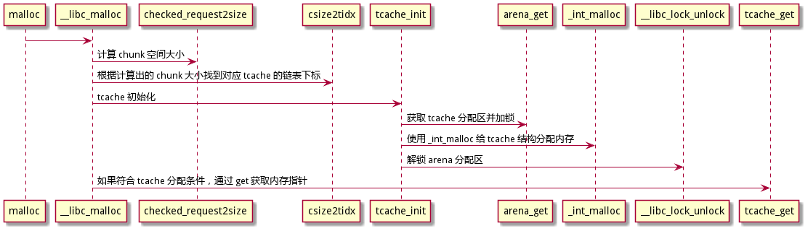
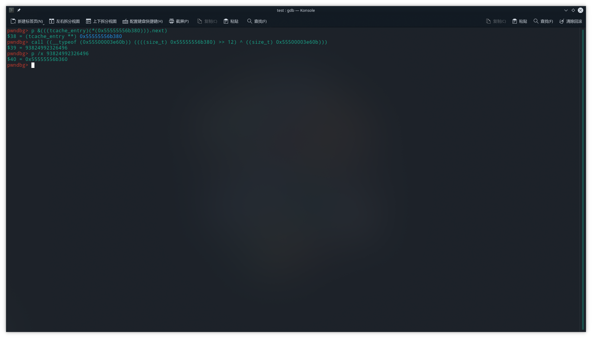

# Tcache 机制分析

- [Tcache 机制分析](#tcache-机制分析)
  - [Tcache 机制](#tcache-机制)
    - [Tcache](#tcache)
    - [Tcache 之计算 Chunk](#tcache-之计算-chunk)
    - [Tcache 之计算索引](#tcache-之计算索引)
    - [Tcache 之初始化](#tcache-之初始化)
    - [Tcache 之参数限制](#tcache-之参数限制)
    - [Tcache 之获取与存入](#tcache-之获取与存入)
  - [总结](#总结)
  - [实践](#实践)

## Tcache 机制

### Tcache

- [tcache 机制](https://nocbtm.github.io/2020/02/27/tcache%E6%9C%BA%E5%88%B6/#%E7%9B%B8%E5%85%B3%E6%95%B0%E6%8D%AE%E7%BB%93%E6%9E%84)

在 Glibc 的 2.26 中 新增了 Tcache 机制，这是 ptmalloc2 的 chunk freed 缓存机制，glibc 中默认是开启的，在进行实际 malloc 的时候会先尝试使用 tcache 进行分配，分配内存源码如下：

```cpp
void *
__libc_malloc (size_t bytes)
{
    .....

#if USE_TCACHE
  /* int_free also calls request2size, be careful to not pad twice.  */
  size_t tbytes;
  if (!checked_request2size (bytes, &tbytes)) // tbytes 为 bytes 请求的 转换后得到的 chunk 的 size
    {
      __set_errno (ENOMEM);
      return NULL;
    }
  size_t tc_idx = csize2tidx (tbytes); // 根据大小 tbytes ， 找到 tcache->entries 索引

  MAYBE_INIT_TCACHE ();

  DIAG_PUSH_NEEDS_COMMENT;
  if (tc_idx < mp_.tcache_bins
      && tcache
      && tcache->counts[tc_idx] > 0) // 如果 tcache->entries[tc_idx] 有 chunk ，就返回
    {
      return tcache_get (tc_idx); // 调用 tcache_get 拿到 chunk 然后返回
    }
  DIAG_POP_NEEDS_COMMENT;
#endif

    .....

}
```

### Tcache 之计算 Chunk

- [参考文章--C 标准库函数 宏定义浅析](https://www.zybuluo.com/yiltoncent/note/87733)
- [参考文章--堆溢出学习笔记 (linux)](https://my.oschina.net/u/4396372/blog/3913130)

tcache 也是使用类似 bins 的方式管理 tcache 内存，首先是通过申请的内存大小计算所需的 chunk 大小，及 `checked_request2size` 接口：

```cpp

/* MALLOC_ALIGNMENT is the minimum alignment for malloc'ed chunks.  It
   must be a power of two at least 2 * SIZE_SZ, even on machines for
   which smaller alignments would suffice. It may be defined as larger
   than this though. Note however that code and data structures are
   optimized for the case of 8-byte alignment.  */
#define MALLOC_ALIGNMENT (2 * SIZE_SZ < __alignof__ (long double) \
                        ? __alignof__ (long double) : 2 * SIZE_SZ)

/* The corresponding bit mask value.  */
#define MALLOC_ALIGN_MASK (MALLOC_ALIGNMENT - 1)

/* The smallest possible chunk */
#define MIN_CHUNK_SIZE        (offsetof(struct malloc_chunk, fd_nextsize))

/* The smallest size we can malloc is an aligned minimal chunk */
#define MINSIZE  \
  (unsigned long)(((MIN_CHUNK_SIZE+MALLOC_ALIGN_MASK) & ~MALLOC_ALIGN_MASK))

#ifndef INTERNAL_SIZE_T
# define INTERNAL_SIZE_T size_t
#endif

/* The corresponding word size.  */
#define SIZE_SZ (sizeof (INTERNAL_SIZE_T))

#define request2size(req)                                         \
  (((req) + SIZE_SZ + MALLOC_ALIGN_MASK < MINSIZE)  ?             \
   MINSIZE :                                                      \
   ((req) + SIZE_SZ + MALLOC_ALIGN_MASK) & ~MALLOC_ALIGN_MASK)

/* Check if REQ overflows when padded and aligned and if the resulting value
   is less than PTRDIFF_T.  Returns TRUE and the requested size or MINSIZE in
   case the value is less than MINSIZE on SZ or false if any of the previous
   check fail.  */
static inline bool
checked_request2size (size_t req, size_t *sz) __nonnull (1)
{
  if (__glibc_unlikely (req > PTRDIFF_MAX))
    return false;
  *sz = request2size (req);
  return true;
}
```

> 注意 `__nonnull` 表示入参不应为 null，如果显示传入了 null，编译期会报警告。

首先判断请求大小是否溢出，调用这次的主角 `request2size` 计算需要分配的 chunk 大小，计算的方式为用户申请的长度（req) + Chunk 头（SIZE_SZ），一般 SIZE_SZ 为 size_t 及 32 位 4 字节、64 位 8 字节。

注意 MIN_CHUNK_SIZE 计算方式是 `malloc_chunk` 结构体偏移到 fd_nextsize 成员的大小，这里涉及到 chunk 共享的知识点：

> 当一个 chunk 为空闲时，至少要有 prev_size、size、fd 和 bk 四个参数，因此 MINSIZE 就代表了这四个参数需要占用的内存大小；而当一个 chunk 被使用时，prev_size 可能会被前一个 chunk 用来存储，而当前 chunk 也可以使用下一个 chunk 的 prev_size，互相抵消；fd 和 bk 也会被当作内存存储数据，因此当 chunk 被使用时，只剩下了 size 参数需要设置，request2size 中的 SIZE_SZ 就是 INTERNAL_SIZE_T 类型的大小，因此至少需要 req + SIZE_SZ 的内存大小。MALLOC_ALIGN_MASK 用来对齐，至此 request2size 就计算出了所需的 chunk 的大小。

- 以 64 位系统举例：

  - 申请 24 字节堆块为例，24 + chunk 头 = 32 (100000)，接下来加上 MALLOC_ALIGN_MASK 01111 (101111) 最后 MALLOC_ALIGN_MASK 取反 10000，按位与的结果就是 100000 了，即 32。

  - 申请 25 字节堆块，25 + chunk 头 = 33 (100001)，加上 MALLOC_ALIGN_MASK 01111 (110000) 接下来按位与上 ~MALLOC_ALIGN_MASK (10000) 结果为 110000 及 48。

### Tcache 之计算索引

- [参考文章--glibc2.26--tcache](https://www.cnblogs.com/crybaby/p/13215209.html)

当计算出 `chunk` 需要的大小后，接下来便是要找到对应的 chunk 索引了。这是通过 `csize2tidx` 宏来实现的

```cpp
/* When "x" is from chunksize().  */
# define csize2tidx(x) (((x) - MINSIZE + MALLOC_ALIGNMENT - 1) / MALLOC_ALIGNMENT)
```

chunk 大小减去一个 chunk 头大小，在整除 MALLOC_ALIGNMENT(32 位：8, 64 位：16)，当前看起来是以某种固定大小进行递增的数组，类似 ptmalloc bins 管理内存一样以递增的方式对应不同的 bins。

- 想要具体了解怎么进行的查找需要先了解几个方面：
  1. Tcache 如何管理内存的？
  2. Tcache 如何进行初始化？
  3. Tcache 如何进行插入获取操作？

接下来会继续按照 malloc 源码进行分析当了解了以上问题，再来讨论计算索引的方式。

### Tcache 之初始化

按照源码来看下一步会进行 Tcache 初始化：

```cpp

# define MAYBE_INIT_TCACHE() \
  if (__glibc_unlikely (tcache == NULL)) \
    tcache_init();


void *
__libc_malloc (size_t bytes)
{
    .....
    MAYBE_INIT_TCACHE ();
    ....

}
```

- 解析 `MAYBE_INIT_TCACHE` 初始化前，先了解几个 tcache 内存管理的结构体。Tcache 管理 chunk 的方法：在 chunk freed（释放） 时，会将 chunk 链接到一个单链表上，结构如下：

    ```cpp
    /* We overlay this structure on the user-data portion of a chunk when
    the chunk is stored in the per-thread cache.  */
    typedef struct tcache_entry
    {
        struct tcache_entry *next;
        /* This field exists to detect double frees.  */
        struct tcache_perthread_struct *key;  // 每个线程都会有一个
    } tcache_entry;

    /* There is one of these for each thread, which contains the
    per-thread cache (hence "tcache_perthread_struct").  Keeping
    overall size low is mildly important.  Note that COUNTS and ENTRIES
    are redundant (we could have just counted the linked list each
    time), this is for performance reasons.  
    */
    typedef struct tcache_perthread_struct
    {
        uint16_t counts[TCACHE_MAX_BINS];
        tcache_entry *entries[TCACHE_MAX_BINS];
    } tcache_perthread_struct;
    ```

- 接下来介绍 tcache 初始化，其结构也是使用分配区，每个线程都有一个独立的分配区，通过 __thread 进行声明。

    ```cpp
    // __thread 标识线程独立存储，各个线程互不影响，这也是每个线程都会有一个 tcache_perthread_struct 的原因，在第一次调用时初始化
    static __thread tcache_perthread_struct *tcache = NULL;

    /*
    arena_get() 获取一个 arena 并锁定相应的互斥锁。
    首先，尝试该线程最后成功锁定的一个。 （这是常见的情况，并使用宏处理以提高速度。）
    然后，循环一次遍历 arenas 的循环链表。如果没有 arena 随时可用，创建一个新的。
    在后一种情况下，“大小”只是关于在新的 arena 上立即需要多少内存。
     */

    #define arena_get(ptr, size) do { \
          ptr = thread_arena;      \
          arena_lock (ptr, size);      \
      } while (0)

    ........

    // tcache 初始化
    static void
    tcache_init(void)
    {
    mstate ar_ptr;
    void *victim = 0;
    const size_t bytes = sizeof (tcache_perthread_struct);

    if (tcache_shutting_down)
        return;
    // 获得分配区
    arena_get (ar_ptr, bytes);

    // 分配 tcache_perthread_struct 内存
    victim = _int_malloc (ar_ptr, bytes); // _int_malloc 接口便是 ptmalloc 分配内存的具体实现了，会在后边章节具体解析
    if (!victim && ar_ptr != NULL) //分配失败会进行重试
        {
        ar_ptr = arena_get_retry (ar_ptr, bytes);
        victim = _int_malloc (ar_ptr, bytes);
        }

    if (ar_ptr != NULL)
        __libc_lock_unlock (ar_ptr->mutex);

    /* In a low memory situation, we may not be able to allocate memory
        - in which case, we just keep trying later.  However, we
        typically do this very early, so either there is sufficient
        memory, or there isn't enough memory to do non-trivial
        allocations anyway.  */
    if (victim)
        {
        tcache = (tcache_perthread_struct *) victim;
        memset (tcache, 0, sizeof (tcache_perthread_struct));
        }

    }
    ```

### Tcache 之参数限制

```cpp
void *
__libc_malloc (size_t bytes)
{
    .....
    DIAG_PUSH_NEEDS_COMMENT; // 推送诊断信息
    if (tc_idx < mp_.tcache_bins
        && tcache
        && tcache->counts[tc_idx] > 0)
        {
        return tcache_get (tc_idx);
        }
    DIAG_POP_NEEDS_COMMENT;
    ....

}
```

首先回答上文中没有说明的一个问题，单链表如何管理长度的。可以看出是 `mp_` 的成员进行限制，在进行存取时都会进行判断：

> 每个分配区是 struct malloc_state 的一个实例，ptmalloc 使用 malloc_state 来管理分配区，而参数管理使用 struct malloc_par, 全局拥有一个唯一的 malloc_par 实例。

```cpp
/* There is only one instance of the malloc parameters.  */

static struct malloc_par mp_ =
{
  .top_pad = DEFAULT_TOP_PAD,
  .n_mmaps_max = DEFAULT_MMAP_MAX,
  .mmap_threshold = DEFAULT_MMAP_THRESHOLD,
  .trim_threshold = DEFAULT_TRIM_THRESHOLD,
#define NARENAS_FROM_NCORES(n) ((n) * (sizeof (long) == 4 ? 2 : 8))
  .arena_test = NARENAS_FROM_NCORES (1)
#if USE_TCACHE
  ,
  .tcache_count = TCACHE_FILL_COUNT, // 每个 tcache bin 可以容纳的 chunk 数量
  .tcache_bins = TCACHE_MAX_BINS,  // tcache bins 的数量。
  .tcache_max_bytes = tidx2usize (TCACHE_MAX_BINS-1), // 最大的 tcache bins 容量大小，计算 tidx2usize 宏，32 位下是 512，64 位下是 1024
  .tcache_unsorted_limit = 0 /* No limit.  */
#endif
};
/*
static struct malloc_par mp_ = {
    .top_pad = 131072,
    .n_mmaps_max = (65536),
    .mmap_threshold = (128 * 1024),
    .trim_threshold = (128 * 1024),
    .arena_test = ((1) * (sizeof(long) == 4 ? 2 : 8)),
    .tcache_count = 7,
    .tcache_bins = 64,
    .tcache_max_bytes =
        (((size_t)64 - 1) * (2 * (sizeof(size_t)) < __alignof(long double)
                                 ? __alignof(long double)
                                 : 2 * (sizeof(size_t))) +
         (unsigned long)((
             ((__builtin_offsetof(struct malloc_chunk, fd_nextsize)) +
              ((2 * (sizeof(size_t)) < __alignof(long double)
                    ? __alignof(long double)
                    : 2 * (sizeof(size_t))) -
               1)) &
             ~((2 * (sizeof(size_t)) < __alignof(long double)
                    ? __alignof(long double)
                    : 2 * (sizeof(size_t))) -
               1))) -
         (sizeof(size_t))),
    .tcache_unsorted_limit = 0}
*/
// 还有一些其他的参数都是在初始化过程中会进行赋值
struct malloc_par
{
  /* Tunable parameters */

  INTERNAL_SIZE_T arena_max;

  /* Memory map support */
  int n_mmaps;
  int max_n_mmaps;
  /* the mmap_threshold is dynamic, until the user sets
     it manually, at which point we need to disable any
     dynamic behavior. */
  int no_dyn_threshold;

  /* Statistics */
  INTERNAL_SIZE_T mmapped_mem;
  INTERNAL_SIZE_T max_mmapped_mem;

  /* First address handed out by MORECORE/sbrk.  */
  char *sbrk_base;

};
```

了解完结构体可以清楚的知道，每条线程都有自己的分配区，每个 tcache 分配区共有 64 条单链表 bins（tcache_bins），每条单链表最多有 7 个节点（tcache_count），每条 tcache 的 chunk 的大小在 32 位系统上是以 8 Bytes 递增，最大 chunk 为 512。在 64 位系统上是以 16 Bytes 递增，最大 chunk 为 1024（tcache_max_bytes）。

同时也明确了 csize2tidx 查找的就是对应大小的 bins，然后查找其上以单链表形式组织的 chunk 结构内存。

### Tcache 之获取与存入

tcache 当通过条件判断后，确保对应链表存在节点后会通过 `tcache_get` 接口获取 chunk 中 user mem 内存。get 与 put 接口源码如下：

```cpp
struct malloc_chunk;
typedef struct malloc_chunk* mchunkptr;

#define chunk2mem(p)   ((void*)((char*)(p) + 2*SIZE_SZ))
#define mem2chunk(mem) ((mchunkptr)((char*)(mem) - 2*SIZE_SZ))

/* Caller must ensure that we know tc_idx is valid and there's room
   for more chunks.  */
static __always_inline void
tcache_put (mchunkptr chunk, size_t tc_idx)
{
  tcache_entry *e = (tcache_entry *) chunk2mem (chunk);

  /* Mark this chunk as "in the tcache" so the test in _int_free will
     detect a double free.  */
  e->key = tcache;

  e->next = tcache->entries[tc_idx];
  tcache->entries[tc_idx] = e;
  ++(tcache->counts[tc_idx]);
}

/* Caller must ensure that we know tc_idx is valid and there's
   available chunks to remove.  */
static __always_inline void *
tcache_get (size_t tc_idx)
{
  tcache_entry *e = tcache->entries[tc_idx];
  tcache->entries[tc_idx] = e->next;
  --(tcache->counts[tc_idx]);
  e->key = NULL;
  return (void *) e;
}
```

- 先分析 get 接口，传入对应链表的标号，取出链表头部的内存节点，count 计数 -1，返回内存指针。
- put 借口传入 chunk，通过 chunk2mem 计算出  chunk 中 user mem 地址指针，存入链表中。
  
## 总结

至此，我们分析了 tcache 中管理 chunk 内存的方式，以及一些申请内存的细节。



- 疑问：为什么 chunk2mem 中偏移量为 2×SIZE_SZ 与申请的内存容量之增加了 SIZE_SZ 对不上。
  - 因为在申请时不需要考虑 pre_size，因为每个 chunk 都是可以复用下一个 chunk 的头 pre_size 内存。而 chunk2mem 偏移则是考虑当前 chunk 结构。
- 疑问：tcache 链表中 chunk 节点是怎么来的？
  - 这个问题简单解释就是 free 时加入的，细节请关注后续 free 解析文档。

## 实践

> 实例代码：[tcache.cpp](../../test/tcache.cpp)

1. 判断是否支持 tcache，参考 pwndbg 实现:

    

    > 为什么 tcache 要 `sbrk_base + 0x10`，由于 tcache 在 malloc 初始化过程中在最前边，也是第一个通过 _int_malloc 调用 brk 向系统申请内存以及更新 `mp_` 中的 `sbrk_base` 值， 同时由于 _int_malloc 中的内存以 chunk 结构进行申请管理，在返回时会调用 chunk2mem 跳过 chunk 头部，也就是 2 * size_t = 16 字节的大小，因此需要 + 0x10。

2. 获取 tcache 链表：

    

    - 可以看出，其中 next 是一个异常值，其目的是为了安全，不过可以通过直接查看内存地址偏移来找到其他 tcache bins chunk 地址，或者通过 glibc 中的算法进行恢复：

    ```cpp
    /* Safe-Linking:
      Use randomness from ASLR (mmap_base) to protect single-linked lists
      of Fast-Bins and TCache.  That is, mask the "next" pointers of the
      lists' chunks, and also perform allocation alignment checks on them.
      This mechanism reduces the risk of pointer hijacking, as was done with
      Safe-Unlinking in the double-linked lists of Small-Bins.
      It assumes a minimum page size of 4096 bytes (12 bits).  Systems with
      larger pages provide less entropy, although the pointer mangling
      still works.  */
    #define PROTECT_PTR(pos, ptr) \
      ((__typeof (ptr)) ((((size_t) pos) >> 12) ^ ((size_t) ptr)))

      /* Caller must ensure that we know tc_idx is valid and there's room
        for more chunks.  */
      static __always_inline void
      tcache_put (mchunkptr chunk, size_t tc_idx)
      {
        tcache_entry *e = (tcache_entry *) chunk2mem (chunk);

        /* Mark this chunk as "in the tcache" so the test in _int_free will
          detect a double free.  */
        e->key = tcache;

        e->next = PROTECT_PTR (&e->next, tcache->entries[tc_idx]);
        tcache->entries[tc_idx] = e;
        ++(tcache->counts[tc_idx]);
      }

    ```

    

3. 内存模型：

    ```text
    -------[0]--------
    Alloc size is 16
    request2size(16) = 32
    csize2tidx(16) = 0, csizeT is 15
    usize2tidx(16) = 0
    tidx2usize(0) = 24
    malloc address is 0x55555556b2c0
    malloc address is 0x55555556b2e0
    malloc address is 0x55555556b300
    malloc address is 0x55555556b320
    malloc address is 0x55555556b340
    malloc address is 0x55555556b360
    malloc address is 0x55555556b380
    malloc address is 0x55555556b3a0
    -------[1]--------
    Alloc size is 32
    request2size(32) = 48
    csize2tidx(32) = 1, csizeT is 31
    usize2tidx(32) = 1
    tidx2usize(1) = 40
    malloc address is 0x55555556b3c0
    malloc address is 0x55555556b3f0
    malloc address is 0x55555556b420
    malloc address is 0x55555556b450
    malloc address is 0x55555556b480
    malloc address is 0x55555556b4b0
    malloc address is 0x55555556b4e0
    malloc address is 0x55555556b510
    -------[2]--------
    Alloc size is 48
    request2size(48) = 64
    csize2tidx(48) = 2, csizeT is 47
    usize2tidx(48) = 2
    tidx2usize(2) = 56
    malloc address is 0x55555556b540
    malloc address is 0x55555556b580
    malloc address is 0x55555556b5c0
    malloc address is 0x55555556b600
    malloc address is 0x55555556b640
    malloc address is 0x55555556b680
    malloc address is 0x55555556b6c0
    malloc address is 0x55555556b700
    -------[3]--------
    Alloc size is 64
    request2size(64) = 80
    csize2tidx(64) = 3, csizeT is 63
    usize2tidx(64) = 3
    tidx2usize(3) = 72
    malloc address is 0x55555556b740
    malloc address is 0x55555556b790
    malloc address is 0x55555556b7e0
    malloc address is 0x55555556b830
    malloc address is 0x55555556b880
    malloc address is 0x55555556b8d0
    malloc address is 0x55555556b920
    malloc address is 0x55555556b970
    -------[4]--------
    Alloc size is 80
    request2size(80) = 96
    csize2tidx(80) = 4, csizeT is 79
    usize2tidx(80) = 4
    tidx2usize(4) = 88
    malloc address is 0x55555556b9c0
    malloc address is 0x55555556ba20
    malloc address is 0x55555556ba80
    malloc address is 0x55555556bae0
    malloc address is 0x55555556bb40
    malloc address is 0x55555556bba0
    malloc address is 0x55555556bc00
    malloc address is 0x55555556bc60
    -------[5]--------
    Alloc size is 96
    request2size(96) = 112
    csize2tidx(96) = 5, csizeT is 95
    usize2tidx(96) = 5
    tidx2usize(5) = 104
    malloc address is 0x55555556bcc0
    malloc address is 0x55555556bd30
    malloc address is 0x55555556bda0
    malloc address is 0x55555556be10
    malloc address is 0x55555556be80
    malloc address is 0x55555556bef0
    malloc address is 0x55555556bf60
    malloc address is 0x55555556bfd0
    -------[6]--------
    Alloc size is 112
    request2size(112) = 128
    csize2tidx(112) = 6, csizeT is 111
    usize2tidx(112) = 6
    tidx2usize(6) = 120
    malloc address is 0x55555556c040
    malloc address is 0x55555556c0c0
    malloc address is 0x55555556c140
    malloc address is 0x55555556c1c0
    malloc address is 0x55555556c240
    malloc address is 0x55555556c2c0
    malloc address is 0x55555556c340
    malloc address is 0x55555556c3c0
    -------[7]--------
    Alloc size is 128
    request2size(128) = 144
    csize2tidx(128) = 7, csizeT is 127
    usize2tidx(128) = 7
    tidx2usize(7) = 136
    malloc address is 0x55555556c440
    malloc address is 0x55555556c4d0
    malloc address is 0x55555556c560
    malloc address is 0x55555556c5f0
    malloc address is 0x55555556c680
    malloc address is 0x55555556c710
    malloc address is 0x55555556c7a0
    malloc address is 0x55555556c830
    -------[8]--------
    Alloc size is 144
    request2size(144) = 160
    csize2tidx(144) = 8, csizeT is 143
    usize2tidx(144) = 8
    tidx2usize(8) = 152
    malloc address is 0x55555556c8c0
    malloc address is 0x55555556c960
    malloc address is 0x55555556ca00
    malloc address is 0x55555556caa0
    malloc address is 0x55555556cb40
    malloc address is 0x55555556cbe0
    malloc address is 0x55555556cc80
    malloc address is 0x55555556cd20
    -------[9]--------
    Alloc size is 160
    request2size(160) = 176
    csize2tidx(160) = 9, csizeT is 159
    usize2tidx(160) = 9
    tidx2usize(9) = 168
    malloc address is 0x55555556cdc0
    malloc address is 0x55555556ce70
    malloc address is 0x55555556cf20
    malloc address is 0x55555556cfd0
    malloc address is 0x55555556d080
    malloc address is 0x55555556d130
    malloc address is 0x55555556d1e0
    malloc address is 0x55555556d290
    -------[10]--------
    Alloc size is 176
    request2size(176) = 192
    csize2tidx(176) = 10, csizeT is 175
    usize2tidx(176) = 10
    tidx2usize(10) = 184
    malloc address is 0x55555556d340
    malloc address is 0x55555556d400
    malloc address is 0x55555556d4c0
    malloc address is 0x55555556d580
    malloc address is 0x55555556d640
    malloc address is 0x55555556d700
    malloc address is 0x55555556d7c0
    malloc address is 0x55555556d880
    -------[11]--------
    Alloc size is 192
    request2size(192) = 208
    csize2tidx(192) = 11, csizeT is 191
    usize2tidx(192) = 11
    tidx2usize(11) = 200
    malloc address is 0x55555556d940
    malloc address is 0x55555556da10
    malloc address is 0x55555556dae0
    malloc address is 0x55555556dbb0
    malloc address is 0x55555556dc80
    malloc address is 0x55555556dd50
    malloc address is 0x55555556de20
    malloc address is 0x55555556def0
    -------[12]--------
    Alloc size is 208
    request2size(208) = 224
    csize2tidx(208) = 12, csizeT is 207
    usize2tidx(208) = 12
    tidx2usize(12) = 216
    malloc address is 0x55555556dfc0
    malloc address is 0x55555556e0a0
    malloc address is 0x55555556e180
    malloc address is 0x55555556e260
    malloc address is 0x55555556e340
    malloc address is 0x55555556e420
    malloc address is 0x55555556e500
    malloc address is 0x55555556e5e0
    -------[13]--------
    Alloc size is 224
    request2size(224) = 240
    csize2tidx(224) = 13, csizeT is 223
    usize2tidx(224) = 13
    tidx2usize(13) = 232
    malloc address is 0x55555556e6c0
    malloc address is 0x55555556e7b0
    malloc address is 0x55555556e8a0
    malloc address is 0x55555556e990
    malloc address is 0x55555556ea80
    malloc address is 0x55555556eb70
    malloc address is 0x55555556ec60
    malloc address is 0x55555556ed50
    -------[14]--------
    Alloc size is 240
    request2size(240) = 256
    csize2tidx(240) = 14, csizeT is 239
    usize2tidx(240) = 14
    tidx2usize(14) = 248
    malloc address is 0x55555556ee40
    malloc address is 0x55555556ef40
    malloc address is 0x55555556f040
    malloc address is 0x55555556f140
    malloc address is 0x55555556f240
    malloc address is 0x55555556f340
    malloc address is 0x55555556f440
    malloc address is 0x55555556f540
    -------[15]--------
    Alloc size is 256
    request2size(256) = 272
    csize2tidx(256) = 15, csizeT is 255
    usize2tidx(256) = 15
    tidx2usize(15) = 264
    malloc address is 0x55555556f640
    malloc address is 0x55555556f750
    malloc address is 0x55555556f860
    malloc address is 0x55555556f970
    malloc address is 0x55555556fa80
    malloc address is 0x55555556fb90
    malloc address is 0x55555556fca0
    malloc address is 0x55555556fdb0
    -------[16]--------
    Alloc size is 272
    request2size(272) = 288
    csize2tidx(272) = 16, csizeT is 271
    usize2tidx(272) = 16
    tidx2usize(16) = 280
    malloc address is 0x55555556fec0
    malloc address is 0x55555556ffe0
    malloc address is 0x555555570100
    malloc address is 0x555555570220
    malloc address is 0x555555570340
    malloc address is 0x555555570460
    malloc address is 0x555555570580
    malloc address is 0x5555555706a0
    -------[17]--------
    Alloc size is 288
    request2size(288) = 304
    csize2tidx(288) = 17, csizeT is 287
    usize2tidx(288) = 17
    tidx2usize(17) = 296
    malloc address is 0x5555555707c0
    malloc address is 0x5555555708f0
    malloc address is 0x555555570a20
    malloc address is 0x555555570b50
    malloc address is 0x555555570c80
    malloc address is 0x555555570db0
    malloc address is 0x555555570ee0
    malloc address is 0x555555571010
    -------[18]--------
    Alloc size is 304
    request2size(304) = 320
    csize2tidx(304) = 18, csizeT is 303
    usize2tidx(304) = 18
    tidx2usize(18) = 312
    malloc address is 0x555555571140
    malloc address is 0x555555571280
    malloc address is 0x5555555713c0
    malloc address is 0x555555571500
    malloc address is 0x555555571640
    malloc address is 0x555555571780
    malloc address is 0x5555555718c0
    malloc address is 0x555555571a00
    -------[19]--------
    Alloc size is 320
    request2size(320) = 336
    csize2tidx(320) = 19, csizeT is 319
    usize2tidx(320) = 19
    tidx2usize(19) = 328
    malloc address is 0x555555571b40
    malloc address is 0x555555571c90
    malloc address is 0x555555571de0
    malloc address is 0x555555571f30
    malloc address is 0x555555572080
    malloc address is 0x5555555721d0
    malloc address is 0x555555572320
    malloc address is 0x555555572470
    -------[20]--------
    Alloc size is 336
    request2size(336) = 352
    csize2tidx(336) = 20, csizeT is 335
    usize2tidx(336) = 20
    tidx2usize(20) = 344
    malloc address is 0x5555555725c0
    malloc address is 0x555555572720
    malloc address is 0x555555572880
    malloc address is 0x5555555729e0
    malloc address is 0x555555572b40
    malloc address is 0x555555572ca0
    malloc address is 0x555555572e00
    malloc address is 0x555555572f60
    -------[21]--------
    Alloc size is 352
    request2size(352) = 368
    csize2tidx(352) = 21, csizeT is 351
    usize2tidx(352) = 21
    tidx2usize(21) = 360
    malloc address is 0x5555555730c0
    malloc address is 0x555555573230
    malloc address is 0x5555555733a0
    malloc address is 0x555555573510
    malloc address is 0x555555573680
    malloc address is 0x5555555737f0
    malloc address is 0x555555573960
    malloc address is 0x555555573ad0
    -------[22]--------
    Alloc size is 368
    request2size(368) = 384
    csize2tidx(368) = 22, csizeT is 367
    usize2tidx(368) = 22
    tidx2usize(22) = 376
    malloc address is 0x555555573c40
    malloc address is 0x555555573dc0
    malloc address is 0x555555573f40
    malloc address is 0x5555555740c0
    malloc address is 0x555555574240
    malloc address is 0x5555555743c0
    malloc address is 0x555555574540
    malloc address is 0x5555555746c0
    -------[23]--------
    Alloc size is 384
    request2size(384) = 400
    csize2tidx(384) = 23, csizeT is 383
    usize2tidx(384) = 23
    tidx2usize(23) = 392
    malloc address is 0x555555574840
    malloc address is 0x5555555749d0
    malloc address is 0x555555574b60
    malloc address is 0x555555574cf0
    malloc address is 0x555555574e80
    malloc address is 0x555555575010
    malloc address is 0x5555555751a0
    malloc address is 0x555555575330
    -------[24]--------
    Alloc size is 400
    request2size(400) = 416
    csize2tidx(400) = 24, csizeT is 399
    usize2tidx(400) = 24
    tidx2usize(24) = 408
    malloc address is 0x5555555754c0
    malloc address is 0x555555575660
    malloc address is 0x555555575800
    malloc address is 0x5555555759a0
    malloc address is 0x555555575b40
    malloc address is 0x555555575ce0
    malloc address is 0x555555575e80
    malloc address is 0x555555576020
    -------[25]--------
    Alloc size is 416
    request2size(416) = 432
    csize2tidx(416) = 25, csizeT is 415
    usize2tidx(416) = 25
    tidx2usize(25) = 424
    malloc address is 0x5555555761c0
    malloc address is 0x555555576370
    malloc address is 0x555555576520
    malloc address is 0x5555555766d0
    malloc address is 0x555555576880
    malloc address is 0x555555576a30
    malloc address is 0x555555576be0
    malloc address is 0x555555576d90
    -------[26]--------
    Alloc size is 432
    request2size(432) = 448
    csize2tidx(432) = 26, csizeT is 431
    usize2tidx(432) = 26
    tidx2usize(26) = 440
    malloc address is 0x555555576f40
    malloc address is 0x555555577100
    malloc address is 0x5555555772c0
    malloc address is 0x555555577480
    malloc address is 0x555555577640
    malloc address is 0x555555577800
    malloc address is 0x5555555779c0
    malloc address is 0x555555577b80
    -------[27]--------
    Alloc size is 448
    request2size(448) = 464
    csize2tidx(448) = 27, csizeT is 447
    usize2tidx(448) = 27
    tidx2usize(27) = 456
    malloc address is 0x555555577d40
    malloc address is 0x555555577f10
    malloc address is 0x5555555780e0
    malloc address is 0x5555555782b0
    malloc address is 0x555555578480
    malloc address is 0x555555578650
    malloc address is 0x555555578820
    malloc address is 0x5555555789f0
    -------[28]--------
    Alloc size is 464
    request2size(464) = 480
    csize2tidx(464) = 28, csizeT is 463
    usize2tidx(464) = 28
    tidx2usize(28) = 472
    malloc address is 0x555555578bc0
    malloc address is 0x555555578da0
    malloc address is 0x555555578f80
    malloc address is 0x555555579160
    malloc address is 0x555555579340
    malloc address is 0x555555579520
    malloc address is 0x555555579700
    malloc address is 0x5555555798e0
    -------[29]--------
    Alloc size is 480
    request2size(480) = 496
    csize2tidx(480) = 29, csizeT is 479
    usize2tidx(480) = 29
    tidx2usize(29) = 488
    malloc address is 0x555555579ac0
    malloc address is 0x555555579cb0
    malloc address is 0x555555579ea0
    malloc address is 0x55555557a090
    malloc address is 0x55555557a280
    malloc address is 0x55555557a470
    malloc address is 0x55555557a660
    malloc address is 0x55555557a850
    -------[30]--------
    Alloc size is 496
    request2size(496) = 512
    csize2tidx(496) = 30, csizeT is 495
    usize2tidx(496) = 30
    tidx2usize(30) = 504
    malloc address is 0x55555557aa40
    malloc address is 0x55555557ac40
    malloc address is 0x55555557ae40
    malloc address is 0x55555557b040
    malloc address is 0x55555557b240
    malloc address is 0x55555557b440
    malloc address is 0x55555557b640
    malloc address is 0x55555557b840
    -------[31]--------
    Alloc size is 512
    request2size(512) = 528
    csize2tidx(512) = 31, csizeT is 511
    usize2tidx(512) = 31
    tidx2usize(31) = 520
    malloc address is 0x55555557ba40
    malloc address is 0x55555557bc50
    malloc address is 0x55555557be60
    malloc address is 0x55555557c070
    malloc address is 0x55555557c280
    malloc address is 0x55555557c490
    malloc address is 0x55555557c6a0
    malloc address is 0x55555557c8b0
    -------[32]--------
    Alloc size is 528
    request2size(528) = 544
    csize2tidx(528) = 32, csizeT is 527
    usize2tidx(528) = 32
    tidx2usize(32) = 536
    malloc address is 0x55555557cac0
    malloc address is 0x55555557cce0
    malloc address is 0x55555557cf00
    malloc address is 0x55555557d120
    malloc address is 0x55555557d340
    malloc address is 0x55555557d560
    malloc address is 0x55555557d780
    malloc address is 0x55555557d9a0
    -------[33]--------
    Alloc size is 544
    request2size(544) = 560
    csize2tidx(544) = 33, csizeT is 543
    usize2tidx(544) = 33
    tidx2usize(33) = 552
    malloc address is 0x55555557dbc0
    malloc address is 0x55555557ddf0
    malloc address is 0x55555557e020
    malloc address is 0x55555557e250
    malloc address is 0x55555557e480
    malloc address is 0x55555557e6b0
    malloc address is 0x55555557e8e0
    malloc address is 0x55555557eb10
    -------[34]--------
    Alloc size is 560
    request2size(560) = 576
    csize2tidx(560) = 34, csizeT is 559
    usize2tidx(560) = 34
    tidx2usize(34) = 568
    malloc address is 0x55555557ed40
    malloc address is 0x55555557ef80
    malloc address is 0x55555557f1c0
    malloc address is 0x55555557f400
    malloc address is 0x55555557f640
    malloc address is 0x55555557f880
    malloc address is 0x55555557fac0
    malloc address is 0x55555557fd00
    -------[35]--------
    Alloc size is 576
    request2size(576) = 592
    csize2tidx(576) = 35, csizeT is 575
    usize2tidx(576) = 35
    tidx2usize(35) = 584
    malloc address is 0x55555557ff40
    malloc address is 0x555555580190
    malloc address is 0x5555555803e0
    malloc address is 0x555555580630
    malloc address is 0x555555580880
    malloc address is 0x555555580ad0
    malloc address is 0x555555580d20
    malloc address is 0x555555580f70
    -------[36]--------
    Alloc size is 592
    request2size(592) = 608
    csize2tidx(592) = 36, csizeT is 591
    usize2tidx(592) = 36
    tidx2usize(36) = 600
    malloc address is 0x5555555811c0
    malloc address is 0x555555581420
    malloc address is 0x555555581680
    malloc address is 0x5555555818e0
    malloc address is 0x555555581b40
    malloc address is 0x555555581da0
    malloc address is 0x555555582000
    malloc address is 0x555555582260
    -------[37]--------
    Alloc size is 608
    request2size(608) = 624
    csize2tidx(608) = 37, csizeT is 607
    usize2tidx(608) = 37
    tidx2usize(37) = 616
    malloc address is 0x5555555824c0
    malloc address is 0x555555582730
    malloc address is 0x5555555829a0
    malloc address is 0x555555582c10
    malloc address is 0x555555582e80
    malloc address is 0x5555555830f0
    malloc address is 0x555555583360
    malloc address is 0x5555555835d0
    -------[38]--------
    Alloc size is 624
    request2size(624) = 640
    csize2tidx(624) = 38, csizeT is 623
    usize2tidx(624) = 38
    tidx2usize(38) = 632
    malloc address is 0x555555583840
    malloc address is 0x555555583ac0
    malloc address is 0x555555583d40
    malloc address is 0x555555583fc0
    malloc address is 0x555555584240
    malloc address is 0x5555555844c0
    malloc address is 0x555555584740
    malloc address is 0x5555555849c0
    -------[39]--------
    Alloc size is 640
    request2size(640) = 656
    csize2tidx(640) = 39, csizeT is 639
    usize2tidx(640) = 39
    tidx2usize(39) = 648
    malloc address is 0x555555584c40
    malloc address is 0x555555584ed0
    malloc address is 0x555555585160
    malloc address is 0x5555555853f0
    malloc address is 0x555555585680
    malloc address is 0x555555585910
    malloc address is 0x555555585ba0
    malloc address is 0x555555585e30
    -------[40]--------
    Alloc size is 656
    request2size(656) = 672
    csize2tidx(656) = 40, csizeT is 655
    usize2tidx(656) = 40
    tidx2usize(40) = 664
    malloc address is 0x5555555860c0
    malloc address is 0x555555586360
    malloc address is 0x555555586600
    malloc address is 0x5555555868a0
    malloc address is 0x555555586b40
    malloc address is 0x555555586de0
    malloc address is 0x555555587080
    malloc address is 0x555555587320
    -------[41]--------
    Alloc size is 672
    request2size(672) = 688
    csize2tidx(672) = 41, csizeT is 671
    usize2tidx(672) = 41
    tidx2usize(41) = 680
    malloc address is 0x5555555875c0
    malloc address is 0x555555587870
    malloc address is 0x555555587b20
    malloc address is 0x555555587dd0
    malloc address is 0x555555588080
    malloc address is 0x555555588330
    malloc address is 0x5555555885e0
    malloc address is 0x555555588890
    -------[42]--------
    Alloc size is 688
    request2size(688) = 704
    csize2tidx(688) = 42, csizeT is 687
    usize2tidx(688) = 42
    tidx2usize(42) = 696
    malloc address is 0x555555588b40
    malloc address is 0x555555588e00
    malloc address is 0x5555555890c0
    malloc address is 0x555555589380
    malloc address is 0x555555589640
    malloc address is 0x555555589900
    malloc address is 0x555555589bc0
    malloc address is 0x555555589e80
    -------[43]--------
    Alloc size is 704
    request2size(704) = 720
    csize2tidx(704) = 43, csizeT is 703
    usize2tidx(704) = 43
    tidx2usize(43) = 712
    malloc address is 0x55555558a140
    malloc address is 0x55555558a410
    malloc address is 0x55555558a6e0
    malloc address is 0x55555558a9b0
    malloc address is 0x55555558ac80
    malloc address is 0x55555558af50
    malloc address is 0x55555558b220
    malloc address is 0x55555558b4f0
    -------[44]--------
    Alloc size is 720
    request2size(720) = 736
    csize2tidx(720) = 44, csizeT is 719
    usize2tidx(720) = 44
    tidx2usize(44) = 728
    malloc address is 0x55555558b7c0
    malloc address is 0x55555558baa0
    malloc address is 0x55555558bd80
    malloc address is 0x55555558c060
    malloc address is 0x55555558c340
    malloc address is 0x55555558c620
    malloc address is 0x55555558c900
    malloc address is 0x55555558cbe0
    -------[45]--------
    Alloc size is 736
    request2size(736) = 752
    csize2tidx(736) = 45, csizeT is 735
    usize2tidx(736) = 45
    tidx2usize(45) = 744
    malloc address is 0x55555558cec0
    malloc address is 0x55555558d1b0
    malloc address is 0x55555558d4a0
    malloc address is 0x55555558d790
    malloc address is 0x55555558da80
    malloc address is 0x55555558dd70
    malloc address is 0x55555558e060
    malloc address is 0x55555558e350
    -------[46]--------
    Alloc size is 752
    request2size(752) = 768
    csize2tidx(752) = 46, csizeT is 751
    usize2tidx(752) = 46
    tidx2usize(46) = 760
    malloc address is 0x55555558e640
    malloc address is 0x55555558e940
    malloc address is 0x55555558ec40
    malloc address is 0x55555558ef40
    malloc address is 0x55555558f240
    malloc address is 0x55555558f540
    malloc address is 0x55555558f840
    malloc address is 0x55555558fb40
    -------[47]--------
    Alloc size is 768
    request2size(768) = 784
    csize2tidx(768) = 47, csizeT is 767
    usize2tidx(768) = 47
    tidx2usize(47) = 776
    malloc address is 0x55555558fe40
    malloc address is 0x555555590150
    malloc address is 0x555555590460
    malloc address is 0x555555590770
    malloc address is 0x555555590a80
    malloc address is 0x555555590d90
    malloc address is 0x5555555910a0
    malloc address is 0x5555555913b0
    -------[48]--------
    Alloc size is 784
    request2size(784) = 800
    csize2tidx(784) = 48, csizeT is 783
    usize2tidx(784) = 48
    tidx2usize(48) = 792
    malloc address is 0x5555555916c0
    malloc address is 0x5555555919e0
    malloc address is 0x555555591d00
    malloc address is 0x555555592020
    malloc address is 0x555555592340
    malloc address is 0x555555592660
    malloc address is 0x555555592980
    malloc address is 0x555555592ca0
    -------[49]--------
    Alloc size is 800
    request2size(800) = 816
    csize2tidx(800) = 49, csizeT is 799
    usize2tidx(800) = 49
    tidx2usize(49) = 808
    malloc address is 0x555555592fc0
    malloc address is 0x5555555932f0
    malloc address is 0x555555593620
    malloc address is 0x555555593950
    malloc address is 0x555555593c80
    malloc address is 0x555555593fb0
    malloc address is 0x5555555942e0
    malloc address is 0x555555594610
    -------[50]--------
    Alloc size is 816
    request2size(816) = 832
    csize2tidx(816) = 50, csizeT is 815
    usize2tidx(816) = 50
    tidx2usize(50) = 824
    malloc address is 0x555555594940
    malloc address is 0x555555594c80
    malloc address is 0x555555594fc0
    malloc address is 0x555555595300
    malloc address is 0x555555595640
    malloc address is 0x555555595980
    malloc address is 0x555555595cc0
    malloc address is 0x555555596000
    -------[51]--------
    Alloc size is 832
    request2size(832) = 848
    csize2tidx(832) = 51, csizeT is 831
    usize2tidx(832) = 51
    tidx2usize(51) = 840
    malloc address is 0x555555596340
    malloc address is 0x555555596690
    malloc address is 0x5555555969e0
    malloc address is 0x555555596d30
    malloc address is 0x555555597080
    malloc address is 0x5555555973d0
    malloc address is 0x555555597720
    malloc address is 0x555555597a70
    -------[52]--------
    Alloc size is 848
    request2size(848) = 864
    csize2tidx(848) = 52, csizeT is 847
    usize2tidx(848) = 52
    tidx2usize(52) = 856
    malloc address is 0x555555597dc0
    malloc address is 0x555555598120
    malloc address is 0x555555598480
    malloc address is 0x5555555987e0
    malloc address is 0x555555598b40
    malloc address is 0x555555598ea0
    malloc address is 0x555555599200
    malloc address is 0x555555599560
    -------[53]--------
    Alloc size is 864
    request2size(864) = 880
    csize2tidx(864) = 53, csizeT is 863
    usize2tidx(864) = 53
    tidx2usize(53) = 872
    malloc address is 0x5555555998c0
    malloc address is 0x555555599c30
    malloc address is 0x555555599fa0
    malloc address is 0x55555559a310
    malloc address is 0x55555559a680
    malloc address is 0x55555559a9f0
    malloc address is 0x55555559ad60
    malloc address is 0x55555559b0d0
    -------[54]--------
    Alloc size is 880
    request2size(880) = 896
    csize2tidx(880) = 54, csizeT is 879
    usize2tidx(880) = 54
    tidx2usize(54) = 888
    malloc address is 0x55555559b440
    malloc address is 0x55555559b7c0
    malloc address is 0x55555559bb40
    malloc address is 0x55555559bec0
    malloc address is 0x55555559c240
    malloc address is 0x55555559c5c0
    malloc address is 0x55555559c940
    malloc address is 0x55555559ccc0
    -------[55]--------
    Alloc size is 896
    request2size(896) = 912
    csize2tidx(896) = 55, csizeT is 895
    usize2tidx(896) = 55
    tidx2usize(55) = 904
    malloc address is 0x55555559d040
    malloc address is 0x55555559d3d0
    malloc address is 0x55555559d760
    malloc address is 0x55555559daf0
    malloc address is 0x55555559de80
    malloc address is 0x55555559e210
    malloc address is 0x55555559e5a0
    malloc address is 0x55555559e930
    -------[56]--------
    Alloc size is 912
    request2size(912) = 928
    csize2tidx(912) = 56, csizeT is 911
    usize2tidx(912) = 56
    tidx2usize(56) = 920
    malloc address is 0x55555559ecc0
    malloc address is 0x55555559f060
    malloc address is 0x55555559f400
    malloc address is 0x55555559f7a0
    malloc address is 0x55555559fb40
    malloc address is 0x55555559fee0
    malloc address is 0x5555555a0280
    malloc address is 0x5555555a0620
    -------[57]--------
    Alloc size is 928
    request2size(928) = 944
    csize2tidx(928) = 57, csizeT is 927
    usize2tidx(928) = 57
    tidx2usize(57) = 936
    malloc address is 0x5555555a09c0
    malloc address is 0x5555555a0d70
    malloc address is 0x5555555a1120
    malloc address is 0x5555555a14d0
    malloc address is 0x5555555a1880
    malloc address is 0x5555555a1c30
    malloc address is 0x5555555a1fe0
    malloc address is 0x5555555a2390
    -------[58]--------
    Alloc size is 944
    request2size(944) = 960
    csize2tidx(944) = 58, csizeT is 943
    usize2tidx(944) = 58
    tidx2usize(58) = 952
    malloc address is 0x5555555a2740
    malloc address is 0x5555555a2b00
    malloc address is 0x5555555a2ec0
    malloc address is 0x5555555a3280
    malloc address is 0x5555555a3640
    malloc address is 0x5555555a3a00
    malloc address is 0x5555555a3dc0
    malloc address is 0x5555555a4180
    -------[59]--------
    Alloc size is 960
    request2size(960) = 976
    csize2tidx(960) = 59, csizeT is 959
    usize2tidx(960) = 59
    tidx2usize(59) = 968
    malloc address is 0x5555555a4540
    malloc address is 0x5555555a4910
    malloc address is 0x5555555a4ce0
    malloc address is 0x5555555a50b0
    malloc address is 0x5555555a5480
    malloc address is 0x5555555a5850
    malloc address is 0x5555555a5c20
    malloc address is 0x5555555a5ff0
    -------[60]--------
    Alloc size is 976
    request2size(976) = 992
    csize2tidx(976) = 60, csizeT is 975
    usize2tidx(976) = 60
    tidx2usize(60) = 984
    malloc address is 0x5555555a63c0
    malloc address is 0x5555555a67a0
    malloc address is 0x5555555a6b80
    malloc address is 0x5555555a6f60
    malloc address is 0x5555555a7340
    malloc address is 0x5555555a7720
    malloc address is 0x5555555a7b00
    malloc address is 0x5555555a7ee0
    -------[61]--------
    Alloc size is 992
    request2size(992) = 1008
    csize2tidx(992) = 61, csizeT is 991
    usize2tidx(992) = 61
    tidx2usize(61) = 1000
    malloc address is 0x5555555a82c0
    malloc address is 0x5555555a86b0
    malloc address is 0x5555555a8aa0
    malloc address is 0x5555555a8e90
    malloc address is 0x5555555a9280
    malloc address is 0x5555555a9670
    malloc address is 0x5555555a9a60
    malloc address is 0x5555555a9e50
    -------[62]--------
    Alloc size is 1008
    request2size(1008) = 1024
    csize2tidx(1008) = 62, csizeT is 1007
    usize2tidx(1008) = 62
    tidx2usize(62) = 1016
    malloc address is 0x5555555aa240
    malloc address is 0x5555555aa640
    malloc address is 0x5555555aaa40
    malloc address is 0x5555555aae40
    malloc address is 0x5555555ab240
    malloc address is 0x5555555ab640
    malloc address is 0x5555555aba40
    malloc address is 0x5555555abe40
    -------[63]--------
    Alloc size is 1024
    request2size(1024) = 1040
    csize2tidx(1024) = 63, csizeT is 1023
    usize2tidx(1024) = 63
    tidx2usize(63) = 1032
    malloc address is 0x5555555ac240
    malloc address is 0x5555555ac650
    malloc address is 0x5555555aca60
    malloc address is 0x5555555ace70
    malloc address is 0x5555555ad280
    malloc address is 0x5555555ad690
    malloc address is 0x5555555adaa0
    malloc address is 0x5555555adeb0
    -------[64]--------
    Alloc size is 1040
    request2size(1040) = 1056
    csize2tidx(1040) = 64, csizeT is 1039
    usize2tidx(1040) = 64
    tidx2usize(64) = 1048
    malloc address is 0x5555555ae2c0
    malloc address is 0x5555555ae6e0
    malloc address is 0x5555555aeb00
    malloc address is 0x5555555aef20
    malloc address is 0x5555555af340
    malloc address is 0x5555555af760
    malloc address is 0x5555555afb80
    malloc address is 0x5555555affa0

    pwndbg> heapinfoall 
    ===================  Thread 1  ===================
    (0x20)     fastbin[0]: 0x55555556b390 --> 0x0
    (0x30)     fastbin[1]: 0x55555556b500 --> 0x0                                                                                                                                                
    (0x40)     fastbin[2]: 0x55555556b6f0 --> 0x0                                                                                                                                                
    (0x50)     fastbin[3]: 0x55555556b960 --> 0x0                                                                                                                                                
    (0x60)     fastbin[4]: 0x55555556bc50 --> 0x0                                                                                                                                                
    (0x70)     fastbin[5]: 0x55555556bfc0 --> 0x0                                                                                                                                                
    (0x80)     fastbin[6]: 0x55555556c3b0 --> 0x0                                                                                                                                                
    (0x90)     fastbin[7]: 0x0
    (0xa0)     fastbin[8]: 0x0
    (0xb0)     fastbin[9]: 0x0
                      top: 0x5555555adea0 (size : 0xe160)                                                                                                                                        
          last_remainder: 0x0 (size : 0x0)                                                                                                                                                      
                unsortbin: 0x5555555abe30 (size : 0x400) <--> 0x5555555a9e40 (size : 0x3f0) <--> 0x5555555a7ed0 (size : 0x3e0) <--> 0x5555555a5fe0 (size : 0x3d0) <--> 0x5555555a4170 (size : 0x3c0) <--> 0x5555555a2380 (size : 0x3b0) <--> 0x5555555a0610 (size : 0x3a0) <--> 0x55555559e920 (size : 0x390) <--> 0x55555559ccb0 (size : 0x380) <--> 0x55555559b0c0 (size : 0x370) <--> 0x555555599550 (size : 0x360) <--> 0x555555597a60 (size : 0x350) <--> 0x555555595ff0 (size : 0x340) <--> 0x555555594600 (size : 0x330) <--> 0x555555592c90 (size : 0x320) <--> 0x5555555913a0 (size : 0x310) <--> 0x55555558fb30 (size : 0x300) <--> 0x55555558e340 (size : 0x2f0) <--> 0x55555558cbd0 (size : 0x2e0) <--> 0x55555558b4e0 (size : 0x2d0) <--> 0x555555589e70 (size : 0x2c0) <--> 0x555555588880 (size : 0x2b0) <--> 0x555555587310 (size : 0x2a0) <--> 0x555555585e20 (size : 0x290) <--> 0x5555555849b0 (size : 0x280) <--> 0x5555555835c0 (size : 0x270) <--> 0x555555582250 (size : 0x260) <--> 0x555555580f60 (size : 0x250) <--> 0x55555557fcf0 (size : 0x240) <--> 0x55555557eb00 (size : 0x230) <--> 0x55555557d990 (size : 0x220) <--> 0x55555557c8a0 (size : 0x210) <--> 0x55555557b830 (size : 0x200) <--> 0x55555557a840 (size : 0x1f0) <--> 0x5555555798d0 (size : 0x1e0) <--> 0x5555555789e0 (size : 0x1d0) <--> 0x555555577b70 (size : 0x1c0) <--> 0x555555576d80 (size : 0x1b0) <--> 0x555555576010 (size : 0x1a0) <--> 0x555555575320 (size : 0x190) <--> 0x5555555746b0 (size : 0x180) <--> 0x555555573ac0 (size : 0x170) <--> 0x555555572f50 (size : 0x160) <--> 0x555555572460 (size : 0x150) <--> 0x5555555719f0 (size : 0x140) <--> 0x555555571000 (size : 0x130) <--> 0x555555570690 (size : 0x120) <--> 0x55555556fda0 (size : 0x110) <--> 0x55555556f530 (size : 0x100) <--> 0x55555556ed40 (size : 0xf0) <--> 0x55555556e5d0 (size : 0xe0) <--> 0x55555556dee0 (size : 0xd0) <--> 0x55555556d870 (size : 0xc0) <--> 0x55555556d280 (size : 0xb0) <--> 0x55555556cd10 (size : 0xa0) <--> 0x55555556c820 (size : 0x90)                                                                                                             
    (0x20)   tcache_entry[0](7): 0x55555556b380 --> 0x55555556b360 --> 0x55555556b340 --> 0x55555556b320 --> 0x55555556b300 --> 0x55555556b2e0 --> 0x55555556b2c0
    (0x30)   tcache_entry[1](7): 0x55555556b4e0 --> 0x55555556b4b0 --> 0x55555556b480 --> 0x55555556b450 --> 0x55555556b420 --> 0x55555556b3f0 --> 0x55555556b3c0
    (0x40)   tcache_entry[2](7): 0x55555556b6c0 --> 0x55555556b680 --> 0x55555556b640 --> 0x55555556b600 --> 0x55555556b5c0 --> 0x55555556b580 --> 0x55555556b540
    (0x50)   tcache_entry[3](7): 0x55555556b920 --> 0x55555556b8d0 --> 0x55555556b880 --> 0x55555556b830 --> 0x55555556b7e0 --> 0x55555556b790 --> 0x55555556b740
    (0x60)   tcache_entry[4](7): 0x55555556bc00 --> 0x55555556bba0 --> 0x55555556bb40 --> 0x55555556bae0 --> 0x55555556ba80 --> 0x55555556ba20 --> 0x55555556b9c0
    (0x70)   tcache_entry[5](7): 0x55555556bf60 --> 0x55555556bef0 --> 0x55555556be80 --> 0x55555556be10 --> 0x55555556bda0 --> 0x55555556bd30 --> 0x55555556bcc0
    (0x80)   tcache_entry[6](7): 0x55555556c340 --> 0x55555556c2c0 --> 0x55555556c240 --> 0x55555556c1c0 --> 0x55555556c140 --> 0x55555556c0c0 --> 0x55555556c040
    (0x90)   tcache_entry[7](7): 0x55555556c7a0 --> 0x55555556c710 --> 0x55555556c680 --> 0x55555556c5f0 --> 0x55555556c560 --> 0x55555556c4d0 --> 0x55555556c440
    (0xa0)   tcache_entry[8](7): 0x55555556cc80 --> 0x55555556cbe0 --> 0x55555556cb40 --> 0x55555556caa0 --> 0x55555556ca00 --> 0x55555556c960 --> 0x55555556c8c0
    (0xb0)   tcache_entry[9](7): 0x55555556d1e0 --> 0x55555556d130 --> 0x55555556d080 --> 0x55555556cfd0 --> 0x55555556cf20 --> 0x55555556ce70 --> 0x55555556cdc0
    (0xc0)   tcache_entry[10](7): 0x55555556d7c0 --> 0x55555556d700 --> 0x55555556d640 --> 0x55555556d580 --> 0x55555556d4c0 --> 0x55555556d400 --> 0x55555556d340
    (0xd0)   tcache_entry[11](7): 0x55555556de20 --> 0x55555556dd50 --> 0x55555556dc80 --> 0x55555556dbb0 --> 0x55555556dae0 --> 0x55555556da10 --> 0x55555556d940
    (0xe0)   tcache_entry[12](7): 0x55555556e500 --> 0x55555556e420 --> 0x55555556e340 --> 0x55555556e260 --> 0x55555556e180 --> 0x55555556e0a0 --> 0x55555556dfc0
    (0xf0)   tcache_entry[13](7): 0x55555556ec60 --> 0x55555556eb70 --> 0x55555556ea80 --> 0x55555556e990 --> 0x55555556e8a0 --> 0x55555556e7b0 --> 0x55555556e6c0
    (0x100)   tcache_entry[14](7): 0x55555556f440 --> 0x55555556f340 --> 0x55555556f240 --> 0x55555556f140 --> 0x55555556f040 --> 0x55555556ef40 --> 0x55555556ee40
    (0x110)   tcache_entry[15](7): 0x55555556fca0 --> 0x55555556fb90 --> 0x55555556fa80 --> 0x55555556f970 --> 0x55555556f860 --> 0x55555556f750 --> 0x55555556f640
    (0x120)   tcache_entry[16](7): 0x555555570580 --> 0x555555570460 --> 0x555555570340 --> 0x555555570220 --> 0x555555570100 --> 0x55555556ffe0 --> 0x55555556fec0
    (0x130)   tcache_entry[17](7): 0x555555570ee0 --> 0x555555570db0 --> 0x555555570c80 --> 0x555555570b50 --> 0x555555570a20 --> 0x5555555708f0 --> 0x5555555707c0
    (0x140)   tcache_entry[18](7): 0x5555555718c0 --> 0x555555571780 --> 0x555555571640 --> 0x555555571500 --> 0x5555555713c0 --> 0x555555571280 --> 0x555555571140
    (0x150)   tcache_entry[19](7): 0x555555572320 --> 0x5555555721d0 --> 0x555555572080 --> 0x555555571f30 --> 0x555555571de0 --> 0x555555571c90 --> 0x555555571b40
    (0x160)   tcache_entry[20](7): 0x555555572e00 --> 0x555555572ca0 --> 0x555555572b40 --> 0x5555555729e0 --> 0x555555572880 --> 0x555555572720 --> 0x5555555725c0
    (0x170)   tcache_entry[21](7): 0x555555573960 --> 0x5555555737f0 --> 0x555555573680 --> 0x555555573510 --> 0x5555555733a0 --> 0x555555573230 --> 0x5555555730c0
    (0x180)   tcache_entry[22](7): 0x555555574540 --> 0x5555555743c0 --> 0x555555574240 --> 0x5555555740c0 --> 0x555555573f40 --> 0x555555573dc0 --> 0x555555573c40
    (0x190)   tcache_entry[23](7): 0x5555555751a0 --> 0x555555575010 --> 0x555555574e80 --> 0x555555574cf0 --> 0x555555574b60 --> 0x5555555749d0 --> 0x555555574840
    (0x1a0)   tcache_entry[24](7): 0x555555575e80 --> 0x555555575ce0 --> 0x555555575b40 --> 0x5555555759a0 --> 0x555555575800 --> 0x555555575660 --> 0x5555555754c0
    (0x1b0)   tcache_entry[25](7): 0x555555576be0 --> 0x555555576a30 --> 0x555555576880 --> 0x5555555766d0 --> 0x555555576520 --> 0x555555576370 --> 0x5555555761c0
    (0x1c0)   tcache_entry[26](7): 0x5555555779c0 --> 0x555555577800 --> 0x555555577640 --> 0x555555577480 --> 0x5555555772c0 --> 0x555555577100 --> 0x555555576f40
    (0x1d0)   tcache_entry[27](7): 0x555555578820 --> 0x555555578650 --> 0x555555578480 --> 0x5555555782b0 --> 0x5555555780e0 --> 0x555555577f10 --> 0x555555577d40
    (0x1e0)   tcache_entry[28](7): 0x555555579700 --> 0x555555579520 --> 0x555555579340 --> 0x555555579160 --> 0x555555578f80 --> 0x555555578da0 --> 0x555555578bc0
    (0x1f0)   tcache_entry[29](7): 0x55555557a660 --> 0x55555557a470 --> 0x55555557a280 --> 0x55555557a090 --> 0x555555579ea0 --> 0x555555579cb0 --> 0x555555579ac0
    (0x200)   tcache_entry[30](7): 0x55555557b640 --> 0x55555557b440 --> 0x55555557b240 --> 0x55555557b040 --> 0x55555557ae40 --> 0x55555557ac40 --> 0x55555557aa40
    (0x210)   tcache_entry[31](7): 0x55555557c6a0 --> 0x55555557c490 --> 0x55555557c280 --> 0x55555557c070 --> 0x55555557be60 --> 0x55555557bc50 --> 0x55555557ba40
    (0x220)   tcache_entry[32](7): 0x55555557d780 --> 0x55555557d560 --> 0x55555557d340 --> 0x55555557d120 --> 0x55555557cf00 --> 0x55555557cce0 --> 0x55555557cac0
    (0x230)   tcache_entry[33](7): 0x55555557e8e0 --> 0x55555557e6b0 --> 0x55555557e480 --> 0x55555557e250 --> 0x55555557e020 --> 0x55555557ddf0 --> 0x55555557dbc0
    (0x240)   tcache_entry[34](7): 0x55555557fac0 --> 0x55555557f880 --> 0x55555557f640 --> 0x55555557f400 --> 0x55555557f1c0 --> 0x55555557ef80 --> 0x55555557ed40
    (0x250)   tcache_entry[35](7): 0x555555580d20 --> 0x555555580ad0 --> 0x555555580880 --> 0x555555580630 --> 0x5555555803e0 --> 0x555555580190 --> 0x55555557ff40
    (0x260)   tcache_entry[36](7): 0x555555582000 --> 0x555555581da0 --> 0x555555581b40 --> 0x5555555818e0 --> 0x555555581680 --> 0x555555581420 --> 0x5555555811c0
    (0x270)   tcache_entry[37](7): 0x555555583360 --> 0x5555555830f0 --> 0x555555582e80 --> 0x555555582c10 --> 0x5555555829a0 --> 0x555555582730 --> 0x5555555824c0
    (0x280)   tcache_entry[38](7): 0x555555584740 --> 0x5555555844c0 --> 0x555555584240 --> 0x555555583fc0 --> 0x555555583d40 --> 0x555555583ac0 --> 0x555555583840
    (0x290)   tcache_entry[39](7): 0x555555585ba0 --> 0x555555585910 --> 0x555555585680 --> 0x5555555853f0 --> 0x555555585160 --> 0x555555584ed0 --> 0x555555584c40
    (0x2a0)   tcache_entry[40](7): 0x555555587080 --> 0x555555586de0 --> 0x555555586b40 --> 0x5555555868a0 --> 0x555555586600 --> 0x555555586360 --> 0x5555555860c0
    (0x2b0)   tcache_entry[41](7): 0x5555555885e0 --> 0x555555588330 --> 0x555555588080 --> 0x555555587dd0 --> 0x555555587b20 --> 0x555555587870 --> 0x5555555875c0
    (0x2c0)   tcache_entry[42](7): 0x555555589bc0 --> 0x555555589900 --> 0x555555589640 --> 0x555555589380 --> 0x5555555890c0 --> 0x555555588e00 --> 0x555555588b40
    (0x2d0)   tcache_entry[43](7): 0x55555558b220 --> 0x55555558af50 --> 0x55555558ac80 --> 0x55555558a9b0 --> 0x55555558a6e0 --> 0x55555558a410 --> 0x55555558a140
    (0x2e0)   tcache_entry[44](7): 0x55555558c900 --> 0x55555558c620 --> 0x55555558c340 --> 0x55555558c060 --> 0x55555558bd80 --> 0x55555558baa0 --> 0x55555558b7c0
    (0x2f0)   tcache_entry[45](7): 0x55555558e060 --> 0x55555558dd70 --> 0x55555558da80 --> 0x55555558d790 --> 0x55555558d4a0 --> 0x55555558d1b0 --> 0x55555558cec0
    (0x300)   tcache_entry[46](7): 0x55555558f840 --> 0x55555558f540 --> 0x55555558f240 --> 0x55555558ef40 --> 0x55555558ec40 --> 0x55555558e940 --> 0x55555558e640
    (0x310)   tcache_entry[47](7): 0x5555555910a0 --> 0x555555590d90 --> 0x555555590a80 --> 0x555555590770 --> 0x555555590460 --> 0x555555590150 --> 0x55555558fe40
    (0x320)   tcache_entry[48](7): 0x555555592980 --> 0x555555592660 --> 0x555555592340 --> 0x555555592020 --> 0x555555591d00 --> 0x5555555919e0 --> 0x5555555916c0
    (0x330)   tcache_entry[49](7): 0x5555555942e0 --> 0x555555593fb0 --> 0x555555593c80 --> 0x555555593950 --> 0x555555593620 --> 0x5555555932f0 --> 0x555555592fc0
    (0x340)   tcache_entry[50](7): 0x555555595cc0 --> 0x555555595980 --> 0x555555595640 --> 0x555555595300 --> 0x555555594fc0 --> 0x555555594c80 --> 0x555555594940
    (0x350)   tcache_entry[51](7): 0x555555597720 --> 0x5555555973d0 --> 0x555555597080 --> 0x555555596d30 --> 0x5555555969e0 --> 0x555555596690 --> 0x555555596340
    (0x360)   tcache_entry[52](7): 0x555555599200 --> 0x555555598ea0 --> 0x555555598b40 --> 0x5555555987e0 --> 0x555555598480 --> 0x555555598120 --> 0x555555597dc0
    (0x370)   tcache_entry[53](7): 0x55555559ad60 --> 0x55555559a9f0 --> 0x55555559a680 --> 0x55555559a310 --> 0x555555599fa0 --> 0x555555599c30 --> 0x5555555998c0
    (0x380)   tcache_entry[54](7): 0x55555559c940 --> 0x55555559c5c0 --> 0x55555559c240 --> 0x55555559bec0 --> 0x55555559bb40 --> 0x55555559b7c0 --> 0x55555559b440
    (0x390)   tcache_entry[55](7): 0x55555559e5a0 --> 0x55555559e210 --> 0x55555559de80 --> 0x55555559daf0 --> 0x55555559d760 --> 0x55555559d3d0 --> 0x55555559d040
    (0x3a0)   tcache_entry[56](7): 0x5555555a0280 --> 0x55555559fee0 --> 0x55555559fb40 --> 0x55555559f7a0 --> 0x55555559f400 --> 0x55555559f060 --> 0x55555559ecc0
    (0x3b0)   tcache_entry[57](7): 0x5555555a1fe0 --> 0x5555555a1c30 --> 0x5555555a1880 --> 0x5555555a14d0 --> 0x5555555a1120 --> 0x5555555a0d70 --> 0x5555555a09c0
    (0x3c0)   tcache_entry[58](7): 0x5555555a3dc0 --> 0x5555555a3a00 --> 0x5555555a3640 --> 0x5555555a3280 --> 0x5555555a2ec0 --> 0x5555555a2b00 --> 0x5555555a2740
    (0x3d0)   tcache_entry[59](7): 0x5555555a5c20 --> 0x5555555a5850 --> 0x5555555a5480 --> 0x5555555a50b0 --> 0x5555555a4ce0 --> 0x5555555a4910 --> 0x5555555a4540
    (0x3e0)   tcache_entry[60](7): 0x5555555a7b00 --> 0x5555555a7720 --> 0x5555555a7340 --> 0x5555555a6f60 --> 0x5555555a6b80 --> 0x5555555a67a0 --> 0x5555555a63c0
    (0x3f0)   tcache_entry[61](7): 0x5555555a9a60 --> 0x5555555a9670 --> 0x5555555a9280 --> 0x5555555a8e90 --> 0x5555555a8aa0 --> 0x5555555a86b0 --> 0x5555555a82c0
    (0x400)   tcache_entry[62](7): 0x5555555aba40 --> 0x5555555ab640 --> 0x5555555ab240 --> 0x5555555aae40 --> 0x5555555aaa40 --> 0x5555555aa640 --> 0x5555555aa240
    (0x410)   tcache_entry[63](7): 0x5555555adaa0 --> 0x5555555ad690 --> 0x5555555ad280 --> 0x5555555ace70 --> 0x5555555aca60 --> 0x5555555ac650 --> 0x5555555ac240
    ```