# Ptmalloc 内存管理

- [Ptmalloc 内存管理](#ptmalloc-内存管理)
  - [前言](#前言)
  - [如何调试 glibc](#如何调试-glibc)
    - [Arch / Manjaro](#arch--manjaro)
    - [Ubuntu](#ubuntu)
    - [编译 debug 版本的 glibc](#编译-debug-版本的-glibc)
  - [进程内存布局](#进程内存布局)
    - [ELF 文件布局](#elf-文件布局)
    - [ELF 文件装载](#elf-文件装载)
    - [内存布局](#内存布局)
  - [ptmalloc 内存管理数据结构](#ptmalloc-内存管理数据结构)
    - [malloc 函数入口](#malloc-函数入口)
      - [malloc_hook_ini](#malloc_hook_ini)
      - [ptmalloc_init](#ptmalloc_init)
      - [malloc_init_state](#malloc_init_state)
    - [Q/A](#qa)
      - [分配区（malloc_state）](#分配区malloc_state)
      - [bin 成员](#bin-成员)
      - [内存结构单元 chunk](#内存结构单元-chunk)
      - [特殊 bins 类型](#特殊-bins-类型)
      - [NONCONTIGUOUS_BIT](#noncontiguous_bit)
  - [Tcache 管理](#tcache-管理)
    - [计算 Chunk](#计算-chunk)
    - [Tcache 初始化](#tcache-初始化)
    - [Tcache 参数限制](#tcache-参数限制)
    - [Tcache 之获取与存入](#tcache-之获取与存入)
    - [tcache 小结](#tcache-小结)
  - [分配区管理](#分配区管理)
  - [内存管理](#内存管理)
    - [_int_malloc](#_int_malloc)
      - [_int_malloc 之 fast bins](#_int_malloc-之-fast-bins)
      - [_int_malloc 之 small bins](#_int_malloc-之-small-bins)
      - [_int_malloc 之 malloc_consolidate](#_int_malloc-之-malloc_consolidate)
      - [_int_malloc 之 large bin](#_int_malloc-之-large-bin)
      - [_int_malloc 之 sysmalloc](#_int_malloc-之-sysmalloc)
  - [free 内存释放](#free-内存释放)
    - [__lib_free](#__lib_free)
    - [_int_free](#_int_free)
  - [参考文章](#参考文章)

## 前言

本文主要介绍 glibc 默认的内存分配器 Ptmalloc 的相关实现细节，希望可以帮助你建立印象中的内存模型，在问题调试、内存优化中不再过于束手无策。

> 文中使用的 glibc 版本为 [2.33（Released 2021-02-01）](https://www.gnu.org/software/libc/)
>
> 由于本人水平有限如有错误以及图片不清晰等问题请即时指出或在 [github 仓库](https://github.com/HATTER-LONG/glibc_Learnging) 提交 issue，谢谢～
>

## 如何调试 glibc

大多数情况下，当我们在使用系统默认的编译工具 gcc、clang 或者一些交叉编译工具时，所链接的 glibc 库都是不包含调试信息的，当出现问题时往往无法看出具体出现问题的代码甚至连行号都没有，例如 [Arch Linux Debugging/Getting traces wiki](https://wiki.archlinux.org/title/Debugging/Getting_traces) 举例：

```text
[...]
Backtrace was generated from '/usr/bin/epiphany'

(no debugging symbols found)
Using host libthread_db library "/lib/libthread_db.so.1".
(no debugging symbols found)
[Thread debugging using libthread_db enabled]
[New Thread -1241265952 (LWP 12630)]
(no debugging symbols found)
0xb7f25410 in __kernel_vsyscall ()
#0  0xb7f25410 in __kernel_vsyscall ()
#1  0xb741b45b in ?? () from /lib/libpthread.so.0
[...]
```

本节介绍我主要使用的系统 Manjaro(类 Arch) 与 Ubuntu 如何为 glibc 添加调试信息，以及如何自己编译一个带有 debug 信息的 glibc 库（推荐）。

### Arch / Manjaro

Manjaro 同样是使用 Arch linux 的 AUR 进行包管理，因此本节内容主要以 [Arch wiki](https://wiki.archlinux.org/title/Debugging/Getting_traces) 为主。

使用如下[脚本](https://gist.github.com/nbulischeck/bda4397a59b77822703f98f6aeb2cb20)可以进行安装：

```shell
#!/bin/bash

# Install Dependencies
sudo pacman -S git svn gd lib32-gcc-libs patch make bison fakeroot

# Checkout glibc source
svn checkout --depth=empty svn://svn.archlinux.org/packages
cd packages
svn update glibc
cd glibc/repos/core-x86_64

# Add current locale to locale.gen.txt
grep -v "#" /etc/locale.gen >> locale.gen.txt

# Enable debug build in PKGBUILD
sed -i 's#!strip#debug#' PKGBUILD

# Build glibc and glibc-debug packages
makepkg --skipchecksums

# Install glibc-debug
sudo pacman -U *.pkg.tar.xz

sed '/^OPTIONS/ s/!debug/debug/g; /^OPTIONS/ s/strip/!strip/g' /etc/makepkg.conf
```

使用gdb 查看线程堆栈，可以看到函数名称显示正常：

```text
pwndbg> bt
#0  allocThreadMem () at /root/glibc_Learnging/test/main.cpp:12

................

#19 0x00007f0039556c27 in __pthread_once_slow () from /usr/lib/libpthread.so.0

................

#37 0x00007f003954f259 in start_thread () from /usr/lib/libpthread.so.0
#38 0x00007f00391035e3 in clone () from /usr/lib/libc.so.6

```

### Ubuntu

Ubuntu 下可以通过 apt 下载当前系统对应 glibc 版本相关的[调试编译信息](https://cloud.tencent.com/developer/article/1116156)：

```shell
> sudo apt-get install libc-dbg
```

接下来同样使用 apt 下载相应版本的源码：

```shell
> sudo apt-get install source libc-dev
```

最后可以使用 gdb 命令进行源码路径指定：

```shell
gdb> set substitute-path  /build/glibc-eX1tMB/glibc-2.31 /home/layton/Tools/glibc-2.31

#/build/glibc-eX1tMB/glibc-2.31 路径便是安装 libc-dbg 中指定的源码编译路径
```

### 编译 debug 版本的 glibc

通过系统工具安装带有 debug 信息的 glibc 往往有一个缺点，就是由于编译时一般都是开启了优化选项，一些局部变量甚至代码流程发生了变化，因此最推荐的就是自己编译一份带有 debug 信息的 glibc 库：

1. 确认 glibc 版本，下载对应的源代码。
   - 推荐下载的 glibc 源码版本与当前系统使用的一致，避免链接时存在不兼容问题，可以查看 ldd 工具版本来判断使用的 glibc 版本：

      ```shell
      ❯ ldd --version
      ldd (GNU libc) 2.33
      Copyright (C) 2021 自由软件基金会。
      这是一个自由软件；请见源代码的授权条款。本软件不含任何没有担保；甚至不保证适销性
      或者适合某些特殊目的。
      由 Roland McGrath 和 Ulrich Drepper 编写。
      ```

   - 在 [GNU 官网](https://www.gnu.org/software/libc/)下载对应的 glibc 源码，这里我下载的就是 2.33 版本。

2. 解压并创建编译目录，如下与源码目录同级即可：

    ```shell
    ❯ ls glibc-* -d                 
    glibc-2.33  glibc-debug
    ```

3. 进入编译目录进行编译安装，注意指定 --enable-debug=yes 使能调试：
   > -O0 编译会失败，由于 glibc 中使用了内敛相关语法，gcc 编译器 -O1 才会开启内联优化。
   >
   > 编译时出现缺少 xdr_* 报错失败注意使能 --enable-obsolete-rpc --enable-obsolete-nsl

   ```shell
   ❯ cd glibc-debug
   
   ❯ ../glibc-2.33/configure --prefix=`pwd`/usr --enable-debug=yes CFLAGS="-O1 -g" CPPFLAGS="-O1 -g"
   
   ❯ mkdir usr && make all && make install 
   ```

4. 工程中使用 CMakeLists.txt 指定 link_dir：

    ```cmake
    link_directories(/home/layton/Tools/glibc-debug/usr/lib)
    ```

5. 编译完成后使用 ldd 命令查看动态库;

    ```shell
    ~/WorkSpace/GLibcDebug/build/test main*
    ❯ ldd automatedtools_unittests              
            linux-vdso.so.1 (0x00007ffdc1d4d000)
            libpthread.so.0 => /home/layton/Tools/glibc-debug/usr/lib/libpthread.so.0 (0x00007fa69e86f000)
            libspdlog.so.1 => /usr/lib/libspdlog.so.1 (0x00007fa69e7dd000)
            libfmt.so.7 => /usr/lib/libfmt.so.7 (0x00007fa69e7a6000)
            libc.so.6 => /home/layton/Tools/glibc-debug/usr/lib/libc.so.6 (0x00007fa69e5f5000)
            /lib64/ld-linux-x86-64.so.2 => /usr/lib64/ld-linux-x86-64.so.2 (0x00007fa69e896000)
            libstdc++.so.6 => /usr/lib/libstdc++.so.6 (0x00007fa69e3df000)
            libgcc_s.so.1 => /usr/lib/libgcc_s.so.1 (0x00007fa69e3c2000)
            libm.so.6 => /home/layton/Tools/glibc-debug/usr/lib/libm.so.6 (0x00007fa69e28a000)
    ```

6. 最后使用 gdb 启动程序，可以正常使用 [pwndbg 插件](https://github.com/pwndbg/pwndbg)打印内存信息以及 thread_arena 线程分配区，如下图所示：

    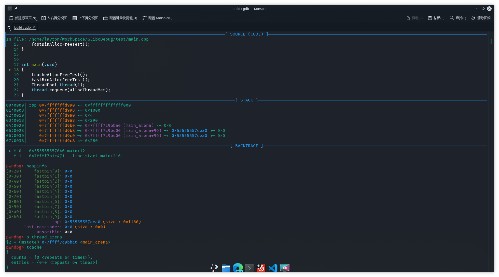

## 进程内存布局

本节将介绍下进程内存布局，这可算是一个老生常谈的东西，但是想要了解内存管理还是必不可少，因此就简单介绍下，想要详细学习下网上也有很多优秀相关的文章，就请自行搜索了解。

### ELF 文件布局

Linux ELF 格式可执行程序的结构是以段（segment）为单位组合而成的。Linux 系统在装载 elf 程序文件时，通过 loader 将各个 segment 依次载入到某一地址开始的内存空间中：

> section 代指 .text、.bss、.data 等，这些信息可用于链接时地址重定位等，因此 section 又被称为链接视图，可以使用 readelf -S object 来查看目标文件的 section。
>
> segment 则是执行视图，程序执行是以 segment 为单位载入，每个 segment 对应 ELF 文件中 program header table 中的一个条目，用来建立可执行文件的进程映像。通常说的，代码段、数据段是 segment，目标代码中的 section 会被链接器组织到可执行文件的各个 segment 中。可以使用 readelf -l a.out 查看 ELF 格式执行文件的 segment 信息。

- 下图中展示了链接视图与执行视图的区别：

  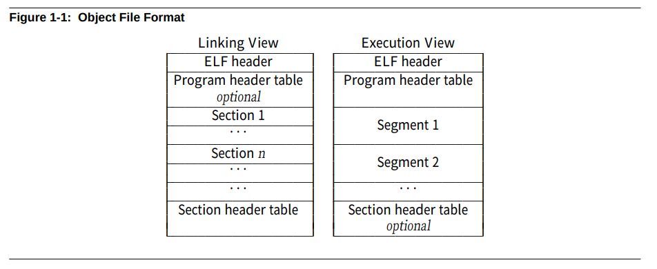

实际程序通过 readelf 查看 Linking View 与 Execution View：

- Linking View：

  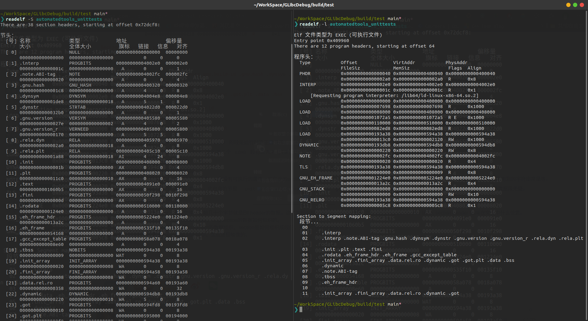

- Execution View：

  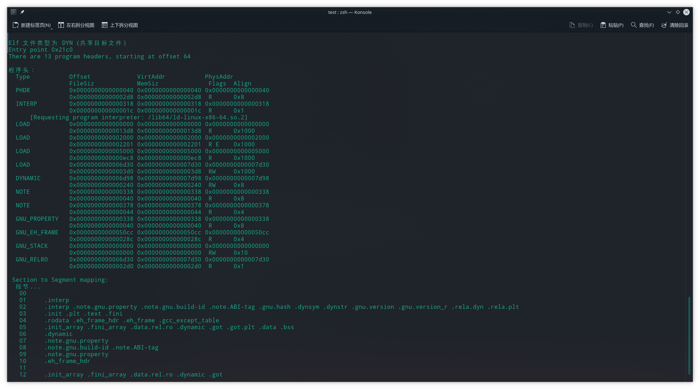

如上图 Execution View 中 segment 信息所示，TYPE 为 LOAD 的段是运行时所需载入的：

```shell
LOAD           0x0000000000002000 0x0000000000002000 0x0000000000002000
                 0x0000000000002201 0x0000000000002201  R E    0x1000
# 其标号为 0x3，对应：

03     .init .plt .text .fini

# 可以发现其包含我们的代码段，R（只读）E（可执行）W（可写）
```

### ELF 文件装载

Linux 支持不同的可执行程序，其内核使用 `struct linux_binfmt` 来描述各种可执行程序，以 ELF 格式举例：

1. 首先需要填充一个 [linux_binfmt](https://www.linux.it/~rubini/docs/binfmt/binfmt.html) 格式的结构：

    ```c
    // /fs/binfmt.c
    static struct linux_binfmt elf_format = {
        .module      = THIS_MODULE,
        .load_binary = load_elf_binary, //通过读存放在可执行文件中的信息为当前进程建立一个新的执行环境
        .load_shlib      = load_elf_library,  //用于动态的把一个共享库捆绑到一个已经在运行的进程，这是由 uselib() 系统调用激活的
        .core_dump       = elf_core_dump,
        .min_coredump    = ELF_EXEC_PAGESIZE,
        .hasvdso     = 1
    };
    ```

2. 所有的 `linux_binfmt` 对象都处于一个链表中，第一个元素的地址存放在 formats 变量中，可以通过调用 register_binfmt() 和 unregister_binfmt() 函数在链表中插入和删除元素。在系统启动期间，为每个编译进内核的可执行格式都执行 registre_fmt() 函数。执行一个可执行程序的时候，内核会 `list_for_each_entry` 遍历所有注册的 `linux_binfmt` 对象，对其调用 `load_binrary` 方法来尝试加载，直到加载成功为止。

3. 内核通过 `execv()` 或 `execve()` 系统调用到 `do_execve()` 函数，其读取 ELF 文件头部字节（Linux 128 字节头），再通过 `search_binary_handler()` 搜索对应的格式加载方法，最终调用处理函数来加载目标 ELF。

    ```shell
    ❯ readelf -h automatedtools_unittests
    ELF 头：
      Magic：  7f 45 4c 46 02 01 01 03 00 00 00 00 00 00 00 00 
      类别:                              ELF64
      数据:                              2 补码，小端序 (little endian)
      Version:                           1 (current)
      OS/ABI:                            UNIX - GNU
      ABI 版本:                          0
      类型:                              DYN (共享目标文件)
      系统架构:                          Advanced Micro Devices X86-64
      版本:                              0x1
      入口点地址：              0x3340
      程序头起点：              64 (bytes into file)
      Start of section headers:          624072 (bytes into file)
      标志：             0x0
      Size of this header:               64 (bytes)
      Size of program headers:           56 (bytes)
      Number of program headers:         13
      Size of section headers:           64 (bytes)
      Number of section headers:         40
      Section header string table index: 39
    ```

4. 总结下，以 ELF 格式的 load_elf_binary 函数执行过程举例：
   - 填充并且检查目标程序 ELF 头部；
   - load_elf_phdrs 加载目标程序的程序头表；
   - 如果需要动态链接，则寻找和处理解释器段；
   - 检查并读取解释器的程序表头；
   - 装入目标程序的段 segment；
   - 填写程序的入口地址；
   - create_elf_tables 填写目标文件的参数环境变量等必要信息；
   - start_kernel 宏准备进入新的程序入口。

### 内存布局

大致了解了 Linux 如何将可执行程序文件装载到内存变为进程后，接下来查看下 segment 实际加载到内存中的地址情况 (64 位系统)：

  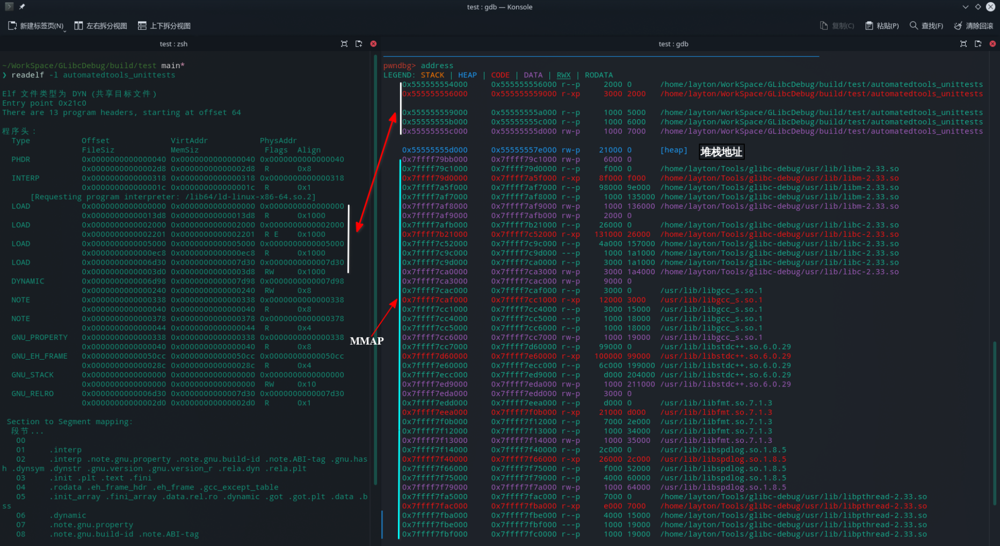
  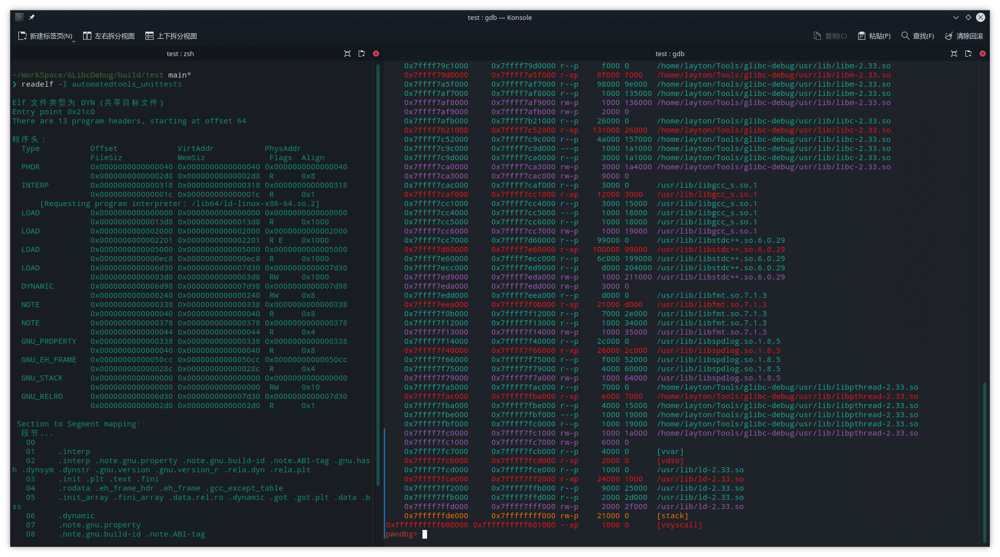

可以看出 ELF 可执行文件中的 LOAD segment 分别加载到了以 0x555555554000 为开始的虚拟内存地址上。进程内存中不仅仅有从 ELF 中加载的 segment 还有 Heap、Mmap、Stack 等，接下来简单介绍下：

1. 内核态内存空间，大小固定（编译时可以调整），32 位系统一般为 1GB，64 位系统为 128TB。
2. 用户态的栈，大小不固定，可以用 ulimit -s 进行调整，默认一般为 8M，从高地址向低地址增长。
3. mmap 区域（内存映射段），既可以从高地址到低地址延伸（所谓 flexible layout），也可以从低到高延伸（所谓 legacy layout)，看进程具体情况。一般 32 位系统默认为 flexible，64 位系统为 legacy。
4. brk 区域（堆），紧邻数据段（甚至贴着），从低位向高位伸展，但它的大小主要取决于 mmap 如何增长，一般来说，即使是 32 位的进程以传统方式延伸，也有差不多 1 GB 的空间。
5. 数据段，主要是进程里初始化和未初始化（BSS）的全局数据总和，当然还有编译器生成一些辅助数据结构等等），大小取决于具体进程，其位置紧贴着代码段。
6. 代码段，主要是进程的指令，包括用户代码和编译器生成的辅助代码，其大小取决于具体程序，但起始位置根据 32 位还是 64 位一般固定（-fPIC, -fPIE 等除外）。
7. 以上各段（除了代码段数据段）其起始位置根据系统是否起用 randomize_va_space 一般稍有变化，各段之间因此可能有随机大小的间隔。

- 32 位 flexible layout。

    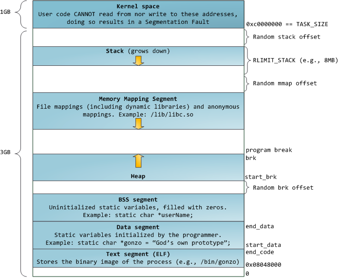

- 64 位 legacy layout。

    

## ptmalloc 内存管理数据结构

从本节开始将正式进入 glibc 默认的内存管理方式 ptmalloc 的分析，本节从 ptmalloc 初始化流程开始，介绍 ptmalloc 进行内存管理时所用到的数据结构。

### malloc 函数入口

当调用 malloc 申请内存时，通过 `strong_alias` 别名机制是直接调用到 `__libc_malloc` 函数上：

> strong_alias : 强别名，当出现相同符号的定义会发成重定义冲突。
>
> weak_alias : 弱别名，当出现相同名字的不会重定义，只有当没有冲突时才使用若定义别名。

```c
# define strong_alias(name, aliasname) _strong_alias(name, aliasname)
# define _strong_alias(name, aliasname) \
  extern __typeof (name) aliasname __attribute__ ((alias (#name))) \
    __attribute_copy__ (name);

strong_alias (__libc_malloc, __malloc) strong_alias (__libc_malloc, malloc)
```

我们先从 `__libc_malloc` 入口开始分析：

```cpp
void *weak_variable (*__malloc_hook)
    (size_t __size, const void *) = malloc_hook_ini;

# if __WORDSIZE == 64
#  define SIZE_MAX  (18446744073709551615UL)
# else
# ............
# endif

# if __WORDSIZE == 64
#  define PTRDIFF_MIN  (-9223372036854775807L-1)
#  define PTRDIFF_MAX  (9223372036854775807L)
# else
# ............
# endif

..................

void *
__libc_malloc (size_t bytes)
{
  mstate ar_ptr;
  void *victim;

  _Static_assert (PTRDIFF_MAX <= SIZE_MAX / 2,
                  "PTRDIFF_MAX is not more than half of SIZE_MAX");

  void *(*hook) (size_t, const void *)
    = atomic_forced_read (__malloc_hook);
  if (__builtin_expect (hook != NULL, 0))
    return (*hook)(bytes, RETURN_ADDRESS (0));
  .........
}
```

1. 可以看出如果没有重定义 `__malloc_hook` 弱别名就使用默认的 `malloc_hook_ini`，其使用 atomic_forced_read 原子读取。
2. 判断 `__malloc_hook` 是否为空，如果不为空则进行调用。
   - `__builtin_expect` 用于编译其优化，告知编译器此判断语句更容易为 true 或 false，便于 cpu 的分支预测。
   - `__glibc_unlikely` 和 `__glibc_likely` 都是包装了下 `__builtin_expect`，功能是一样的。
3. 看下最开始的静态断言判断：
   - `SIZE_MAX` 是指 size_t 的最大范围，也就是当前系统最大的寻址范围。
   - 而 `PTRDIFF_MAX` 是指 ptrdiff_t 的最大范围，ptrdiff_t 常用于存放两个地址做减法后的结果。
   - `SIZE_MAX` 是 UL 类型，`PTRDIFF_MAX` 是 L 类型：从地址空间可以看出堆栈的地址范围不可能超过地址的一半，通常 32 位系统是 3：1 分配的堆空间（1G），即使是 64 位系统，由于与内核对半分配也不可能超过 SIZE_MAX 的一半（128T），因此 PTRDIFF_MAX <= SIZE_MAX / 2。

#### malloc_hook_ini

```c
static void *
malloc_hook_ini (size_t sz, const void *caller)
{
  __malloc_hook = NULL;
  ptmalloc_init ();
  return __libc_malloc (sz);
}
```

1. 第一步先将 `__malloc_hook` 置为 NULL。
2. 调用 `ptmalloc_init` 后，又重新调用了 `__libc_malloc`，配合前边 `__libc_malloc` 中判断 hook 是否为空就是为这时准备的，由于 hook 在第一次 malloc 调用后就被置 NULL 了，此时正符合了 __libc_malloc 中判断时 `__builtin_expect` 所期望也就是 false。

#### ptmalloc_init

简略版本代码：

```c
/* There are several instances of this struct ("arenas") in this
   malloc.  If you are adapting this malloc in a way that does NOT use
   a static or mmapped malloc_state, you MUST explicitly zero-fill it
   before using. This malloc relies on the property that malloc_state
   is initialized to all zeroes (as is true of C statics).  */

static struct malloc_state main_arena =
{
  .mutex = _LIBC_LOCK_INITIALIZER,
  .next = &main_arena,
  .attached_threads = 1
};
.....

/* Already initialized? */
int __malloc_initialized = -1;

.....

static void
ptmalloc_init (void)
{
  if (__malloc_initialized >= 0)
    return;

  __malloc_initialized = 0;

  thread_arena = &main_arena;

  malloc_init_state (&main_arena);

  TUNABLE_GET (check, int32_t, TUNABLE_CALLBACK (set_mallopt_check));
  TUNABLE_GET (top_pad, size_t, TUNABLE_CALLBACK (set_top_pad));
  TUNABLE_GET (perturb, int32_t, TUNABLE_CALLBACK (set_perturb_byte));
  TUNABLE_GET (mmap_threshold, size_t, TUNABLE_CALLBACK (set_mmap_threshold));
  TUNABLE_GET (trim_threshold, size_t, TUNABLE_CALLBACK (set_trim_threshold));
  TUNABLE_GET (mmap_max, int32_t, TUNABLE_CALLBACK (set_mmaps_max));
  TUNABLE_GET (arena_max, size_t, TUNABLE_CALLBACK (set_arena_max));
  TUNABLE_GET (arena_test, size_t, TUNABLE_CALLBACK (set_arena_test));

  TUNABLE_GET (mxfast, size_t, TUNABLE_CALLBACK (set_mxfast));

  __malloc_initialized = 1;
}
```

1. 通过全局变量 `__malloc_initialized` 标识 ptmalloc 初始化状态：-1 未初始化、0 正在初始化、1 初始化完成。
2. 将主分配区 `main_arena` 分配给进行初始化的线程。*// Q1: 什么是主分配区、分配区又指什么，分配区各个成员作用都有哪些？*
3. 调用 `malloc_init_state` 初始话主分配区。
4. `TUNABLE_GET` 可调参数是 GNU C 库中的一个特性，它允许应用程序作者和发行版维护人员改变运行时库的行为以匹配他们的工作负载。具体详见参考文章 [`Tunable Framework`](https://sourceware.org/glibc/wiki/Tunables)。

#### malloc_init_state

```c
/* addressing -- note that bin_at(0) does not exist */
#define bin_at(m, i) \
  (mbinptr) (((char *) &((m)->bins[((i) - 1) * 2]))     \
             - offsetof (struct malloc_chunk, fd))

#define set_noncontiguous(M)   ((M)->flags |= NONCONTIGUOUS_BIT)

#define set_max_fast(s) \
  global_max_fast = (((size_t) (s) <= MALLOC_ALIGN_MASK - SIZE_SZ) \
                     ? MIN_CHUNK_SIZE / 2 : ((s + SIZE_SZ) & ~MALLOC_ALIGN_MASK))


/*
   Unsorted chunks

    All remainders from chunk splits, as well as all returned chunks,
    are first placed in the "unsorted" bin. They are then placed
    in regular bins after malloc gives them ONE chance to be used before
    binning. So, basically, the unsorted_chunks list acts as a queue,
    with chunks being placed on it in free (and malloc_consolidate),
    and taken off (to be either used or placed in bins) in malloc.

    The NON_MAIN_ARENA flag is never set for unsorted chunks, so it
    does not have to be taken into account in size comparisons.
 */
/* The otherwise unindexable 1-bin is used to hold unsorted chunks. */
#define unsorted_chunks(M)          (bin_at (M, 1))


#define initial_top(M)              (unsorted_chunks (M))


.........................

/*
   Initialize a malloc_state struct.

   This is called from ptmalloc_init () or from _int_new_arena ()
   when creating a new arena.
 */

static void
malloc_init_state (mstate av)
{
  int i;
  mbinptr bin;

  /* Establish circular links for normal bins */
  /* NBINS=128 */
  for (i = 1; i < NBINS; ++i)
    {
      bin = bin_at (av, i);
      bin->fd = bin->bk = bin;
    }

#if MORECORE_CONTIGUOUS
  if (av != &main_arena)
#endif
  set_noncontiguous (av);
  if (av == &main_arena)
    set_max_fast (DEFAULT_MXFAST);
  atomic_store_relaxed (&av->have_fastchunks, false);

  av->top = initial_top (av);
}
```

1. 从`下标 1` 开始对分配区 bin 成员进行初始化，将每个 bin 的 fd、bk 都置为自身。 *// Q2: bin 成员作用是什么，为什么要从下标 1 开始？*
2. 如果初始化非主分配区，调用 set_noncontiguous 设置 NONCONTIGUOUS_BIT 标识位。*// Q3: NONCONTIGUOUS_BIT 是什么，为什么要针对非主分配区？*
3. 如果是主分配区通过 set_max_fast 初始化 global_max_fast 的大小。*// Q4: global_max_fast 是什么，有什么作用？*
4. 原子操作设置分配区 have_fastchunks 成员为 false。
5. 初始化分配区 top 成员。 *// Q5：top 成员特点，以及为什么这么初始化？*

至此，ptmalloc 的第一次调用初始化就完成了，流程图如下：

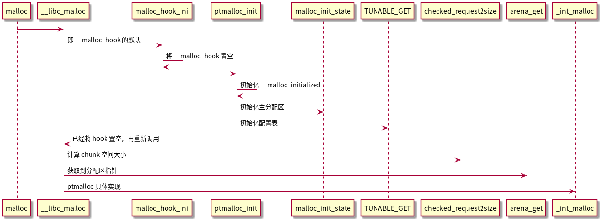

再次调用的流程。

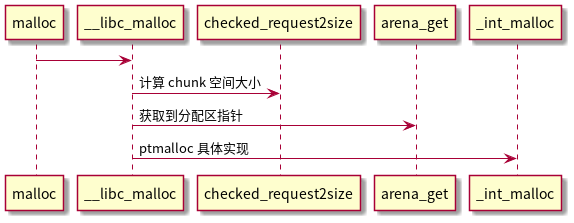

### Q/A

虽然初始化流程已经过完了，但是对细节还没有解释，接下来围绕这些问题，将介绍初始化中所接触到的数据结构。

- Q1: 什么是分配区，主分配区又指什么，分配区各个成员作用都有哪些？
- Q2: bin 成员作用是什么，为什么要从下标 1 开始？
- Q3: NONCONTIGUOUS_BIT 是什么，为什么要针对非主分配区？
- Q4: global_max_fast 是什么，有什么作用？
- Q5: top 成员特点，以及为什么这么初始化？

#### 分配区（malloc_state）

本小节主要介绍分配区的相关概念以及分配区管理相关的数据结构，本节罗列了相关概念代码逻辑解析在[分配区管理](#分配区管理)小节介绍。

1. 什么是分配区？主分配区与非主分配区有什么区别？
   - ptmalloc 通过 malloc_state 的状态机来管理内存的分配，即`分配区`。malloc_state 主要用来管理分配的内存块，比如是否有空闲的 chunk，有什么大小的空闲 chunk 等等（ chunk 是内存管理的最小单元）。当用户层调用 malloc/free 等函数的时候，都会通过 ptmalloc 内核模块进行内存的分配，每一块从操作系统上分配的内存，都会使用 malloc_state 结构体来管理。
   - 每个进程有一个主分配区，也可以允许有多个非主分配区。主分配区可以使用 brk 和 mmap 来分配，而非主分配区只能使用 mmap 来映射内存块。非主分配区的数量一旦增加，则不会减少。主分配区和非主分配区形成一个环形链表进行管理。通过 malloc_state->next 来链接。

2. 分配区如何避免多线程问题？
   - 最初版本的 malloc 内存分配器只有一个主分配区，每次分配内存都必须对住分配区加锁，完成后再释放使得多线程情况下效率较差。而当前的 ptmalloc 增加了对应`非主分配区`，主分配区与非主分配区用环形链表进行管理，每一个分配区利用互斥锁 (mutex) 使线程对于该分配区的访问互斥。
   - 当一个线程使用 malloc 分配内存的时候，首选会检查该线程环境中是否已经存在一个分配区，如果存在，则对该分配区进行加锁，并使用该分配区进行内存分配。如果分配失败，则遍历链表中获取的未加锁的分配区。如果整个链表都没有未加锁的分配区，则 ptmalloc 开辟一个新的分配区。分配区的数量受限于内核数：

    ```text
      For 32 bit systems:
      Number of arena = 2 * number of cores.
      For 64 bit systems:
      Number of arena = 8 * number of cores.
    ```

   - 当释放这块内存的时候，首先获取分配区的锁，然后释放内存，如果其他线程正在使用，则等待其他线程。

3. 管理分配区，以及分配区管理的内存相关数据结构：
   - heap_info（Heap Header）：一个 thread arena 可以维护多个堆。每个堆都有自己的堆 Header（注：也即头部元数据）。什么时候 Thread Arena 会维护多个堆呢？ 一般情况下，每个 thread arena 都只维护一个堆，但是当这个堆的空间耗尽时，新的堆（而非连续内存区域）就会被 mmap 到这个 aerna 里。
   - malloc_state（Arena header）： 一个 thread arena 可以维护多个堆，这些堆另外共享同一个 arena header。Arena header 描述的信息包括：bins、top chunk、last remainder chunk 等。
   - malloc_chunk（Chunk header）：根据用户请求，每个堆被分为若干 chunk。每个 chunk 都有自己的 chunk header。

    

     - thread arena 的图示如下（多堆段）：

      

4. 下面详细解释下，malloc_state 每个成员的作用：

    ```c
    struct malloc_state
    {
      /* 
        线程锁，只有当前申请线程拿到后才能使用分配区申请内存，否则只能继续查找下一个空闲的分配区。
        如果所有的分配区都已经加锁，那么 malloc() 会开辟一个新的分配区。
        把该分配区加入到全局分配区循环链表并加锁，然后使用该分配区进行分配内存操作。
      */
      __libc_lock_define (, mutex); 
    
      /* Flags (formerly in max_fast).  
        记录了分配区的一些标志，比如 bit0 记录了分配区是否有 fast bin chunk ，bit1 标识分配区是否能返回连续的虚拟地址空间
      */
      int flags;
    
      /* Set if the fastbin chunks contain recently inserted free blocks.  
        Note this is a bool but not all targets support atomics on booleans.  
      
        用于标记是否有 fast bins
        have_fastchunks 表示可能存在 fastbin 块。在将 chunk 存入任何 fastbin 时设置为 true，并在 malloc_consolidate 中进行合并。
        该值是近似值，因为它可能在出现即使有 fastbin 可用块也可能为 false。
        鉴于它的唯一目的是减少冗余调用 malloc_consolidate 的数量不影响正确性。因此，可以安全地使用宽松的原子访问。
        注：malloc_consolidate 的作用是将 fastbin 进行合并，加入到其他 bin 管理链表上去。
      */
      int have_fastchunks;
    
      /* Fastbins 
        fast bins 是 bins 的高速缓冲区，大约有 10 个定长队列。
        当用户释放一块不大于 max_fast（默认值 64）的 chunk（一般小内存）的时候，会默认会被放到 fast bins 上。
      */
      mfastbinptr fastbinsY[NFASTBINS];
    
      /* Base of the topmost chunk -- not otherwise kept in a bin
        指向分配区的 top chunk。
        top chunk 相当于分配区的顶部空闲内存，当 bins 上都不能满足内存分配要求的时候，就会来 top chunk 上分配。 
      */
      mchunkptr top;
    
      /* The remainder from the most recent split of a small request */
      mchunkptr last_remainder;
    
      /* Normal bins packed as described above 
      *  常规 bins chunk 的链表数组，具体可以参见 bin 成员分析。
      */
      mchunkptr bins[NBINS * 2 - 2];
    
      /* Bitmap of bins 
        表示 bin 数组当中某一个下标的 bin 是否为空，用来在分配的时候加速
      */
      unsigned int binmap[BINMAPSIZE];
    
      /* Linked list 
        分配区全局链表：分配区链表，主分配区放头部，新加入的分配区放 main_arean.next 位置 Linked list 
      */
      struct malloc_state *next;
    
      /* Linked list for free arenas.  Access to this field is serialized
          by free_list_lock in arena.c.  
          空闲的分配区链表
      */
      struct malloc_state *next_free;
    
      /* Number of threads attached to this arena.  0 if the arena is on
          the free list.  Access to this field is serialized by
          free_list_lock in arena.c.  
          使用当前分配区的线程数量，0 时存放在 next_free 链表上
      */
      INTERNAL_SIZE_T attached_threads;
    
      /* Memory allocated from the system in this arena.  */
      INTERNAL_SIZE_T system_mem;
      INTERNAL_SIZE_T max_system_mem;
    };
    ```

#### bin 成员

1. bin 相关成员：
   - ptmalloc 的空闲 chunk 都是通过在 malloc_state 上的 bins 数组来管理的。一共分为四种类型的 bins：fast bins、 unsorted bin、small bins 和 large bins。

2. 首先让看下分配区结构中涉及到 bin 管理的成员，大体的成员含义上一节已经讲解，本节主要分析每一个成员具体实现的功能：

    ```c
    struct malloc_state
    {
      .................

      int have_fastchunks;

      mfastbinptr fastbinsY[NFASTBINS];

      mchunkptr top;

      mchunkptr last_remainder;

      /* Normal bins packed as described above 
      * 1. unsorted bin：是 bins 的一个缓冲区。当用户释放的内存大于 max_fast 或者 fast bins 合并后的 chunk 都会进入 unsorted bin 上
      * 2. small bins 和 large bins：small bins 和 large bins 是真正用来放置 chunk 双向链表的。每个 bin 之间相差 8 个字节，并且通过上面的这个列表，可以快速定位到合适大小的空闲 chunk。
      * 3. 下标 1 是 unsorted bin，2 到 63 是 small bin，64 到 126 是 large bin，共 126 个 bin
      * 4. BINS 定义为 128 由于在 bins 数组中的每个 bin 都有着一个 fd 和 bk 的指针 所以要乘 2，bin[0] 没有使用 因此 - 2。
      */
      mchunkptr bins[NBINS * 2 - 2];

      unsigned int binmap[BINMAPSIZE];
      ...............
    }
    ```

    - bins 结构可以见下图，每两个 bins 元素指向一个双向链表的头与尾，因此需要 `NBINS * 2`：

      ```text
          Bins Array                Chunk 0                Chunk 1 
      
      +--> XXXXXXXXXX <-\     /--> +--------+ <-\     /--> +--------+ <-----+
      |    XXXXXXXXXX    \   /     |  p_sz  |    \   /     |  p_sz  |       |
      |    XXXXXXXXXX     \ /      +--------+     \ /      +--------+       |
      |    XXXXXXXXXX      X       |   sz   |      X       |   sz   |       |
      |    +--------+     / \      +--------+     / \      +--------+       |
      |    | [2i-2] | -->/   \     |   fd   | -->/   \     |   fd   | ->+   |
      |    +--------+         \    +--------+         \    +--------+   |   |
      |    | [2i-1] | -->+     \<- |   bk   |          \<- |   bk   |   |   |
      |    +--------+    |         +--------+              +--------+   |   |
      |                  |                                              |   |
      |                  +----------------------------------------------+---+
      |                                                                 |
      +<----------------------------------------------------------------+
      ```

3. `fast bins`: 相关的成员有 have_fastchunks 与 fastbinsY。
   - have_fastchunks：如前文所述，用于标识是否存在空闲的 fast bins 内存块。
   - fastbinsY：用于管理 fast bins 内存块，
   - 当用户释放一块不大于 max_fast（主分配区初始化时配置，默认值  64 * SIZE_SZ / 4  ）的 chunk，会默认会被放到 fast bins 上（**Q4**）。当用户下次需要申请内存的时候首先会到 fast bins 上寻找是否有合适的 chunk，然后才会到 bins 上空闲链表里面查找的 chunk。每次申请内存 如果 fast bins 以及 small bins 无法满足需求，ptmalloc 都会遍历 fast bin 看是否有合适的 chunk 需要合并到 unorder bins 上，再尝试进行后续分配，避免过多的碎片缓存。

    ```cpp
    /*
      Fastbins
        包含最近释放的 small chunk 的列表数组。
        Fastbins 没有使用双向链表，不仅仅单链表的速度更快，而且由于每个 fast bin 链表大小都是一致的因此不需要从中间进行删除，因此采用单链表结构。
        此外，与普通 bins 不同的是，它们甚至没有按 FIFO 顺序处理（它们使用更快的 LIFO, 增删 chunk 发生在链表顶端即可），因为在瞬态上下文中，通常使用 fastbins 排序并不重要。
   
        fastbins 中的 chunk 保持其 inuse 位设置，因此它们不能与其他空闲 chunk 合并。 
        需要通过 malloc_consolidate 释放 fastbins 中的所有 chunk 并将它们合并其他 free chunk。 
    */
   
    typedef struct malloc_chunk *mfastbinptr;
    #define fastbin(ar_ptr, idx) ((ar_ptr)->fastbinsY[idx])
   
    /* offset 2 to use otherwise unindexable first 2 bins */
    #define fastbin_index(sz) \
      ((((unsigned int) (sz)) >> (SIZE_SZ == 8 ? 4 : 3)) - 2)
   
    /* The maximum fastbin request size we support */
    // 80 * size_t / 4 = 160 Byte
    #define MAX_FAST_SIZE     (80 * SIZE_SZ / 4) 
   
    // request2size 用于将申请的内存大小通过对齐后计算所需的 chunk size，后续章节会有介绍。
    // request2size (MAX_FAST_SIZE) = ((160 + 8) + MALLOC_ALIGN_MASK(01111)) and ~MALLOC_ALIGN_MASK(10000) = 176 Byte
    // fastbin_index (176) = 177 >> 4 - 2 = 11 - 2 = 9
    // NFASTBINS = 9 + 1 = 10
    #define NFASTBINS  (fastbin_index (request2size (MAX_FAST_SIZE)) + 1) 
   
    /*
      Set value of max_fast.
      Use impossibly small value if 0.
      Precondition: there are no existing fastbin chunks in the main arena.
      Since do_check_malloc_state () checks this, we call malloc_consolidate ()
      before changing max_fast.  Note other arenas will leak their fast bin
      entries if max_fast is reduced.
    */
   
    #define set_max_fast(s) \
      global_max_fast = (((size_t) (s) <= MALLOC_ALIGN_MASK - SIZE_SZ) \
                        ? MIN_CHUNK_SIZE / 2 : ((s + SIZE_SZ) & ~MALLOC_ALIGN_MASK))
   
    static inline INTERNAL_SIZE_T
    get_max_fast (void)
    {
      /* Tell the GCC optimizers that global_max_fast is never larger
        than MAX_FAST_SIZE.  This avoids out-of-bounds array accesses in
        _int_malloc after constant propagation of the size parameter.
        (The code never executes because malloc preserves the
        global_max_fast invariant, but the optimizers may not recognize
        this.)  */
      if (global_max_fast > MAX_FAST_SIZE)
        __builtin_unreachable ();
      return global_max_fast;
    }
   
    #ifndef DEFAULT_MXFAST
    #define DEFAULT_MXFAST     (64 * SIZE_SZ / 4)
    #endif
    ```

   - 下图描述了 fast bin 与 chunk 的数据结构：

      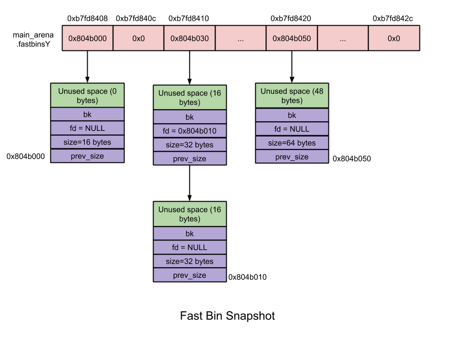

4. `unsorted bin`：是 bins 的一个缓冲区，bins 数组下标为 1 的即是 unstored bin。当用户释放的内存大于 max_fast 或者 fast bins 合并后的 chunk 都会进入 unsorted bin 上。这使得分配器可以重新使用最近 free 掉的 chunk，从而消除了寻找合适 bin 的时间开销，进而加速了内存分配及释放的效率。当用户 malloc 的时候，如果 fast bins 以及 small bins 都无法满足需求后，首先通过 malloc_consolidate 进行合并 fast bins 到 unsorted bin 上，在使用 large bins 进行分配前，会遍历整个 unsorted bin 将其管理的 chunk 按照大小标准插入到 small bins 或者 large bins 中，再尝试分配。
   - unsorted bin 是双向链表管理，用于保存 free chunk。对于 chunk 大小无限制，除开小于 max_fast 的都会插入到这里。

    ```cpp
    /*
        Unsorted chunks
   
        所有 chunk 经过切割后的剩余部分 chunk，以及 free 的 chunk, 首先被放在 "unsorted" bin 中，
        然后在 malloc 给他们一个机会被使用之前放置的进入 常规 bins 中。
   
        所以，基本上，未排序的块列表作为一个队列，以 free （和 malloc_consolidated) 存入 chunk,
        在 malloc 中使用（要么使用，要么放在 bins 里）。
   
        从未为未排序的块设置 NON_MAIN_ARENA 标志，因此它在大小比较中不必考虑。
        
    */
   
    /* The otherwise unindexable 1-bin is used to hold unsorted chunks. */
    #define unsorted_chunks(M)          (bin_at (M, 1))
   
    ```

   - 下图描述了 bins 与 chunk 的数据结构关系：

    

5. `small bins`：小于 512 字节（64 位机器 1024 字节）的 chunk 被称为 small chunk，而保存 small chunks 的 bin 被称为 small bin。**数组从 2 开始编号到 63，前 62 个 bin 为 small bins**，small bin 每个 bin 之间相差 8 个字节（64 位 16 字节），同一个 small bin 中的 chunk 具有相同大小。起始 bin 大小为 16 字节（64 位系统 32）。

6. `large bins`：大于等于 512 字节（64 位机器 1024 字节）的 chunk 被称为 large chunk，而保存 large chunks 的 bin 被称为 large bin。**位于 small bins 后面，数组编号从 64 开始，后 64 个 bin 为 large bins**。同一个 bin 上的 chunk，可以大小不一定相同。large bins 都是通过等差步长的方式进行拆分。（以 32 位系统为例，前 32 个 bin 步长 64，后 16 个 bin 步长 512，后 8 个步长 4096，后四个 32768，后 2 个 262144）（编号 63 到 64 的步长跟）。起始 bin 大小为 512 字节（64 位系统 1024）。

    ```cpp
    /*
    Bins
    
    An array of bin headers for free chunks. Each bin is doubly
    linked.  The bins are approximately proportionally (log) spaced.
    There are a lot of these bins (128). This may look excessive, but
    works very well in practice.  Most bins hold sizes that are
    unusual as malloc request sizes, but are more usual for fragments
    and consolidated sets of chunks, which is what these bins hold, so
    they can be found quickly.  All procedures maintain the invariant
    that no consolidated chunk physically borders another one, so each
    chunk in a list is known to be preceeded and followed by either
    inuse chunks or the ends of memory.
    
    Chunks in bins are kept in size order, with ties going to the
    approximately least recently used chunk. Ordering isn't needed
    for the small bins, which all contain the same-sized chunks, but
    facilitates best-fit allocation for larger chunks. These lists
    are just sequential. Keeping them in order almost never requires
    enough traversal to warrant using fancier ordered data
    structures.
    
    Chunks of the same size are linked with the most
    recently freed at the front, and allocations are taken from the
    back.  This results in LRU (FIFO) allocation order, which tends
    to give each chunk an equal opportunity to be consolidated with
    adjacent freed chunks, resulting in larger free chunks and less
    fragmentation.
    
    To simplify use in double-linked lists, each bin header acts
    as a malloc_chunk. This avoids special-casing for headers.
    But to conserve space and improve locality, we allocate
    only the fd/bk pointers of bins, and then use repositioning tricks
    to treat these as the fields of a malloc_chunk*.
    
    用于管理空闲块的 bin 标头数组。每个 bin 都是双重的链接。 
    bin 大约按比例 (log) 间隔。有很多这样的 bins（128）。这可能看起来有些过分的，但是在实践中效果很好。
    
    大多数 bin 的尺寸都是不寻常的 malloc 请求大小，
    但这些 bins 保存着更常见的片段和合并的内存块集，可以快速的找到并分配。
    
    所有过程保持不变没有合并的块在物理上与另一个块相邻，
    所以已知每个列表中的块在前面和后面是使用块或内存的末端。
    
    large bins 中的 chunk 按大小顺序排列，连接到大约最近最少使用的块。
    
    对于 small bins 则不需要排序，它们都包含相同大小的块，但是
    这对 larger chunk 最佳分配有促进作用。这些队列只是顺序。
    使它们井然有序几乎不需要遍历足以保证快速定位到需要的数据 bin 下标。
    
    chunk 相同的链表，free 是在前端插入，使用时从链表尾端取出。
    这就是 LRU (FIFO) 分配顺序，往往给每个块一个平等的机会与相邻的释放块，
    从而保证更大的空闲块和更少的碎片化。
    
    为了简化在双链表中的使用，每个 bin header 作为 malloc_chunk。这避免了链表头的特殊类型转换。
    但是为了节省空间和改善局部性，我们分配只有 bins 的 fd/bk 指针，然后使用重新定位技巧，将这些视为 malloc_chunk *的字段。
    */
    
    typedef struct malloc_chunk *mbinptr;
    
    /* addressing -- note that bin_at(0) does not exist 
       每个 bin header 类型都是作为 malloc_chunk，但是由于节省空间仅仅在 bins 上分配了 fd 和 bk 两个指针的空间，
       为了使用者的一致性，offsetof (struct malloc_chunk, fd)) 进行偏移并强转为 mbinptr 类型，最终可以使用 fd 和 bk 成员指针，
       去到对应的 bins 上数组下标地址内指向的地址。
    
       因此不可以 bin_at(0), 会变为负数下标。
    
    */
    #define bin_at(m, i) \
      (mbinptr) (((char *) &((m)->bins[((i) - 1) * 2]))     \
                - offsetof (struct malloc_chunk, fd))
    
    /* analog of ++bin */
    #define next_bin(b)  ((mbinptr) ((char *) (b) + (sizeof (mchunkptr) << 1)))
    
    /* Reminders about list directionality within bins */
    #define first(b)     ((b)->fd)
    #define last(b)      ((b)->bk)
    
    /*
      Indexing
    
        Bins for sizes < 512 bytes contain chunks of all the same size, spaced
        8 bytes apart. Larger bins are approximately logarithmically spaced:
    
        64 bins of size       8
        32 bins of size      64
        16 bins of size     512
        8 bins of size    4096
        4 bins of size   32768
        2 bins of size  262144
        1 bin  of size what's left
    
        There is actually a little bit of slop in the numbers in bin_index
        for the sake of speed. This makes no difference elsewhere.
    
        The bins top out around 1MB because we expect to service large
        requests via mmap.
    
        Bin 0 does not exist.  Bin 1 is the unordered list; if that would be
        a valid chunk size the small bins are bumped up one.
    
        索引
    
        Bins 所包含的 chunk’s size < 512 字节为 small chunk 链表上所有的 chunk 大小一致，
    
        每个 Bin 管理的大小以 8 字节倍数递增：
    
        64 bins of size       8
        32 bins of size      64
        16 bins of size     512
        8 bins of size    4096
        4 bins of size   32768
        2 bins of size  262144
        1 bin  of size what's left
    */
    
    #define NBINS             128
    #define NSMALLBINS         64
    #define SMALLBIN_WIDTH    MALLOC_ALIGNMENT
    #define SMALLBIN_CORRECTION (MALLOC_ALIGNMENT > CHUNK_HDR_SZ)
    #define MIN_LARGE_SIZE    ((NSMALLBINS - SMALLBIN_CORRECTION) * SMALLBIN_WIDTH)
    
    #define in_smallbin_range(sz)  \
      ((unsigned long) (sz) < (unsigned long) MIN_LARGE_SIZE)
    
    #define smallbin_index(sz) \
      ((SMALLBIN_WIDTH == 16 ? (((unsigned) (sz)) >> 4) : (((unsigned) (sz)) >> 3))\
      + SMALLBIN_CORRECTION)
    
    #define largebin_index_32(sz)                                                \
      (((((unsigned long) (sz)) >> 6) <= 38) ?  56 + (((unsigned long) (sz)) >> 6) :\
      ((((unsigned long) (sz)) >> 9) <= 20) ?  91 + (((unsigned long) (sz)) >> 9) :\
      ((((unsigned long) (sz)) >> 12) <= 10) ? 110 + (((unsigned long) (sz)) >> 12) :\
      ((((unsigned long) (sz)) >> 15) <= 4) ? 119 + (((unsigned long) (sz)) >> 15) :\
      ((((unsigned long) (sz)) >> 18) <= 2) ? 124 + (((unsigned long) (sz)) >> 18) :\
      126)
    
    #define largebin_index_32_big(sz)                                            \
      (((((unsigned long) (sz)) >> 6) <= 45) ?  49 + (((unsigned long) (sz)) >> 6) :\
      ((((unsigned long) (sz)) >> 9) <= 20) ?  91 + (((unsigned long) (sz)) >> 9) :\
      ((((unsigned long) (sz)) >> 12) <= 10) ? 110 + (((unsigned long) (sz)) >> 12) :\
      ((((unsigned long) (sz)) >> 15) <= 4) ? 119 + (((unsigned long) (sz)) >> 15) :\
      ((((unsigned long) (sz)) >> 18) <= 2) ? 124 + (((unsigned long) (sz)) >> 18) :\
      126)
    
    /* 
        It remains to be seen whether it is good to keep the widths of
        the buckets the same or whether it should be scaled by a factor
        of two as well.
    */
    #define largebin_index_64(sz)                                                \
      (((((unsigned long) (sz)) >> 6) <= 48) ?  48 + (((unsigned long) (sz)) >> 6) :\
      ((((unsigned long) (sz)) >> 9) <= 20) ?  91 + (((unsigned long) (sz)) >> 9) :\
      ((((unsigned long) (sz)) >> 12) <= 10) ? 110 + (((unsigned long) (sz)) >> 12) :\
      ((((unsigned long) (sz)) >> 15) <= 4) ? 119 + (((unsigned long) (sz)) >> 15) :\
      ((((unsigned long) (sz)) >> 18) <= 2) ? 124 + (((unsigned long) (sz)) >> 18) :\
      126)
    
    #define largebin_index(sz) \
      (SIZE_SZ == 8 ? largebin_index_64 (sz)                                     \
      : MALLOC_ALIGNMENT == 16 ? largebin_index_32_big (sz)                     \
      : largebin_index_32 (sz))
    
    #define bin_index(sz) \
      ((in_smallbin_range (sz)) ? smallbin_index (sz) : largebin_index (sz))
    
    ```

- large bin 的 chunk 结构：

    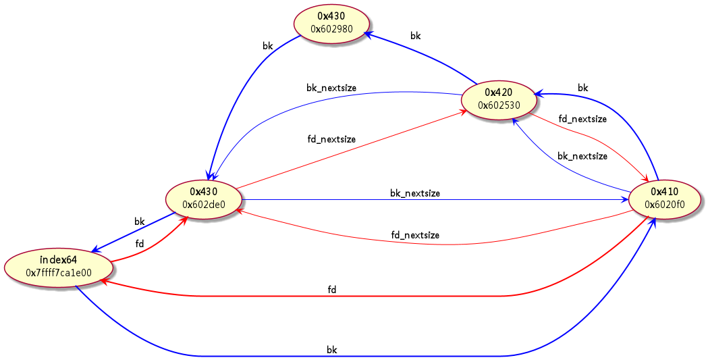

  - 验证：

    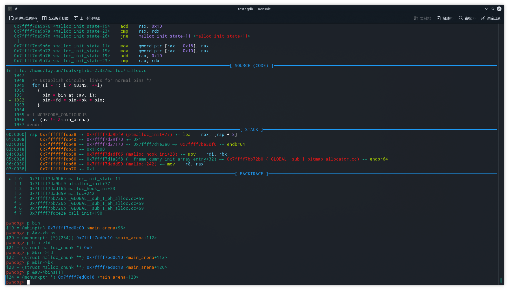

- bins 的结构：
  - bins 长度为 127 ，前 62 为 small bins，后 64 个为 large bin ，下标 1 的 bin 为 unstored bins。

    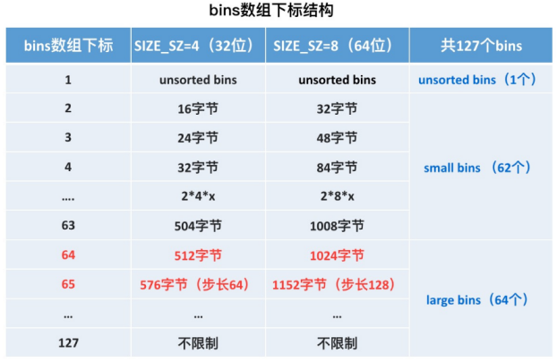

  - 每个 bin 之间，通过等差数列的方式排序，32 位系统前 64 个 small bins 步长为 8，large bin 前 32 步长为 64；64 位系统分别为 16，128。

      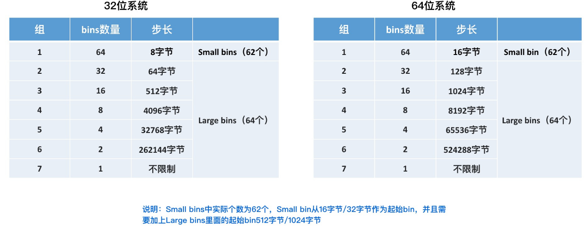

#### 内存结构单元 chunk

```c
/*
  -----------------------  Chunk representations -----------------------
*/

/*
  This struct declaration is misleading (but accurate and necessary).
  It declares a "view" into memory allowing access to necessary
  fields at known offsets from a given base. See explanation below.
*/

/*
   malloc_chunk 详细信息：

    （以下内容包括 Colin Plumb 精心编辑的解释。）

    内存块使用“边界标记”方法维护，如下所示：如 Knuth 或 Standish 中所述。 （请参阅保罗的论文威尔逊 ftp://ftp.cs.utexas.edu/pub/garbage/allocsrv.ps 这些技术的调查。）
    空闲块的大小都存储在每个块的前面和结尾。这使得将碎片化的块合并为更大的块更快。大小字段的低位表示块是空正在使用。

    分配的块看起来像这样：

    chunk-> +-+-+-+-+-+-+-+-+-+-+-+-+-+-+-+-+-+-+-+-+-+-+-+-+-+-+-+-+-+-+-+-+
        |             Size of previous chunk, if unallocated (P clear)  |
        +-+-+-+-+-+-+-+-+-+-+-+-+-+-+-+-+-+-+-+-+-+-+-+-+-+-+-+-+-+-+-+-+
        |             Size of chunk, in bytes                     |A|M|P|
        mem-> +-+-+-+-+-+-+-+-+-+-+-+-+-+-+-+-+-+-+-+-+-+-+-+-+-+-+-+-+-+-+-+-+
        |             User data starts here...                          .
        .                                                               .
        .             (malloc_usable_size() bytes)                      .
        .                                                               |
    nextchunk-> +-+-+-+-+-+-+-+-+-+-+-+-+-+-+-+-+-+-+-+-+-+-+-+-+-+-+-+-+-+-+-+-+
        |             (size of chunk, but used for application data)    |
        +-+-+-+-+-+-+-+-+-+-+-+-+-+-+-+-+-+-+-+-+-+-+-+-+-+-+-+-+-+-+-+-+
        |             Size of next chunk, in bytes                |A|0|1|
        +-+-+-+-+-+-+-+-+-+-+-+-+-+-+-+-+-+-+-+-+-+-+-+-+-+-+-+-+-+-+-+-+

    在大多数情况下，“chunk”是标识的给 malloc 分配的空间，但是“mem”是返回到用户的地址。 “Nextchunk”是下一个连续块的开始。
    
    块总是从偶数字边界开始，因此 mem 部分（返回给用户）是在偶数字边界上，并且因此，至少双字对齐。

    空闲块存储在环形双向链接列表中，如下所示：

    chunk-> +-+-+-+-+-+-+-+-+-+-+-+-+-+-+-+-+-+-+-+-+-+-+-+-+-+-+-+-+-+-+-+-+
        |             Size of previous chunk, if unallocated (P clear)  |
        +-+-+-+-+-+-+-+-+-+-+-+-+-+-+-+-+-+-+-+-+-+-+-+-+-+-+-+-+-+-+-+-+
    `head:' |             Size of chunk, in bytes                     |A|0|P|
        mem-> +-+-+-+-+-+-+-+-+-+-+-+-+-+-+-+-+-+-+-+-+-+-+-+-+-+-+-+-+-+-+-+-+
        |             Forward pointer to next chunk in list             |
        +-+-+-+-+-+-+-+-+-+-+-+-+-+-+-+-+-+-+-+-+-+-+-+-+-+-+-+-+-+-+-+-+
        |             Back pointer to previous chunk in list            |
        +-+-+-+-+-+-+-+-+-+-+-+-+-+-+-+-+-+-+-+-+-+-+-+-+-+-+-+-+-+-+-+-+
        |             Unused space (may be 0 bytes long)                .
        .                                                               .
        .                                                               |
    nextchunk-> +-+-+-+-+-+-+-+-+-+-+-+-+-+-+-+-+-+-+-+-+-+-+-+-+-+-+-+-+-+-+-+-+
    `foot:' |             Size of chunk, in bytes                           |
        +-+-+-+-+-+-+-+-+-+-+-+-+-+-+-+-+-+-+-+-+-+-+-+-+-+-+-+-+-+-+-+-+
        |             Size of next chunk, in bytes                |A|0|0|
        +-+-+-+-+-+-+-+-+-+-+-+-+-+-+-+-+-+-+-+-+-+-+-+-+-+-+-+-+-+-+-+-+

    P（PREV_INUSE）位，存储在未使用的块大小标识的低位中及 "head"（始终是两字节的倍数），在使用中*上一个*块的位。如果该位*清除*，则当前块大小之前的字节包含前一个块大小，并且可以用来查找前一个块的前面。
    分配的第一个块始终设置有该位，防止访问不存在的（或非所有的）内存。如果为任何给定的块设置了 prev_inuse，那么您无法确定前一块的大小，甚至可能会得到一个内存尝试解决故障时。

    清除开头的块中的 A（NON_MAIN_ARENA）位，主分配区，由 main_arena 变量描述。当额外产生线程，每个线程都有自己的舞台（最多一个可配置的限制，之后将分配区重用于多个线程），并且这些分配区中的块均设置了 A 位。
    在这样的非主分配区上找到块的分配区，heap_for_ptr 通过 ar_ptr 执行位掩码操作和间接寻址每堆头标 heap_info 的成员（请参见 arena.c）。

    请注意，当前块的“英尺”实际上表示为作为 NEXT 块的 prev_size。这使得更容易处理对齐方式等，但尝试时可能会造成混乱扩展或修改此代码。

    所有这三个例外是：

     1. 特殊的块“top”不会打扰使用尾随大小字段，因为没有下一个连续的块那将不得不索引它。初始化后，“top”被迫永远存在。如果它变得小于长度为 MINSIZE 个字节，则补充。

     2. 通过 mmap 分配的块，其次低在其大小字段中设置的位 M（IS_MMAPPED）。因为他们是一对一分配，每个都必须包含自己的尾随大小场地。如果设置了 M 位，则忽略其他位（因为映射的块既不在分配区中，也不在附近到释放的块中）。 M 位还用于块最初来自通过 malloc_set_state 的转储堆钩子 c。

     3. fastbin 中的块被视为从中分配的块。块分配器的观点。他们被合并与他们的邻居仅在 malloc_consolidate 中批量。
*/ 

struct malloc_chunk {

  INTERNAL_SIZE_T      mchunk_prev_size;  /* Size of previous chunk (if free).  */
  INTERNAL_SIZE_T      mchunk_size;       /* Size in bytes, including overhead. */

  struct malloc_chunk* fd;         /* double links -- used only if free. */
  struct malloc_chunk* bk;

  /* Only used for large blocks: pointer to next larger size.  */
  struct malloc_chunk* fd_nextsize; /* double links -- used only if free. */
  struct malloc_chunk* bk_nextsize;
};
```

1. Allocated chunk: 就是已经分配给用户的 chunk，其图示如下：
   - chunk：该 Allocated chunk 的起始地址；
   - mem：该 Allocated chunk 中用户可用区域的起始地址（= chunk + sizeof(malloc_chunk)）；
   - next_chunk：下一个 chunck（无论类型）的起始地址。
   - prev_size：若上一个 chunk 可用，则此字段赋值为上一个 chunk 的大小；否则，此字段被用来存储上一个 chunk 的用户数据；
   - size：此字段赋值本 chunk 的大小，其最后三位包含标志信息：
     - PREV_INUSE § – 置「1」表示上个 chunk 被分配；
     - IS_MMAPPED (M) – 置「1」表示这个 chunk 是通过 mmap 申请的（较大的内存）；
     - NON_MAIN_ARENA (N) – 置「1」表示这个 chunk 属于一个 thread arena。

    

    > malloc_chunk 中的其余结构成员，如 fd、 bk，没有使用的必要而拿来存储用户数据；
    >
    > 用户请求的大小被转换为内部实际大小，因为需要额外空间存储 malloc_chunk，此外还需要考虑对齐。

2. Free chunk: 用户已释放的 chunk，其图示如下：
   - prev_size: 两个相邻 free chunk 会被合并成一个，因此该字段总是保存前一个 allocated chunk 的用户数据；
   - size: 该字段保存本 free chunk 的大小；
   - fd: Forward pointer —— 本字段指向同一 bin 中的下个 free chunk（free chunk 链表的前驱指针）；
   - bk: Backward pointer —— 本字段指向同一 bin 中的上个 free chunk（free chunk 链表的后继指针）。

    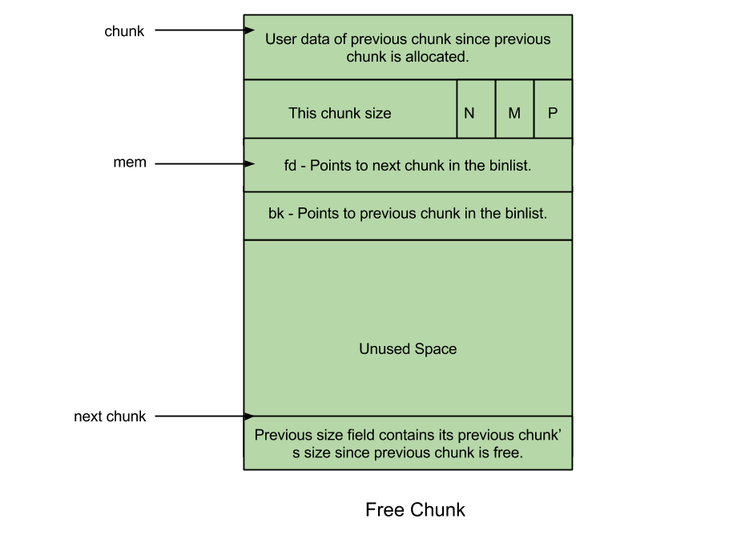

#### 特殊 bins 类型

有三种例外的 chunk 管理方式：`top chunk`，`mmaped chunk` 和 `last remainder chunk`。

- `Top chunk`：top chunk 相当于分配区的顶部空闲内存，当 bins 上都不能满足内存分配要求的时候，就会来 top chunk 上分配。top chunk 大小比用户所请求大小还大的时候，top chunk 会分为两个部分：User chunk（用户请求大小）和 Remainder chunk（剩余大小）。其中 Remainder chunk 成为新的 top chunk。当 top chunk 大小小于用户所请求的大小时，top chunk 就通过 sbrk（main arena）或 mmap（thread arena）系统调用来扩容。

- `mmaped chunk`：当分配的内存非常大（大于分配阀值，默认 128K）的时候，需要被 mmap 映射，则会放到 mmaped chunk 上，当释放 mmaped chunk 上的内存的时候会直接交还给操作系统。

- `Last remainder chunk`：即最后一次 small request 中因分割而得到的剩余部分，它有利于改进引用局部性，也即后续对 small chunk 的 malloc 请求可能最终被分配得彼此靠近。
  - 那么 arena 中的若干 chunks，哪个有资格成为 last remainder chunk 呢？
    - 当用户请求 small chunk 而无法从 small bin 和 unsorted bin 得到服务时，分配器就会通过扫描 binmaps 找到最小非空 bin。正如前文所提及的，如果这样的 bin 找到了，其中最合适的 chunk 就会分割为两部分：返回给用户的 User chunk 、添加到 unsorted bin 中的 Remainder chunk。这一 Remainder chunk 就将成为 last remainder chunk。
  - 那么引用局部性是如何达成的呢？
    - 当用户的后续请求 small chunk，并且 last remainder chunk 是 unsorted bin 中唯一的 chunk，该 last remainder chunk 就将分割成两部分：返回给用户的 User chunk、添加到 unsorted bin 中的 Remainder chunk（也是 last remainder chunk）。因此后续的请求的 chunk 最终将被分配得彼此靠近。

#### NONCONTIGUOUS_BIT

```c
#define NONCONTIGUOUS_BIT (2U)
#define contiguous(M) (((M)->flags & NONCONTIGUOUS_BIT) == 0)
#define noncontiguous(M) (((M)->flags & NONCONTIGUOUS_BIT) != 0)
#define set_noncontiguous(M) ((M)->flags |= NONCONTIGUOUS_BIT)
#define set_contiguous(M) ((M)->flags &= ~NONCONTIGUOUS_BIT)
```

- contiguous(M)：返回值为 1，表示 MORCORE 返回连续虚拟地址空间；返回值为 0，表示 MORCORE 返回非连续虚拟地址空间。
- noncontiguous(M)：返回值为 1，表示 MORCORE 返回非连续虚拟地址空间；返回值为 0，表示 MORCORE 返回连续虚拟地址空间。
- set_noncontiguous(M)：将 bit1 标志位置 1，表示 MORCORE 返回非连续虚拟地址空间。
- set_contiguous(M)：将 bit1 标志位置 0，表示 MORCORE 返回连续虚拟地址空间。

## Tcache 管理

继初始化流程结束，将正式开始内存分配的流程，本节将开始分析 tcache 内存管理。

```cpp
void *
__libc_malloc (size_t bytes)
{

.........

#if USE_TCACHE
  /* int_free also calls request2size, be careful to not pad twice.  */
  size_t tbytes;
  if (!checked_request2size (bytes, &tbytes))
    {
      __set_errno (ENOMEM);
      return NULL;
    }
  size_t tc_idx = csize2tidx (tbytes);

  MAYBE_INIT_TCACHE ();

  DIAG_PUSH_NEEDS_COMMENT;
  if (tc_idx < mp_.tcache_bins
      && tcache
      && tcache->counts[tc_idx] > 0)
    {
      victim = tcache_get (tc_idx);
      return TAG_NEW_USABLE (victim);
    }
  DIAG_POP_NEEDS_COMMENT;
#endif

.......
}
```

### 计算 Chunk

tcache 也是使用类似 bins 的方式管理 tcache 内存，首先是通过申请的内存大小计算所需的 chunk，即 `checked_request2size` 接口，其源码如下：

```cpp

/* MALLOC_ALIGNMENT is the minimum alignment for malloc'ed chunks.  It
   must be a power of two at least 2 * SIZE_SZ, even on machines for
   which smaller alignments would suffice. It may be defined as larger
   than this though. Note however that code and data structures are
   optimized for the case of 8-byte alignment.  */
#define MALLOC_ALIGNMENT (2 * SIZE_SZ < __alignof__ (long double) \
                        ? __alignof__ (long double) : 2 * SIZE_SZ)

/* The corresponding bit mask value.  */
#define MALLOC_ALIGN_MASK (MALLOC_ALIGNMENT - 1)

/* The smallest possible chunk */
#define MIN_CHUNK_SIZE        (offsetof(struct malloc_chunk, fd_nextsize))

/* The smallest size we can malloc is an aligned minimal chunk */
#define MINSIZE  \
  (unsigned long)(((MIN_CHUNK_SIZE+MALLOC_ALIGN_MASK) & ~MALLOC_ALIGN_MASK))

#ifndef INTERNAL_SIZE_T
# define INTERNAL_SIZE_T size_t
#endif

/* The corresponding word size.  */
#define SIZE_SZ (sizeof (INTERNAL_SIZE_T))

#define request2size(req)                                         \
  (((req) + SIZE_SZ + MALLOC_ALIGN_MASK < MINSIZE)  ?             \
   MINSIZE :                                                      \
   ((req) + SIZE_SZ + MALLOC_ALIGN_MASK) & ~MALLOC_ALIGN_MASK)

/* Check if REQ overflows when padded and aligned and if the resulting value
   is less than PTRDIFF_T.  Returns TRUE and the requested size or MINSIZE in
   case the value is less than MINSIZE on SZ or false if any of the previous
   check fail.  */
static inline bool
checked_request2size (size_t req, size_t *sz) __nonnull (1)
{
  if (__glibc_unlikely (req > PTRDIFF_MAX))
    return false;
  *sz = request2size (req);
  return true;
}
```

> 注意 `__nonnull` 表示入参不应为 null，如果显示传入了 null，编译期会报警告。

首先判断请求大小是否溢出，调用这次的主角 `request2size` 计算需要分配的 chunk 大小，计算的方式为用户申请的长度（req) + Chunk 头（SIZE_SZ），一般 SIZE_SZ 为 size_t 及 32 位 4 字节、64 位 8 字节。

注意 MIN_CHUNK_SIZE 计算方式是 `malloc_chunk` 结构体偏移到 fd_nextsize 成员的大小，这里涉及到 chunk 共享的知识点：

> 当一个 chunk 为空闲时，至少要有 prev_size、size、fd 和 bk 四个参数，因此 MINSIZE 就代表了这四个参数需要占用的内存大小；
> 而当一个 chunk 被使用时，prev_size 可能会被前一个 chunk 用来存储，而当前 chunk 也可以使用下一个 chunk 的 prev_size，互相抵消；
> fd 和 bk 也会被当作内存存储数据，因此当 chunk 被使用时，只剩下了 size 参数需要设置，request2size 中的 SIZE_SZ 就是 INTERNAL_SIZE_T 类型的大小，因此至少需要 req + SIZE_SZ 的内存大小。MALLOC_ALIGN_MASK 用来对齐，至此 request2size 就计算出了所需的 chunk 的大小。

- 以 64 位系统举例：

  - 申请 24 字节堆块为例，24 + chunk 头 = 32 (100000)，接下来加上 MALLOC_ALIGN_MASK 01111 (101111) 最后 MALLOC_ALIGN_MASK 取反 10000，按位与的结果就是 100000 了，即 32。

  - 申请 25 字节堆块，25 + chunk 头 = 33 (100001)，加上 MALLOC_ALIGN_MASK 01111 (110000) 接下来按位与上 ~MALLOC_ALIGN_MASK (10000) 结果为 110000 及 48。

至此也就获得了所需的 chunk 大小，接下来就需要通过 `csize2tidx` 获得所需 chunk 所在的 bin 索引下标：

```cpp
/* When "x" is from chunksize().  */
# define csize2tidx(x) (((x) - MINSIZE + MALLOC_ALIGNMENT - 1) / MALLOC_ALIGNMENT
```

chunk 大小减去一个 chunk 头大小，在整除 MALLOC_ALIGNMENT(32 位：8, 64 位：16)，当前看起来是以某种固定大小进行递增的数组，类似 ptmalloc bins 管理内存一样以递增的方式对应不同的 bins。

- 想要具体了解怎么进行的查找需要先了解几个方面：
  1. Tcache 如何管理内存的？
  2. Tcache 如何进行初始化？
  3. Tcache 如何进行插入获取操作？

### Tcache 初始化

按照源码来看下一步会进行 Tcache 初始化：

```cpp

# define MAYBE_INIT_TCACHE() \
  if (__glibc_unlikely (tcache == NULL)) \
    tcache_init();

void *
__libc_malloc (size_t bytes)
{
    .....
    MAYBE_INIT_TCACHE ();
    ....

}
```

- 解析 `MAYBE_INIT_TCACHE` 初始化前，先了解几个 tcache 内存管理的结构体。Tcache 管理 chunk 的方法，在 chunk freed（释放） 时，会将 chunk 链接到一个单链表上，结构如下：

    ```cpp
    /* We want 64 entries.  This is an arbitrary limit, which tunables can reduce.  */
    # define TCACHE_MAX_BINS  64
    /* We overlay this structure on the user-data portion of a chunk when
    the chunk is stored in the per-thread cache.  */
    typedef struct tcache_entry
    {
        struct tcache_entry *next;
        /* This field exists to detect double frees.  */
        struct tcache_perthread_struct *key;  // 每个线程都会有一个
    } tcache_entry;

    /* There is one of these for each thread, which contains the
    per-thread cache (hence "tcache_perthread_struct").  Keeping
    overall size low is mildly important.  Note that COUNTS and ENTRIES
    are redundant (we could have just counted the linked list each
    time), this is for performance reasons.  
    */
    typedef struct tcache_perthread_struct
    {
        uint16_t counts[TCACHE_MAX_BINS];
        tcache_entry *entries[TCACHE_MAX_BINS];
    } tcache_perthread_struct;
    ```

- 接下来介绍 tcache 初始化，其结构也是使用分配区，每个线程都有一个独立的分配区，通过 __thread 进行声明，`arena_get` 在[分配区管理](#分配区管理)小节介绍。

    ```cpp
    // __thread 标识线程独立存储，各个线程互不影响，这也是每个线程都会有一个 tcache_perthread_struct 的原因，在第一次调用时初始化
    static __thread tcache_perthread_struct *tcache = NULL;
    
    /*
    arena_get() 获取一个 arena 并锁定相应的互斥锁。
    首先，尝试该线程最后成功锁定的一个。 （这是常见的情况，并使用宏处理以提高速度。）
    然后，循环一次遍历 arenas 的循环链表。如果没有 arena 随时可用，创建一个新的。
    在后一种情况下，“大小”只是关于在新的 arena 上立即需要多少内存。
     */
    
    #define arena_get(ptr, size) do { \
          ptr = thread_arena;      \
          arena_lock (ptr, size);      \
      } while (0)
    
    ........
    
    // tcache 初始化
    static void
    tcache_init(void)
    {
    mstate ar_ptr;
    void *victim = 0;
    const size_t bytes = sizeof (tcache_perthread_struct);
    
    if (tcache_shutting_down)
        return;
    // 获得分配区
    arena_get (ar_ptr, bytes);
    
    // 分配 tcache_perthread_struct 内存
    victim = _int_malloc (ar_ptr, bytes); // _int_malloc 接口便是 ptmalloc 分配内存的具体实现了，会在后边章节具体解析
    if (!victim && ar_ptr != NULL) //分配失败会进行重试
        {
        ar_ptr = arena_get_retry (ar_ptr, bytes);
        victim = _int_malloc (ar_ptr, bytes);
        }
    
    if (ar_ptr != NULL)
        __libc_lock_unlock (ar_ptr->mutex);
    
    /* In a low memory situation, we may not be able to allocate memory
        - in which case, we just keep trying later.  However, we
        typically do this very early, so either there is sufficient
        memory, or there isn't enough memory to do non-trivial
        allocations anyway.  */
    if (victim)
        {
        tcache = (tcache_perthread_struct *) victim;
        memset (tcache, 0, sizeof (tcache_perthread_struct));
        }
    
    }
    ```

### Tcache 参数限制

```cpp
void *
__libc_malloc (size_t bytes)
{
    .....
    DIAG_PUSH_NEEDS_COMMENT; // 推送诊断信息
    if (tc_idx < mp_.tcache_bins
        && tcache
        && tcache->counts[tc_idx] > 0)
        {
        return tcache_get (tc_idx);
        }
    DIAG_POP_NEEDS_COMMENT;
    ....

}
```

首先回答上文中没有说明的一个问题，单链表如何管理长度的。可以看出是 `mp_` 的成员进行限制，在进行存取时都会进行判断：

> 每个分配区是 struct malloc_state 的一个实例，ptmalloc 使用 malloc_state 来管理分配区，而参数管理使用 struct malloc_par, 全局拥有一个唯一的 malloc_par 实例。

```cpp
/* There is only one instance of the malloc parameters.  */

static struct malloc_par mp_ =
{
  .top_pad = DEFAULT_TOP_PAD,
  .n_mmaps_max = DEFAULT_MMAP_MAX,
  .mmap_threshold = DEFAULT_MMAP_THRESHOLD,
  .trim_threshold = DEFAULT_TRIM_THRESHOLD,
#define NARENAS_FROM_NCORES(n) ((n) * (sizeof (long) == 4 ? 2 : 8))
  .arena_test = NARENAS_FROM_NCORES (1)
#if USE_TCACHE
  ,
  .tcache_count = TCACHE_FILL_COUNT, // 每个 tcache bin 可以容纳的 chunk 数量
  .tcache_bins = TCACHE_MAX_BINS,  // tcache bins 的数量。
  .tcache_max_bytes = tidx2usize (TCACHE_MAX_BINS-1), // 最大的 tcache bins 容量大小，计算 tidx2usize 宏，32 位下是 512，64 位下是 1024
  .tcache_unsorted_limit = 0 /* No limit.  */
#endif
};
/*
static struct malloc_par mp_ = {
    .top_pad = 131072,
    .n_mmaps_max = (65536),
    .mmap_threshold = (128 * 1024),
    .trim_threshold = (128 * 1024),
    .arena_test = ((1) * (sizeof(long) == 4 ? 2 : 8)),
    .tcache_count = 7,
    .tcache_bins = 64,
    .tcache_max_bytes =
        (((size_t)64 - 1) * (2 * (sizeof(size_t)) < __alignof(long double)
                                 ? __alignof(long double)
                                 : 2 * (sizeof(size_t))) +
         (unsigned long)((
             ((__builtin_offsetof(struct malloc_chunk, fd_nextsize)) +
              ((2 * (sizeof(size_t)) < __alignof(long double)
                    ? __alignof(long double)
                    : 2 * (sizeof(size_t))) -
               1)) &
             ~((2 * (sizeof(size_t)) < __alignof(long double)
                    ? __alignof(long double)
                    : 2 * (sizeof(size_t))) -
               1))) -
         (sizeof(size_t))),
    .tcache_unsorted_limit = 0}
*/
// 还有一些其他的参数都是在初始化过程中会进行赋值
struct malloc_par
{
  /* Tunable parameters */

  INTERNAL_SIZE_T arena_max;

  /* Memory map support */
  int n_mmaps;
  int max_n_mmaps;
  /* the mmap_threshold is dynamic, until the user sets
     it manually, at which point we need to disable any
     dynamic behavior. */
  int no_dyn_threshold;

  /* Statistics */
  INTERNAL_SIZE_T mmapped_mem;
  INTERNAL_SIZE_T max_mmapped_mem;

  /* First address handed out by MORECORE/sbrk.  */
  char *sbrk_base;

};
```

查看结构体可以清楚的知道，每条线程都有自己的分配区，每个 tcache 分配区共有 64 条单链表 bins（tcache_bins），每条单链表最多有 7 个节点（tcache_count），每条 tcache 的 chunk 的大小在 32 位系统上是以 8 Bytes 递增，最大 chunk 为 512。在 64 位系统上是以 16 Bytes 递增，最大 chunk 为 1024（tcache_max_bytes）。

同时也明确了 csize2tidx 查找的就是对应大小的 bins，从而获取其上以单链表形式组织的 chunk 结构内存。

### Tcache 之获取与存入

tcache 当通过条件判断后，确保对应链表存在 chunk 内存节点后，会通过 `tcache_get` 接口获取 chunk 中 user mem 内存。get 与 put 接口源码如下：

```cpp
struct malloc_chunk;
typedef struct malloc_chunk* mchunkptr;

#define chunk2mem(p)   ((void*)((char*)(p) + 2*SIZE_SZ))
#define mem2chunk(mem) ((mchunkptr)((char*)(mem) - 2*SIZE_SZ))

/* Caller must ensure that we know tc_idx is valid and there's room
   for more chunks.  */
static __always_inline void
tcache_put (mchunkptr chunk, size_t tc_idx)
{
  tcache_entry *e = (tcache_entry *) chunk2mem (chunk);

  /* Mark this chunk as "in the tcache" so the test in _int_free will
     detect a double free.  */
  e->key = tcache;

  e->next = PROTECT_PTR (&e->next, tcache->entries[tc_idx]); // PROTECT_PTR 作用见下节
  tcache->entries[tc_idx] = e;
  ++(tcache->counts[tc_idx]);
}

/* Caller must ensure that we know tc_idx is valid and there's
   available chunks to remove.  */
static __always_inline void *
tcache_get (size_t tc_idx)
{
  tcache_entry *e = tcache->entries[tc_idx];
  if (__glibc_unlikely (!aligned_OK (e)))
    malloc_printerr ("malloc(): unaligned tcache chunk detected");
  tcache->entries[tc_idx] = REVEAL_PTR (e->next);
  --(tcache->counts[tc_idx]);
  e->key = NULL;
  return (void *) e;
}
```

- 先分析 get 接口，传入对应链表的标号，取出链表头部的内存节点，count 计数 -1，返回内存指针。
- put 借口传入 chunk，通过 chunk2mem 计算出  chunk 中 user mem 地址指针，存入链表中。

### tcache 小结

至此，我们分析了 tcache 中管理 chunk 内存的方式，以及一些申请内存的细节。

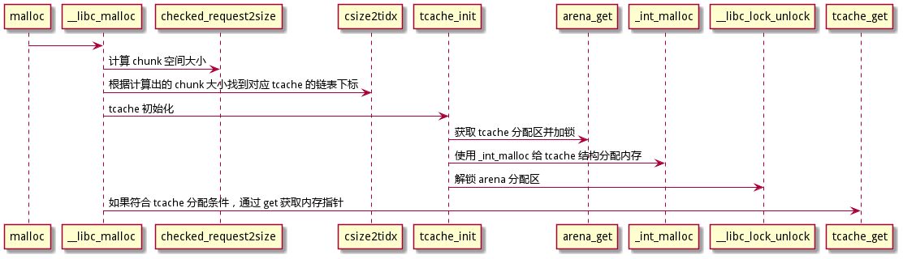

- 疑问：为什么 chunk2mem 中偏移量为 2×SIZE_SZ 与[计算 Chunk](#计算-Chunk) 小结中描述申请内存时需要申请的内存大小只增加 SIZE_SZ 对不上。
  - 因为在申请时不需要考虑 pre_size，每个 chunk 都是可以复用下一个 chunk 的头 pre_size 内存。而 chunk2mem 偏移则是考虑当前 chunk 结构。
- 疑问：csize2tidx 到底是如何查找对应 bin 下标的？
  - 其实这个问题更应该在 free 时解答，就像 tcache 链表中 chunk 节点是怎么来的？也都是在 free 时加入的，或者申请内存时从 fastbin 放进来的。只不过 tcache 的 bins 结构比较特殊，它存储的不是 chunk 的指针而是 user mem 的指针，因此 csize2tidx 会先减去一个 chunk head 在除以 MALLOC_ALIGNMENT（16）。
- 疑问：REVEAL_PTR 作用？
  - 主要是为了安全，避免指针劫持风险：

      ```cpp
      /* Safe-Linking:
        Use randomness from ASLR (mmap_base) to protect single-linked lists
        of Fast-Bins and TCache.  That is, mask the "next" pointers of the
        lists' chunks, and also perform allocation alignment checks on them.
        This mechanism reduces the risk of pointer hijacking, as was done with
        Safe-Unlinking in the double-linked lists of Small-Bins.
        It assumes a minimum page size of 4096 bytes (12 bits).  Systems with
        larger pages provide less entropy, although the pointer mangling
        still works.  */
      /*
      安全链接：
        使用来自 ASLR (mmap_base) 的随机性来保护单链表 Fast-Bins 和 TCache。
        也就是说，屏蔽“下一个”指针列表的块，并对它们执行分配对齐检查。
        这种机制降低了指针劫持的风险，就像在 Small-Bins 双链表中的安全解除链接。
        它假定最小页面大小为 4096 字节（12 位）。系统与较大的页面提供较少的熵，尽管指针重整仍然有效。 
      */
      
      #define PROTECT_PTR(pos, ptr) \
        ((__typeof (ptr)) ((((size_t) pos) >> 12) ^ ((size_t) ptr)))
      #define REVEAL_PTR(ptr)  PROTECT_PTR (&ptr, ptr)
      ```

- 实践：

> 实例代码：[tcache.cpp](https://github.com/HATTER-LONG/glibc_Learnging/blob/main/test/tcache.cpp)

1. 判断是否支持 tcache，参考 pwndbg 实现：

    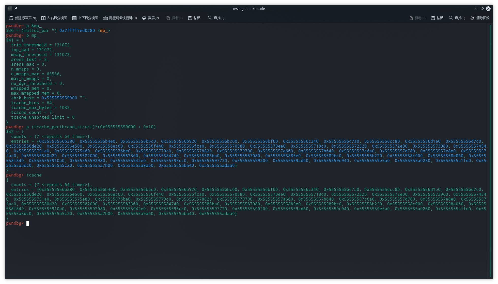

    > 为什么 tcache 要 `sbrk_base + 0x10`，由于 tcache 在 malloc 初始化过程中在最前边，也是第一个通过 _int_malloc 调用 brk 向系统申请内存以及更新 `mp_` 中的 `sbrk_base` 值， 同时由于 _int_malloc 中的内存以 chunk 结构进行申请管理，在返回时会调用 chunk2mem 跳过 chunk 头部，也就是 2 * size_t = 16 字节的大小，因此需要 + 0x10。

2. 获取 tcache 链表：

    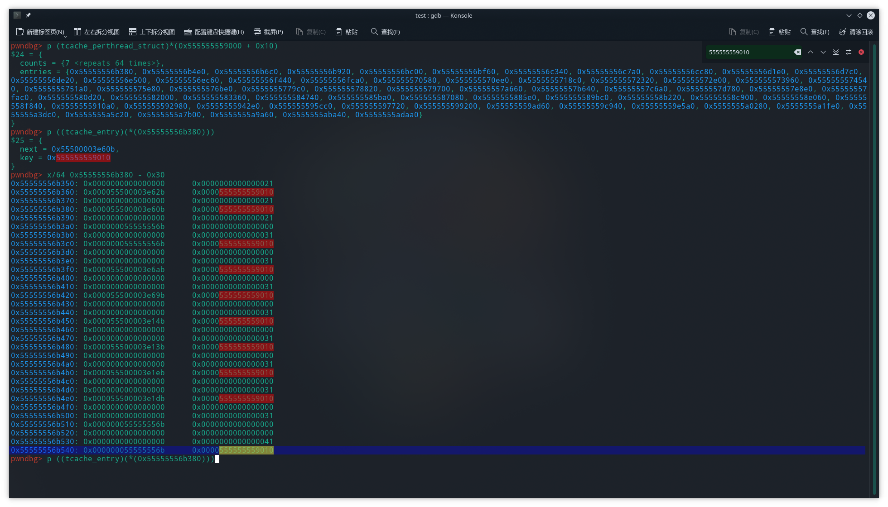

    - 可以看出经过 REVEAL_PTR 其中 next 是一个异常值。

    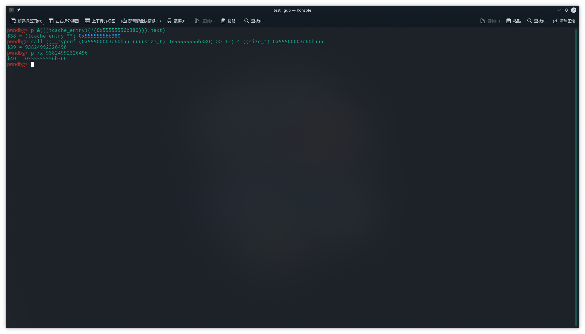

## 分配区管理

讲述初始化流程时已经介绍了分配区管理的一些基本结构，本节从代码角度分析下其管理逻辑。在 Tcache 初始化一节中，介绍了其分配区是通过 `arena_get` 接口获取，本节就从这里入手介绍下分配区的管理代码：

```cpp
/* arena_get() acquires an arena and locks the corresponding mutex.
   First, try the one last locked successfully by this thread.  (This
   is the common case and handled with a macro for speed.)  Then, loop
   once over the circularly linked list of arenas.  If no arena is
   readily available, create a new one.  In this latter case, `size'
   is just a hint as to how much memory will be required immediately
   in the new arena. */

#define arena_get(ptr, size) do { \
      ptr = thread_arena;         \
      arena_lock (ptr, size);     \
  } while (0)

#define arena_lock(ptr, size) do {      \
      if (ptr)                          \
        __libc_lock_lock (ptr->mutex);  \
      else                              \
        ptr = arena_get2 ((size), NULL);\
  } while (0)
```

- 以上部分代码逻辑比较简单，获取当前线程的分配区，判断如果不为空则对其进行上锁，如果为空则通过 `arena_get2` 获取一个分配区：

```cpp

static mstate
arena_get2 (size_t size, mstate avoid_arena)
{
  mstate a;

  static size_t narenas_limit;

  a = get_free_list ();
  if (a == NULL)
    {
      ....... // 创建 分配区
    }
  return a;
}
```

1. 首先通过 `get_free_list` 借口获取一个空闲的分配区，其中 free_list 是空闲分配区链表头，并替换掉当前线程所持有的分配区。

    ```cpp

    /* If REPLACED_ARENA is not NULL, detach it from this thread.  Must be
     called while free_list_lock is held.  */
    static void
    detach_arena (mstate replaced_arena)
    {
      if (replaced_arena != NULL)
        {
          assert (replaced_arena->attached_threads > 0);
          /* The current implementation only detaches from main_arena in
          case of allocation failure.  This means that it is likely not
          beneficial to put the arena on free_list even if the
          reference count reaches zero.  */
          --replaced_arena->attached_threads;
        }
    }
    static mstate free_list;

    /* Remove an arena from free_list.  */
    static mstate
    get_free_list (void)
    {
      mstate replaced_arena = thread_arena;
      mstate result = free_list;
      if (result != NULL)
        {
          __libc_lock_lock (free_list_lock);
          result = free_list; //避免多线程
          if (result != NULL)
            {
              free_list = result->next_free; //从链表中删除头节点

              /* The arena will be attached to this thread.  */
              assert (result->attached_threads == 0);
              result->attached_threads = 1; //增加引用计数

              detach_arena (replaced_arena); // 将前线程所持有的分配区分离，减少引用计数
            }
          __libc_lock_unlock (free_list_lock);

          if (result != NULL)
            {
              LIBC_PROBE (memory_arena_reuse_free_list, 1, result);
              __libc_lock_lock (result->mutex);
              thread_arena = result; //替换
            }
        }

      return result;
    }
    ```

2. 如果当前没有空闲的分配区时，则开始创建新的分配区：

    ```cpp
    static struct malloc_par mp_ =
    {
      .top_pad = DEFAULT_TOP_PAD,
      .n_mmaps_max = DEFAULT_MMAP_MAX,
      .mmap_threshold = DEFAULT_MMAP_THRESHOLD,
      .trim_threshold = DEFAULT_TRIM_THRESHOLD,
    #define NARENAS_FROM_NCORES(n) ((n) * (sizeof (long) == 4 ? 2 : 8))
      .arena_test = NARENAS_FROM_NCORES (1)
    #if USE_TCACHE
      ,
      .tcache_count = TCACHE_FILL_COUNT,
      .tcache_bins = TCACHE_MAX_BINS,
      .tcache_max_bytes = tidx2usize (TCACHE_MAX_BINS-1),
      .tcache_unsorted_limit = 0 /* No limit.  */
    #endif
    };

    /* Return number of available processors.  */
    extern int __get_nprocs (void);
    libc_hidden_proto (__get_nprocs)

    static size_t narenas = 1;

    static mstate
    arena_get2 (size_t size, mstate avoid_arena)
    {
      mstate a;

      static size_t narenas_limit;

      a = get_free_list ();
      if (a == NULL)
        {
          /* Nothing immediately available, so generate a new arena.  */
          if (narenas_limit == 0)
            {
              if (mp_.arena_max != 0) // 是否设置了分配区数量
                narenas_limit = mp_.arena_max;
              else if (narenas > mp_.arena_test)
                {
                  int n = __get_nprocs (); // 获取处理器核心数

                  if (n >= 1)
                    narenas_limit = NARENAS_FROM_NCORES (n); // 这里通过核心数限制了分配区数量
                  else
                    /* We have no information about the system.  Assume two
                      cores.  */
                    narenas_limit = NARENAS_FROM_NCORES (2);
                }
            }
        repeat:;
          size_t n = narenas;
          /* NB: the following depends on the fact that (size_t)0 - 1 is a
            very large number and that the underflow is OK.  If arena_max
            is set the value of arena_test is irrelevant.  If arena_test
            is set but narenas is not yet larger or equal to arena_test
            narenas_limit is 0.  There is no possibility for narenas to
            be too big for the test to always fail since there is not
            enough address space to create that many arenas.  */
            /*注意：以下取决于 (size_t)0 -1 是一个事实
            非常大的数字并且下溢是可以的。如果 arena_max
            设置 arena_test 的值是无关紧要的。如果 arena_test
            已设置但 narenas 尚未大于或等于 arena_test
            narenas_limit 为 0。 narenas 不可能
            太大以至于测试总是失败，因为没有
            足够的地址空间来创建这么多的分配区。 */ 
          if (__glibc_unlikely (n <= narenas_limit - 1))
            {
              if (catomic_compare_and_exchange_bool_acq (&narenas, n + 1, n))
                goto repeat;
              a = _int_new_arena (size);
              if (__glibc_unlikely (a == NULL))
                catomic_decrement (&narenas);
            }
          else
            a = reused_arena (avoid_arena);
        }
      return a;
    }
    ```

3. 通过 `_int_new_arena` 创建分配区，主要通过 `new_heap` 实现，注意函数的最后为了避免多线程情况使用到刚刚创建的分配区要在返回前加锁，而这也解释了为什么设计 arena_get 接口返回的分配区必须是加锁状态的，需要在使用完成后解锁：

    ```cpp
    static mstate
    _int_new_arena (size_t size)
    {
      mstate a;
      heap_info *h;
      char *ptr;
      unsigned long misalign;

      h = new_heap (size + (sizeof (*h) + sizeof (*a) + MALLOC_ALIGNMENT),
                    mp_.top_pad);
      if (!h)
        {
          /* Maybe size is too large to fit in a single heap.  So, just try
            to create a minimally-sized arena and let _int_malloc() attempt
            to deal with the large request via mmap_chunk().  
            也许尺寸太大而无法放入单个堆中。所以，试试吧
            创建一个最小尺寸的 分配区 并让 _int_malloc() 尝试
            通过 mmap_chunk() 处理大请求。
          */
          h = new_heap (sizeof (*h) + sizeof (*a) + MALLOC_ALIGNMENT, mp_.top_pad);
          if (!h)
            return 0;
        }
      a = h->ar_ptr = (mstate) (h + 1); //NOTE: WHY + 1 https://www.cnblogs.com/omnipotent/p/4187502.html
      malloc_init_state (a);
      a->attached_threads = 1;
      /*a->next = NULL;*/
      a->system_mem = a->max_system_mem = h->size;

      /* Set up the top chunk, with proper alignment. */
      ptr = (char *) (a + 1); // 取出 top chunk 指针并对齐
      misalign = (unsigned long) chunk2mem (ptr) & MALLOC_ALIGN_MASK;
      if (misalign > 0)
        ptr += MALLOC_ALIGNMENT - misalign;
      top (a) = (mchunkptr) ptr;
      set_head (top (a), (((char *) h + h->size) - ptr) | PREV_INUSE);

      LIBC_PROBE (memory_arena_new, 2, a, size);
      mstate replaced_arena = thread_arena;
      thread_arena = a;
      __libc_lock_init (a->mutex);

      __libc_lock_lock (list_lock);

      /* Add the new arena to the global list.  */
      a->next = main_arena.next;
      /* FIXME: The barrier is an attempt to synchronize with read access
        in reused_arena, which does not acquire list_lock while
        traversing the list.  */
      atomic_write_barrier ();
      main_arena.next = a; // 重要：将新创建的分配区加到 main_arena 链表上

      __libc_lock_unlock (list_lock);

      __libc_lock_lock (free_list_lock);
      detach_arena (replaced_arena);
      __libc_lock_unlock (free_list_lock);

      /* Lock this arena.  NB: Another thread may have been attached to
        this arena because the arena is now accessible from the
        main_arena.next list and could have been picked by reused_arena.
        This can only happen for the last arena created (before the arena
        limit is reached).  At this point, some arena has to be attached
        to two threads.  We could acquire the arena lock before list_lock
        to make it less likely that reused_arena picks this new arena,
        but this could result in a deadlock with
        __malloc_fork_lock_parent.  
        锁定这个分配区。注意：另一个线程可能已附加到
        这个分配区是因为现在可以从 main_arena.next 列表，可能已被重用的分配区选中。
        这只能发生在最后创建的分配区是上（在分配区是之前
        达到极限）。此时，必须附加一些分配区是
        到两个线程。我们可以在 list_lock 之前获取 arena 锁
        为了减少重用的分配区是选择这个新分配区是的可能性，
        但这可能会导致僵局 __malloc_fork_lock_parent。*/

      __libc_lock_lock (a->mutex);

      return a;
    }
    ```

4. 通过 `new_heap` 调用 mmap 分配新的分配区：

    ```cpp
    static heap_info *
    new_heap (size_t size, size_t top_pad)
    {
      size_t pagesize = GLRO (dl_pagesize);
      char *p1, *p2;
      unsigned long ul;
      heap_info *h;
    
      if (size + top_pad < HEAP_MIN_SIZE)
        size = HEAP_MIN_SIZE;
      else if (size + top_pad <= HEAP_MAX_SIZE)
        size += top_pad;
      else if (size > HEAP_MAX_SIZE)
        return 0;
      else
        size = HEAP_MAX_SIZE;
      size = ALIGN_UP (size, pagesize);
    
      /* A memory region aligned to a multiple of HEAP_MAX_SIZE is needed.
        No swap space needs to be reserved for the following large
        mapping (on Linux, this is the case for all non-writable mappings
        anyway). */
      p2 = MAP_FAILED;
      if (aligned_heap_area)
        {
          p2 = (char *) MMAP (aligned_heap_area, HEAP_MAX_SIZE, PROT_NONE,
                              MAP_NORESERVE);
          aligned_heap_area = NULL;
          if (p2 != MAP_FAILED && ((unsigned long) p2 & (HEAP_MAX_SIZE - 1)))
            {
              __munmap (p2, HEAP_MAX_SIZE);
              p2 = MAP_FAILED;
            }
        }
      if (p2 == MAP_FAILED)
        {
          p1 = (char *) MMAP (0, HEAP_MAX_SIZE << 1, PROT_NONE, MAP_NORESERVE);
          if (p1 != MAP_FAILED)
            {
              p2 = (char *) (((unsigned long) p1 + (HEAP_MAX_SIZE - 1))
                            & ~(HEAP_MAX_SIZE - 1));
              ul = p2 - p1;
              if (ul)
                __munmap (p1, ul);
              else
                aligned_heap_area = p2 + HEAP_MAX_SIZE;
              __munmap (p2 + HEAP_MAX_SIZE, HEAP_MAX_SIZE - ul);
            }
          else
            {
              /* Try to take the chance that an allocation of only HEAP_MAX_SIZE
                is already aligned. */
              p2 = (char *) MMAP (0, HEAP_MAX_SIZE, PROT_NONE, MAP_NORESERVE);
              if (p2 == MAP_FAILED)
                return 0;
    
              if ((unsigned long) p2 & (HEAP_MAX_SIZE - 1))
                {
                  __munmap (p2, HEAP_MAX_SIZE);
                  return 0;
                }
            }
        }
      if (__mprotect (p2, size, MTAG_MMAP_FLAGS | PROT_READ | PROT_WRITE) != 0)
        {
          __munmap (p2, HEAP_MAX_SIZE);
          return 0;
        }
      h = (heap_info *) p2;
      h->size = size;
      h->mprotect_size = size;
      LIBC_PROBE (memory_heap_new, 2, h, h->size);
      return h;
    }
    ```

## 内存管理

本节继续分析 ptmalloc 内存管理源码，当只有主分配区时的内存管理：

```cpp
void *
__libc_malloc (size_t bytes)
{
  mstate ar_ptr;
  void *victim;

  ...........

  if (SINGLE_THREAD_P)
    {
      victim = _int_malloc (&main_arena, bytes);
      assert (!victim || chunk_is_mmapped (mem2chunk (victim)) ||
          &main_arena == arena_for_chunk (mem2chunk (victim)));
      return victim;
    }

  ...........
}
```

`SINGLE_THREAD_P` 判断当前进程是否为单线程，如果为真则调用 `_int_malloc` 方法并传入 main_arena 主分配区进行内存内存，这个接口也是 malloc 的核心代码。

> main_arena 主分配区在 Ptmalloc 初始化分析中介绍过，当进程中第一次调用 malloc 申请内存的线程会进行 ptmalloc 初始化，会构建一个主分配区。

当多线程情况时，会先获取当前分配区，然后在通过 `_int_malloc` 获取内存，因此后文将以解析此接口为主。

```cpp
void *
__libc_malloc (size_t bytes)
{
  .......
  arena_get (ar_ptr, bytes);
  victim = _int_malloc (ar_ptr, bytes);
  /* Retry with another arena only if we were able to find a usable arena
     before.  */
  if (!victim && ar_ptr != NULL)
    {
      LIBC_PROBE (memory_malloc_retry, 1, bytes);
      ar_ptr = arena_get_retry (ar_ptr, bytes);
      victim = _int_malloc (ar_ptr, bytes);
    }

  if (ar_ptr != NULL)
    __libc_lock_unlock (ar_ptr->mutex);

  victim = TAG_NEW_USABLE (victim);

  assert (!victim || chunk_is_mmapped (mem2chunk (victim)) ||
          ar_ptr == arena_for_chunk (mem2chunk (victim)));
  return victim;
}
```

### _int_malloc

在介绍 tcache 时也已经见过 `_int_malloc` 接口了，它是 ptmalloc 内存管理分配的主要实现，接下来从源码来了解下具体实现。

- _int_malloc 入口部分代码，定义了一些局部变量：

    ```cpp
    static void *
    _int_malloc (mstate av, size_t bytes)
    {
        INTERNAL_SIZE_T nb;               /* normalized request size */
        unsigned int idx;                 /* associated bin index */
        mbinptr bin;                      /* associated bin */

        mchunkptr victim;                 /* inspected/selected chunk */
        INTERNAL_SIZE_T size;             /* its size */
        int victim_index;                 /* its bin index */

        mchunkptr remainder;              /* remainder from a split */
        unsigned long remainder_size;     /* its size */

        unsigned int block;               /* bit map traverser */
        unsigned int bit;                 /* bit map traverser */
        unsigned int map;                 /* current word of binmap */

        mchunkptr fwd;                    /* misc temp for linking */
        mchunkptr bck;                    /* misc temp for linking */

        #if USE_TCACHE
        size_t tcache_unsorted_count;      /* count of unsorted chunks processed */
        #endif

        .......

    }
    ```

- 将申请的内存字节转化为对应 chunk 且对其后的大小，使用的也是之前分析过的 `checked_request2size`，接下来判断传入的分配区是否存在，如果为空则使用 `sysmalloc` 创建一个分配区，并使用其申请内存（sysmalloc 主要实现了 ptmalloc 向系统申请内存，后文有具体解析）：

    ```cpp
    /*
        Convert request size to internal form by adding SIZE_SZ bytes
        overhead plus possibly more to obtain necessary alignment and/or
        to obtain a size of at least MINSIZE, the smallest allocatable
        size. Also, checked_request2size returns false for request sizes
        that are so large that they wrap around zero when padded and
        aligned.
    */
    
    if (!checked_request2size (bytes, &nb))
        {
        __set_errno (ENOMEM);
        return NULL;
        }
    
    /* There are no usable arenas.  Fall back to sysmalloc to get a chunk from
        mmap.  */
    if (__glibc_unlikely (av == NULL))
        {
        void *p = sysmalloc (nb, av);
        if (p != NULL)
        alloc_perturb (p, bytes); // 将申请到的内存块中数据清空，默认为 0
        return p;
        }
    ```

#### _int_malloc 之 fast bins

- 接下来首先判断申请内存 fastbin 是否能满足，并使用 fastbin 进行分配内存：
  - chunk 的大小在 32 字节 ~ 128 字节（0x20~0x80）的 chunk 称为 “fast chunk”，注意是指 struct malloc_chunk 结构的大小。
  - 不会对 free chunk 进行合并：鉴于设计 fast bin 的初衷就是进行快速的小内存分配和释放，因此系统将属于 fast bin 的 chunk 的 PREV_INUSE 位总是设置为 1，这样即使当 fast bin 中有某个 chunk 同一个 free chunk 相邻的时候，系统也不会进行自动合并操作，而是保留两者。虽然这样做可能会造成额外的碎片化问题。

    ```cpp
    /*
        If the size qualifies as a fastbin, first check corresponding bin.
        This code is safe to execute even if av is not yet initialized, so we
        can try it without checking, which saves some time on this fast path.
    */
    // 多线程安全的从 fastbin 里面移除一个 chunk.
    #define REMOVE_FB(fb, victim, pp)            \
    do                            \
        {                            \
        victim = pp;                    \
        if (victim == NULL)                \
        break;                        \
        }                            \
    while ((pp = catomic_compare_and_exchange_val_acq (fb, victim->fd, victim)) \
        != victim);                    \
    
    if ((unsigned long) (nb) <= (unsigned long) (get_max_fast ()))
        {
        idx = fastbin_index (nb); // 判断某一个 fastchunk 属于哪一个 fastbin 链表。
        mfastbinptr *fb = &fastbin (av, idx); // 获得 bin 链表上的 chunk
        mchunkptr pp;
        victim = *fb;
    
        if (victim != NULL)
        {
        if (SINGLE_THREAD_P)
            *fb = victim->fd; // 如果为单线程则直接删除对应 chunk 节点即可
        else
            REMOVE_FB (fb, pp, victim); // 多线程需要使用 原子操作 进行删除
        if (__glibc_likely (victim != NULL))
            {
            size_t victim_idx = fastbin_index (chunksize (victim)); // 检查分配的 chunk 内存
            if (__builtin_expect (victim_idx != idx, 0))
            malloc_printerr ("malloc(): memory corruption (fast)");
            check_remalloced_chunk (av, victim, nb);
    #if USE_TCACHE
            /* While we're here, if we see other chunks of the same size,
            stash them in the tcache.  
            发现其他相同大小的块，将它们存放在 tcache 中，直到 tcache 对应链长度表达到 tcache_count = 7
            */
            size_t tc_idx = csize2tidx (nb);
            if (tcache && tc_idx < mp_.tcache_bins)
            {
            mchunkptr tc_victim;
    
            /* While bin not empty and tcache not full, copy chunks.  */
            while (tcache->counts[tc_idx] < mp_.tcache_count
                && (tc_victim = *fb) != NULL)
                {
                if (SINGLE_THREAD_P)
                *fb = tc_victim->fd;
                else
                {
                REMOVE_FB (fb, pp, tc_victim);
                if (__glibc_unlikely (tc_victim == NULL))
                    break;
                }
                tcache_put (tc_victim, tc_idx);
                }
            }
    #endif
            void *p = chunk2mem (victim); // 定位到 chunk 中用户内存地址
            alloc_perturb (p, bytes); //对用户使用的内存进行初始化
            return p;
            }
        }
    ```

    - `REMOVE_FB` 中不好理解的宏便是 `catomic_compare_and_exchange_val_acq`，其中传入的参数 `mem` 与 `oldval` 一般都是相等的，因此其作用便是将 mem 指向 newval 并返回 oldval，达成在 mem 链表中取出 oldval 的目的：

        ```cpp
        /* Atomically store NEWVAL in *MEM if *MEM is equal to OLDVAL.
           Return the old *MEM value.  
           如果 *MEM 等于 OLDVAL，则将 NEWVAL 原子地存储在 *MEM 中。
           返回旧的 *MEM 值。
        */
        #ifndef catomic_compare_and_exchange_val_acq
        # ifdef __arch_c_compare_and_exchange_val_32_acq
        #  define catomic_compare_and_exchange_val_acq(mem, newval, oldval) \
        __atomic_val_bysize (__arch_c_compare_and_exchange_val,acq,         \
                    mem, newval, oldval)
        # else
        #  define catomic_compare_and_exchange_val_acq(mem, newval, oldval) \
        atomic_compare_and_exchange_val_acq (mem, newval, oldval)
        # endif
        #endif
        ```

    - `fastbin_index` 与 `fastbin` 可以看出其组合使用取出目标大小的 chunk 链表节点，`fastbin_index` 判断 64 位系统则除以 8 再减去 2，64 位系统举例： sz 为 32 时，32 >> 4 = 2 - 2 = 0; 得出 fastbin 数字的对应 chunk 链表下标，因此可以反推 fastbin 是 32 字节开始，最大的请求为 160 字节（注意这并不是指 fastbin 中 chunk 的大小，其是通过 set_max_fast 设置）：

        ```cpp
        typedef struct malloc_chunk *mfastbinptr;
        #define fastbin(ar_ptr, idx) ((ar_ptr)->fastbinsY[idx])

        /* offset 2 to use otherwise unindexable first 2 bins */
        #define fastbin_index(sz) \
        ((((unsigned int) (sz)) >> (SIZE_SZ == 8 ? 4 : 3)) - 2)

        /* The maximum fastbin request size we support */
        #define MAX_FAST_SIZE     (80 * SIZE_SZ / 4)

        #define NFASTBINS  (fastbin_index (request2size (MAX_FAST_SIZE)) + 1)
        struct malloc_state
        {
            ......
            /* Fastbins */
            mfastbinptr fastbinsY[NFASTBINS];
            .......
        };
        ```

    - 当获取到正确大小的 chunk 后，会有进行一个检查操作：

        ```cpp
        size_t victim_idx = fastbin_index (chunksize (victim)); // 检查分配的 chunk 内存
        if (__builtin_expect (victim_idx != idx, 0))            // 应该与申请时的下表保持一致，否则可能 chunk 内存被破坏
        malloc_printerr ("malloc(): memory corruption (fast)");
        check_remalloced_chunk (av, victim, nb);  // 这一部分用于 debug 模式

        .....

        /* size field is or'ed with PREV_INUSE when previous adjacent chunk in use */
        #define PREV_INUSE 0x1
        /* size field is or'ed with IS_MMAPPED if the chunk was obtained with mmap() */
        #define IS_MMAPPED 0x2
        /* size field is or'ed with NON_MAIN_ARENA if the chunk was obtained
        from a non-main arena.  This is only set immediately before handing
        the chunk to the user, if necessary.  */
        #define NON_MAIN_ARENA 0x4

        /*
        Bits to mask off when extracting size

        Note: IS_MMAPPED is intentionally not masked off from size field in
        macros for which mmapped chunks should never be seen. This should
        cause helpful core dumps to occur if it is tried by accident by
        people extending or adapting this malloc.
        */
        #define SIZE_BITS (PREV_INUSE | IS_MMAPPED | NON_MAIN_ARENA)

        /* Get size, ignoring use bits */
        #define chunksize(p) (chunksize_nomask (p) & ~(SIZE_BITS))
        /* Like chunksize, but do not mask SIZE_BITS.  */
        #define chunksize_nomask(p)         ((p)->mchunk_size)
        ```

    - 终于 fastbin 内存分配就分析完了，但是有一点需要注意，我们默认 `get_max_fast` 是有效的，但是从源码可以看出 `global_max_fast` 是需要设置的，其就是在 `malloc_init_state` 在 ptmalloc 初始化过程中进行设置。

        ```cpp
        /*
        Set value of max_fast.
        Use impossibly small value if 0.
        Precondition: there are no existing fastbin chunks in the main arena.
        Since do_check_malloc_state () checks this, we call malloc_consolidate ()
        before changing max_fast.  Note other arenas will leak their fast bin
        entries if max_fast is reduced.
            */
        
        #define set_max_fast(s) \
        global_max_fast = (((s) == 0)    \
                            ? MIN_CHUNK_SIZE / 2 : ((s + SIZE_SZ) & ~MALLOC_ALIGN_MASK))
        
        static inline INTERNAL_SIZE_T
        get_max_fast (void)
        {
        /* Tell the GCC optimizers that global_max_fast is never larger
            than MAX_FAST_SIZE.  This avoids out-of-bounds array accesses in
            _int_malloc after constant propagation of the size parameter.
            (The code never executes because malloc preserves the
            global_max_fast invariant, but the optimizers may not recognize
            this.)  */
        if (global_max_fast > MAX_FAST_SIZE)
            __builtin_unreachable ();
        return global_max_fast;
        }
        ```

#### _int_malloc 之 small bins

当 `fast bins` 未初始化或者不能满足申请的内存时，流程就会尝试使用 `small bins` 来完成内存申请。

```cpp
  /*
     If a small request, check regular bin.  Since these "smallbins"
     hold one size each, no searching within bins is necessary.
     (For a large request, we need to wait until unsorted chunks are
     processed to find best fit. But for small ones, fits are exact
     anyway, so we can check now, which is faster.)
   */

  if (in_smallbin_range (nb))
    {
      idx = smallbin_index (nb);// 1
      bin = bin_at (av, idx); // 2

      // 判断当前 chunk 不是此链表最后一个 chunk，并进行正确性链表检查
      if ((victim = last (bin)) != bin)
        {
          bck = victim->bk;
      if (__glibc_unlikely (bck->fd != victim))
        malloc_printerr ("malloc(): smallbin double linked list corrupted");

          set_inuse_bit_at_offset (victim, nb); //3
          bin->bk = bck;
          bck->fd = bin;

          if (av != &main_arena)
        set_non_main_arena (victim); 
          check_malloced_chunk (av, victim, nb);
#if USE_TCACHE
      /* While we're here, if we see other chunks of the same size,
         stash them in the tcache.  */
      //类似 fastbins 一样，会将相同类型的 chunk 填充到 tcache 中
      size_t tc_idx = csize2tidx (nb);
      if (tcache && tc_idx < mp_.tcache_bins)
        {
          mchunkptr tc_victim;

          /* While bin not empty and tcache not full, copy chunks over.  */
          while (tcache->counts[tc_idx] < mp_.tcache_count
             && (tc_victim = last (bin)) != bin)
        {
          if (tc_victim != 0)
            {
              bck = tc_victim->bk;
              set_inuse_bit_at_offset (tc_victim, nb);
              if (av != &main_arena)
            set_non_main_arena (tc_victim);
              bin->bk = bck;
              bck->fd = bin;

              tcache_put (tc_victim, tc_idx);
                }
        }
#endif
          void *p = chunk2mem (victim); 
          alloc_perturb (p, bytes);
          return p;
        }
    }
    /*
     If this is a large request, consolidate fastbins before continuing.
     While it might look excessive to kill all fastbins before
     even seeing if there is space available, this avoids
     fragmentation problems normally associated with fastbins.
     Also, in practice, programs tend to have runs of either small or
     large requests, but less often mixtures, so consolidation is not
     invoked all that often in most programs. And the programs that
     it is called frequently in otherwise tend to fragment.
   */

  else
    {
      idx = largebin_index (nb);//4
      if (atomic_load_relaxed (&av->have_fastchunks))
        malloc_consolidate (av);
    }
```

1. 首先判断申请的内存大小是否符合 `small bins` 范围，然后使用 `smallbin_index` 寻找对应链表。 small bins 中每个 chunk 的大小与其所在的 bin 的 index 的关系为 `chunk_size = 2 * SIZE_SZ * index`：

    ```cpp
    /*
    Indexing

        Bins for sizes < 512 bytes contain chunks of all the same size, spaced
        8 bytes apart. Larger bins are approximately logarithmically spaced:

        64 bins of size       8
        32 bins of size      64
        16 bins of size     512
        8 bins of size    4096
        4 bins of size   32768
        2 bins of size  262144
        1 bin  of size what's left

        There is actually a little bit of slop in the numbers in bin_index
        for the sake of speed. This makes no difference elsewhere.

        The bins top out around 1MB because we expect to service large
        requests via mmap.

        Bin 0 does not exist.  Bin 1 is the unordered list; if that would be
        a valid chunk size the small bins are bumped up one.
    */
    //bins 总的数量
    #define NBINS             128
    //Small bin 大小
    #define NSMALLBINS         64
    // 2*size_t
    #define SMALLBIN_WIDTH    MALLOC_ALIGNMENT
    //是否需要对 small bin 的下标进行纠正
    #define SMALLBIN_CORRECTION (MALLOC_ALIGNMENT > 2 * SIZE_SZ)
    #define MIN_LARGE_SIZE    ((NSMALLBINS - SMALLBIN_CORRECTION) * SMALLBIN_WIDTH)

    #define in_smallbin_range(sz)  \
    ((unsigned long) (sz) < (unsigned long) MIN_LARGE_SIZE)
    //根据 sz 得到 smallbin 的序号，例如 sz = 32， 32>>4 = 2 + SMALLBIN_CORRECTION (0) = 2
    // 对应 bins 数组，第 1 位是无序链表，小于 512 字节 的是 smalle bins，8、64、512、。因此返回 下标 2（64） 
    #define smallbin_index(sz) \
    ((SMALLBIN_WIDTH == 16 ? (((unsigned) (sz)) >> 4) : (((unsigned) (sz)) >> 3))\
    + SMALLBIN_CORRECTION)

    ```

2. 使用 `bin_at` 得到 `small bin` 的链表头地址：

    ```cpp
    /* addressing -- note that bin_at(0) does not exist */
    #define bin_at(m, i) \
    (mbinptr) (((char *) &((m)->bins[((i) - 1) * 2]))     \
                - offsetof (struct malloc_chunk, fd))

    /* analog of ++bin */
    #define next_bin(b)  ((mbinptr) ((char *) (b) + (sizeof (mchunkptr) << 1)))

    /* Reminders about list directionality within bins */
    #define first(b)     ((b)->fd)
    #define last(b)      ((b)->bk)

    // 由于 分配区的 bins 管理是双向链表 fd 与 bk 进行管理
    // 当拿到 fd 地址时需要减去对应偏移就是当前 chunk 的头部地址
    struct malloc_chunk {

    INTERNAL_SIZE_T      mchunk_prev_size;  /* Size of previous chunk (if free).  */
    INTERNAL_SIZE_T      mchunk_size;       /* Size in bytes, including overhead. */

    struct malloc_chunk* fd;         /* double links -- used only if free. */
    struct malloc_chunk* bk;

    /* Only used for large blocks: pointer to next larger size.  */
    struct malloc_chunk* fd_nextsize; /* double links -- used only if free. */
    struct malloc_chunk* bk_nextsize;
    };
    ```

3. 设置取出的 chunk 使用标志位，然后将其从链表中取出，非主分配区设置此 chunk 对应标志位：

    ```cpp
    set_inuse_bit_at_offset (victim, nb);
    bin->bk = bck;
    bck->fd = bin;
    if (av != &main_arena)
        set_non_main_arena (victim);
    check_malloced_chunk (av, victim, nb);// debug 模式使用
    .................

    #define set_inuse_bit_at_offset(p, s)     \
        (((mchunkptr) (((char *) (p)) + (s)))->mchunk_size |= PREV_INUSE)

    /* Check for chunk from main arena.  */
    #define chunk_main_arena(p) (((p)->mchunk_size & NON_MAIN_ARENA) == 0)

    /* Mark a chunk as not being on the main arena.  */
    #define set_non_main_arena(p) ((p)->mchunk_size |= NON_MAIN_ARENA)

    ```

4. else 分支则表示当 small bins 无法满足必须使用 large bins 之前，先进行 fast bins 的合并工作：

    - 大于 1024（512）字节的 chunk 称之为 large chunk，large bin 就是用于管理这些 large chunk 的。一共包括 63 个 bin，index 为 64~126，每个 bin 中的 chunk 的大小不一致，而是处于一定区间范围内。
    - 例如分配 1024 字节内存，largebin_index_64：1024 >> 16 = 16 < 48 = 48 + 16 = 64。

    ```cpp
      idx = largebin_index (nb); //获取申请内存所需的 largebin 的 下标
      if (atomic_load_relaxed (&av->have_fastchunks)) // 原子获取分配区中是否有空闲的 fast chunks 接下来进行合并操作
        malloc_consolidate (av);
    
    ........
    
    //  It remains to be seen whether it is good to keep the widths of
    //  the buckets the same or whether it should be scaled by a factor
    //  of two as well.
    #define largebin_index_64(sz)                                                \
    (((((unsigned long) (sz)) >> 6) <= 48) ?  48 + (((unsigned long) (sz)) >> 6) :\
    ((((unsigned long) (sz)) >> 9) <= 20) ?  91 + (((unsigned long) (sz)) >> 9) :\
    ((((unsigned long) (sz)) >> 12) <= 10) ? 110 + (((unsigned long) (sz)) >> 12) :\
    ((((unsigned long) (sz)) >> 15) <= 4) ? 119 + (((unsigned long) (sz)) >> 15) :\
    ((((unsigned long) (sz)) >> 18) <= 2) ? 124 + (((unsigned long) (sz)) >> 18) :\
    126)
    
    #define largebin_index(sz) \
    (SIZE_SZ == 8 ? largebin_index_64 (sz)                                     \
    : MALLOC_ALIGNMENT == 16 ? largebin_index_32_big (sz)                     \
    : largebin_index_32 (sz))
    
    # define atomic_load_relaxed(mem) \
    ({ __atomic_check_size_ls((mem));    \
        __atomic_load_n ((mem), __ATOMIC_RELAXED); })
    ```

- 下图为 _int_malloc 前半部分流程图：

  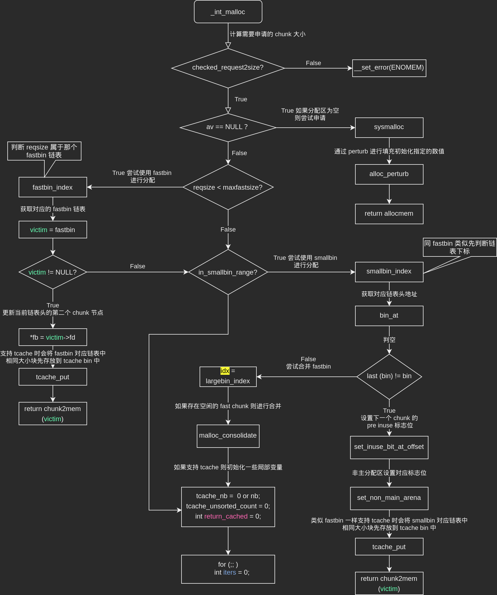

#### _int_malloc 之 malloc_consolidate

consolidate 的目的是对堆中的碎片 chunk 进行合并整理，减少堆中的碎片。主要将 fastbin 管理的所有 chunk 空闲的进行释放，将其添加到 unsorted bin 上。

```cpp
/*
  ------------------------- malloc_consolidate -------------------------

  malloc_consolidate is a specialized version of free() that tears
  down chunks held in fastbins.  Free itself cannot be used for this
  purpose since, among other things, it might place chunks back onto
  fastbins.  So, instead, we need to use a minor variant of the same
  code.
*/

static void malloc_consolidate(mstate av) {
  mfastbinptr *fb;          /* current fastbin being consolidated */
  mfastbinptr *maxfb;       /* last fastbin (for loop control) */
  mchunkptr p;              /* current chunk being consolidated */
  mchunkptr nextp;          /* next chunk to consolidate */
  mchunkptr unsorted_bin;   /* bin header */
  mchunkptr first_unsorted; /* chunk to link to */

  /* These have same use as in free() */
  mchunkptr nextchunk;
  INTERNAL_SIZE_T size;
  INTERNAL_SIZE_T nextsize;
  INTERNAL_SIZE_T prevsize;
  int nextinuse;

  atomic_store_relaxed(&av->have_fastchunks,
                       false); //首先原子操作将分配区 have_fastchunks 置为 false

  unsorted_bin =
      unsorted_chunks(av); //取出 bin[1] 也就是 unsorted bins 的第一个 chunk

  /*
    Remove each chunk from fast bin and consolidate it, placing it
    then in unsorted bin. Among other reasons for doing this,
    placing in unsorted bin avoids needing to calculate actual bins
    until malloc is sure that chunks aren't immediately going to be
    reused anyway.
  */
  /*
      从 fast bin 中删除每个块并合并它，然后将其放入 unsorted bin 中。
      这样做的其他原因之一是，放入 unsorted bin 避免了需要计算实际 bin，
      直到 malloc 确定无论如何都不会立即重用块。
  */
  maxfb = &fastbin(av, NFASTBINS - 1); // 取出 fastbin 中最后一个链表 chunk
  fb = &fastbin(av, 0);                // fastbin 第一个链表的 chunk
  do {
    p = atomic_exchange_acq(fb, NULL); //原子性的 将 fb 置空并返回 fb 原来的值
    if (p != 0) {
      do {
        {
          unsigned int idx =
              fastbin_index(chunksize(p)); // 通过 chunksize 重新获取 index
          if ((&fastbin(av, idx)) != fb) // 并重新获取一次 chunk 判断链表布局是否正常
            malloc_printerr("malloc_consolidate(): invalid chunk size");
        }

        check_inuse_chunk(av, p); // debug 模式使用
        nextp = p->fd;

        /* Slightly streamlined version of consolidation code in free() */
        size = chunksize(p);                  // 获取当前 p chunk 的大小
        nextchunk = chunk_at_offset(p, size); // 偏移获取下一个 chunk 头地址
        nextsize = chunksize(nextchunk);

        if (!prev_inuse(p)) {      // 如果前一块 chunk 没有使用，
          prevsize = prev_size(p); // 则获取前一块 chunk 偏移
          size += prevsize;
          p = chunk_at_offset(
              p, -((long)prevsize)); // 并将 p 向前推移到前一块 chunk 的首地址
          if (__glibc_unlikely(chunksize(p) != prevsize))
            malloc_printerr("corrupted size vs. prev_size in fastbins");
          unlink_chunk(av, p); // 将这块空闲的 chunk 从对应的 bins 链表取出
        }

        if (nextchunk != av->top) { // 判断当前 chunk 是否与 top chunk 相邻
          nextinuse = inuse_bit_at_offset(nextchunk, nextsize); // 判断 nextchunk 是否 inuse

          if (!nextinuse) {
            size += nextsize;
            unlink_chunk(av, nextchunk); // 如果没有使用，则证明其并不属于 fastbins 的 chunk, 将当前 nextchunk 从其所属链表中取出
          } else
            clear_inuse_bit_at_offset(nextchunk, 0); //如果还有在使用 则将当前 nextchunk 设置为未使用

          first_unsorted = unsorted_bin->fd;
          unsorted_bin->fd = p; // 将取出的 p chunk 放入 unsorted bin 链表上
          first_unsorted->bk = p;

          if (!in_smallbin_range(size)) {
            p->fd_nextsize = NULL;  // large bins 需要考虑 这两个指针赋值
            p->bk_nextsize = NULL;
          }

          set_head(p, size | PREV_INUSE); // 设置 p 的 chunk_size 包含 PREV_INUSE 标志
          p->bk = unsorted_bin;
          p->fd = first_unsorted;
          set_foot(p, size); // 设置下一块 chunk 的 prev_size 大小
        }

        else { // 将此 chunk 与 top 融合
          size += nextsize;
          set_head(p, size | PREV_INUSE);
          av->top = p;
        }

      } while ((p = nextp) != 0); // 遍历链表所有节点
    }
  } while (fb++ != maxfb); // 遍历所有链表
}
```

- 下图为 malloc_consolidate 流程图：

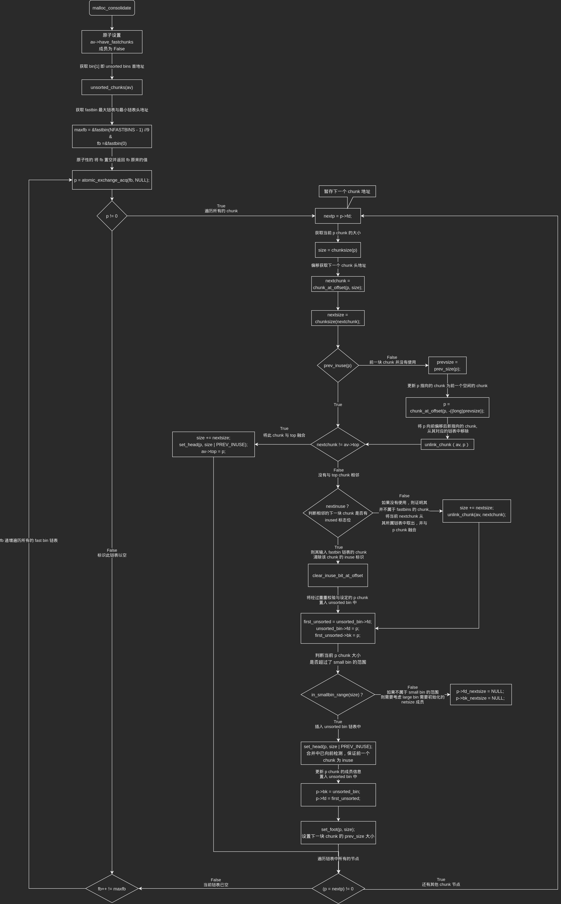

#### _int_malloc 之 large bin

前文已经介绍了 `small bin` 以及当其无法满足需求时，需要使用 `large bin` 并且会进行 `fast bin` 的内存合并相关操作，接下来开始分析 `_int_malloc` 后续的分配流程。

1. 首先判断 tcache 是否支持当前申请的内存块，初始化一些局部变量。

    ```cpp
    static void *
    _int_malloc (mstate av, size_t bytes)
    {

      ...............
      #if USE_TCACHE
      INTERNAL_SIZE_T tcache_nb = 0;
      size_t tc_idx = csize2tidx (nb);
      if (tcache && tc_idx < mp_.tcache_bins)
          tcache_nb = nb;
      int return_cached = 0;

      tcache_unsorted_count = 0;
      #endif
      .................
    }
    ```

2. 两个循环，最外层用于无法满足需求用于合并重试，里层遍历所有 unsorted 节点：

    ```cpp
    //这里需要外循环，因为可能直到 malloc 结束时才意识到应该合并，所以必须这样做并重试。
    //这最多发生一次，并且仅在需要扩展内存以服务“小”请求时才发生。
    for (;; ) 
        {
        int iters = 0;
        while ((victim = unsorted_chunks (av)->bk) != unsorted_chunks (av)) // 判断 unsorted 不为空
            {
            bck = victim->bk; //取出 unsorted bin 中倒数第二个空闲的 chunk
            size = chunksize (victim);
            mchunkptr next = chunk_at_offset (victim, size);  // 偏移到再下一个 chunk 头 用于检查链表是否正常

            if (__glibc_unlikely (size <= 2 * SIZE_SZ)
                || __glibc_unlikely (size > av->system_mem))
                malloc_printerr ("malloc(): invalid size (unsorted)");
            if (__glibc_unlikely (chunksize_nomask (next) < 2 * SIZE_SZ)
                || __glibc_unlikely (chunksize_nomask (next) > av->system_mem))
                malloc_printerr ("malloc(): invalid next size (unsorted)");
            if (__glibc_unlikely ((prev_size (next) & ~(SIZE_BITS)) != size))
                malloc_printerr ("malloc(): mismatching next->prev_size (unsorted)");
            if (__glibc_unlikely (bck->fd != victim)
                || __glibc_unlikely (victim->fd != unsorted_chunks (av)))
                malloc_printerr ("malloc(): unsorted double linked list corrupted");
            if (__glibc_unlikely (prev_inuse (next)))
                malloc_printerr ("malloc(): invalid next->prev_inuse (unsorted)");
            
                .......
            }
        }
    ```

3. 经过检查后进入到内存分配流程，当小内存请求，且 unsorted 中仅剩余一个 chunk 时，使用 last_remiainder 进行切割分配：

    ```cpp
          /*
             If a small request, try to use last remainder if it is the
             only chunk in unsorted bin.  This helps promote locality for
             runs of consecutive small requests. This is the only
             exception to best-fit, and applies only when there is
             no exact fit for a small chunk.
             如果是小请求，则尝试使用最后一个余数只有未排序 bin 中的块。 
             这有助于促进本地化运行连续的小请求。 
             这是唯一最佳拟合的例外，仅适用于不完全合适一小块内存。
           */

          if (in_smallbin_range (nb) &&
              bck == unsorted_chunks (av) && //当剩余 1 个未使用的 chunk
              victim == av->last_remainder && // 指向上一个 chunk 分配出一个 small chunk 之后剩余的部分
              (unsigned long) (size) > (unsigned long) (nb + MINSIZE))
            {
              /* split and reattach remainder */
              remainder_size = size - nb; //减去所需的内存
              remainder = chunk_at_offset (victim, nb);
              unsorted_chunks (av)->bk = unsorted_chunks (av)->fd = remainder;
              av->last_remainder = remainder; //更新
              remainder->bk = remainder->fd = unsorted_chunks (av); //将删减过剩余的内存重新添加回链表
              if (!in_smallbin_range (remainder_size))
                {
                  remainder->fd_nextsize = NULL;
                  remainder->bk_nextsize = NULL;
                }

              set_head (victim, nb | PREV_INUSE |
                        (av != &main_arena ? NON_MAIN_ARENA : 0));
              set_head (remainder, remainder_size | PREV_INUSE);
              set_foot (remainder, remainder_size);

              check_malloced_chunk (av, victim, nb);
              void *p = chunk2mem (victim);
              alloc_perturb (p, bytes);
              return p;
            }
    ```

4. 将 victim 从 unsorted list 中移除，判断是否符合申请的内存大小，如果符合且 tcache 相应链表未满，则先将对应 chunk 放入 tcache 队列中，反之返回给用户使用。

    ```cpp
          /* remove from unsorted list */
          if (__glibc_unlikely (bck->fd != victim))
            malloc_printerr ("malloc(): corrupted unsorted chunks 3");
          unsorted_chunks (av)->bk = bck;
          bck->fd = unsorted_chunks (av);

          /* Take now instead of binning if exact fit */

          if (size == nb) //如果当前 chunk 的大小符合申请
            {
                set_inuse_bit_at_offset (victim, size); //设置当前块为使用状态
                if (av != &main_arena) //非主分区设置标志位
                  set_non_main_arena (victim);
        #if USE_TCACHE
                /* Fill cache first, return to user only if cache fills.
                We may return one of these chunks later.  
                先填充缓存，缓存满才返回给用户。我们稍后可能会返回这些块之一。*/
                if (tcache_nb
                && tcache->counts[tc_idx] < mp_.tcache_count)
                {
                    tcache_put (victim, tc_idx);
                    return_cached = 1;
                    continue;
                }
                else
                {
        #endif
                    check_malloced_chunk (av, victim, nb);
                    void *p = chunk2mem (victim); // 返回用户内存地址
                    alloc_perturb (p, bytes);
                    return p;
        #if USE_TCACHE
                }
        #endif
            }
    ```

5. 当前将遍历到的 unrsored bin 插入对应的 small bin 或者 large bin 中，需要了解一点 large chunk 中有两个特殊的指针，如下：
    - 指针 fd_nextsize : 该指针指向下一个大小更小的 chunk（注意可能不是相邻 chunk）;
    - 指针 bk_nextsize : 该指针指向前一个大小更大的 chunk（注意可能不是相邻 chunk）。

    ```cpp
      /* place chunk in bin */
    
      if (in_smallbin_range (size)) 
        {
          // 如果申请的大小在 small bin 的范围则取出对应的 对应大小链的头节点与前一个个节点
          victim_index = smallbin_index (size);
          bck = bin_at (av, victim_index);
          fwd = bck->fd;
        }
      else
        {
          // 不符合 small bin 的范围则使用 large bin，同样是取出对应大小链的头节点与前一个节点
          victim_index = largebin_index (size);
          bck = bin_at (av, victim_index);
          fwd = bck->fd;
    
          /* maintain large bins in sorted order 
            large bins 是按照顺序进行维护的*/
          if (fwd != bck) // large bins 不为空
            {
              /* Or with inuse bit to speed comparisons */
              size |= PREV_INUSE;
              /* if smaller than smallest, bypass loop below */
              assert (chunk_main_arena (bck->bk));
              if ((unsigned long) (size) < (unsigned long) chunksize_nomask (bck->bk))
                {
                  // 如果小于当前 large bin 链表最小的 chunk 则直接加到链表尾即可
                  fwd = bck;
                  bck = bck->bk;
    
                  victim->fd_nextsize = fwd->fd;
                  victim->bk_nextsize = fwd->fd->bk_nextsize;
                  fwd->fd->bk_nextsize = victim->bk_nextsize->fd_nextsize = victim; // large bin 需要将 nextsize 链表加上
                }
              else
                {
                  // 否则遍历链表 nextsize 找到合适位置插入
                  assert (chunk_main_arena (fwd));
                  while ((unsigned long) size < chunksize_nomask (fwd))
                    {
                      fwd = fwd->fd_nextsize;
                      assert (chunk_main_arena (fwd));
                    }
    
                  if ((unsigned long) size
                            == (unsigned long) chunksize_nomask (fwd))
                    /* Always insert in the second position.  */
                    fwd = fwd->fd;
                  else
                    {
                      victim->fd_nextsize = fwd;
                      victim->bk_nextsize = fwd->bk_nextsize;
                      if (__glibc_unlikely (fwd->bk_nextsize->fd_nextsize != fwd))
                        malloc_printerr ("malloc(): largebin double linked list corrupted (nextsize)");
                      fwd->bk_nextsize = victim;
                      victim->bk_nextsize->fd_nextsize = victim;
                    }
                  bck = fwd->bk;
                  if (bck->fd != fwd)
                    malloc_printerr ("malloc(): largebin double linked list corrupted (bk)");
                }
            }
          else
            victim->fd_nextsize = victim->bk_nextsize = victim;
        }
    
      //最终插入 victim 到合适的链表上，并将 large bin 所对应 binmap 的相应 bit 置位。 关于 binmap 后边会介绍
      mark_bin (av, victim_index);
      victim->bk = bck;
      victim->fd = fwd;
      fwd->bk = victim;
      bck->fd = victim;
    ```

6. (4) 中描述了将符合申请块大小的 chunk 缓存进入了 Tcache 中后没有立即返回给调用者，而是继续遍历所有相同的块都放入 Tcache 中，直到这里才会返回合适的内存。

    ```cpp
    #if USE_TCACHE
                /* If we've processed as many chunks as we're allowed while
                filling the cache, return one of the cached ones.  */
                ++tcache_unsorted_count;
                if (return_cached && mp_.tcache_unsorted_limit > 0 &&
                    tcache_unsorted_count > mp_.tcache_unsorted_limit) {
                return tcache_get(tc_idx);
                }
    #endif

    #define MAX_ITERS 10000
                if (++iters >= MAX_ITERS)
                break;
            } // while 循环退出，表示 unsorted bin 以处理完，如果 return_cached 同样没有置为 1 表示没有符合的 chunk.

    #if USE_TCACHE
            /* If all the small chunks we found ended up cached, return one now.  */
            if (return_cached) {
            return tcache_get(tc_idx);
            }
    #endif
    ```

7. 遍历 large bin 查找合适的 chunk 块，并尝试进行切割节约内存：

    ```cpp
          /*
         If a large request, scan through the chunks of current bin in
         sorted order to find smallest that fits.  Use the skip list for this.
         如果请求很大，则扫描当前 bin 中的块排序顺序以找到适合的最小的。
       */

      if (!in_smallbin_range (nb))
        {
          bin = bin_at (av, idx);

          /* 如果空块或最大块太小则跳过扫描*/
          if ((victim = first (bin)) != bin
          && (unsigned long) chunksize_nomask (victim)
            >= (unsigned long) (nb))
            {
                // 遍历查找合适大小的 chunk
              victim = victim->bk_nextsize;
              while (((unsigned long) (size = chunksize (victim)) <
                      (unsigned long) (nb)))
                victim = victim->bk_nextsize;

              /* Avoid removing the first entry for a size so that the skip
                 list does not have to be rerouted.
                 跳过相同大小的下一个 chunk ，避免后续无效遍历
                */
              if (victim != last (bin)
          && chunksize_nomask (victim)
            == chunksize_nomask (victim->fd))
                victim = victim->fd;

              remainder_size = size - nb;
              unlink_chunk (av, victim); //从链表中删除 chunk

              /* Exhaust 如果申请大小与 chunksize 差距小于 MINSIZE 直接使用此 chunk, 反之进行切割*/
              if (remainder_size < MINSIZE)
                {
                  set_inuse_bit_at_offset (victim, size);
                  if (av != &main_arena)
                    set_non_main_arena (victim);
                }
              /* Split */
              else
                {
                  remainder = chunk_at_offset (victim, nb); // 偏移取出多分配的内存
                  /* We cannot assume the unsorted list is empty and therefore
                     have to perform a complete insert here.  */
                  bck = unsorted_chunks (av); // 将其存入 unsorted 中
                  fwd = bck->fd;
                    if (__glibc_unlikely (fwd->bk != bck))
                     malloc_printerr ("malloc(): corrupted unsorted chunks");
                  remainder->bk = bck;
                  remainder->fd = fwd;
                  bck->fd = remainder;
                  fwd->bk = remainder;
                  if (!in_smallbin_range (remainder_size))
                    {
                      remainder->fd_nextsize = NULL;
                      remainder->bk_nextsize = NULL;
                    }
                  set_head (victim, nb | PREV_INUSE |
                            (av != &main_arena ? NON_MAIN_ARENA : 0));
                  set_head (remainder, remainder_size | PREV_INUSE);
                  set_foot (remainder, remainder_size);
                }
              check_malloced_chunk (av, victim, nb);
              void *p = chunk2mem (victim);
              alloc_perturb (p, bytes);
              return p;
            }
        }
    ```

8. binmap 中的每一位表示对应的 bin 中是否存在空闲的 chunk，4 个 block 来管理，每个 block 有 4 字节，也就是 128 个 bit。通过 binmap 机制快速查找所有  large bin 所包含的空闲内存是否有符合标准的。

    ```cpp
        ////////////////////////////////////////
        /*
        Binmap
    
            To help compensate for the large number of bins, a one-level index
            structure is used for bin-by-bin searching.  `binmap' is a
            bitvector recording whether bins are definitely empty so they can
            be skipped over during during traversals.  The bits are NOT always
            cleared as soon as bins are empty, but instead only
            when they are noticed to be empty during traversal in malloc.
        二进制映射
    
        为了帮助补偿大量的 bin，一个一级索引结构用于逐个 bin 搜索。 `binmap' 是一个 bitvector 记录 bin 是否绝对为空，
        以便它们可以在遍历过程中被跳过。这些位并不总是一旦 bin 为空，就会被清除，而只会当在 malloc 中遍历期间注意到它们为空时。
        */
    
        /* Conservatively use 32 bits per map word, even if on 64bit system */
        #define BINMAPSHIFT      5
        #define BITSPERMAP       (1U << BINMAPSHIFT)
        #define BINMAPSIZE       (NBINS / BITSPERMAP)
    
        #define idx2block(i)     ((i) >> BINMAPSHIFT)
        #define idx2bit(i)       ((1U << ((i) & ((1U << BINMAPSHIFT) - 1))))
    
        #define mark_bin(m, i)    ((m)->binmap[idx2block (i)] |= idx2bit (i))
        #define unmark_bin(m, i)  ((m)->binmap[idx2block (i)] &= ~(idx2bit (i)))
        #define get_binmap(m, i)  ((m)->binmap[idx2block (i)] & idx2bit (i))
    
        ////////////////////////////////////////
      /*
         Search for a chunk by scanning bins, starting with next largest
         bin. This search is strictly by best-fit; i.e., the smallest
         (with ties going to approximately the least recently used) chunk
         that fits is selected.
    
         The bitmap avoids needing to check that most blocks are nonempty.
         The particular case of skipping all bins during warm-up phases
         when no chunks have been returned yet is faster than it might look.
       */
        /*
        当前 index 的 large bin 可能为空导致无法分配 [(7) 小结中有判断]， idx 递增开始查看比当前 bin 的 index 大的 small bin 或 large bin 是否有空闲 chunk 可利用来分配所需的 chunk。
        这里使用到了 Binmap 进行索引管理，快速判断哪些 bin 有合适的 chunk 块
        */
      ++idx;
      bin = bin_at (av, idx);
      block = idx2block (idx);
      map = av->binmap[block];
      bit = idx2bit (idx);
    
      for (;; )
        {
          /* Skip rest of block if there are no more set bits in this block.  */
          if (bit > map || bit == 0)
            {
              do
                {
                  if (++block >= BINMAPSIZE) /* out of bins */
                    goto use_top;
                }
              while ((map = av->binmap[block]) == 0);
    
              bin = bin_at (av, (block << BINMAPSHIFT));
              bit = 1;
            }
    
          /* Advance to bin with set bit. There must be one. */
          while ((bit & map) == 0)
            {
              bin = next_bin (bin);
              bit <<= 1;
              assert (bit != 0);
            }
    
          /* Inspect the bin. It is likely to be non-empty */
          victim = last (bin);
    
          /*  If a false alarm (empty bin), clear the bit. */
          if (victim == bin)
            {
              av->binmap[block] = map &= ~bit; /* Write through */
              bin = next_bin (bin);
              bit <<= 1;
            }
    
          else
            {
              size = chunksize (victim);
    
              /*  We know the first chunk in this bin is big enough to use. 
                  们知道这个 bin 中的第一个块足够大可以使用*/
              assert ((unsigned long) (size) >= (unsigned long) (nb));
    
              remainder_size = size - nb;
    
              /* unlink */
              unlink_chunk (av, victim);
    
              /* Exhaust */
              if (remainder_size < MINSIZE)
                {
                  set_inuse_bit_at_offset (victim, size);
                  if (av != &main_arena)
            set_non_main_arena (victim);
                }
    
              /* Split */
              else
                {
                  remainder = chunk_at_offset (victim, nb);
    
                  /* We cannot assume the unsorted list is empty and therefore
                     have to perform a complete insert here.  */
                  bck = unsorted_chunks (av);
                  fwd = bck->fd;
          if (__glibc_unlikely (fwd->bk != bck))
            malloc_printerr ("malloc(): corrupted unsorted chunks 2");
                  remainder->bk = bck;
                  remainder->fd = fwd;
                  bck->fd = remainder;
                  fwd->bk = remainder;
    
                  /* advertise as last remainder */
                  if (in_smallbin_range (nb))
                    av->last_remainder = remainder;
                  if (!in_smallbin_range (remainder_size))
                    {
                      remainder->fd_nextsize = NULL;
                      remainder->bk_nextsize = NULL;
                    }
                  set_head (victim, nb | PREV_INUSE |
                            (av != &main_arena ? NON_MAIN_ARENA : 0));
                  set_head (remainder, remainder_size | PREV_INUSE);
                  set_foot (remainder, remainder_size);
                }
              check_malloced_chunk (av, victim, nb);
              void *p = chunk2mem (victim);
              alloc_perturb (p, bytes);
              return p;
            }
        }
    ```

9. use_top 处理，尝试使用分配区 top 节点进行，如果上边所有方法都不能再分配出内存只能通过 sysmalloc 向系统申请：

    ```cpp
        use_top:
        /*
            If large enough, split off the chunk bordering the end of memory
            (held in av->top). Note that this is in accord with the best-fit
            search rule.  In effect, av->top is treated as larger (and thus
            less well fitting) than any other available chunk since it can
            be extended to be as large as necessary (up to system
            limitations).
    
            We require that av->top always exists (i.e., has size >=
            MINSIZE) after initialization, so if it would otherwise be
            exhausted by current request, it is replenished. (The main
            reason for ensuring it exists is that we may need MINSIZE space
            to put in fenceposts in sysmalloc.)
    
            如果足够大，则拆分与内存末尾接壤的块（保存在 av->top 中）。请注意，这符合最佳拟合搜索规则。
            实际上， av->top 被视为比任何其他可用的块更大（因此不太适合），因为它可以根据需要扩展到尽可能大（直到系统限制）。
    
            我们要求 av->top 始终存在（即，大小 >= MINSIZE) 初始化后，所以如果否则当前请求耗尽，它被补充。
          （主要的确保它存在的原因是我们可能需要 MINSIZE 空间在 sysmalloc 中放入 bin。）
        */
    
        victim = av->top;
        size = chunksize (victim);
    
        if (__glibc_unlikely (size > av->system_mem))
            malloc_printerr ("malloc(): corrupted top size");
    
        if ((unsigned long) (size) >= (unsigned long) (nb + MINSIZE))
            {
                //将 top chunk 划分
                remainder_size = size - nb;
                remainder = chunk_at_offset (victim, nb);
                av->top = remainder;
                set_head (victim, nb | PREV_INUSE |
                            (av != &main_arena ? NON_MAIN_ARENA : 0));
                set_head (remainder, remainder_size | PREV_INUSE);
    
                check_malloced_chunk (av, victim, nb);
                void *p = chunk2mem (victim);
                alloc_perturb (p, bytes);
                return p;
            }
    
        /* When we are using atomic ops to free fast chunks we can get
            here for all block sizes.  */
        //如果 top chunk 不够，则合并 fastbin，再次尝试使用 small bin 或者 large bin 进行分配
        else if (atomic_load_relaxed (&av->have_fastchunks))
            {
            malloc_consolidate (av);
            /* restore original bin index */
            if (in_smallbin_range (nb))
                idx = smallbin_index (nb);
            else
                idx = largebin_index (nb);
            }
    
        /*
            Otherwise, relay to handle system-dependent cases
        */
        //如果仍然不够，则调用 sysmalloc 继续分配堆块
        else
            {
            void *p = sysmalloc (nb, av);
            if (p != NULL)
                alloc_perturb (p, bytes);
            return p;
            }
        }
    }
    ```

    

#### _int_malloc 之 sysmalloc

1. sysmalloc 处理需要更多系统内存的情况：

    ```cpp
    /*
    sysmalloc handles malloc cases requiring more memory from the system.
    On entry, it is assumed that av->top does not have enough
    space to service request for nb bytes, thus requiring that av->top
    be extended or replaced.

    sysmalloc 处理需要更多系统内存的 malloc 情况。
    进入时，假设 av->top 没有足够的为 nb 字节服务请求的空间，因此需要 av->top 延长或更换。 
    */

    static void *
    sysmalloc (INTERNAL_SIZE_T nb, mstate av)
    {
    mchunkptr old_top;              /* incoming value of av->top */
    INTERNAL_SIZE_T old_size;       /* its size */
    char *old_end;                  /* its end address */

    long size;                      /* arg to first MORECORE or mmap call */
    char *brk;                      /* return value from MORECORE */

    long correction;                /* arg to 2nd MORECORE call */
    char *snd_brk;                  /* 2nd return val */

    INTERNAL_SIZE_T front_misalign; /* unusable bytes at front of new space */
    INTERNAL_SIZE_T end_misalign;   /* partial page left at end of new space */
    char *aligned_brk;              /* aligned offset into brk */

    mchunkptr p;                    /* the allocated/returned chunk */
    mchunkptr remainder;            /* remainder from allocation */
    unsigned long remainder_size;   /* its size */

    size_t pagesize = GLRO (dl_pagesize);
    bool tried_mmap = false;
    ```

    - 注意其中的 `pagesize` 定义：

    ```cpp
    #ifndef SHARED
    #define GLRO(name) _##name

    //将 dl_pagesize 转化为 _dl_pagesize

    #ifndef EXEC_PAGESIZE
    #define EXEC_PAGESIZE  4096  //0x1000
    #endif

    /* Cached value of `getpagesize ()'.  */
    EXTERN size_t _dl_pagesize;
    ......
    size_t _dl_pagesize = EXEC_PAGESIZE;

    /* Return the system page size.  */
    int
    __getpagesize (void)
    {
        #ifdef EXEC_PAGESIZE
        return EXEC_PAGESIZE;
        ......
    }
    libc_hidden_def (__getpagesize)
    weak_alias (__getpagesize, getpagesize)

    ```

2. 如果存在且支持 mmap 并且请求大小满足 mmap 阈值则考虑使用 mmap。如果目前还不够分配的 mmapped 区域，尝试直接映射此请求而不是扩大顶部。

    ```cpp
    #ifndef DEFAULT_MMAP_MAX
    #define DEFAULT_MMAP_MAX       (65536) // 0x10000
    #endif

    /* Align a value by rounding down to closest size.
    e.g. Using size of 4096, we get this behavior:
    通过向下舍入到最接近的大小来对齐值。
    例如使用 4096 的大小，我们得到以下行为
    {4095, 4096, 4097} = {0, 4096, 4096}.  */
    #define ALIGN_DOWN(base, size) ((base) & -((__typeof__ (base)) (size)))

    /* Align a value by rounding up to closest size.
    e.g. Using size of 4096, we get this behavior:
        {4095, 4096, 4097} = {4096, 4096, 8192}.

    Note: The size argument has side effects (expanded multiple times).  */
    #define ALIGN_UP(base, size) ALIGN_DOWN ((base) + (size) - 1, (size))

    #define MMAP(addr, size, prot, flags) \
    __mmap((addr), (size), (prot), (flags)|MAP_ANONYMOUS|MAP_PRIVATE, -1, 0)

    .......

    /*
        If have mmap, and the request size meets the mmap threshold, and
        the system supports mmap, and there are few enough currently
        allocated mmapped regions, try to directly map this request
        rather than expanding top.
    */
    //mp_.mmap_threshold 阀值 (128 * 1024)
    if (av == NULL
        || ((unsigned long) (nb) >= (unsigned long) (mp_.mmap_threshold)
        && (mp_.n_mmaps < mp_.n_mmaps_max)))
        {
        char *mm;           /* return value from mmap call*/

        try_mmap:
        /*
            Round up size to nearest page.  For mmapped chunks, the overhead
            is one SIZE_SZ unit larger than for normal chunks, because there
            is no following chunk whose prev_size field could be used.

            See the front_misalign handling below, for glibc there is no
            need for further alignments unless we have have high alignment.
            将大小四舍五入到最近的页面。对于 mmapped 块，开销比普通块大一个 SIZE_SZ 单位，
            因为有没有可以使用其 prev_size 字段的后续块。

            请参阅下面的 front_misalign 处理，对于 glibc 没有除非我们有高度对齐，否则需要进一步对齐。 
        */
        if (MALLOC_ALIGNMENT == CHUNK_HDR_SZ)
            size = ALIGN_UP (nb + SIZE_SZ, pagesize);
        else
            size = ALIGN_UP (nb + SIZE_SZ + MALLOC_ALIGN_MASK, pagesize);
        tried_mmap = true;

        /* Don't try if size wraps around 0 */
        if ((unsigned long) (size) > (unsigned long) (nb))
            {
                //调用 mmap 映射内存
            mm = (char *) (MMAP (0, size,
                    MTAG_MMAP_FLAGS | PROT_READ | PROT_WRITE, 0));

            if (mm != MAP_FAILED)
                {
                /*
                    The offset to the start of the mmapped region is stored
                    in the prev_size field of the chunk. This allows us to adjust
                    returned start address to meet alignment requirements here
                    and in memalign(), and still be able to compute proper
                    address argument for later munmap in free() and realloc().
                */

                if (MALLOC_ALIGNMENT == CHUNK_HDR_SZ)
                    {
                    /* For glibc, chunk2rawmem increases the address by
                        CHUNK_HDR_SZ and MALLOC_ALIGN_MASK is
                        CHUNK_HDR_SZ-1.  Each mmap'ed area is page
                        aligned and therefore definitely
                        MALLOC_ALIGN_MASK-aligned.  */
                    assert (((INTERNAL_SIZE_T) chunk2rawmem (mm) & MALLOC_ALIGN_MASK) == 0);
                    front_misalign = 0;
                    }
                else
                    front_misalign = (INTERNAL_SIZE_T) chunk2rawmem (mm) & MALLOC_ALIGN_MASK;
                if (front_misalign > 0)
                    {
                    correction = MALLOC_ALIGNMENT - front_misalign;
                    p = (mchunkptr) (mm + correction);
                    set_prev_size (p, correction);
                    set_head (p, (size - correction) | IS_MMAPPED);
                    }
                else
                    {
                    p = (mchunkptr) mm;
                    set_prev_size (p, 0);
                    set_head (p, size | IS_MMAPPED);
                    }

                /* update statistics */

                int new = atomic_exchange_and_add (&mp_.n_mmaps, 1) + 1;
                atomic_max (&mp_.max_n_mmaps, new);

                unsigned long sum;
                sum = atomic_exchange_and_add (&mp_.mmapped_mem, size) + size;
                atomic_max (&mp_.max_mmapped_mem, sum);

                check_chunk (av, p);

                return chunk2mem (p);
                }
            }
        }

    /* There are no usable arenas and mmap also failed.  */
    if (av == NULL)
        return 0;
    ```

3. 记录并检查旧堆信息：

    ```cpp
    /* Record incoming configuration of top */

    old_top = av->top;
    old_size = chunksize (old_top);
    old_end = (char *) (chunk_at_offset (old_top, old_size));

    brk = snd_brk = (char *) (MORECORE_FAILURE);

    /*
        If not the first time through, we require old_size to be
        at least MINSIZE and to have prev_inuse set.
    */
    // 检查 旧堆：1, 如果是刚初始化的 top 其 size 应该为 0; 2, 已经分配过的对结束地址应该是页对齐的
    assert ((old_top == initial_top (av) && old_size == 0) ||
            ((unsigned long) (old_size) >= MINSIZE &&
            prev_inuse (old_top) &&
            ((unsigned long) old_end & (pagesize - 1)) == 0));

    /* Precondition: not enough current space to satisfy nb request */
    assert ((unsigned long) (old_size) < (unsigned long) (nb + MINSIZE));
    ```

4. 非主分配区情况，通过 mmap 申请新的 heap header，放入线程的 heap 链表中进行内存扩展。首先获取当前非主分配区 heap header info：
    - 首先判断是否而可以进行 heap 扩展 `grow_heap`，成功则进行标志位更新；
    - 否则申请新的 heap 使用，`new_heap` 通过 mmap 申请新的 heap 内存；
    - [**参考文章--glibc+malloc 源码简析（二）**](https://openeuler.org/zh/blog/wangshuo/glibc+malloc%E6%BA%90%E7%A0%81%E7%AE%80%E6%9E%90(%E4%BA%8C).html)
    - 想要详细了解下 sysmalloc 内存对齐相关细节参考上边这篇文章。

    ```cpp
    #define heap_for_ptr(ptr) \
    ((heap_info *) ((unsigned long) (ptr) & ~(HEAP_MAX_SIZE - 1)))
    #define arena_for_chunk(ptr) \
    (chunk_main_arena (ptr) ? &main_arena : heap_for_ptr (ptr)->ar_ptr)
    
    .......
    if (av != &main_arena)
        {
        heap_info *old_heap, *heap;
        size_t old_heap_size;
    
        /* First try to extend the current heap. */
        old_heap = heap_for_ptr (old_top);
        old_heap_size = old_heap->size;
        if ((long) (MINSIZE + nb - old_size) > 0
            && grow_heap (old_heap, MINSIZE + nb - old_size) == 0) //grow_heap() 函数主要将 sub_heap 中可读可写区域扩大
            {
            av->system_mem += old_heap->size - old_heap_size;
            set_head (old_top, (((char *) old_heap + old_heap->size) - (char *) old_top)
                        | PREV_INUSE);
            }
        else if ((heap = new_heap (nb + (MINSIZE + sizeof (*heap)), mp_.top_pad)))
            {
            /* Use a newly allocated heap.  */
            heap->ar_ptr = av;
            heap->prev = old_heap; // 更新 heap header info
            av->system_mem += heap->size; // 更新分配区信息
            /* Set up the new top.  */
            top (av) = chunk_at_offset (heap, sizeof (*heap)); // 更新 top 地址
            set_head (top (av), (heap->size - sizeof (*heap)) | PREV_INUSE);
    
            /* Setup fencepost and free the old top chunk with a multiple of
                MALLOC_ALIGNMENT in size. */
            /* The fencepost takes at least MINSIZE bytes, because it might
                become the top chunk again later.  Note that a footer is set
                up, too, although the chunk is marked in use. */
            /*设置 fencepost 并使用多个的释放旧的顶部块
                MALLOC_ALIGNMENT 大小。 */
            /*栅栏柱至少需要 MINSIZE 字节，因为它可能
                稍后再次成为顶级块。注意设置了页脚
                也一样，虽然块被标记为使用中。 */ 
            old_size = (old_size - MINSIZE) & ~MALLOC_ALIGN_MASK;
            set_head (chunk_at_offset (old_top, old_size + CHUNK_HDR_SZ),
                0 | PREV_INUSE);
            if (old_size >= MINSIZE)
                {
                set_head (chunk_at_offset (old_top, old_size),
                CHUNK_HDR_SZ | PREV_INUSE);
                set_foot (chunk_at_offset (old_top, old_size), CHUNK_HDR_SZ);
                set_head (old_top, old_size | PREV_INUSE | NON_MAIN_ARENA);
                _int_free (av, old_top, 1);
                }
            else
                {
                set_head (old_top, (old_size + CHUNK_HDR_SZ) | PREV_INUSE);
                set_foot (old_top, (old_size + CHUNK_HDR_SZ));
                }
            }
        else if (!tried_mmap)
            /* We can at least try to use to mmap memory.  */
            goto try_mmap;
        }
    ```

5. 主分配区情况：

    ```cpp
    else     /* av == main_arena */
        { /* Request enough space for nb + pad + overhead */
        // 计算可以满足请求的内存大小
        size = nb + mp_.top_pad + MINSIZE;
    
        /*
            If contiguous, we can subtract out existing space that we hope to
            combine with new space. We add it back later only if
            we don't actually get contiguous space.
    
            如果是连续的可以复用 old top 的内存
        */
    
        if (contiguous (av))
            size -= old_size;
    
        /*
            Round to a multiple of page size.
            If MORECORE is not contiguous, this ensures that we only call it
            with whole-page arguments.  And if MORECORE is contiguous and
            this is not first time through, this preserves page-alignment of
            previous calls. Otherwise, we correct to page-align below.
    
            四舍五入为页面大小的倍数。如果 MORECORE 不连续，这确保我们只调用它使用整页参数。
            如果 MORECORE 是连续的并且这不是第一次通过，这保留了页面对齐以前的电话。
            否则，我们更正下面的页面对齐。
        */
    
        size = ALIGN_UP (size, pagesize);
    
        /*
            Don't try to call MORECORE if argument is so big as to appear
            negative. Note that since mmap takes size_t arg, it may succeed
            below even if we cannot call MORECORE.
    
            尝试申请内存使用 sbrk
        */
    
        if (size > 0)
            {
            brk = (char *) (MORECORE (size));
            LIBC_PROBE (memory_sbrk_more, 2, brk, size);
            }
        // 申请成功，调用了一个 __after_morecore_hook
        if (brk != (char *) (MORECORE_FAILURE))
            {
            /* Call the `morecore' hook if necessary.  */
            void (*hook) (void) = atomic_forced_read (__after_morecore_hook);
            if (__builtin_expect (hook != NULL, 0))
                (*hook)();
            }
        else // 调用失败后 尝试使用 mmap 进行分配
            {
            /*
                If have mmap, try using it as a backup when MORECORE fails or
                cannot be used. This is worth doing on systems that have "holes" in
                address space, so sbrk cannot extend to give contiguous space, but
                space is available elsewhere.  Note that we ignore mmap max count
                and threshold limits, since the space will not be used as a
                segregated mmap region.
                如果有 mmap，请尝试在 MORECORE 失败时将其用作备份或
                不能使用。这对于有“漏洞”的系统来说是值得的
                地址空间，因此 sbrk 不能扩展以提供连续空间，但是
                其他地方有空位。请注意，我们忽略了 mmap 最大计数
                和阈值限制，因为空间不会被用作
                隔离的 mmap 区域。 
            */
    
            /* Cannot merge with old top, so add its size back in */
            if (contiguous (av))
                size = ALIGN_UP (size + old_size, pagesize);
    
            /* If we are relying on mmap as backup, then use larger units */
            if ((unsigned long) (size) < (unsigned long) (MMAP_AS_MORECORE_SIZE))
                size = MMAP_AS_MORECORE_SIZE;
    
            /* Don't try if size wraps around 0 */
            if ((unsigned long) (size) > (unsigned long) (nb))
                {
                char *mbrk = (char *) (MMAP (0, size,
                        MTAG_MMAP_FLAGS | PROT_READ | PROT_WRITE,
                        0));
    
                if (mbrk != MAP_FAILED)
                    {
                    /* We do not need, and cannot use, another sbrk call to find end */
                    brk = mbrk;
                    snd_brk = brk + size;
    
                    /*
                        Record that we no longer have a contiguous sbrk region.
                        After the first time mmap is used as backup, we do not
                        ever rely on contiguous space since this could incorrectly
                        bridge regions.
                    */
                    set_noncontiguous (av);
                    }
                }
            }
    
        // 当内存分配成功后
        if (brk != (char *) (MORECORE_FAILURE))
            {
            if (mp_.sbrk_base == 0)
                mp_.sbrk_base = brk;
            av->system_mem += size;
    
            /*
                If MORECORE extends previous space, we can likewise extend top size.
                空间是连续的，则可以尝试进行扩张 old top
            */
    
            if (brk == old_end && snd_brk == (char *) (MORECORE_FAILURE))
                set_head (old_top, (size + old_size) | PREV_INUSE);
    
            // 意外的已申请内存被耗尽
            else if (contiguous (av) && old_size && brk < old_end)
            /* Oops!  Someone else killed our space..  Can't touch anything.  */
            malloc_printerr ("break adjusted to free malloc space");
    
            /*
                Otherwise, make adjustments:
    
            * If the first time through or noncontiguous, we need to call sbrk
                just to find out where the end of memory lies.
                如果第一次连续或者不连续，需要调用 sbrk 只是为了找出内存的尽头在哪里。
    
            * We need to ensure that all returned chunks from malloc will meet
                MALLOC_ALIGNMENT
                我们需要确保所有从 malloc 返回的块都会满足 MALLOC_ALIGNMENT
    
            * If there was an intervening foreign sbrk, we need to adjust sbrk
                request size to account for fact that we will not be able to
                combine new space with existing space in old_top.
                如果有外部 sbrk 介入，我们需要调整 sbrk 请求大小以说明我们将无法将新空间与 old_top 中的现有空间结合起来。
    
            * Almost all systems internally allocate whole pages at a time, in
                which case we might as well use the whole last page of request.
                So we allocate enough more memory to hit a page boundary now,
                which in turn causes future contiguous calls to page-align.
                几乎所有系统都在内部一次分配整个页面，在在这种情况下，我们不妨使用请求的整个最后一页。
                所以我们现在分配足够多的内存来达到页面边界，这反过来又会导致未来对页面对齐的连续调用。 
            */
    
            else  // 新申请的内存并不连续
            /*新分配的内存地址大于原来的 top chunk 的结束地址，但是不连续。这种情况下，如果分配区的连续标志位置位，则表示不是通过 MMAP 分配的，肯定有其他线程调用了 brk 在堆上分配了内存，av->system_mem += brk - old_end 表示将其他线程分配的内存一并计入到该分配区分配的内存大小。*/
                {
                front_misalign = 0;
                end_misalign = 0;
                correction = 0;
                aligned_brk = brk;
    
                /* handle contiguous cases 处理连续内存 */
                if (contiguous (av))
                    {
                    /* Count foreign sbrk as system_mem.  */
                    if (old_size)
                        av->system_mem += brk - old_end;
    
                    /* Guarantee alignment of first new chunk made from this space */
    
                    front_misalign = (INTERNAL_SIZE_T) chunk2rawmem (brk) & MALLOC_ALIGN_MASK;
                    if (front_misalign > 0)
                        {
                        /*
                            Skip over some bytes to arrive at an aligned position.
                            We don't need to specially mark these wasted front bytes.
                            They will never be accessed anyway because
                            prev_inuse of av->top (and any chunk created from its start)
                            is always true after initialization.
                        */
    
                        correction = MALLOC_ALIGNMENT - front_misalign;
                        aligned_brk += correction;
                        }
    
                    /*
                        If this isn't adjacent to existing space, then we will not
                        be able to merge with old_top space, so must add to 2nd request.
                    */
    
                    correction += old_size;
    
                    /* Extend the end address to hit a page boundary */
                    end_misalign = (INTERNAL_SIZE_T) (brk + size + correction);
                    correction += (ALIGN_UP (end_misalign, pagesize)) - end_misalign;
    
                    assert (correction >= 0);
                    snd_brk = (char *) (MORECORE (correction));
    
                    /*
                        If can't allocate correction, try to at least find out current
                        brk.  It might be enough to proceed without failing.
    
                        Note that if second sbrk did NOT fail, we assume that space
                        is contiguous with first sbrk. This is a safe assumption unless
                        program is multithreaded but doesn't use locks and a foreign sbrk
                        occurred between our first and second calls.
                    */
    
                    if (snd_brk == (char *) (MORECORE_FAILURE))
                        {
                        correction = 0;
                        snd_brk = (char *) (MORECORE (0));
                        }
                    else
                        {
                        /* Call the `morecore' hook if necessary.  */
                        void (*hook) (void) = atomic_forced_read (__after_morecore_hook);
                        if (__builtin_expect (hook != NULL, 0))
                            (*hook)();
                        }
                    }
    
                /* handle non-contiguous cases 处理不连续内存 */
                else
                    {
                    if (MALLOC_ALIGNMENT == CHUNK_HDR_SZ)
                        /* MORECORE/mmap must correctly align */
                        assert (((unsigned long) chunk2rawmem (brk) & MALLOC_ALIGN_MASK) == 0);
                    else
                        {
                        front_misalign = (INTERNAL_SIZE_T) chunk2rawmem (brk) & MALLOC_ALIGN_MASK;
                        if (front_misalign > 0)
                            {
                            /*
                                Skip over some bytes to arrive at an aligned position.
                                We don't need to specially mark these wasted front bytes.
                                They will never be accessed anyway because
                                prev_inuse of av->top (and any chunk created from its start)
                                is always true after initialization.
                            */
    
                            aligned_brk += MALLOC_ALIGNMENT - front_misalign;
                            }
                        }
    
                    /* Find out current end of memory */
                    if (snd_brk == (char *) (MORECORE_FAILURE))
                        {
                        snd_brk = (char *) (MORECORE (0));
                        }
                    }
    
                /* Adjust top based on results of second sbrk 根据第二个 sbrk 的结果调整顶部*/
                if (snd_brk != (char *) (MORECORE_FAILURE))
                    {
                    av->top = (mchunkptr) aligned_brk;
                    set_head (av->top, (snd_brk - aligned_brk + correction) | PREV_INUSE);
                    av->system_mem += correction;
    
                    /*
                        If not the first time through, we either have a
                        gap due to foreign sbrk or a non-contiguous region.  Insert a
                        double fencepost at old_top to prevent consolidation with space
                        we don't own. These fenceposts are artificial chunks that are
                        marked as inuse and are in any case too small to use.  We need
                        two to make sizes and alignments work out.
                    */
    
                    if (old_size != 0)
                        {
                        /*
                            Shrink old_top to insert fenceposts, keeping size a
                            multiple of MALLOC_ALIGNMENT. We know there is at least
                            enough space in old_top to do this.
                        */
                        old_size = (old_size - 2 * CHUNK_HDR_SZ) & ~MALLOC_ALIGN_MASK;
                        set_head (old_top, old_size | PREV_INUSE);
    
                        /*
                            Note that the following assignments completely overwrite
                            old_top when old_size was previously MINSIZE.  This is
                            intentional. We need the fencepost, even if old_top otherwise gets
                            lost.
                        */
                set_head (chunk_at_offset (old_top, old_size),
                    CHUNK_HDR_SZ | PREV_INUSE);
                set_head (chunk_at_offset (old_top,
                            old_size + CHUNK_HDR_SZ),
                    CHUNK_HDR_SZ | PREV_INUSE);
    
                        /* If possible, release the rest. 
                        需要注意的是，在这里程序将旧的 top chunk 进行了释放，那么其会根据大小进入不同的 bin 或 tcache 中。*/
                        if (old_size >= MINSIZE)
                            {
                            _int_free (av, old_top, 1);
                            }
                        }
                    }
                }
            }
        } /* if (av !=  &main_arena) */
    //更新最大内存
    if ((unsigned long) av->system_mem > (unsigned long) (av->max_system_mem))
        av->max_system_mem = av->system_mem;
    check_malloc_state (av);
    
    /* finally, do the allocation 分配内存块*/
    p = av->top;
    size = chunksize (p);
    
    /* check that one of the above allocation paths succeeded 切分 TOP*/
    if ((unsigned long) (size) >= (unsigned long) (nb + MINSIZE))
        {
        remainder_size = size - nb;
        remainder = chunk_at_offset (p, nb);
        av->top = remainder;
        set_head (p, nb | PREV_INUSE | (av != &main_arena ? NON_MAIN_ARENA : 0));
        set_head (remainder, remainder_size | PREV_INUSE);
        check_malloced_chunk (av, p, nb);
        return chunk2mem (p);
        }
    
    /* catch all failure paths */
    __set_errno (ENOMEM);
    return 0;
    }
    ```

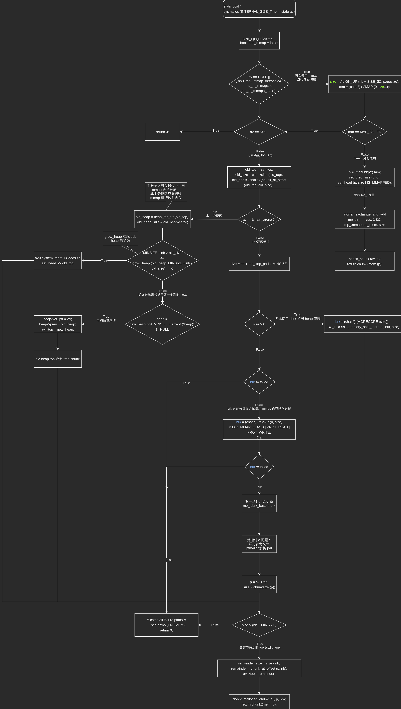

## free 内存释放

本节将开始介绍 free 内存释放时的具体流程。

### __lib_free

1. 初始化过程与 `__lib_malloc` 类似可以指定 free_hook 替换掉 glibc 中的 free 实现。默认 `__free_hook` 为 NULL。

    ```cpp
    void
    __libc_free (void *mem)
    {
    mstate ar_ptr;
    mchunkptr p;                          /* chunk corresponding to mem */

    void (*hook) (void *, const void *)
        = atomic_forced_read (__free_hook);
    if (__builtin_expect (hook != NULL, 0))
        {
        (*hook)(mem, RETURN_ADDRESS (0));
        return;
        }

    if (mem == 0)                              /* free(0) has no effect */
        return;
    ```

2. 判断是否是通过 mmap 申请的内存，如果是则尝试使用 munmap_chunk 进行释放：

    ```cpp
    #ifndef DEFAULT_MMAP_THRESHOLD_MIN
    #define DEFAULT_MMAP_THRESHOLD_MIN (128 * 1024)  //mmap_threshold 默认值
    #endif

    #define DEFAULT_MMAP_THRESHOLD_MAX (4 * 1024 * 1024 * sizeof(long))

    /* These variables are used for undumping support.  Chunked are marked
    as using mmap, but we leave them alone if they fall into this
    range.  NB: The chunk size for these chunks only includes the
    initial size field (of SIZE_SZ bytes), there is no trailing size
    field (unlike with regular mmapped chunks).  */
    static mchunkptr dumped_main_arena_start; /* Inclusive.  */ // = 0
    static mchunkptr dumped_main_arena_end;   /* Exclusive.  */ // = 0

    /* True if the pointer falls into the dumped arena.  Use this after
    chunk_is_mmapped indicates a chunk is mmapped.  
    如果指针落入转储区域，则为真。之后使用这个 chunk_is_mmapped 表示块被 mmapped 管理*/
    #define DUMPED_MAIN_ARENA_CHUNK(p) \
    ((p) >= dumped_main_arena_start && (p) < dumped_main_arena_end)

    ..................................

      void
    __libc_free (void *mem)
    {

        .............
    #ifdef USE_MTAG
        /* Quickly check that the freed pointer matches the tag for the memory.
        This gives a useful double-free detection.  
        快速检查释放的指针是否与内存标签匹配。
            这提供了有用的双重释放检测。*/
        *(volatile char *)mem;
    #endif

        int err = errno;

        p = mem2chunk (mem);

        /* Mark the chunk as belonging to the library again.  */
        (void)TAG_REGION (chunk2rawmem (p), CHUNK_AVAILABLE_SIZE (p) - CHUNK_HDR_SZ);

        if (chunk_is_mmapped (p))                       /* release mmapped memory. */
        {
            /* See if the dynamic brk/mmap threshold needs adjusting.
        Dumped fake mmapped chunks do not affect the threshold.  */
            if (!mp_.no_dyn_threshold
                && chunksize_nomask (p) > mp_.mmap_threshold //起始值为 128KB，它是系统选择 mmap() 还是 brk() 进行分配的一个门槛值，它是动态变化的。
                                                             //大于 mp._mmap_threshold 时，系统会选择 mmap() 进行分配，否则选择 brk() 进行分配。
                && chunksize_nomask (p) <= DEFAULT_MMAP_THRESHOLD_MAX
            && !DUMPED_MAIN_ARENA_CHUNK (p))
            {
                mp_.mmap_threshold = chunksize (p);
                mp_.trim_threshold = 2 * mp_.mmap_threshold; //trim_threshold 是归还系统的阈值
                LIBC_PROBE (memory_mallopt_free_dyn_thresholds, 2,
                            mp_.mmap_threshold, mp_.trim_threshold);
            }
            munmap_chunk (p);
        }
    ```

3. 非 mmap 则使用 `_int_free` 进行释放：

    ```cpp
    else
        {
        MAYBE_INIT_TCACHE ();
    
        ar_ptr = arena_for_chunk (p);
        _int_free (ar_ptr, p, 0);
        }
    
    __set_errno (err);
    }
    ```

### _int_free

1. 安全检查：

    ```cpp
    static void
    _int_free (mstate av, mchunkptr p, int have_lock)
    {
    INTERNAL_SIZE_T size;        /* its size */
    mfastbinptr *fb;             /* associated fastbin */
    mchunkptr nextchunk;         /* next contiguous chunk */
    INTERNAL_SIZE_T nextsize;    /* its size */
    int nextinuse;               /* true if nextchunk is used */
    INTERNAL_SIZE_T prevsize;    /* size of previous contiguous chunk */
    mchunkptr bck;               /* misc temp for linking */
    mchunkptr fwd;               /* misc temp for linking */

    size = chunksize (p);

    /* Little security check which won't hurt performance: the
        allocator never wrapps around at the end of the address space.
        Therefore we can exclude some size values which might appear
        here by accident or by "design" from some intruder.  
        不会影响性能的小安全检查：分配器永远不会在地址空间的末尾回绕。
        因此我们可以排除一些可能偶然出现的尺寸值或者是某些入侵者的“设计”*/

    //  如果当前 chunk 的大小异常大，或者地址不是按 2SIZE_SZ 对齐，则报错退出
    if (__builtin_expect ((uintptr_t) p > (uintptr_t) -size, 0)
        || __builtin_expect (misaligned_chunk (p), 0))
        malloc_printerr ("free(): invalid pointer");
    /* We know that each chunk is at least MINSIZE bytes in size or a
        multiple of MALLOC_ALIGNMENT. 
        我们知道每个块的大小至少为 MINSIZE 字节或 MALLOC_ALIGNMENT 的倍数 */
    if (__glibc_unlikely (size < MINSIZE || !aligned_OK (size)))
        malloc_printerr ("free(): invalid size");
    ```

2. 如果块大小在 tcache 链表中：

    ```cpp
    check_inuse_chunk(av, p);

    #if USE_TCACHE
    {
        size_t tc_idx = csize2tidx (size); // 转化为 tcache index
        if (tcache != NULL && tc_idx < mp_.tcache_bins)
        {
        /* Check to see if it's already in the tcache.  */
        tcache_entry *e = (tcache_entry *) chunk2mem (p);

        /* This test succeeds on double free.  However, we don't 100%
        trust it (it also matches random payload data at a 1 in
        2^<size_t> chance), so verify it's not an unlikely
        coincidence before aborting.  */
        if (__glibc_unlikely (e->key == tcache)) //key 是在 put 到 tcache 中置位，检测 double free
        {
            tcache_entry *tmp;
            size_t cnt = 0;
            LIBC_PROBE (memory_tcache_double_free, 2, e, tc_idx);
            for (tmp = tcache->entries[tc_idx];
            tmp;
            tmp = REVEAL_PTR (tmp->next), ++cnt)
            {
            if (cnt >= mp_.tcache_count)
            malloc_printerr ("free(): too many chunks detected in tcache");
            if (__glibc_unlikely (!aligned_OK (tmp)))
            malloc_printerr ("free(): unaligned chunk detected in tcache 2");
            if (tmp == e)
            malloc_printerr ("free(): double free detected in tcache 2");
            /* If we get here, it was a coincidence.  We've wasted a
            few cycles, but don't abort.  */
            }
        }

        if (tcache->counts[tc_idx] < mp_.tcache_count) // 如果对应链表没有满则将其放入
        {
            tcache_put (p, tc_idx);
            return;
        }
        }
    }
    #endif
    ```

3. 如果块大小在 fastbin 链表中或者 tcache 已经放满了：

    ```cpp

    /*
        If eligible, place chunk on a fastbin so it can be found
        and used quickly in malloc.
    */

    if ((unsigned long)(size) <= (unsigned long)(get_max_fast ())

    #if TRIM_FASTBINS
        /*
        If TRIM_FASTBINS set, don't place chunks
        bordering top into fastbins
        */
        // 如果 TRIM_FASTBINS 设置了，就不能把与 top chunk 相邻的 chunk 放入 fastbin 里
        // 默认 #define TRIM_FASTBINS 0，因此默认情况下下面的语句不会执行
        // 如果当前 chunk 是 fast chunk，并且下一个 chunk 是 top chunk，则不能插入，会尝试合并进 top
        && (chunk_at_offset(p, size) != av->top)
    #endif
        ) {
            // 下一个 chunk 的大小不能小于两倍的 SIZE_SZ, 并且
            // 下一个 chunk 的大小不能大于 system_mem， 一般为 132k
            // 如果出现这样的情况，就报错。
        if (__builtin_expect (chunksize_nomask (chunk_at_offset (p, size))
                <= CHUNK_HDR_SZ, 0)
        || __builtin_expect (chunksize (chunk_at_offset (p, size))
                    >= av->system_mem, 0))
        {
        bool fail = true;
        /* We might not have a lock at this point and concurrent modifications
        of system_mem might result in a false positive.  Redo the test after
        getting the lock.  */
        if (!have_lock)
        {
            __libc_lock_lock (av->mutex);
            fail = (chunksize_nomask (chunk_at_offset (p, size)) <= CHUNK_HDR_SZ
                || chunksize (chunk_at_offset (p, size)) >= av->system_mem);
            __libc_lock_unlock (av->mutex);
        }

        if (fail)
        malloc_printerr ("free(): invalid next size (fast)");
        }
        // 将 chunk 的 mem 部分全部设置为 perturb_byte，默认为 0 ，注意减去的 CHUNK_HDR_SZ = 2 * siez_t 
        free_perturb (chunk2mem(p), size - CHUNK_HDR_SZ);

        atomic_store_relaxed (&av->have_fastchunks, true); // 置位
        unsigned int idx = fastbin_index(size);
        // 获取对应 fastbin 的头指针
        fb = &fastbin (av, idx);

        /* Atomically link P to its fastbin: P->FD = *FB; *FB = P;  */
        // 使用原子操作将 P 插入到链表中
        mchunkptr old = *fb, old2;

        if (SINGLE_THREAD_P)
        {
            /* Check that the top of the bin is not the record we are going to
            add (i.e., double free).  
            检查不要添加 bin 头，避免 double free
            */
            if (__builtin_expect (old == p, 0))
            malloc_printerr ("double free or corruption (fasttop)");
            // 将 p 插入 fastbin
            p->fd = PROTECT_PTR (&p->fd, old);
            *fb = p;
        }
        else
            do
            {
                /* Check that the top of the bin is not the record we are going to
                    add (i.e., double free).  */
                // 判断 fastbin 的头 chunk 是否就是我们将要 free 的 chunk，以防止正常用户的 double free(hacker 另说）
                if (__builtin_expect (old == p, 0))
                    malloc_printerr ("double free or corruption (fasttop)");
                old2 = old;
                p->fd = PROTECT_PTR (&p->fd, old);
            }
            while ((old = catomic_compare_and_exchange_val_rel (fb, p, old2))
                != old2);

        /* Check that size of fastbin chunk at the top is the same as
        size of the chunk that we are adding.  We can dereference OLD
        only if we have the lock, otherwise it might have already been
        allocated again.  */
         // 如果实际放入的 fastbin index 与预期的不同，则 error
        if (have_lock && old != NULL
        && __builtin_expect (fastbin_index (chunksize (old)) != idx, 0))
        malloc_printerr ("invalid fastbin entry (free)");
    }
    ```

4. 当前 chunk 不在 fastbin 中，也不是通过 mmap 分配得来的，则尝试进行相关内存块合并并放入对应的 bins 上：

    ```cpp
    /*
        Consolidate other non-mmapped chunks as they arrive.
    */
    
    else if (!chunk_is_mmapped(p)) {
    
        /* If we're single-threaded, don't lock the arena.  */
    if (SINGLE_THREAD_P)
      have_lock = true;
    
    if (!have_lock)
      __libc_lock_lock (av->mutex);
    
    nextchunk = chunk_at_offset(p, size);
    
    /* Lightweight tests: check whether the block is already the
       top block.  */
    // 判断当前 chunk 是否 top chunk
    if (__glibc_unlikely (p == av->top))
      malloc_printerr ("double free or corruption (top)");
    /* Or whether the next chunk is beyond the boundaries of the arena.  */
    // 或者下一个块是否超出了 arena 的边界。
    if (__builtin_expect (contiguous (av)
              && (char *) nextchunk
              >= ((char *) av->top + chunksize(av->top)), 0))
    malloc_printerr ("double free or corruption (out)");
    /* Or whether the block is actually not marked used.  */
    //或者块是否实际上没有被标记为使用。
    if (__glibc_unlikely (!prev_inuse(nextchunk)))
      malloc_printerr ("double free or corruption (!prev)");
    
    // 判断下一块 chunksize 是否正常
    nextsize = chunksize(nextchunk);
    if (__builtin_expect (chunksize_nomask (nextchunk) <= CHUNK_HDR_SZ, 0)
    || __builtin_expect (nextsize >= av->system_mem, 0))
      malloc_printerr ("free(): invalid next size (normal)");
    
    free_perturb (chunk2mem(p), size - CHUNK_HDR_SZ);
    
    /* consolidate backward  向后合并*/
    if (!prev_inuse(p)) {
      prevsize = prev_size (p);
      size += prevsize;
      p = chunk_at_offset(p, -((long) prevsize));
      if (__glibc_unlikely (chunksize(p) != prevsize))
        malloc_printerr ("corrupted size vs. prev_size while consolidating");
      unlink_chunk (av, p);
    }
    
    if (nextchunk != av->top) {
      /* get and clear inuse bit */
      nextinuse = inuse_bit_at_offset(nextchunk, nextsize);
    
      /* consolidate forward 向前合并*/
      if (!nextinuse) {
    unlink_chunk (av, nextchunk);
    size += nextsize;
      } else
    clear_inuse_bit_at_offset(nextchunk, 0); //清空使用标志位
    
      /*
    Place the chunk in unsorted chunk list. Chunks are
    not placed into regular bins until after they have
    been given one chance to be used in malloc.
      */
    //对 fastbin 中的 chunk 进行合并并添加到 unsortedbin 中
      bck = unsorted_chunks(av);
      fwd = bck->fd;
      if (__glibc_unlikely (fwd->bk != bck))
    malloc_printerr ("free(): corrupted unsorted chunks");
      p->fd = fwd;
      p->bk = bck;
      if (!in_smallbin_range(size))
    {
      p->fd_nextsize = NULL;
      p->bk_nextsize = NULL;
    }
      bck->fd = p;
      fwd->bk = p;
    
      set_head(p, size | PREV_INUSE);
      set_foot(p, size);
    
      check_free_chunk(av, p);
    }
    
    /*
      If the chunk borders the current high end of memory,
      consolidate into top
    */
    
    else {
      size += nextsize;
      set_head(p, size | PREV_INUSE);
      av->top = p;
      check_chunk(av, p);
    }
    
    /*
      If freeing a large space, consolidate possibly-surrounding
      chunks. Then, if the total unused topmost memory exceeds trim
      threshold, ask malloc_trim to reduce top.
    
      Unless max_fast is 0, we don't know if there are fastbins
      bordering top, so we cannot tell for sure whether threshold
      has been reached unless fastbins are consolidated.  But we
      don't want to consolidate on each free.  As a compromise,
      consolidation is performed if FASTBIN_CONSOLIDATION_THRESHOLD
      is reached.
    
      如果腾出大空间，巩固可能的周围大块。
      然后，如果总未使用的最高内存超过 trim 阈值，要求 malloc_trim 减少顶部。
    
      除非 max_fast 为 0，否则我们不知道是否有 fastbins 与顶部接壤，因此我们无法确定阈值是否除非合并 fastbins，否则已经达到。
      但我们不想在每个 free bin 上整合。作为妥协，如果 FASTBIN_CONSOLIDATION_THRESHOLD，则执行合并到达了。 
    */
    //如果是主分配区，并且主分配区的 top chunk 大于一定的值，就通过 systrim 缩小 top chunk。如果是非主分配区，就获得 top chunk 对应的非主分配区的 heap_info 指针，调用 heap_trim 尝试缩小该 heap。后面来看 systrim 和 heap_trim 这两个函数。
    if ((unsigned long)(size) >= FASTBIN_CONSOLIDATION_THRESHOLD) {
      if (atomic_load_relaxed (&av->have_fastchunks))
    malloc_consolidate(av);
    
      if (av == &main_arena) {
    #ifndef MORECORE_CANNOT_TRIM
        if ((unsigned long)(chunksize(av->top)) >=
            (unsigned long)(mp_.trim_threshold))
        systrim(mp_.top_pad, av);
    #endif
        } else {
        /* Always try heap_trim(), even if the top chunk is not
        large, because the corresponding heap might go away.  */
        heap_info *heap = heap_for_ptr(top(av));
    
        assert(heap->ar_ptr == av);
        heap_trim(heap, mp_.top_pad);
        }
        }
    
        if (!have_lock)
        __libc_lock_unlock (av->mutex);
    }
    /*
        If the chunk was allocated via mmap, release via munmap().
    */
    else {
        munmap_chunk (p);
    }
    }
    ```

- 下图为 _int_free 流程图:

  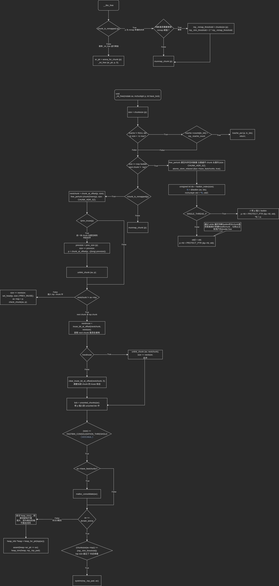

## 参考文章

- [参考文章-Linux 可执行文件如何装载进虚拟内存](https://zhuanlan.zhihu.com/p/148426554)
- [参考文章-ELF 文件解析（一）：Segment 和 Section](https://www.cnblogs.com/jiqingwu/p/elf_format_research_01.html)
- [参考文章-Executable and Linkable Format (ELF)](http://www.skyfree.org/linux/references/ELF_Format.pdf)
- [参考文章-ELF 文件的加载过程](https://blog.csdn.net/gatieme/article/details/51628257#t0)
- [参考文章-Linux 中 main 是如何执行的](https://www.cnblogs.com/harlanc/p/7774882.html)
- [参考文章-进程的内存空间布局](https://blog.csdn.net/cztqwan/article/details/80248479)
- [参考文章-anatomy-of-program-in-memory](https://girdhargopalbansal.blogspot.com/2013/06/anatomy-of-program-in-memory.html)
- [参考文章-Glibc：浅谈 malloc() 函数具体实现](https://blog.csdn.net/plus_re/article/details/80211488)
- [参考文章-认真分析 mmap](https://www.cnblogs.com/huxiao-tee/p/4660352.html)
- [参考文章-系统调用与内存管理](https://blog.csdn.net/apollon_krj/article/details/54565768)
- [参考文章-strong_alias && weak_alias && __attribute__](https://www.cnblogs.com/justinyo/archive/2013/03/12/2956438.html)
- [参考文章-why uClibc/glibc use the alias for function name?](https://comp.os.linux.development.system.narkive.com/L4JmkjDb/why-uclibc-glibc-use-the-alias-for-function-name)
- [参考文章-C++性能榨汁机之分支预测器](https://zhuanlan.zhihu.com/p/36543235)
- [参考文章-prevent allocs larger than PTRDIFF_MAX on Android](https://github.com/jemalloc/jemalloc/pull/295)
- [参考文章-What is the maximum size of an array in C?](https://stackoverflow.com/questions/9386979/what-is-the-maximum-size-of-an-array-in-c)
- [参考文章--Tunable Framework](https://sourceware.org/glibc/wiki/Tunables)
- [参考文章--ptmalloc 源码分析](https://blog.csdn.net/initphp/article/details/109489720#t1)
- [参考文章-Wolfram Gloger's malloc homepage](http://www.malloc.de/en/)
- [参考文章-ptmalloc 源码分析 - 分配器状态机 malloc_state（02）](https://blog.csdn.net/initphp/article/details/109489720)
- [参考文章-Understanding the glibc malloc binning implementation](https://stackoverflow.com/questions/63600405/understanding-the-glibc-malloc-binning-implementation)
- [参考文章--glibc 内存管理源码分析](https://github.com/vislee/leevis.com/issues/132)
- [参考文章-理解 glibc malloc：malloc() 与 free() 原理图解](https://blog.csdn.net/maokelong95/article/details/52006379)
- [参考文章-Understanding glibc malloc](https://sploitfun.wordpress.com/2015/02/10/understanding-glibc-malloc/comment-page-1/?blogsub=confirming#subscribe-blog%E3%80%82)
- [参考文章--C 标准库函数 宏定义浅析](https://www.zybuluo.com/yiltoncent/note/87733)
- [参考文章--堆溢出学习笔记 (linux)](https://my.oschina.net/u/4396372/blog/3913130)
- [参考文章--glibc2.26--tcache](https://www.cnblogs.com/crybaby/p/13215209.html)
- [参考文章--堆漏洞挖掘中的 bins 分类](https://blog.csdn.net/qq_41453285/article/details/96865321)
- [参考文章--Linux 堆内存管理深入分析](https://www.cnblogs.com/alisecurity/p/5520847.html)
- [参考文章--glibc-malloc 源码分析](https://a1ex.online/2020/09/28/glibc-malloc%E6%BA%90%E7%A0%81%E5%88%86%E6%9E%90/)
- [参考文章--浅析 largebin attack](https://xz.aliyun.com/t/5177)
- [参考文章--largebin 学习从源码到做题](https://xz.aliyun.com/t/6596)
- [参考文章--堆漏洞挖掘中的 malloc_consolidate 与 FASTBIN_CONSOLIDATION_THRESHOLD](https://dongshao.blog.csdn.net/article/details/97627411)
- [参考文章--浅析 largebin attack](https://xz.aliyun.com/t/5177)
- [参考文章--largebin 学习从源码到做题](https://xz.aliyun.com/t/6596)
- [参考文章--glibc-malloc 源码分析](https://a1ex.online/2020/09/28/glibc-malloc%E6%BA%90%E7%A0%81%E5%88%86%E6%9E%90/)
- [参考文章--申请内存块](https://ctf-wiki.org/pwn/linux/glibc-heap/implementation/malloc/)
- [参考文章--Glibc 内存管理--ptmalloc2 源代码分析（二十四）](https://blog.csdn.net/iteye_7858/article/details/82070321?utm_medium=distribute.pc_relevant.none-task-blog-2~default~baidujs_title~default-0.base&spm=1001.2101.3001.4242)
- [参考文章--glibc+malloc 源码简析（二）](https://openeuler.org/zh/blog/wangshuo/glibc+malloc%E6%BA%90%E7%A0%81%E7%AE%80%E6%9E%90(%E4%BA%8C).html)
- [参考文章--How does LIBC_PROBE macro actually work in Glibc?](https://stackoverflow.com/questions/52219096/how-does-libc-probe-macro-actually-work-in-glibc)
- [参考文章--heap-exploitation](https://heap-exploitation.dhavalkapil.com/diving_into_glibc_heap/core_functions)
- [参考文章--heap-9-_int_free 源码及其部分分析](https://kiprey.github.io/2020/05/heap-9-__int_free_source/)
- [参考文章--linux 堆溢出学习之 malloc 堆管理机制原理详解](https://blog.csdn.net/qq_29343201/article/details/59614863)
