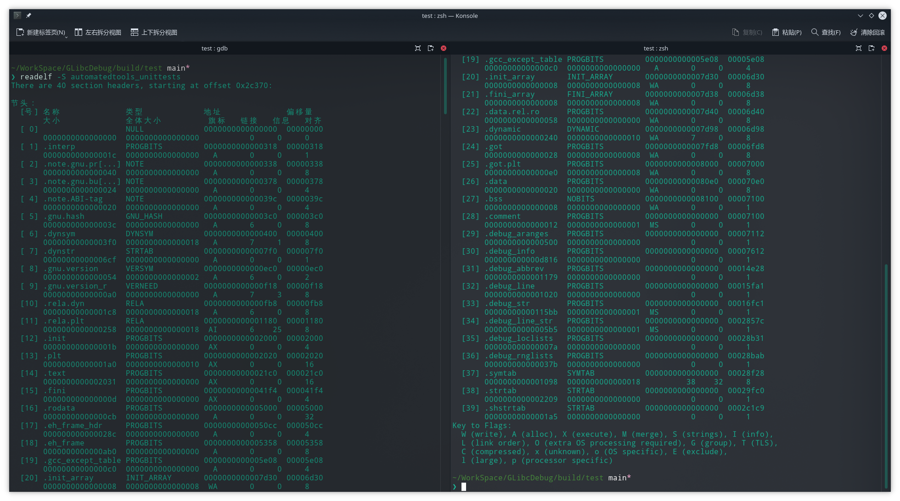

# Ptmalloc 内存管理

- [Ptmalloc 内存管理](#ptmalloc-内存管理)
  - [前言](#前言)
  - [如何调试 glibc](#如何调试-glibc)
    - [Arch / Manjaro](#arch--manjaro)
    - [Ubuntu](#ubuntu)
    - [编译 debug 版本的 glibc](#编译-debug-版本的-glibc)
  - [进程内存布局](#进程内存布局)
    - [ELF 文件布局](#elf-文件布局)
    - [ELF 文件装载](#elf-文件装载)
    - [内存布局](#内存布局)
  - [ptmalloc 内存管理数据结构](#ptmalloc-内存管理数据结构)
    - [malloc 函数入口](#malloc-函数入口)
      - [malloc_hook_ini](#malloc_hook_ini)
      - [ptmalloc_init](#ptmalloc_init)
      - [malloc_init_state](#malloc_init_state)
    - [Q/A](#qa)
      - [分配区](#分配区)
      - [bin 成员](#bin-成员)
      - [NONCONTIGUOUS_BIT](#noncontiguous_bit)
      - [global_max_fast](#global_max_fast)
      - [top 及其他特殊的 chunk](#top-及其他特殊的-chunk)

## 前言

本文主要介绍 glibc 默认的内存分配器 Ptmalloc 的相关实现细节，希望可以帮助你建立印象中的内存模型，在问题调试、内存优化中不再过于束手无策。

> 文中使用的 glibc 版本为 [2.33（Released 2021-02-01）](https://www.gnu.org/software/libc/)

## 如何调试 glibc

大多数情况下，当我们在使用系统默认的编译工具 gcc、clang 或者一些交叉编译工具时，所链接的 glibc 库都是不包含调试信息的，当出现问题时往往无法看出具体出现问题的代码甚至连行号都没有，例如 [Arch Linux Debugging/Getting traces wiki](https://wiki.archlinux.org/title/Debugging/Getting_traces) 举例：

```text
[...]
Backtrace was generated from '/usr/bin/epiphany'

(no debugging symbols found)
Using host libthread_db library "/lib/libthread_db.so.1".
(no debugging symbols found)
[Thread debugging using libthread_db enabled]
[New Thread -1241265952 (LWP 12630)]
(no debugging symbols found)
0xb7f25410 in __kernel_vsyscall ()
#0  0xb7f25410 in __kernel_vsyscall ()
#1  0xb741b45b in ?? () from /lib/libpthread.so.0
[...]
```

本节介绍我主要使用的系统 Manjaro(类 Arch) 与 Ubuntu 如何为 glibc 添加调试信息，以及如何自己编译一个带有 debug 信息的 glibc 库（推荐）。

### Arch / Manjaro

Manjaro 同样是使用 Arch linux 的 AUR 进行包管理，因此本节内容主要以 [Arch wiki](https://wiki.archlinux.org/title/Debugging/Getting_traces) 为主。

使用如下[脚本](https://gist.github.com/nbulischeck/bda4397a59b77822703f98f6aeb2cb20)可以进行安装：

```shell
#!/bin/bash

# Install Dependencies
sudo pacman -S git svn gd lib32-gcc-libs patch make bison fakeroot

# Checkout glibc source
svn checkout --depth=empty svn://svn.archlinux.org/packages
cd packages
svn update glibc
cd glibc/repos/core-x86_64

# Add current locale to locale.gen.txt
grep -v "#" /etc/locale.gen >> locale.gen.txt

# Enable debug build in PKGBUILD
sed -i 's#!strip#debug#' PKGBUILD

# Build glibc and glibc-debug packages
makepkg --skipchecksums

# Install glibc-debug
sudo pacman -U *.pkg.tar.xz

sed '/^OPTIONS/ s/!debug/debug/g; /^OPTIONS/ s/strip/!strip/g' /etc/makepkg.conf
```

使用gdb 查看线程堆栈，可以看到函数名称显示正常：

```text
pwndbg> bt
#0  allocThreadMem () at /root/glibc_Learnging/test/main.cpp:12

................

#19 0x00007f0039556c27 in __pthread_once_slow () from /usr/lib/libpthread.so.0

................

#37 0x00007f003954f259 in start_thread () from /usr/lib/libpthread.so.0
#38 0x00007f00391035e3 in clone () from /usr/lib/libc.so.6

```

### Ubuntu

Ubuntu 下可以通过 apt 下载当前系统对应 glibc 版本相关的[调试编译信息](https://cloud.tencent.com/developer/article/1116156)：

```shell
> sudo apt-get install libc-dbg
```

接下来同样使用 apt 下载相应版本的源码：

```shell
> sudo apt-get install source libc-dev
```

最后可以使用 gdb 命令进行源码路径指定：

```shell
gdb> set substitute-path  /build/glibc-eX1tMB/glibc-2.31 /home/layton/Tools/glibc-2.31

#/build/glibc-eX1tMB/glibc-2.31 路径便是安装 libc-dbg 中指定的源码编译路径
```

### 编译 debug 版本的 glibc

通过系统工具安装带有 debug 信息的 glibc 往往有一个缺点，就是由于编译时一般都是开启了优化选项，一些局部变量甚至代码流程发生了变化，因此最推荐的就是自己编译一份带有 debug 信息的 glibc 库：

1. 确认 glibc 版本，下载对应的源代码。
   - 推荐下载的 glibc 源码版本与当前系统使用的一致，避免链接时存在不兼容问题，可以查看 ldd 工具版本来判断使用的 glibc 版本：

      ```shell
      ❯ ldd --version
      ldd (GNU libc) 2.33
      Copyright (C) 2021 自由软件基金会。
      这是一个自由软件；请见源代码的授权条款。本软件不含任何没有担保；甚至不保证适销性
      或者适合某些特殊目的。
      由 Roland McGrath 和 Ulrich Drepper 编写。
      ```

   - 在 [GNU 官网](https://www.gnu.org/software/libc/)下载对应的 glibc 源码，这里我下载的就是 2.33 版本。

2. 解压并创建编译目录，如下与源码目录同级即可：

    ```shell
    ❯ ls glibc-* -d                 
    glibc-2.33  glibc-debug
    ```

3. 进入编译目录进行编译安装，注意指定 --enable-debug=yes 使能调试：
   > -O0 编译会失败，由于 glibc 中使用了内敛相关语法，gcc 编译器 -O1 才会开启内联优化。
   >
   > 编译时出现缺少 xdr_* 报错失败注意使能 --enable-obsolete-rpc --enable-obsolete-nsl

   ```shell
   ❯ cd glibc-debug

   ❯ ../glibc-2.33/configure --prefix=`pwd`/usr --enable-debug=yes CFLAGS="-O1 -g" CPPFLAGS="-O1 -g"

   ❯ mkdir usr && make all && make install 
   ```

4. 工程中使用 CMakeLists.txt 指定 link_dir：

    ```cmake
    link_directories(/home/layton/Tools/glibc-debug/usr/lib)
    ```

5. 编译完成后使用 ldd 命令查看动态库;

    ```shell
    ~/WorkSpace/GLibcDebug/build/test main*
    ❯ ldd automatedtools_unittests              
            linux-vdso.so.1 (0x00007ffdc1d4d000)
            libpthread.so.0 => /home/layton/Tools/glibc-debug/usr/lib/libpthread.so.0 (0x00007fa69e86f000)
            libspdlog.so.1 => /usr/lib/libspdlog.so.1 (0x00007fa69e7dd000)
            libfmt.so.7 => /usr/lib/libfmt.so.7 (0x00007fa69e7a6000)
            libc.so.6 => /home/layton/Tools/glibc-debug/usr/lib/libc.so.6 (0x00007fa69e5f5000)
            /lib64/ld-linux-x86-64.so.2 => /usr/lib64/ld-linux-x86-64.so.2 (0x00007fa69e896000)
            libstdc++.so.6 => /usr/lib/libstdc++.so.6 (0x00007fa69e3df000)
            libgcc_s.so.1 => /usr/lib/libgcc_s.so.1 (0x00007fa69e3c2000)
            libm.so.6 => /home/layton/Tools/glibc-debug/usr/lib/libm.so.6 (0x00007fa69e28a000)
    ```

6. 最后使用 gdb 启动程序，可以正常使用 [pwndbg 插件](https://github.com/pwndbg/pwndbg)打印内存信息以及 thread_arena 线程分配区：

    

## 进程内存布局

本节将介绍下进程内存布局，这可算是一个老生常谈的东西，但是想要了解内存管理还是必不可少，因此就简单介绍下，想要详细学习下，网上也有很多优秀相关的文章，就请自行搜索了解。

### ELF 文件布局

Linux ELF 格式可执行程序的结构是以段（segment）为单位组合而成的。Linux 系统在装载 elf 程序文件时，通过 loader 将各个 segment 依次载入到某一地址开始的内存空间中：

> section 代指 .text、.bss、.data 等，这些信息可用于链接时地址重定位等，因此 section 又被称为链接视图，可以使用 readelf -S object 来查看目标文件的 section。
>
> segment 则是执行视图，程序执行是以 segment 为单位载入，每个 segment 对应 ELF 文件中 program header table 中的一个条目，用来建立可执行文件的进程映像。通常说的，代码段、数据段是 segment，目标代码中的 section 会被链接器组织到可执行文件的各个 segment 中。可以使用 readelf -l a.out 查看 ELF 格式执行文件的 segment 信息。





如上图 segment 所示，TYPE 为 LOAD 的段是运行时所需载入的：

```shell
LOAD           0x0000000000002000 0x0000000000002000 0x0000000000002000
                 0x0000000000002201 0x0000000000002201  R E    0x1000
# 其标号为 0x3，对应：

03     .init .plt .text .fini

# 可以发现其包含我们的代码段，R（只读）E（可执行）W（可写）
```

### ELF 文件装载

Linux 支持不同的可执行程序，其内核使用 `struct linux_binfmt` 来描述各种可执行程序，以 ELF 格式举例：

1. 首先需要填充一个 [linux_binfmt](https://www.linux.it/~rubini/docs/binfmt/binfmt.html) 格式的结构：

    ```c
    // /fs/binfmt.c
    static struct linux_binfmt elf_format = {
        .module      = THIS_MODULE,
        .load_binary = load_elf_binary, //通过读存放在可执行文件中的信息为当前进程建立一个新的执行环境
        .load_shlib      = load_elf_library,  //用于动态的把一个共享库捆绑到一个已经在运行的进程，这是由 uselib() 系统调用激活的
        .core_dump       = elf_core_dump,
        .min_coredump    = ELF_EXEC_PAGESIZE,
        .hasvdso     = 1
    };
    ```

2. 所有的 `linux_binfmt` 对象都处于一个链表中，第一个元素的地址存放在 formats 变量中，可以通过调用 register_binfmt() 和 unregister_binfmt() 函数在链表中插入和删除元素。在系统启动期间，为每个编译进内核的可执行格式都执行 registre_fmt() 函数。执行一个可执行程序的时候，内核会 `list_for_each_entry` 遍历所有注册的 `linux_binfmt` 对象，对其调用 `load_binrary` 方法来尝试加载，直到加载成功为止。

3. 内核通过 `execv()` 或 `execve()` 系统调用到 `do_execve()` 函数，其读取 ELF 文件头部字节（Linux 128 字节头），再通过 `search_binary_handler()` 搜索对应的格式加载方法，最终调用处理函数来加载目标 ELF。

    ```shell
    ❯ readelf -h automatedtools_unittests
    ELF 头：
      Magic：  7f 45 4c 46 02 01 01 03 00 00 00 00 00 00 00 00 
      类别:                              ELF64
      数据:                              2 补码，小端序 (little endian)
      Version:                           1 (current)
      OS/ABI:                            UNIX - GNU
      ABI 版本:                          0
      类型:                              DYN (共享目标文件)
      系统架构:                          Advanced Micro Devices X86-64
      版本:                              0x1
      入口点地址：              0x3340
      程序头起点：              64 (bytes into file)
      Start of section headers:          624072 (bytes into file)
      标志：             0x0
      Size of this header:               64 (bytes)
      Size of program headers:           56 (bytes)
      Number of program headers:         13
      Size of section headers:           64 (bytes)
      Number of section headers:         40
      Section header string table index: 39
    ```

4. 总结下，以 ELF 格式的 load_elf_binary 函数执行过程举例：
   - 填充并且检查目标程序 ELF 头部；
   - load_elf_phdrs 加载目标程序的程序头表；
   - 如果需要动态链接，则寻找和处理解释器段；
   - 检查并读取解释器的程序表头；
   - 装入目标程序的段 segment；
   - 填写程序的入口地址；
   - create_elf_tables 填写目标文件的参数环境变量等必要信息；
   - start_kernel 宏准备进入新的程序入口。

### 内存布局

大致了解了 Linux 如何将可执行程序文件装载到内存变为进程后，接下来查看下 segment 实际加载到内存中的地址情况 (64 位系统)：

  
  

可以看出 ELF 可执行文件中的 LOAD segment 分别加载到了以 0x555555554000 为开始的虚拟内存地址上。进程内存中不仅仅有从 ELF 中加载的 segment 还有 Heap、Mmap、Stack 等，接下来简单介绍下：

1. 内核态内存空间，大小固定（编译时可以调整），32 位系统一般为 1GB，64 位系统为 128TB。
2. 用户态的栈，大小不固定，可以用 ulimit -s 进行调整，默认一般为 8M，从高地址向低地址增长。
3. mmap 区域（内存映射段），既可以从高地址到低地址延伸（所谓 flexible layout），也可以从低到高延伸（所谓 legacy layout)，看进程具体情况。一般 32 位系统默认为 flexible，64 位系统为 legacy。
4. brk 区域（堆），紧邻数据段（甚至贴着），从低位向高位伸展，但它的大小主要取决于 mmap 如何增长，一般来说，即使是 32 位的进程以传统方式延伸，也有差不多 1 GB 的空间。
5. 数据段，主要是进程里初始化和未初始化（BSS）的全局数据总和，当然还有编译器生成一些辅助数据结构等等），大小取决于具体进程，其位置紧贴着代码段。
6. 代码段，主要是进程的指令，包括用户代码和编译器生成的辅助代码，其大小取决于具体程序，但起始位置根据 32 位还是 64 位一般固定（-fPIC, -fPIE 等除外）。
7. 以上各段（除了代码段数据段）其起始位置根据系统是否起用 randomize_va_space 一般稍有变化，各段之间因此可能有随机大小的间隔。

- 32 位 flexible layout。

    

- 64 位 legacy layout。

    

## ptmalloc 内存管理数据结构

从本节开始将正式进入 glibc 默认的内存管理方式 ptmalloc 的分析，本节从 ptmalloc 初始化流程开始，介绍 ptmalloc 进行内存管理时所用到的数据结构。

### malloc 函数入口

当调用 malloc 申请内存时，通过 `strong_alias` 别名机制是直接调用到 `__libc_malloc` 函数上：

> strong_alias : 强别名，当出现相同符号的定义会发成重定义冲突。
>
> weak_alias : 弱别名，当出现相同名字的不会重定义，只有当没有冲突时才使用若定义别名。

```c
# define strong_alias(name, aliasname) _strong_alias(name, aliasname)
# define _strong_alias(name, aliasname) \
  extern __typeof (name) aliasname __attribute__ ((alias (#name))) \
    __attribute_copy__ (name);

strong_alias (__libc_malloc, __malloc) strong_alias (__libc_malloc, malloc)
```

我们先从 `__libc_malloc` 入口开始分析：

```c
void *weak_variable (*__malloc_hook)
    (size_t __size, const void *) = malloc_hook_ini;

# if __WORDSIZE == 64
#  define SIZE_MAX  (18446744073709551615UL)
# else
#  if __WORDSIZE32_SIZE_ULONG
#   define SIZE_MAX  (4294967295UL)
#  else
#   define SIZE_MAX  (4294967295U)
#  endif
# endif

# if __WORDSIZE == 64
#  define PTRDIFF_MIN  (-9223372036854775807L-1)
#  define PTRDIFF_MAX  (9223372036854775807L)
# else
#  if __WORDSIZE32_PTRDIFF_LONG
#   define PTRDIFF_MIN  (-2147483647L-1)
#   define PTRDIFF_MAX  (2147483647L)
#  else
#   define PTRDIFF_MIN  (-2147483647-1)
#   define PTRDIFF_MAX  (2147483647)
#  endif
# endif

..................

void *
__libc_malloc (size_t bytes)
{
  mstate ar_ptr;
  void *victim;

  _Static_assert (PTRDIFF_MAX <= SIZE_MAX / 2,
                  "PTRDIFF_MAX is not more than half of SIZE_MAX");

  void *(*hook) (size_t, const void *)
    = atomic_forced_read (__malloc_hook);
  if (__builtin_expect (hook != NULL, 0))
    return (*hook)(bytes, RETURN_ADDRESS (0));
  .........
}
```

1. 可以看出如果没有重定义 `__malloc_hook` 弱别名就使用默认的 `malloc_hook_ini`，其使用 atomic_forced_read 原子读取。
2. 判断 `__malloc_hook` 是否为空，如果不为空则进行调用。
   - `__builtin_expect` 用于编译其优化，告知编译器此判断语句更容易为 true 或 false，便于 cpu 的分支预测。
   - `__glibc_unlikely` 和 `__glibc_likely` 都是包装了下 `__builtin_expect`，功能是一样的。
3. 看下最开始的静态断言判断：
   - `SIZE_MAX` 是指 size_t 的最大范围，也就是当前系统最大的寻址范围。
   - 而 `PTRDIFF_MAX` 是指 ptrdiff_t 的最大范围，ptrdiff_t 常用于存放两个地址做减法后的结果。
   - `SIZE_MAX` 是 UL 类型，`PTRDIFF_MAX` 是 L 类型：从地址空间可以看出堆栈的地址范围不可能超过地址的一半，通常 32 位系统是 3：1 分配的堆空间（1G)，即使是 64 位系统，由于与内核对半分配也不可能超过 SIZE_MAX 的一半（128T），因此 PTRDIFF_MAX <= SIZE_MAX / 2。

#### malloc_hook_ini

```c
static void *
malloc_hook_ini (size_t sz, const void *caller)
{
  __malloc_hook = NULL;
  ptmalloc_init ();
  return __libc_malloc (sz);
}
```

1. 第一步先将 `__malloc_hook` 置为 NULL。
2. 调用 `ptmalloc_init` 后，又重新调用了 `__libc_malloc`，配合前边 `__libc_malloc` 中判断 hook 是否为空就是为这时准备的，由于 hook 在第一次 malloc 调用后就被置 NULL 了，正符合了 __libc_malloc 中判断时 `__builtin_expect` 所期望也就是 false。

#### ptmalloc_init

简略版本代码：

```c
/* There are several instances of this struct ("arenas") in this
   malloc.  If you are adapting this malloc in a way that does NOT use
   a static or mmapped malloc_state, you MUST explicitly zero-fill it
   before using. This malloc relies on the property that malloc_state
   is initialized to all zeroes (as is true of C statics).  */

static struct malloc_state main_arena =
{
  .mutex = _LIBC_LOCK_INITIALIZER,
  .next = &main_arena,
  .attached_threads = 1
};
.....

/* Already initialized? */
int __malloc_initialized = -1;

.....

static void
ptmalloc_init (void)
{
  if (__malloc_initialized >= 0)
    return;

  __malloc_initialized = 0;

  thread_arena = &main_arena;

  malloc_init_state (&main_arena);

  TUNABLE_GET (check, int32_t, TUNABLE_CALLBACK (set_mallopt_check));
  TUNABLE_GET (top_pad, size_t, TUNABLE_CALLBACK (set_top_pad));
  TUNABLE_GET (perturb, int32_t, TUNABLE_CALLBACK (set_perturb_byte));
  TUNABLE_GET (mmap_threshold, size_t, TUNABLE_CALLBACK (set_mmap_threshold));
  TUNABLE_GET (trim_threshold, size_t, TUNABLE_CALLBACK (set_trim_threshold));
  TUNABLE_GET (mmap_max, int32_t, TUNABLE_CALLBACK (set_mmaps_max));
  TUNABLE_GET (arena_max, size_t, TUNABLE_CALLBACK (set_arena_max));
  TUNABLE_GET (arena_test, size_t, TUNABLE_CALLBACK (set_arena_test));

  TUNABLE_GET (mxfast, size_t, TUNABLE_CALLBACK (set_mxfast));

  __malloc_initialized = 1;
}
```

1. 通过全局变量 `__malloc_initialized` 标识 ptmalloc 初始化状态：-1 未初始化、0 正在初始化、1 初始化完成。
2. 将主分配区 `main_arena` 分配给进行初始化的线程。*// Q1: 什么是主分配区、分配区又指什么，分配区各个成员作用都有哪些？*
3. 调用 `malloc_init_state` 初始话主分配区。
4. `TUNABLE_GET` 可调参数是 GNU C 库中的一个特性，它允许应用程序作者和发行版维护人员改变运行时库的行为以匹配他们的工作负载。具体详见参考文章 [`Tunable Framework`](https://sourceware.org/glibc/wiki/Tunables)。

#### malloc_init_state

```c
/* addressing -- note that bin_at(0) does not exist */
#define bin_at(m, i) \
  (mbinptr) (((char *) &((m)->bins[((i) - 1) * 2]))     \
             - offsetof (struct malloc_chunk, fd))

#define set_noncontiguous(M)   ((M)->flags |= NONCONTIGUOUS_BIT)

#define set_max_fast(s) \
  global_max_fast = (((size_t) (s) <= MALLOC_ALIGN_MASK - SIZE_SZ) \
                     ? MIN_CHUNK_SIZE / 2 : ((s + SIZE_SZ) & ~MALLOC_ALIGN_MASK))


/*
   Unsorted chunks

    All remainders from chunk splits, as well as all returned chunks,
    are first placed in the "unsorted" bin. They are then placed
    in regular bins after malloc gives them ONE chance to be used before
    binning. So, basically, the unsorted_chunks list acts as a queue,
    with chunks being placed on it in free (and malloc_consolidate),
    and taken off (to be either used or placed in bins) in malloc.

    The NON_MAIN_ARENA flag is never set for unsorted chunks, so it
    does not have to be taken into account in size comparisons.
 */
/* The otherwise unindexable 1-bin is used to hold unsorted chunks. */
#define unsorted_chunks(M)          (bin_at (M, 1))


#define initial_top(M)              (unsorted_chunks (M))


.........................

/*
   Initialize a malloc_state struct.

   This is called from ptmalloc_init () or from _int_new_arena ()
   when creating a new arena.
 */

static void
malloc_init_state (mstate av)
{
  int i;
  mbinptr bin;

  /* Establish circular links for normal bins */
  /* NBINS=128 */
  for (i = 1; i < NBINS; ++i)
    {
      bin = bin_at (av, i);
      bin->fd = bin->bk = bin;
    }

#if MORECORE_CONTIGUOUS
  if (av != &main_arena)
#endif
  set_noncontiguous (av);
  if (av == &main_arena)
    set_max_fast (DEFAULT_MXFAST);
  atomic_store_relaxed (&av->have_fastchunks, false);

  av->top = initial_top (av);
}
```

1. 从`下标 1` 开始对分配区 bin 成员进行初始化，将每个 bin 的 fd、bk 都置为自身。 *// Q2: bin 成员作用是什么，为什么要从下标 1 开始？*
2. 如果初始化非主分配区，调用 set_noncontiguous 设置 NONCONTIGUOUS_BIT 标识位。*// Q3: NONCONTIGUOUS_BIT 是什么，为什么要针对非主分配区？*
3. 如果是主分配区通过 set_max_fast 初始化 global_max_fast 的大小。*// Q4: global_max_fast 是什么，有什么作用？*
4. 原子操作设置分配区 have_fastchunks 成员为 false。
5. 初始化分配区 top 成员。 *// Q5：top 成员特点，以及为什么这么初始化？*

至此，ptmalloc 的第一次调用初始化就完成了，流程图如下：


再次调用的流程。


### Q/A

虽然初始化流程已经过完了，但是对细节还没有解释，接下来围绕这些问题，将介绍初始化中所接触到的数据结构。

- Q1: 什么是主分配区、分配区又指什么，分配区各个成员作用都有哪些？
- Q2: bin 成员作用是什么，为什么要从下标 1 开始？
- Q3: NONCONTIGUOUS_BIT 是什么，为什么要针对非主分配区？
- Q4: global_max_fast 是什么，有什么作用？
- Q5: top 成员特点，以及为什么这么初始化？

#### 分配区

#### bin 成员

#### NONCONTIGUOUS_BIT

#### global_max_fast

#### top 及其他特殊的 chunk


    0x7ffff7a5e000     0x7ffff7a84000 r--p    26000 0      /home/layton/Tools/glibc-debug/usr/lib/libc-2.33.so
 这种成为 backlog 当用到对应虚拟地址时会自动映射对应的文件内存

 而像有的地址后边没有文件，这就是匿名内存空间，它不会关心映射的文件加载，仅仅是提供虚拟内存给程序使用。