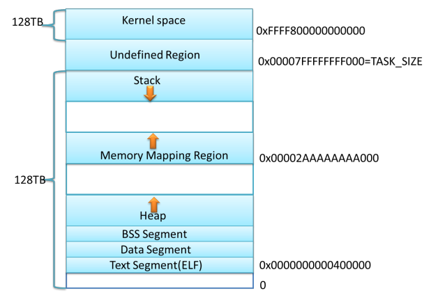
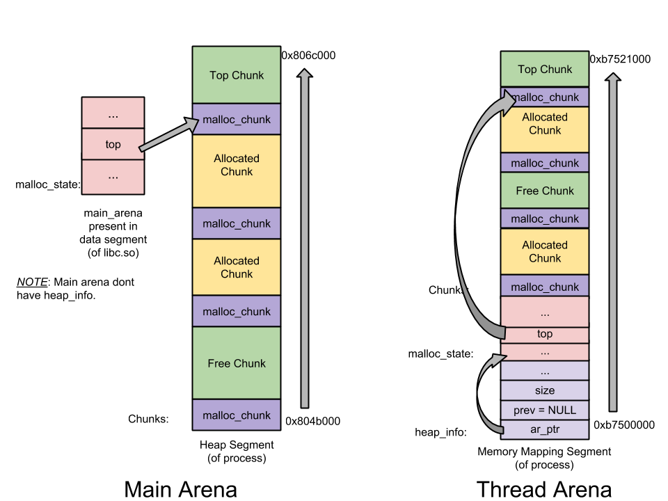

# Ptmalloc 内存管理

- [Ptmalloc 内存管理](#ptmalloc-内存管理)
  - [前言](#前言)
  - [如何调试 glibc](#如何调试-glibc)
    - [Arch / Manjaro](#arch--manjaro)
    - [Ubuntu](#ubuntu)
    - [编译 debug 版本的 glibc](#编译-debug-版本的-glibc)
  - [进程内存布局](#进程内存布局)
    - [ELF 文件布局](#elf-文件布局)
    - [ELF 文件装载](#elf-文件装载)
    - [内存布局](#内存布局)
  - [ptmalloc 内存管理数据结构](#ptmalloc-内存管理数据结构)
    - [malloc 函数入口](#malloc-函数入口)
      - [malloc_hook_ini](#malloc_hook_ini)
      - [ptmalloc_init](#ptmalloc_init)
      - [malloc_init_state](#malloc_init_state)
    - [Q/A](#qa)
      - [分配区（malloc_state）](#分配区malloc_state)
      - [bin 成员](#bin-成员)
      - [内存结构单元 chunk](#内存结构单元-chunk)
      - [特殊 bins 类型](#特殊-bins-类型)
      - [NONCONTIGUOUS_BIT](#noncontiguous_bit)
  - [Tcache 管理](#tcache-管理)
    - [计算 Chunk](#计算-chunk)

## 前言

本文主要介绍 glibc 默认的内存分配器 Ptmalloc 的相关实现细节，希望可以帮助你建立印象中的内存模型，在问题调试、内存优化中不再过于束手无策。

> 文中使用的 glibc 版本为 [2.33（Released 2021-02-01）](https://www.gnu.org/software/libc/)

## 如何调试 glibc

大多数情况下，当我们在使用系统默认的编译工具 gcc、clang 或者一些交叉编译工具时，所链接的 glibc 库都是不包含调试信息的，当出现问题时往往无法看出具体出现问题的代码甚至连行号都没有，例如 [Arch Linux Debugging/Getting traces wiki](https://wiki.archlinux.org/title/Debugging/Getting_traces) 举例：

```text
[...]
Backtrace was generated from '/usr/bin/epiphany'

(no debugging symbols found)
Using host libthread_db library "/lib/libthread_db.so.1".
(no debugging symbols found)
[Thread debugging using libthread_db enabled]
[New Thread -1241265952 (LWP 12630)]
(no debugging symbols found)
0xb7f25410 in __kernel_vsyscall ()
#0  0xb7f25410 in __kernel_vsyscall ()
#1  0xb741b45b in ?? () from /lib/libpthread.so.0
[...]
```

本节介绍我主要使用的系统 Manjaro(类 Arch) 与 Ubuntu 如何为 glibc 添加调试信息，以及如何自己编译一个带有 debug 信息的 glibc 库（推荐）。

### Arch / Manjaro

Manjaro 同样是使用 Arch linux 的 AUR 进行包管理，因此本节内容主要以 [Arch wiki](https://wiki.archlinux.org/title/Debugging/Getting_traces) 为主。

使用如下[脚本](https://gist.github.com/nbulischeck/bda4397a59b77822703f98f6aeb2cb20)可以进行安装：

```shell
#!/bin/bash

# Install Dependencies
sudo pacman -S git svn gd lib32-gcc-libs patch make bison fakeroot

# Checkout glibc source
svn checkout --depth=empty svn://svn.archlinux.org/packages
cd packages
svn update glibc
cd glibc/repos/core-x86_64

# Add current locale to locale.gen.txt
grep -v "#" /etc/locale.gen >> locale.gen.txt

# Enable debug build in PKGBUILD
sed -i 's#!strip#debug#' PKGBUILD

# Build glibc and glibc-debug packages
makepkg --skipchecksums

# Install glibc-debug
sudo pacman -U *.pkg.tar.xz

sed '/^OPTIONS/ s/!debug/debug/g; /^OPTIONS/ s/strip/!strip/g' /etc/makepkg.conf
```

使用gdb 查看线程堆栈，可以看到函数名称显示正常：

```text
pwndbg> bt
#0  allocThreadMem () at /root/glibc_Learnging/test/main.cpp:12

................

#19 0x00007f0039556c27 in __pthread_once_slow () from /usr/lib/libpthread.so.0

................

#37 0x00007f003954f259 in start_thread () from /usr/lib/libpthread.so.0
#38 0x00007f00391035e3 in clone () from /usr/lib/libc.so.6

```

### Ubuntu

Ubuntu 下可以通过 apt 下载当前系统对应 glibc 版本相关的[调试编译信息](https://cloud.tencent.com/developer/article/1116156)：

```shell
> sudo apt-get install libc-dbg
```

接下来同样使用 apt 下载相应版本的源码：

```shell
> sudo apt-get install source libc-dev
```

最后可以使用 gdb 命令进行源码路径指定：

```shell
gdb> set substitute-path  /build/glibc-eX1tMB/glibc-2.31 /home/layton/Tools/glibc-2.31

#/build/glibc-eX1tMB/glibc-2.31 路径便是安装 libc-dbg 中指定的源码编译路径
```

### 编译 debug 版本的 glibc

通过系统工具安装带有 debug 信息的 glibc 往往有一个缺点，就是由于编译时一般都是开启了优化选项，一些局部变量甚至代码流程发生了变化，因此最推荐的就是自己编译一份带有 debug 信息的 glibc 库：

1. 确认 glibc 版本，下载对应的源代码。
   - 推荐下载的 glibc 源码版本与当前系统使用的一致，避免链接时存在不兼容问题，可以查看 ldd 工具版本来判断使用的 glibc 版本：

      ```shell
      ❯ ldd --version
      ldd (GNU libc) 2.33
      Copyright (C) 2021 自由软件基金会。
      这是一个自由软件；请见源代码的授权条款。本软件不含任何没有担保；甚至不保证适销性
      或者适合某些特殊目的。
      由 Roland McGrath 和 Ulrich Drepper 编写。
      ```

   - 在 [GNU 官网](https://www.gnu.org/software/libc/)下载对应的 glibc 源码，这里我下载的就是 2.33 版本。

2. 解压并创建编译目录，如下与源码目录同级即可：

    ```shell
    ❯ ls glibc-* -d                 
    glibc-2.33  glibc-debug
    ```

3. 进入编译目录进行编译安装，注意指定 --enable-debug=yes 使能调试：
   > -O0 编译会失败，由于 glibc 中使用了内敛相关语法，gcc 编译器 -O1 才会开启内联优化。
   >
   > 编译时出现缺少 xdr_* 报错失败注意使能 --enable-obsolete-rpc --enable-obsolete-nsl

   ```shell
   ❯ cd glibc-debug
   
   ❯ ../glibc-2.33/configure --prefix=`pwd`/usr --enable-debug=yes CFLAGS="-O1 -g" CPPFLAGS="-O1 -g"
   
   ❯ mkdir usr && make all && make install 
   ```

4. 工程中使用 CMakeLists.txt 指定 link_dir：

    ```cmake
    link_directories(/home/layton/Tools/glibc-debug/usr/lib)
    ```

5. 编译完成后使用 ldd 命令查看动态库;

    ```shell
    ~/WorkSpace/GLibcDebug/build/test main*
    ❯ ldd automatedtools_unittests              
            linux-vdso.so.1 (0x00007ffdc1d4d000)
            libpthread.so.0 => /home/layton/Tools/glibc-debug/usr/lib/libpthread.so.0 (0x00007fa69e86f000)
            libspdlog.so.1 => /usr/lib/libspdlog.so.1 (0x00007fa69e7dd000)
            libfmt.so.7 => /usr/lib/libfmt.so.7 (0x00007fa69e7a6000)
            libc.so.6 => /home/layton/Tools/glibc-debug/usr/lib/libc.so.6 (0x00007fa69e5f5000)
            /lib64/ld-linux-x86-64.so.2 => /usr/lib64/ld-linux-x86-64.so.2 (0x00007fa69e896000)
            libstdc++.so.6 => /usr/lib/libstdc++.so.6 (0x00007fa69e3df000)
            libgcc_s.so.1 => /usr/lib/libgcc_s.so.1 (0x00007fa69e3c2000)
            libm.so.6 => /home/layton/Tools/glibc-debug/usr/lib/libm.so.6 (0x00007fa69e28a000)
    ```

6. 最后使用 gdb 启动程序，可以正常使用 [pwndbg 插件](https://github.com/pwndbg/pwndbg)打印内存信息以及 thread_arena 线程分配区：

    

## 进程内存布局

本节将介绍下进程内存布局，这可算是一个老生常谈的东西，但是想要了解内存管理还是必不可少，因此就简单介绍下，想要详细学习下网上也有很多优秀相关的文章，就请自行搜索了解。

### ELF 文件布局

Linux ELF 格式可执行程序的结构是以段（segment）为单位组合而成的。Linux 系统在装载 elf 程序文件时，通过 loader 将各个 segment 依次载入到某一地址开始的内存空间中：

> section 代指 .text、.bss、.data 等，这些信息可用于链接时地址重定位等，因此 section 又被称为链接视图，可以使用 readelf -S object 来查看目标文件的 section。
>
> segment 则是执行视图，程序执行是以 segment 为单位载入，每个 segment 对应 ELF 文件中 program header table 中的一个条目，用来建立可执行文件的进程映像。通常说的，代码段、数据段是 segment，目标代码中的 section 会被链接器组织到可执行文件的各个 segment 中。可以使用 readelf -l a.out 查看 ELF 格式执行文件的 segment 信息。


如上图 segment 所示，TYPE 为 LOAD 的段是运行时所需载入的：

```shell
LOAD           0x0000000000002000 0x0000000000002000 0x0000000000002000
                 0x0000000000002201 0x0000000000002201  R E    0x1000
# 其标号为 0x3，对应：

03     .init .plt .text .fini

# 可以发现其包含我们的代码段，R（只读）E（可执行）W（可写）
```

### ELF 文件装载

Linux 支持不同的可执行程序，其内核使用 `struct linux_binfmt` 来描述各种可执行程序，以 ELF 格式举例：

1. 首先需要填充一个 [linux_binfmt](https://www.linux.it/~rubini/docs/binfmt/binfmt.html) 格式的结构：

    ```c
    // /fs/binfmt.c
    static struct linux_binfmt elf_format = {
        .module      = THIS_MODULE,
        .load_binary = load_elf_binary, //通过读存放在可执行文件中的信息为当前进程建立一个新的执行环境
        .load_shlib      = load_elf_library,  //用于动态的把一个共享库捆绑到一个已经在运行的进程，这是由 uselib() 系统调用激活的
        .core_dump       = elf_core_dump,
        .min_coredump    = ELF_EXEC_PAGESIZE,
        .hasvdso     = 1
    };
    ```

2. 所有的 `linux_binfmt` 对象都处于一个链表中，第一个元素的地址存放在 formats 变量中，可以通过调用 register_binfmt() 和 unregister_binfmt() 函数在链表中插入和删除元素。在系统启动期间，为每个编译进内核的可执行格式都执行 registre_fmt() 函数。执行一个可执行程序的时候，内核会 `list_for_each_entry` 遍历所有注册的 `linux_binfmt` 对象，对其调用 `load_binrary` 方法来尝试加载，直到加载成功为止。

3. 内核通过 `execv()` 或 `execve()` 系统调用到 `do_execve()` 函数，其读取 ELF 文件头部字节（Linux 128 字节头），再通过 `search_binary_handler()` 搜索对应的格式加载方法，最终调用处理函数来加载目标 ELF。

    ```shell
    ❯ readelf -h automatedtools_unittests
    ELF 头：
      Magic：  7f 45 4c 46 02 01 01 03 00 00 00 00 00 00 00 00 
      类别:                              ELF64
      数据:                              2 补码，小端序 (little endian)
      Version:                           1 (current)
      OS/ABI:                            UNIX - GNU
      ABI 版本:                          0
      类型:                              DYN (共享目标文件)
      系统架构:                          Advanced Micro Devices X86-64
      版本:                              0x1
      入口点地址：              0x3340
      程序头起点：              64 (bytes into file)
      Start of section headers:          624072 (bytes into file)
      标志：             0x0
      Size of this header:               64 (bytes)
      Size of program headers:           56 (bytes)
      Number of program headers:         13
      Size of section headers:           64 (bytes)
      Number of section headers:         40
      Section header string table index: 39
    ```

4. 总结下，以 ELF 格式的 load_elf_binary 函数执行过程举例：
   - 填充并且检查目标程序 ELF 头部；
   - load_elf_phdrs 加载目标程序的程序头表；
   - 如果需要动态链接，则寻找和处理解释器段；
   - 检查并读取解释器的程序表头；
   - 装入目标程序的段 segment；
   - 填写程序的入口地址；
   - create_elf_tables 填写目标文件的参数环境变量等必要信息；
   - start_kernel 宏准备进入新的程序入口。

### 内存布局

大致了解了 Linux 如何将可执行程序文件装载到内存变为进程后，接下来查看下 segment 实际加载到内存中的地址情况 (64 位系统)：

  
  

可以看出 ELF 可执行文件中的 LOAD segment 分别加载到了以 0x555555554000 为开始的虚拟内存地址上。进程内存中不仅仅有从 ELF 中加载的 segment 还有 Heap、Mmap、Stack 等，接下来简单介绍下：

1. 内核态内存空间，大小固定（编译时可以调整），32 位系统一般为 1GB，64 位系统为 128TB。
2. 用户态的栈，大小不固定，可以用 ulimit -s 进行调整，默认一般为 8M，从高地址向低地址增长。
3. mmap 区域（内存映射段），既可以从高地址到低地址延伸（所谓 flexible layout），也可以从低到高延伸（所谓 legacy layout)，看进程具体情况。一般 32 位系统默认为 flexible，64 位系统为 legacy。
4. brk 区域（堆），紧邻数据段（甚至贴着），从低位向高位伸展，但它的大小主要取决于 mmap 如何增长，一般来说，即使是 32 位的进程以传统方式延伸，也有差不多 1 GB 的空间。
5. 数据段，主要是进程里初始化和未初始化（BSS）的全局数据总和，当然还有编译器生成一些辅助数据结构等等），大小取决于具体进程，其位置紧贴着代码段。
6. 代码段，主要是进程的指令，包括用户代码和编译器生成的辅助代码，其大小取决于具体程序，但起始位置根据 32 位还是 64 位一般固定（-fPIC, -fPIE 等除外）。
7. 以上各段（除了代码段数据段）其起始位置根据系统是否起用 randomize_va_space 一般稍有变化，各段之间因此可能有随机大小的间隔。

- 32 位 flexible layout。

    

- 64 位 legacy layout。

    

## ptmalloc 内存管理数据结构

从本节开始将正式进入 glibc 默认的内存管理方式 ptmalloc 的分析，本节从 ptmalloc 初始化流程开始，介绍 ptmalloc 进行内存管理时所用到的数据结构。

### malloc 函数入口

当调用 malloc 申请内存时，通过 `strong_alias` 别名机制是直接调用到 `__libc_malloc` 函数上：

> strong_alias : 强别名，当出现相同符号的定义会发成重定义冲突。
>
> weak_alias : 弱别名，当出现相同名字的不会重定义，只有当没有冲突时才使用若定义别名。

```c
# define strong_alias(name, aliasname) _strong_alias(name, aliasname)
# define _strong_alias(name, aliasname) \
  extern __typeof (name) aliasname __attribute__ ((alias (#name))) \
    __attribute_copy__ (name);

strong_alias (__libc_malloc, __malloc) strong_alias (__libc_malloc, malloc)
```

我们先从 `__libc_malloc` 入口开始分析：

```c
void *weak_variable (*__malloc_hook)
    (size_t __size, const void *) = malloc_hook_ini;

# if __WORDSIZE == 64
#  define SIZE_MAX  (18446744073709551615UL)
# else
#  if __WORDSIZE32_SIZE_ULONG
#   define SIZE_MAX  (4294967295UL)
#  else
#   define SIZE_MAX  (4294967295U)
#  endif
# endif

# if __WORDSIZE == 64
#  define PTRDIFF_MIN  (-9223372036854775807L-1)
#  define PTRDIFF_MAX  (9223372036854775807L)
# else
#  if __WORDSIZE32_PTRDIFF_LONG
#   define PTRDIFF_MIN  (-2147483647L-1)
#   define PTRDIFF_MAX  (2147483647L)
#  else
#   define PTRDIFF_MIN  (-2147483647-1)
#   define PTRDIFF_MAX  (2147483647)
#  endif
# endif

..................

void *
__libc_malloc (size_t bytes)
{
  mstate ar_ptr;
  void *victim;

  _Static_assert (PTRDIFF_MAX <= SIZE_MAX / 2,
                  "PTRDIFF_MAX is not more than half of SIZE_MAX");

  void *(*hook) (size_t, const void *)
    = atomic_forced_read (__malloc_hook);
  if (__builtin_expect (hook != NULL, 0))
    return (*hook)(bytes, RETURN_ADDRESS (0));
  .........
}
```

1. 可以看出如果没有重定义 `__malloc_hook` 弱别名就使用默认的 `malloc_hook_ini`，其使用 atomic_forced_read 原子读取。
2. 判断 `__malloc_hook` 是否为空，如果不为空则进行调用。
   - `__builtin_expect` 用于编译其优化，告知编译器此判断语句更容易为 true 或 false，便于 cpu 的分支预测。
   - `__glibc_unlikely` 和 `__glibc_likely` 都是包装了下 `__builtin_expect`，功能是一样的。
3. 看下最开始的静态断言判断：
   - `SIZE_MAX` 是指 size_t 的最大范围，也就是当前系统最大的寻址范围。
   - 而 `PTRDIFF_MAX` 是指 ptrdiff_t 的最大范围，ptrdiff_t 常用于存放两个地址做减法后的结果。
   - `SIZE_MAX` 是 UL 类型，`PTRDIFF_MAX` 是 L 类型：从地址空间可以看出堆栈的地址范围不可能超过地址的一半，通常 32 位系统是 3：1 分配的堆空间（1G），即使是 64 位系统，由于与内核对半分配也不可能超过 SIZE_MAX 的一半（128T），因此 PTRDIFF_MAX <= SIZE_MAX / 2。

#### malloc_hook_ini

```c
static void *
malloc_hook_ini (size_t sz, const void *caller)
{
  __malloc_hook = NULL;
  ptmalloc_init ();
  return __libc_malloc (sz);
}
```

1. 第一步先将 `__malloc_hook` 置为 NULL。
2. 调用 `ptmalloc_init` 后，又重新调用了 `__libc_malloc`，配合前边 `__libc_malloc` 中判断 hook 是否为空就是为这时准备的，由于 hook 在第一次 malloc 调用后就被置 NULL 了，正符合了 __libc_malloc 中判断时 `__builtin_expect` 所期望也就是 false。

#### ptmalloc_init

简略版本代码：

```c
/* There are several instances of this struct ("arenas") in this
   malloc.  If you are adapting this malloc in a way that does NOT use
   a static or mmapped malloc_state, you MUST explicitly zero-fill it
   before using. This malloc relies on the property that malloc_state
   is initialized to all zeroes (as is true of C statics).  */

static struct malloc_state main_arena =
{
  .mutex = _LIBC_LOCK_INITIALIZER,
  .next = &main_arena,
  .attached_threads = 1
};
.....

/* Already initialized? */
int __malloc_initialized = -1;

.....

static void
ptmalloc_init (void)
{
  if (__malloc_initialized >= 0)
    return;

  __malloc_initialized = 0;

  thread_arena = &main_arena;

  malloc_init_state (&main_arena);

  TUNABLE_GET (check, int32_t, TUNABLE_CALLBACK (set_mallopt_check));
  TUNABLE_GET (top_pad, size_t, TUNABLE_CALLBACK (set_top_pad));
  TUNABLE_GET (perturb, int32_t, TUNABLE_CALLBACK (set_perturb_byte));
  TUNABLE_GET (mmap_threshold, size_t, TUNABLE_CALLBACK (set_mmap_threshold));
  TUNABLE_GET (trim_threshold, size_t, TUNABLE_CALLBACK (set_trim_threshold));
  TUNABLE_GET (mmap_max, int32_t, TUNABLE_CALLBACK (set_mmaps_max));
  TUNABLE_GET (arena_max, size_t, TUNABLE_CALLBACK (set_arena_max));
  TUNABLE_GET (arena_test, size_t, TUNABLE_CALLBACK (set_arena_test));

  TUNABLE_GET (mxfast, size_t, TUNABLE_CALLBACK (set_mxfast));

  __malloc_initialized = 1;
}
```

1. 通过全局变量 `__malloc_initialized` 标识 ptmalloc 初始化状态：-1 未初始化、0 正在初始化、1 初始化完成。
2. 将主分配区 `main_arena` 分配给进行初始化的线程。*// Q1: 什么是主分配区、分配区又指什么，分配区各个成员作用都有哪些？*
3. 调用 `malloc_init_state` 初始话主分配区。
4. `TUNABLE_GET` 可调参数是 GNU C 库中的一个特性，它允许应用程序作者和发行版维护人员改变运行时库的行为以匹配他们的工作负载。具体详见参考文章 [`Tunable Framework`](https://sourceware.org/glibc/wiki/Tunables)。

#### malloc_init_state

```c
/* addressing -- note that bin_at(0) does not exist */
#define bin_at(m, i) \
  (mbinptr) (((char *) &((m)->bins[((i) - 1) * 2]))     \
             - offsetof (struct malloc_chunk, fd))

#define set_noncontiguous(M)   ((M)->flags |= NONCONTIGUOUS_BIT)

#define set_max_fast(s) \
  global_max_fast = (((size_t) (s) <= MALLOC_ALIGN_MASK - SIZE_SZ) \
                     ? MIN_CHUNK_SIZE / 2 : ((s + SIZE_SZ) & ~MALLOC_ALIGN_MASK))


/*
   Unsorted chunks

    All remainders from chunk splits, as well as all returned chunks,
    are first placed in the "unsorted" bin. They are then placed
    in regular bins after malloc gives them ONE chance to be used before
    binning. So, basically, the unsorted_chunks list acts as a queue,
    with chunks being placed on it in free (and malloc_consolidate),
    and taken off (to be either used or placed in bins) in malloc.

    The NON_MAIN_ARENA flag is never set for unsorted chunks, so it
    does not have to be taken into account in size comparisons.
 */
/* The otherwise unindexable 1-bin is used to hold unsorted chunks. */
#define unsorted_chunks(M)          (bin_at (M, 1))


#define initial_top(M)              (unsorted_chunks (M))


.........................

/*
   Initialize a malloc_state struct.

   This is called from ptmalloc_init () or from _int_new_arena ()
   when creating a new arena.
 */

static void
malloc_init_state (mstate av)
{
  int i;
  mbinptr bin;

  /* Establish circular links for normal bins */
  /* NBINS=128 */
  for (i = 1; i < NBINS; ++i)
    {
      bin = bin_at (av, i);
      bin->fd = bin->bk = bin;
    }

#if MORECORE_CONTIGUOUS
  if (av != &main_arena)
#endif
  set_noncontiguous (av);
  if (av == &main_arena)
    set_max_fast (DEFAULT_MXFAST);
  atomic_store_relaxed (&av->have_fastchunks, false);

  av->top = initial_top (av);
}
```

1. 从`下标 1` 开始对分配区 bin 成员进行初始化，将每个 bin 的 fd、bk 都置为自身。 *// Q2: bin 成员作用是什么，为什么要从下标 1 开始？*
2. 如果初始化非主分配区，调用 set_noncontiguous 设置 NONCONTIGUOUS_BIT 标识位。*// Q3: NONCONTIGUOUS_BIT 是什么，为什么要针对非主分配区？*
3. 如果是主分配区通过 set_max_fast 初始化 global_max_fast 的大小。*// Q4: global_max_fast 是什么，有什么作用？*
4. 原子操作设置分配区 have_fastchunks 成员为 false。
5. 初始化分配区 top 成员。 *// Q5：top 成员特点，以及为什么这么初始化？*

至此，ptmalloc 的第一次调用初始化就完成了，流程图如下：


再次调用的流程。


### Q/A

虽然初始化流程已经过完了，但是对细节还没有解释，接下来围绕这些问题，将介绍初始化中所接触到的数据结构。

- Q1: 什么是分配区，主分配区又指什么，分配区各个成员作用都有哪些？
- Q2: bin 成员作用是什么，为什么要从下标 1 开始？
- Q3: NONCONTIGUOUS_BIT 是什么，为什么要针对非主分配区？
- Q4: global_max_fast 是什么，有什么作用？
- Q5: top 成员特点，以及为什么这么初始化？

#### 分配区（malloc_state）

本小节主要介绍分配区的相关概念以及分配区管理相关的数据结构，本节罗列了相关概念相关代码逻辑会在后文分析。

1. 什么是分配区？主分配区与非主分配区有什么区别？
   - ptmalloc 通过 malloc_state 的状态机来管理内存的分配，即`分配区`。malloc_state 主要用来管理分配的内存块，比如是否有空闲的 chunk，有什么大小的空闲 chunk 等等。（ chunk 是内存管理的最小单元）。当用户层调用 malloc/free 等函数的时候，都会通过 ptmalloc 内核模块进行内存的分配，每一块从操作系统上分配的内存，都会使用 malloc_state 结构体来管理。
   - 每个进程有一个主分配区，也可以允许有多个非主分配区。主分配区可以使用 brk 和 mmap 来分配，而非主分配区只能使用 mmap 来映射内存块。非主分配区的数量一旦增加，则不会减少。主分配区和非主分配区形成一个环形链表进行管理。通过 malloc_state->next 来链接。

2. 分配区如何避免多线程问题？
   - 最初版本的 malloc 内存分配器只有一个主分配区，每次分配内存都必须对住分配区加锁，完成后再释放使得多线程情况下效率较差。而当前的 ptmalloc 增加了对应`非主分配区`，主分配区与非主分配区用环形链表进行管理，每一个分配区利用互斥锁 (mutex) 使线程对于该分配区的访问互斥。
   - 当一个线程使用 malloc 分配内存的时候，首选会检查该线程环境中是否已经存在一个分配区，如果存在，则对该分配区进行加锁，并使用该分配区进行内存分配。如果分配失败，则遍历链表中获取的未加锁的分配区。如果整个链表都没有未加锁的分配区，则 ptmalloc 开辟一个新的分配区。分配区的数量受限于内核数：

    ```text
      For 32 bit systems:
      Number of arena = 2 * number of cores.
      For 64 bit systems:
      Number of arena = 8 * number of cores.
    ```

   - 当释放这块内存的时候，首先获取分配区的锁，然后释放内存，如果其他线程正在使用，则等待其他线程。

3. 管理分配区，以及分配区管理的内存相关数据结构：
   - heap_info（Heap Header）：一个 thread arena 可以维护多个堆。每个堆都有自己的堆 Header（注：也即头部元数据）。什么时候 Thread Arena 会维护多个堆呢？ 一般情况下，每个 thread arena 都只维护一个堆，但是当这个堆的空间耗尽时，新的堆（而非连续内存区域）就会被 mmap 到这个 aerna 里。
   - malloc_state（Arena header）： 一个 thread arena 可以维护多个堆，这些堆另外共享同一个 arena header。Arena header 描述的信息包括：bins、top chunk、last remainder chunk 等。
   - malloc_chunk（Chunk header）：根据用户请求，每个堆被分为若干 chunk。每个 chunk 都有自己的 chunk header。

    

     - thread arena 的图示如下（多堆段）：

      

4. 下面详细解释下，malloc_state 每个成员的作用：

    ```c
    struct malloc_state
    {
      /* 
        线程锁，只有当前申请线程拿到后才能使用分配区申请内存，否则只能继续查找下一个空闲的分配区。
        如果所有的分配区都已经加锁，那么 malloc() 会开辟一个新的分配区。
        把该分配区加入到全局分配区循环链表并加锁，然后使用该分配区进行分配内存操作。
      */
      __libc_lock_define (, mutex); 
    
      /* Flags (formerly in max_fast).  
        记录了分配区的一些标志，比如 bit0 记录了分配区是否有 fast bin chunk ，bit1 标识分配区是否能返回连续的虚拟地址空间
      */
      int flags;
    
      /* Set if the fastbin chunks contain recently inserted free blocks.  
        Note this is a bool but not all targets support atomics on booleans.  
      
        用于标记是否有 fast bins
        have_fastchunks 表示可能存在 fastbin 块。在将 chunk 存入任何 fastbin 时设置为 true，并在 malloc_consolidate 中进行合并。
        该值是近似值，因为它可能在出现即使有 fastbin 可用块也可能为 false。
        鉴于它的唯一目的是减少冗余调用 malloc_consolidate 的数量不影响正确性。因此，可以安全地使用宽松的原子访问。
        注：malloc_consolidate 的作用是将 fastbin 进行合并，加入到其他 bin 管理链表上去。
      */
      int have_fastchunks;
    
      /* Fastbins 
        fast bins 是 bins 的高速缓冲区，大约有 10 个定长队列。
        当用户释放一块不大于 max_fast（默认值 64）的 chunk（一般小内存）的时候，会默认会被放到 fast bins 上。
      */
      mfastbinptr fastbinsY[NFASTBINS];
    
      /* Base of the topmost chunk -- not otherwise kept in a bin
        指向分配区的 top chunk。
        top chunk 相当于分配区的顶部空闲内存，当 bins 上都不能满足内存分配要求的时候，就会来 top chunk 上分配。 
      */
      mchunkptr top;
    
      /* The remainder from the most recent split of a small request */
      mchunkptr last_remainder;
    
      /* Normal bins packed as described above 
      *  常规 bins chunk 的链表数组，具体可以参见 bin 成员分析。
      */
      mchunkptr bins[NBINS * 2 - 2];
    
      /* Bitmap of bins 
        表示 bin 数组当中某一个下标的 bin 是否为空，用来在分配的时候加速
      */
      unsigned int binmap[BINMAPSIZE];
    
      /* Linked list 
        分配区全局链表：分配区链表，主分配区放头部，新加入的分配区放 main_arean.next 位置 Linked list 
      */
      struct malloc_state *next;
    
      /* Linked list for free arenas.  Access to this field is serialized
          by free_list_lock in arena.c.  
          空闲的分配区链表
      */
      struct malloc_state *next_free;
    
      /* Number of threads attached to this arena.  0 if the arena is on
          the free list.  Access to this field is serialized by
          free_list_lock in arena.c.  
          使用当前分配区的线程数量，0 时存放在 next_free 链表上
      */
      INTERNAL_SIZE_T attached_threads;
    
      /* Memory allocated from the system in this arena.  */
      INTERNAL_SIZE_T system_mem;
      INTERNAL_SIZE_T max_system_mem;
    };
    ```

#### bin 成员

1. bin 相关成员：
   - ptmalloc 的空闲 chunk 都是通过在 malloc_state 上的 bins 数组来管理的。一共分为四种类型的 bins：fast bins、 unsorted bin、small bins 和 large bins。

2. 首先让看下分配区结构中涉及到 bin 管理的成员，大体的成员含义上一节已经讲解，本节主要分析每一个成员具体实现的功能：

    ```c
    struct malloc_state
    {
      .................

      int have_fastchunks;

      mfastbinptr fastbinsY[NFASTBINS];

      mchunkptr top;

      mchunkptr last_remainder;

      /* Normal bins packed as described above 
      * 1. unsorted bin：是 bins 的一个缓冲区。当用户释放的内存大于 max_fast 或者 fast bins 合并后的 chunk 都会进入 unsorted bin 上
      * 2. small bins 和 large bins：small bins 和 large bins 是真正用来放置 chunk 双向链表的。每个 bin 之间相差 8 个字节，并且通过上面的这个列表，可以快速定位到合适大小的空闲 chunk。
      * 3. 下标 1 是 unsorted bin，2 到 63 是 small bin，64 到 126 是 large bin，共 126 个 bin
      * 4. BINS 定义为 128 由于在 bins 数组中的每个 bin 都有着一个 fd 和 bk 的指针 所以要乘 2，bin[0] 没有使用 因此 - 2。
      */
      mchunkptr bins[NBINS * 2 - 2];

      unsigned int binmap[BINMAPSIZE];
      ...............
    }
    ```

    - bins 结构可以见下图，每两个 bins 元素指向一个双向链表的头与尾，因此需要 `NBINS * 2`：

      ```text
          Bins Array                Chunk 0                Chunk 1 
    
      +--> XXXXXXXXXX <-\     /--> +--------+ <-\     /--> +--------+ <-----+
      |    XXXXXXXXXX    \   /     |  p_sz  |    \   /     |  p_sz  |       |
      |    XXXXXXXXXX     \ /      +--------+     \ /      +--------+       |
      |    XXXXXXXXXX      X       |   sz   |      X       |   sz   |       |
      |    +--------+     / \      +--------+     / \      +--------+       |
      |    | [2i-2] | -->/   \     |   fd   | -->/   \     |   fd   | ->+   |
      |    +--------+         \    +--------+         \    +--------+   |   |
      |    | [2i-1] | -->+     \<- |   bk   |          \<- |   bk   |   |   |
      |    +--------+    |         +--------+              +--------+   |   |
      |                  |                                              |   |
      |                  +----------------------------------------------+---+
      |                                                                 |
      +<----------------------------------------------------------------+
      ```

3. `fast bins`: 相关的成员有 have_fastchunks 与 fastbinsY。
   - have_fastchunks：如前文所述，用于标识是否存在空闲的 fast bins 内存块。
   - fastbinsY：用于管理 fast bins 内存块，
   - 当用户释放一块不大于 max_fast（**主分配区初始化时配置，默认值  64 * SIZE_SZ / 4  **）的 chunk，会默认会被放到 fast bins 上（**Q4**）。当用户下次需要申请内存的时候首先会到 fast bins 上寻找是否有合适的 chunk，然后才会到 bins 上空闲链表里面查找的 chunk。每次申请内存 如果 fast bins 以及 small bins 无法满足需求，ptmalloc 都会遍历 fast bin 看是否有合适的 chunk 需要合并到 unorder bins 上，再尝试进行后续分配，避免过多的碎片缓存。

    ```cpp
    /*
      Fastbins
        包含最近释放的 small chunk 的列表数组。
        Fastbins 没有使用双向链表，不仅仅单链表的速度更快，而且由于每个 fast bin 链表大小都是一致的因此不需要从中间进行删除，因此采用单链表结构。
        此外，与普通 bins 不同的是，它们甚至没有按 FIFO 顺序处理（它们使用更快的 LIFO, 增删 chunk 发生在链表顶端即可），因为在瞬态上下文中，通常使用 fastbins 排序并不重要。
   
        fastbins 中的 chunk 保持其 inuse 位设置，因此它们不能与其他空闲 chunk 合并。 
        需要通过 malloc_consolidate 释放 fastbins 中的所有 chunk 并将它们合并其他 free chunk。 
    */
   
    typedef struct malloc_chunk *mfastbinptr;
    #define fastbin(ar_ptr, idx) ((ar_ptr)->fastbinsY[idx])
   
    /* offset 2 to use otherwise unindexable first 2 bins */
    #define fastbin_index(sz) \
      ((((unsigned int) (sz)) >> (SIZE_SZ == 8 ? 4 : 3)) - 2)
   
    /* The maximum fastbin request size we support */
    // 80 * size_t / 4 = 160 Byte
    #define MAX_FAST_SIZE     (80 * SIZE_SZ / 4) 
   
    // request2size 用于将申请的内存大小通过对齐后计算所需的 chunk size，后续章节会有介绍。
    // request2size (MAX_FAST_SIZE) = ((160 + 8) + MALLOC_ALIGN_MASK(01111)) and ~MALLOC_ALIGN_MASK(10000) = 176 Byte
    // fastbin_index (176) = 177 >> 4 - 2 = 11 - 2 = 9
    // NFASTBINS = 9 + 1 = 10
    #define NFASTBINS  (fastbin_index (request2size (MAX_FAST_SIZE)) + 1) 
   
    /*
      Set value of max_fast.
      Use impossibly small value if 0.
      Precondition: there are no existing fastbin chunks in the main arena.
      Since do_check_malloc_state () checks this, we call malloc_consolidate ()
      before changing max_fast.  Note other arenas will leak their fast bin
      entries if max_fast is reduced.
    */
   
    #define set_max_fast(s) \
      global_max_fast = (((size_t) (s) <= MALLOC_ALIGN_MASK - SIZE_SZ) \
                        ? MIN_CHUNK_SIZE / 2 : ((s + SIZE_SZ) & ~MALLOC_ALIGN_MASK))
   
    static inline INTERNAL_SIZE_T
    get_max_fast (void)
    {
      /* Tell the GCC optimizers that global_max_fast is never larger
        than MAX_FAST_SIZE.  This avoids out-of-bounds array accesses in
        _int_malloc after constant propagation of the size parameter.
        (The code never executes because malloc preserves the
        global_max_fast invariant, but the optimizers may not recognize
        this.)  */
      if (global_max_fast > MAX_FAST_SIZE)
        __builtin_unreachable ();
      return global_max_fast;
    }
   
    #ifndef DEFAULT_MXFAST
    #define DEFAULT_MXFAST     (64 * SIZE_SZ / 4)
    #endif
    ```

    

4. `unsorted bin`：是 bins 的一个缓冲区，bins 数组下标为 1 的即是 unstored bin。当用户释放的内存大于 max_fast 或者 fast bins 合并后的 chunk 都会进入 unsorted bin 上。这使得分配器可以重新使用最近 free 掉的 chunk，从而消除了寻找合适 bin 的时间开销，进而加速了内存分配及释放的效率。当用户 malloc 的时候，如果 fast bins 以及 small bins 都无法满足需求后，首先通过 malloc_consolidate 进行合并 fast bins 到 unsorted bin 上，在使用 large bins 进行分配前，会遍历整个 unsorted bin 将其管理的 chunk 按照大小标准插入到 small bins 或者 large bins 中，再尝试分配。//TODO：增加实践验证！！！
   - unsorted bin 是双向链表管理，用于保存 free chunk。对于 chunk 大小无限制，除开小于 max_fast 的都会插入到这里。

    ```cpp
    /*
        Unsorted chunks
   
        所有 chunk 经过切割后的剩余部分 chunk，以及 free 的 chunk, 首先被放在 "unsorted" bin 中，
        然后在 malloc 给他们一个机会被使用之前放置的进入 常规 bins 中。
   
        所以，基本上，未排序的块列表作为一个队列，以 free （和 malloc_consolidated) 存入 chunk,
        在 malloc 中使用（要么使用，要么放在 bins 里）。
   
        从未为未排序的块设置 NON_MAIN_ARENA 标志，因此它在大小比较中不必考虑。
        
    */
   
    /* The otherwise unindexable 1-bin is used to hold unsorted chunks. */
    #define unsorted_chunks(M)          (bin_at (M, 1))
   
    ```

    

5. `small bins`：小于 512 字节（64 位机器 1024 字节）的 chunk 被称为 small chunk，而保存 small chunks 的 bin 被称为 small bin。**数组从 2 开始编号到 63，前 62 个 bin 为 small bins**，small bin 每个 bin 之间相差 8 个字节（64 位 16 字节），同一个 small bin 中的 chunk 具有相同大小。起始 bin 大小为 16 字节（64 位系统 32）。

6. `large bins`：大于等于 512 字节（64 位机器 1024 字节）的 chunk 被称为 large chunk，而保存 large chunks 的 bin 被称为 large bin。**位于 small bins 后面，数组编号从 64 开始，后 64 个 bin 为 large bins**。同一个 bin 上的 chunk，可以大小不一定相同。large bins 都是通过等差步长的方式进行拆分。（以 32 位系统为例，前 32 个 bin 步长 64，后 16 个 bin 步长 512，后 8 个步长 4096，后四个 32768，后 2 个 262144）（编号 63 到 64 的步长跟）。起始 bin 大小为 512 字节（64 位系统 1024）。

    ```cpp
    /*
    Bins
    
    An array of bin headers for free chunks. Each bin is doubly
    linked.  The bins are approximately proportionally (log) spaced.
    There are a lot of these bins (128). This may look excessive, but
    works very well in practice.  Most bins hold sizes that are
    unusual as malloc request sizes, but are more usual for fragments
    and consolidated sets of chunks, which is what these bins hold, so
    they can be found quickly.  All procedures maintain the invariant
    that no consolidated chunk physically borders another one, so each
    chunk in a list is known to be preceeded and followed by either
    inuse chunks or the ends of memory.
    
    Chunks in bins are kept in size order, with ties going to the
    approximately least recently used chunk. Ordering isn't needed
    for the small bins, which all contain the same-sized chunks, but
    facilitates best-fit allocation for larger chunks. These lists
    are just sequential. Keeping them in order almost never requires
    enough traversal to warrant using fancier ordered data
    structures.
    
    Chunks of the same size are linked with the most
    recently freed at the front, and allocations are taken from the
    back.  This results in LRU (FIFO) allocation order, which tends
    to give each chunk an equal opportunity to be consolidated with
    adjacent freed chunks, resulting in larger free chunks and less
    fragmentation.
    
    To simplify use in double-linked lists, each bin header acts
    as a malloc_chunk. This avoids special-casing for headers.
    But to conserve space and improve locality, we allocate
    only the fd/bk pointers of bins, and then use repositioning tricks
    to treat these as the fields of a malloc_chunk*.
    
    用于管理空闲块的 bin 标头数组。每个 bin 都是双重的链接。 
    bin 大约按比例 (log) 间隔。有很多这样的 bins（128）。这可能看起来有些过分的，但是在实践中效果很好。
    
    大多数 bin 的尺寸都是不寻常的 malloc 请求大小，
    但这些 bins 保存着更常见的片段和合并的内存块集，可以快速的找到并分配。
    
    所有过程保持不变没有合并的块在物理上与另一个块相邻，
    所以已知每个列表中的块在前面和后面是使用块或内存的末端。
    
    large bins 中的 chunk 按大小顺序排列，连接到大约最近最少使用的块。
    
    对于 small bins 则不需要排序，它们都包含相同大小的块，但是
    这对 larger chunk 最佳分配有促进作用。这些队列只是顺序。
    使它们井然有序几乎不需要遍历足以保证快速定位到需要的数据 bin 下标。
    
    chunk 相同的链表，free 是在前端插入，使用时从链表尾端取出。
    这就是 LRU (FIFO) 分配顺序，往往给每个块一个平等的机会与相邻的释放块，
    从而保证更大的空闲块和更少的碎片化。
    
    为了简化在双链表中的使用，每个 bin header 作为 malloc_chunk。这避免了链表头的特殊类型转换。
    但是为了节省空间和改善局部性，我们分配只有 bins 的 fd/bk 指针，然后使用重新定位技巧，将这些视为 malloc_chunk *的字段。
    */
    
    typedef struct malloc_chunk *mbinptr;
    
    /* addressing -- note that bin_at(0) does not exist 
       每个 bin header 类型都是作为 malloc_chunk，但是由于节省空间仅仅在 bins 上分配了 fd 和 bk 两个指针的空间，
       为了使用者的一致性，offsetof (struct malloc_chunk, fd)) 进行偏移并强转为 mbinptr 类型，最终可以使用 fd 和 bk 成员指针，
       去到对应的 bins 上数组下标地址内指向的地址。
    
       因此不可以 bin_at(0), 会变为负数下标。
    
    */
    #define bin_at(m, i) \
      (mbinptr) (((char *) &((m)->bins[((i) - 1) * 2]))     \
                - offsetof (struct malloc_chunk, fd))
    
    /* analog of ++bin */
    #define next_bin(b)  ((mbinptr) ((char *) (b) + (sizeof (mchunkptr) << 1)))
    
    /* Reminders about list directionality within bins */
    #define first(b)     ((b)->fd)
    #define last(b)      ((b)->bk)
    
    /*
      Indexing
    
        Bins for sizes < 512 bytes contain chunks of all the same size, spaced
        8 bytes apart. Larger bins are approximately logarithmically spaced:
    
        64 bins of size       8
        32 bins of size      64
        16 bins of size     512
        8 bins of size    4096
        4 bins of size   32768
        2 bins of size  262144
        1 bin  of size what's left
    
        There is actually a little bit of slop in the numbers in bin_index
        for the sake of speed. This makes no difference elsewhere.
    
        The bins top out around 1MB because we expect to service large
        requests via mmap.
    
        Bin 0 does not exist.  Bin 1 is the unordered list; if that would be
        a valid chunk size the small bins are bumped up one.
    
        索引
    
        Bins 所包含的 chunk’s size < 512 字节为 small chunk 链表上所有的 chunk 大小一致，
    
        每个 Bin 管理的大小以 8 字节倍数递增：
    
        64 bins of size       8
        32 bins of size      64
        16 bins of size     512
        8 bins of size    4096
        4 bins of size   32768
        2 bins of size  262144
        1 bin  of size what's left
    */
    
    #define NBINS             128
    #define NSMALLBINS         64
    #define SMALLBIN_WIDTH    MALLOC_ALIGNMENT
    #define SMALLBIN_CORRECTION (MALLOC_ALIGNMENT > CHUNK_HDR_SZ)
    #define MIN_LARGE_SIZE    ((NSMALLBINS - SMALLBIN_CORRECTION) * SMALLBIN_WIDTH)
    
    #define in_smallbin_range(sz)  \
      ((unsigned long) (sz) < (unsigned long) MIN_LARGE_SIZE)
    
    #define smallbin_index(sz) \
      ((SMALLBIN_WIDTH == 16 ? (((unsigned) (sz)) >> 4) : (((unsigned) (sz)) >> 3))\
      + SMALLBIN_CORRECTION)
    
    #define largebin_index_32(sz)                                                \
      (((((unsigned long) (sz)) >> 6) <= 38) ?  56 + (((unsigned long) (sz)) >> 6) :\
      ((((unsigned long) (sz)) >> 9) <= 20) ?  91 + (((unsigned long) (sz)) >> 9) :\
      ((((unsigned long) (sz)) >> 12) <= 10) ? 110 + (((unsigned long) (sz)) >> 12) :\
      ((((unsigned long) (sz)) >> 15) <= 4) ? 119 + (((unsigned long) (sz)) >> 15) :\
      ((((unsigned long) (sz)) >> 18) <= 2) ? 124 + (((unsigned long) (sz)) >> 18) :\
      126)
    
    #define largebin_index_32_big(sz)                                            \
      (((((unsigned long) (sz)) >> 6) <= 45) ?  49 + (((unsigned long) (sz)) >> 6) :\
      ((((unsigned long) (sz)) >> 9) <= 20) ?  91 + (((unsigned long) (sz)) >> 9) :\
      ((((unsigned long) (sz)) >> 12) <= 10) ? 110 + (((unsigned long) (sz)) >> 12) :\
      ((((unsigned long) (sz)) >> 15) <= 4) ? 119 + (((unsigned long) (sz)) >> 15) :\
      ((((unsigned long) (sz)) >> 18) <= 2) ? 124 + (((unsigned long) (sz)) >> 18) :\
      126)
    
    /* 
        It remains to be seen whether it is good to keep the widths of
        the buckets the same or whether it should be scaled by a factor
        of two as well.
    */
    #define largebin_index_64(sz)                                                \
      (((((unsigned long) (sz)) >> 6) <= 48) ?  48 + (((unsigned long) (sz)) >> 6) :\
      ((((unsigned long) (sz)) >> 9) <= 20) ?  91 + (((unsigned long) (sz)) >> 9) :\
      ((((unsigned long) (sz)) >> 12) <= 10) ? 110 + (((unsigned long) (sz)) >> 12) :\
      ((((unsigned long) (sz)) >> 15) <= 4) ? 119 + (((unsigned long) (sz)) >> 15) :\
      ((((unsigned long) (sz)) >> 18) <= 2) ? 124 + (((unsigned long) (sz)) >> 18) :\
      126)
    
    #define largebin_index(sz) \
      (SIZE_SZ == 8 ? largebin_index_64 (sz)                                     \
      : MALLOC_ALIGNMENT == 16 ? largebin_index_32_big (sz)                     \
      : largebin_index_32 (sz))
    
    #define bin_index(sz) \
      ((in_smallbin_range (sz)) ? smallbin_index (sz) : largebin_index (sz))
    
    ```

    
    

- bins 的结构：
  - bins 长度为 127 ，前 62 为 small bins，后 64 个为 large bin ，下标 1 的 bin 为 unstored bins。
  - 每个 bin 之间，通过等差数列的方式排序，32 位系统前 64 个 small bins 步长为 8，large bin 前 32 步长为 64；64 位系统分别为 16，128。


#### 内存结构单元 chunk

```c
/*
  -----------------------  Chunk representations -----------------------
*/

/*
  This struct declaration is misleading (but accurate and necessary).
  It declares a "view" into memory allowing access to necessary
  fields at known offsets from a given base. See explanation below.
*/

/*
   malloc_chunk 详细信息：

    （以下内容包括 Colin Plumb 精心编辑的解释。）

    内存块使用“边界标记”方法维护，如下所示：如 Knuth 或 Standish 中所述。 （请参阅保罗的论文威尔逊 ftp://ftp.cs.utexas.edu/pub/garbage/allocsrv.ps 这些技术的调查。）
    空闲块的大小都存储在每个块的前面和结尾。这使得将碎片化的块合并为更大的块更快。大小字段的低位表示块是空正在使用。

    分配的块看起来像这样：

    chunk-> +-+-+-+-+-+-+-+-+-+-+-+-+-+-+-+-+-+-+-+-+-+-+-+-+-+-+-+-+-+-+-+-+
        |             Size of previous chunk, if unallocated (P clear)  |
        +-+-+-+-+-+-+-+-+-+-+-+-+-+-+-+-+-+-+-+-+-+-+-+-+-+-+-+-+-+-+-+-+
        |             Size of chunk, in bytes                     |A|M|P|
        mem-> +-+-+-+-+-+-+-+-+-+-+-+-+-+-+-+-+-+-+-+-+-+-+-+-+-+-+-+-+-+-+-+-+
        |             User data starts here...                          .
        .                                                               .
        .             (malloc_usable_size() bytes)                      .
        .                                                               |
    nextchunk-> +-+-+-+-+-+-+-+-+-+-+-+-+-+-+-+-+-+-+-+-+-+-+-+-+-+-+-+-+-+-+-+-+
        |             (size of chunk, but used for application data)    |
        +-+-+-+-+-+-+-+-+-+-+-+-+-+-+-+-+-+-+-+-+-+-+-+-+-+-+-+-+-+-+-+-+
        |             Size of next chunk, in bytes                |A|0|1|
        +-+-+-+-+-+-+-+-+-+-+-+-+-+-+-+-+-+-+-+-+-+-+-+-+-+-+-+-+-+-+-+-+

    在大多数情况下，“chunk”是标识的给 malloc 分配的空间，但是“mem”是返回到用户的地址。 “Nextchunk”是下一个连续块的开始。
    
    块总是从偶数字边界开始，因此 mem 部分（返回给用户）是在偶数字边界上，并且因此，至少双字对齐。

    空闲块存储在环形双向链接列表中，如下所示：

    chunk-> +-+-+-+-+-+-+-+-+-+-+-+-+-+-+-+-+-+-+-+-+-+-+-+-+-+-+-+-+-+-+-+-+
        |             Size of previous chunk, if unallocated (P clear)  |
        +-+-+-+-+-+-+-+-+-+-+-+-+-+-+-+-+-+-+-+-+-+-+-+-+-+-+-+-+-+-+-+-+
    `head:' |             Size of chunk, in bytes                     |A|0|P|
        mem-> +-+-+-+-+-+-+-+-+-+-+-+-+-+-+-+-+-+-+-+-+-+-+-+-+-+-+-+-+-+-+-+-+
        |             Forward pointer to next chunk in list             |
        +-+-+-+-+-+-+-+-+-+-+-+-+-+-+-+-+-+-+-+-+-+-+-+-+-+-+-+-+-+-+-+-+
        |             Back pointer to previous chunk in list            |
        +-+-+-+-+-+-+-+-+-+-+-+-+-+-+-+-+-+-+-+-+-+-+-+-+-+-+-+-+-+-+-+-+
        |             Unused space (may be 0 bytes long)                .
        .                                                               .
        .                                                               |
    nextchunk-> +-+-+-+-+-+-+-+-+-+-+-+-+-+-+-+-+-+-+-+-+-+-+-+-+-+-+-+-+-+-+-+-+
    `foot:' |             Size of chunk, in bytes                           |
        +-+-+-+-+-+-+-+-+-+-+-+-+-+-+-+-+-+-+-+-+-+-+-+-+-+-+-+-+-+-+-+-+
        |             Size of next chunk, in bytes                |A|0|0|
        +-+-+-+-+-+-+-+-+-+-+-+-+-+-+-+-+-+-+-+-+-+-+-+-+-+-+-+-+-+-+-+-+

    P（PREV_INUSE）位，存储在未使用的块大小标识的低位中及 "head"（始终是两字节的倍数），在使用中*上一个*块的位。如果该位*清除*，则当前块大小之前的字节包含前一个块大小，并且可以用来查找前一个块的前面。
    分配的第一个块始终设置有该位，防止访问不存在的（或非所有的）内存。如果为任何给定的块设置了 prev_inuse，那么您无法确定前一块的大小，甚至可能会得到一个内存尝试解决故障时。

    清除开头的块中的 A（NON_MAIN_ARENA）位，主分配区，由 main_arena 变量描述。当额外产生线程，每个线程都有自己的舞台（最多一个可配置的限制，之后将分配区重用于多个线程），并且这些分配区中的块均设置了 A 位。
    在这样的非主分配区上找到块的分配区，heap_for_ptr 通过 ar_ptr 执行位掩码操作和间接寻址每堆头标 heap_info 的成员（请参见 arena.c）。

    请注意，当前块的“英尺”实际上表示为作为 NEXT 块的 prev_size。这使得更容易处理对齐方式等，但尝试时可能会造成混乱扩展或修改此代码。

    所有这三个例外是：

     1. 特殊的块“top”不会打扰使用尾随大小字段，因为没有下一个连续的块那将不得不索引它。初始化后，“top”被迫永远存在。如果它变得小于长度为 MINSIZE 个字节，则补充。

     2. 通过 mmap 分配的块，其次低在其大小字段中设置的位 M（IS_MMAPPED）。因为他们是一对一分配，每个都必须包含自己的尾随大小场地。如果设置了 M 位，则忽略其他位（因为映射的块既不在分配区中，也不在附近到释放的块中）。 M 位还用于块最初来自通过 malloc_set_state 的转储堆钩子 c。

     3. fastbin 中的块被视为从中分配的块。块分配器的观点。他们被合并与他们的邻居仅在 malloc_consolidate 中批量。
*/ 

struct malloc_chunk {

  INTERNAL_SIZE_T      mchunk_prev_size;  /* Size of previous chunk (if free).  */
  INTERNAL_SIZE_T      mchunk_size;       /* Size in bytes, including overhead. */

  struct malloc_chunk* fd;         /* double links -- used only if free. */
  struct malloc_chunk* bk;

  /* Only used for large blocks: pointer to next larger size.  */
  struct malloc_chunk* fd_nextsize; /* double links -- used only if free. */
  struct malloc_chunk* bk_nextsize;
};
```

1. Allocated chunk: 就是已经分配给用户的 chunk，其图示如下：
   - chunk：该 Allocated chunk 的起始地址；
   - mem：该 Allocated chunk 中用户可用区域的起始地址（= chunk + sizeof(malloc_chunk)）；
   - next_chunk：下一个 chunck（无论类型）的起始地址。
   - prev_size：若上一个 chunk 可用，则此字段赋值为上一个 chunk 的大小；否则，此字段被用来存储上一个 chunk 的用户数据；
   - size：此字段赋值本 chunk 的大小，其最后三位包含标志信息：
     - PREV_INUSE § – 置「1」表示上个 chunk 被分配；
     - IS_MMAPPED (M) – 置「1」表示这个 chunk 是通过 mmap 申请的（较大的内存）；
     - NON_MAIN_ARENA (N) – 置「1」表示这个 chunk 属于一个 thread arena。

    

    > malloc_chunk 中的其余结构成员，如 fd、 bk，没有使用的必要而拿来存储用户数据；
    >
    > 用户请求的大小被转换为内部实际大小，因为需要额外空间存储 malloc_chunk，此外还需要考虑对齐。

2. Free chunk: 用户已释放的 chunk，其图示如下：
   - prev_size: 两个相邻 free chunk 会被合并成一个，因此该字段总是保存前一个 allocated chunk 的用户数据；
   - size: 该字段保存本 free chunk 的大小；
   - fd: Forward pointer —— 本字段指向同一 bin 中的下个 free chunk（free chunk 链表的前驱指针）；
   - bk: Backward pointer —— 本字段指向同一 bin 中的上个 free chunk（free chunk 链表的后继指针）。

    

#### 特殊 bins 类型

有三种例外的 chunk 管理方式：`top chunk`，`mmaped chunk` 和 `last remainder chunk`。

- `Top chunk`：top chunk 相当于分配区的顶部空闲内存，当 bins 上都不能满足内存分配要求的时候，就会来 top chunk 上分配。top chunk 大小比用户所请求大小还大的时候，top chunk 会分为两个部分：User chunk（用户请求大小）和 Remainder chunk（剩余大小）。其中 Remainder chunk 成为新的 top chunk。当 top chunk 大小小于用户所请求的大小时，top chunk 就通过 sbrk（main arena）或 mmap（thread arena）系统调用来扩容。

- `mmaped chunk`：当分配的内存非常大（大于分配阀值，默认 128K）的时候，需要被 mmap 映射，则会放到 mmaped chunk 上，当释放 mmaped chunk 上的内存的时候会直接交还给操作系统。

- `Last remainder chunk`：即最后一次 small request 中因分割而得到的剩余部分，它有利于改进引用局部性，也即后续对 small chunk 的 malloc 请求可能最终被分配得彼此靠近。
  - 那么 arena 中的若干 chunks，哪个有资格成为 last remainder chunk 呢？
    - 当用户请求 small chunk 而无法从 small bin 和 unsorted bin 得到服务时，分配器就会通过扫描 binmaps 找到最小非空 bin。正如前文所提及的，如果这样的 bin 找到了，其中最合适的 chunk 就会分割为两部分：返回给用户的 User chunk 、添加到 unsorted bin 中的 Remainder chunk。这一 Remainder chunk 就将成为 last remainder chunk。
  - 那么引用局部性是如何达成的呢？
    - 当用户的后续请求 small chunk，并且 last remainder chunk 是 unsorted bin 中唯一的 chunk，该 last remainder chunk 就将分割成两部分：返回给用户的 User chunk、添加到 unsorted bin 中的 Remainder chunk（也是 last remainder chunk）。因此后续的请求的 chunk 最终将被分配得彼此靠近。

#### NONCONTIGUOUS_BIT

```c
#define NONCONTIGUOUS_BIT (2U)
#define contiguous(M) (((M)->flags & NONCONTIGUOUS_BIT) == 0)
#define noncontiguous(M) (((M)->flags & NONCONTIGUOUS_BIT) != 0)
#define set_noncontiguous(M) ((M)->flags |= NONCONTIGUOUS_BIT)
#define set_contiguous(M) ((M)->flags &= ~NONCONTIGUOUS_BIT)
```

- contiguous(M)：返回值为 1，表示 MORCORE 返回连续虚拟地址空间；返回值为 0，表示 MORCORE 返回非连续虚拟地址空间。
- noncontiguous(M)：返回值为 1，表示 MORCORE 返回非连续虚拟地址空间；返回值为 0，表示 MORCORE 返回连续虚拟地址空间。
- set_noncontiguous(M)：将 bit1 标志位置 1，表示 MORCORE 返回非连续虚拟地址空间。
- set_contiguous(M)：将 bit1 标志位置 0，表示 MORCORE 返回连续虚拟地址空间。

## Tcache 管理

继初始化流程结束，将正式开始内存分配的流程，本节将开始分析 tcache 管理方法。

```cpp
void *
__libc_malloc (size_t bytes)
{

.........

#if USE_TCACHE
  /* int_free also calls request2size, be careful to not pad twice.  */
  size_t tbytes;
  if (!checked_request2size (bytes, &tbytes))
    {
      __set_errno (ENOMEM);
      return NULL;
    }
  size_t tc_idx = csize2tidx (tbytes);

  MAYBE_INIT_TCACHE ();

  DIAG_PUSH_NEEDS_COMMENT;
  if (tc_idx < mp_.tcache_bins
      && tcache
      && tcache->counts[tc_idx] > 0)
    {
      victim = tcache_get (tc_idx);
      return TAG_NEW_USABLE (victim);
    }
  DIAG_POP_NEEDS_COMMENT;
#endif

.......
}
```

### 计算 Chunk

tcache 也是使用类似 bins 的方式管理 tcache 内存，首先是通过申请的内存大小计算所需的 chunk，及 `checked_request2size` 接口，源码如下：

```cpp

/* MALLOC_ALIGNMENT is the minimum alignment for malloc'ed chunks.  It
   must be a power of two at least 2 * SIZE_SZ, even on machines for
   which smaller alignments would suffice. It may be defined as larger
   than this though. Note however that code and data structures are
   optimized for the case of 8-byte alignment.  */
#define MALLOC_ALIGNMENT (2 * SIZE_SZ < __alignof__ (long double) \
                        ? __alignof__ (long double) : 2 * SIZE_SZ)

/* The corresponding bit mask value.  */
#define MALLOC_ALIGN_MASK (MALLOC_ALIGNMENT - 1)

/* The smallest possible chunk */
#define MIN_CHUNK_SIZE        (offsetof(struct malloc_chunk, fd_nextsize))

/* The smallest size we can malloc is an aligned minimal chunk */
#define MINSIZE  \
  (unsigned long)(((MIN_CHUNK_SIZE+MALLOC_ALIGN_MASK) & ~MALLOC_ALIGN_MASK))

#ifndef INTERNAL_SIZE_T
# define INTERNAL_SIZE_T size_t
#endif

/* The corresponding word size.  */
#define SIZE_SZ (sizeof (INTERNAL_SIZE_T))

#define request2size(req)                                         \
  (((req) + SIZE_SZ + MALLOC_ALIGN_MASK < MINSIZE)  ?             \
   MINSIZE :                                                      \
   ((req) + SIZE_SZ + MALLOC_ALIGN_MASK) & ~MALLOC_ALIGN_MASK)

/* Check if REQ overflows when padded and aligned and if the resulting value
   is less than PTRDIFF_T.  Returns TRUE and the requested size or MINSIZE in
   case the value is less than MINSIZE on SZ or false if any of the previous
   check fail.  */
static inline bool
checked_request2size (size_t req, size_t *sz) __nonnull (1)
{
  if (__glibc_unlikely (req > PTRDIFF_MAX))
    return false;
  *sz = request2size (req);
  return true;
}
```

> 注意 `__nonnull` 表示入参不应为 null，如果显示传入了 null，编译期会报警告。

首先判断请求大小是否溢出，调用这次的主角 `request2size` 计算需要分配的 chunk 大小，计算的方式为用户申请的长度（req) + Chunk 头（SIZE_SZ），一般 SIZE_SZ 为 size_t 及 32 位 4 字节、64 位 8 字节。

> 当一个 chunk 为空闲时，至少要有 prev_size、size、fd 和 bk 四个参数，因此 MINSIZE 就代表了这四个参数需要占用的内存大小；而当一个 chunk 被使用时，prev_size 可能会被前一个 chunk 用来存储，而当前 chunk 也可以使用下一个 chunk 的 prev_size，互相抵消；fd 和 bk 也会被当作内存存储数据，因此当 chunk 被使用时，只剩下了 size 参数需要设置，request2size 中的 SIZE_SZ 就是 INTERNAL_SIZE_T 类型的大小，因此至少需要 req + SIZE_SZ 的内存大小。MALLOC_ALIGN_MASK 用来对齐，至此 request2size 就计算出了所需的 chunk 的大小。

- 以 64 位系统举例：

  - 申请 24 字节堆块为例，24 + chunk 头 = 32 (100000)，接下来加上 MALLOC_ALIGN_MASK 01111 (101111) 最后 MALLOC_ALIGN_MASK 取反 10000，按位与的结果就是 100000 了，即 32。

  - 申请 25 字节堆块，25 + chunk 头 = 33 (100001)，加上 MALLOC_ALIGN_MASK 01111 (110000) 接下来按位与上 ~MALLOC_ALIGN_MASK (10000) 结果为 110000 及 48。

至此也就获得了所需的 chunk 大小，接下来就需要通过 `csize2tidx` 获得所需 chunk 所在的 bin 索引下标：

```cpp
/* When "x" is from chunksize().  */
# define csize2tidx(x) (((x) - MINSIZE + MALLOC_ALIGNMENT - 1) / MALLOC_ALIGNMENT
```

chunk 大小减去一个 chunk 头大小，在整除 MALLOC_ALIGNMENT(32 位：8, 64 位：16)，当前看起来是以某种固定大小进行递增的数组，类似 ptmalloc bins 管理内存一样以递增的方式对应不同的 bins。

- 想要具体了解怎么进行的查找需要先了解几个方面：
  1. Tcache 如何管理内存的？
  2. Tcache 如何进行初始化？
  3. Tcache 如何进行插入获取操作？

